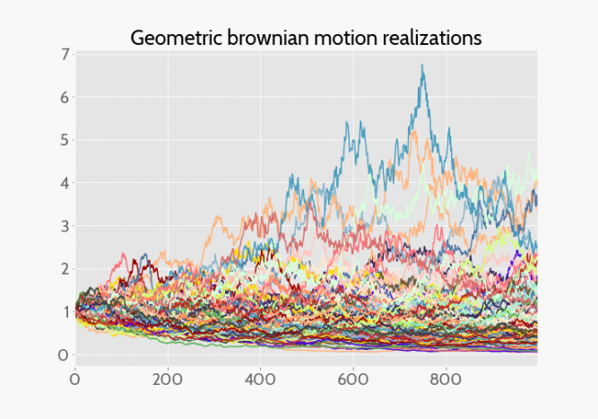

Stochastic Portfolio Theory (SPT) provides a framework designed to analyze how different assets within a portfolio interact through the application of probabilistic measures. Unlike traditional approaches that may rely heavily on assumptions of market efficiency or focus primarily on expected returns and volatilities, SPT emphasizes the stochastic behavior of portfolio value processes over time. This perspective allows for a more dynamic understanding of how asset prices evolve, making it particularly valuable for the complexities of modern financial markets.

The integration of SPT into algorithmic trading represents a significant advancement in trading strategies. Algorithmic trading, often referred to as algo trading, utilizes automated rules and computer programs to execute trades efficiently and systematically. Incorporating stochastic processes into this environment can significantly enhance decision-making. By modeling the random nature and inherent uncertainties of financial markets, SPT contributes to more robust trading algorithms capable of adapting to changing market conditions.

This article aims to explore the synergy between Stochastic Portfolio Theory and algorithmic trading, focusing on the benefits and applications arising from their fusion. Both SPT and algorithmic trading leverage advanced mathematical tools to optimize investment strategies, striving for more effective portfolio management and improved financial outcomes. By understanding the probabilistic interactions within a portfolio, traders and portfolio managers can potentially achieve a more adaptive and strategic approach to trading.

## Table of Contents

## Understanding Stochastic Portfolio Theory

Stochastic Portfolio Theory (SPT) offers a framework for analyzing and managing portfolios that diverges from traditional methods like Modern Portfolio Theory (MPT) and the Capital Asset Pricing Model (CAPM). One of the foundational differences between SPT and CAPM lies in the rejection of the market efficiency hypothesis. Instead of assuming that markets operate efficiently and that asset prices reflect all available information, SPT acknowledges that asset prices follow a stochastic process, allowing for potential inefficiencies and random fluctuations.

At its core, SPT prioritizes the understanding and modeling of the stochastic behavior of portfolio value processes over time. This approach shifts focus from expected returns or volatilities to the distribution of portfolio weights and their evolution. In contrast to MPT, which largely relies on static inputs and outputs, SPT necessitates a dynamic interpretation, accommodating the unpredictable and often volatile nature of financial markets.

The stochastic nature of asset prices advocates for a more dynamic and realistic framework for portfolio management, incorporating randomness and unpredictability as inherent features. This dynamic model enables investors to evaluate how portfolio compositions could shift due to underlying stochastic processes, acknowledging the continuous and often abrupt changes in market conditions.

SPT also facilitates the exploration of complex market dynamics and asset interactions, where traditional models might fall short. By examining the stochastic properties of asset prices and their distributions, SPT allows for a more nuanced analysis of how individual assets interact within a portfolio. This capability is particularly beneficial when navigating markets characterized by high [volatility](/wiki/volatility-trading-strategies) or irregular behaviors, where traditional assumptions about linear correlations and normal distributions may not hold.

In summary, Stochastic Portfolio Theory expands the toolkit for portfolio managers and financial analysts, offering a robust alternative to conventional approaches. By accommodating the randomness inherent in financial markets and focusing on the behavior of portfolio weights, SPT provides a sophisticated means of understanding and reacting to complex market dynamics.

## Integration of Stochastic Portfolio Theory into Algorithmic Trading

Stochastic Portfolio Theory (SPT) offers a comprehensive framework for enhancing risk assessment in [algorithmic trading](/wiki/algorithmic-trading) by incorporating stochastic models that account for the inherent randomness in market movements. By focusing on the stochastic dynamics of portfolio weights and asset prices, SPT allows for a more nuanced understanding of market behaviors, which is crucial in developing robust trading algorithms.

In algorithmic trading, the integration of SPT enables the dynamic adjustment of portfolio allocations in response to evolving stochastic factors. Algorithms can be tailored to modify investment positions based on probabilistic assessments of market fluctuations, thereby optimizing the timing and scale of trades. To achieve this, it is essential to design algorithms that continuously monitor and analyze stochastic indicators in real-time, adjusting strategies as necessary to mitigate risk and seize market opportunities.

For instance, a trading algorithm incorporating SPT could use stochastic differential equations (SDEs) to model the prices of assets over time. This involves solving an equation of the form:

$$
dS_t = \mu(S_t, t)dt + \sigma(S_t, t)dW_t
$$

where $S_t$ is the asset price at time $t$, $\mu$ is the drift component representing the expected return, $\sigma$ is the volatility component, and $dW_t$ is a Wiener process capturing the random market movements. By integrating such models, the algorithm can anticipate potential market scenarios and make data-driven decisions to adjust portfolio compositions accordingly.

SPT also complements trading strategies that require processing extensive datasets in real-time, a common prerequisite for achieving responsiveness in today's trading environments. The need to manage large-scale computations and adapt to rapid market changes is facilitated by SPT's capacity to model complex asset interactions and market dynamics statistically.

Robust simulations and [backtesting](/wiki/backtesting) are crucial components of successful algorithmic trading. By adopting stochastic processes, traders can construct models that simulate diverse market conditions, offering insights into potential portfolio performance under various scenarios. This approach allows for improved strategy refinement and risk management, ensuring that trading algorithms are not only theoretically sound but also practically effective.

In conclusion, the integration of Stochastic Portfolio Theory into algorithmic trading frameworks enhances the capability to assess and respond to market variability through dynamic, probabilistic modeling. This not only aids in optimizing trading decisions but also supports the design of algorithms capable of thriving in volatile financial markets.

## Benefits of Using SPT in Algorithmic Trading

Stochastic Portfolio Theory (SPT) provides a valuable alternative to traditional portfolio management methods, offering increased flexibility and realism in handling investment portfolios. Unlike conventional approaches that often rely on static models, SPT incorporates a dynamic framework that accounts for the random nature of financial markets. This dynamic consideration allows algorithmic trading strategies to more accurately predict potential market shifts and changes in asset correlations.

One of the key benefits of integrating SPT into algorithmic trading is its ability to improve risk management. Stochastic models introduce the capability to predict a wider range of market behaviors, helping traders identify potential risks and better manage them. By understanding the probabilistic distribution of portfolio weights, SPT facilitates better diversification strategies. This stochastic approach ensures that portfolios are not overly exposed to singular market events, thereby reducing risk.

SPT also supports the development of adaptive algorithms capable of responding swiftly to different market conditions. By analyzing the probabilistic range of potential outcomes, these algorithms can adjust trading strategies in real-time, maximizing returns while minimizing potential losses. This adaptability is crucial in volatile markets where rapid changes are a constant.

Moreover, incorporating SPT into trading algorithms enables enhanced performance measurement through stochastic dominance techniques. These techniques allow for performance evaluation not just based on average returns but through a more nuanced understanding of return distributions. For instance, metrics such as stochastic dominance help compare portfolios by considering the entirety of return distributions rather than just the mean and variance, providing a more comprehensive evaluation.

In summary, the integration of Stochastic Portfolio Theory into algorithmic trading offers significant benefits. By moving beyond traditional static models, SPT provides a framework that captures the complexities of financial markets through a stochastic lens. The result is improved risk management, better diversification, real-time adaptability, and more robust performance metrics, all of which contribute to more efficient and profitable trading strategies.

## Challenges in Implementing SPT in Algorithmic Trading

Stochastic Portfolio Theory (SPT) offers significant advantages in algorithmic trading, but its implementation is not without challenges. One of the foremost hurdles is the substantial computational resources required to handle the complexity of stochastic models. These models involve advanced mathematical constructs, such as stochastic differential equations, which necessitate both significant processing power and storage capacity, leading to potentially high costs.

Mathematical proficiency is essential for effectively implementing these models, as they rely on intricate stochastic processes. Practitioners need a solid understanding of concepts like Ito's calculus and martingale theory. This requirement implies that a highly skilled team is necessary to develop and maintain such systems, thus further adding to the operational cost.

Ensuring data quality is another critical aspect that can affect the success of SPT in algorithmic trading. Accurate, high-frequency data is crucial to model the stochastic nature of markets adequately. Any inaccuracies or delays in data could lead to incorrect model outputs, resulting in suboptimal trading decisions. Real-time processing capability is vital, as decisions need to be made at lightning speeds to capitalize on market movements.

The management of computational costs and latency issues presents additional challenges. Large stochastic models can result in increased latency due to their computational demands. Real-time execution, a requirement for algorithmic trading, can be compromised unless these latency issues are skillfully managed. Techniques such as parallel processing and efficient algorithm design can mitigate some of these issues, but still require substantial investment in both hardware and software solutions.

Moreover, the integration of SPT into existing trading systems demands overcoming various technical and operational barriers. These can include system incompatibilities, data integration challenges, and the need to update infrastructure to support new models. Building robust frameworks that can handle the dynamic and unpredictable nature of markets while maintaining system integrity is a complex task that requires careful planning and execution.

In summary, while the incorporation of SPT into algorithmic trading can greatly enhance decision-making capabilities, it requires overcoming significant computational, mathematical, and operational challenges. Addressing these challenges is crucial for fully leveraging the potential of stochastic models in financial markets.

## Practical Applications of SPT in Algo Trading

Stochastic Portfolio Theory (SPT) finds practical applications in algorithmic trading, particularly in optimizing high-frequency trading ([HFT](/wiki/high-frequency-trading-strategies)) strategies. In HFT, where rapid decision-making is crucial, stochastic models enable the anticipation of price movements by simulating various market scenarios. This involves using advanced mathematical tools to understand asset behavior under different conditions, thus refining execution strategies and improving profitability.

Portfolio managers leverage SPT to evaluate portfolio insurance strategies amidst market uncertainties. SPT allows them to model the probabilistic behavior of assets, providing insights into potential downside risks and hedges. By assessing the stochastic properties of portfolio weights and market volatility, managers can devise robust insurance strategies that protect against adverse market conditions.

SPT is instrumental in assessing risk-adjusted performance, which is key to constructing efficient frontiers. By incorporating stochastic dominance techniques, where a portfolio is considered optimal if its cumulative distribution function lies below that of another portfolio, managers can ensure a better return per unit of risk. This approach supports the identification of investment strategies with superior risk-return profiles.

Quantitative analysts use SPT to develop adaptive strategies for dynamic risk management. The stochastic framework aids in the continuous adjustment of portfolios in response to evolving market conditions. This adaptability is pivotal in maintaining optimal asset allocations and managing exposure to risk factors effectively.

Furthermore, analyzing historical data combined with stochastic outputs enables traders to forecast market trends and adjust their strategies proactively. By understanding the probabilities of various outcomes, traders can position themselves advantageously in the market, capitalizing on emerging trends while mitigating potential risks. This forward-thinking approach is critical for maintaining a competitive edge in the fast-paced world of algorithmic trading.

## Future of Stochastic Portfolio Theory in Algorithmic Trading

The progression of computational tools is poised to significantly elevate the applicability of Stochastic Portfolio Theory (SPT) in algorithmic trading. As computational power grows, the ability to implement complex stochastic models in real-time trading environments expands, facilitating more nuanced analyses and execution strategies. One notable area of development is the enhancement of SPT models to manage multi-asset and multi-period scenarios. This involves creating more sophisticated stochastic simulations that can account for the interactions between numerous types of financial instruments over various time horizons. 

Advancements in [machine learning](/wiki/machine-learning) and [artificial intelligence](/wiki/ai-artificial-intelligence) offer another dimension to SPT integration. By integrating SPT with AI, we can develop models that adaptively learn from market data, potentially improving predictive accuracy and decision-making processes. These hybrid models can discern patterns within vast datasets, offering strategic insights and refining the portfolio management process by adjusting to emerging market trends.

The interconnectedness of global financial markets further amplifies the demand for robust stochastic models capable of understanding complex interdependencies. As market dynamics grow in complexity, traditional approaches may fall short. Stochastic models, with their inherent flexibility, are well-suited to navigate these challenges by providing a probabilistic understanding of market behavior and the potential for nuanced statistical estimation.

Additionally, the intersection of SPT with big data analytics and blockchain technology presents intriguing possibilities for future developments. Big data methodologies offer comprehensive data analysis capabilities, supporting the extraction of actionable insights from multifaceted market information. Meanwhile, blockchain technology provides a transparent and decentralized ledger, enhancing the security and efficiency of trades executed based on stochastic models. 

In summary, the future trajectory of SPT in algorithmic trading is promising, driven by continuous advancements in computational techniques, data analytics, and financial technology. Embracing these innovations will likely lead to more sophisticated, reliable, and strategic trading solutions, capable of navigating the increasingly complex global financial landscape.

## Conclusion

Stochastic Portfolio Theory (SPT) offers a robust alternative to conventional portfolio models, especially when integrated with algorithmic trading. By embedding stochastic processes into trading strategies, a more comprehensive grasp of market dynamics can be achieved, enhancing the ability to anticipate and react to market conditions. Despite the challenges that arise in implementing these complex models, the advantages they provide are substantial. Difficulties such as the necessity for sophisticated computational resources and the requirement of expert knowledge illustrate the complexity of these models. However, these challenges are outweighed by the significant benefits, including improved risk assessment and dynamic portfolio rebalancing.

As technology advances, the application of SPT in trading is poised for continual enhancement. The rise of computational capabilities facilitates the use of stochastic models, enabling traders to handle more intricate and data-intensive tasks. As these tools evolve, they will offer greater precision in market predictions and portfolio management, thereby making trading strategies more adaptable, resilient, and profitable. Embracing stochastic portfolio models promises to pave the way for more responsive and efficient trading strategies, meeting the demands of ever-evolving financial markets.

## References & Further Reading

[1]: Fernholz, R. (2002). ["Stochastic Portfolio Theory."](https://link.springer.com/book/10.1007/978-1-4757-3699-1) Springer.

[2]: Karatzas, I., & Shreve, S. E. (1998). ["Brownian Motion and Stochastic Calculus."](https://link.springer.com/book/10.1007/978-1-4612-0949-2) Springer.

[3]: Merton, R.C. (1973). ["Theory of Rational Option Pricing."](https://dspace.mit.edu/bitstream/handle/1721.1/49331/theoryofrational00mert.pdf?sequence=1) The Bell Journal of Economics and Management Science. 

[4]: Luenberger, D. (1997). ["Investment Science."](https://www.amazon.com/Investment-Science-David-G-Luenberger/dp/0199740089) Oxford University Press.

[5]: Kissell, R., & Malamut, R. (2006). ["Algorithmic Trading Strategies."](https://guides.pm-research.com/content/iijtrading/2006/1/82) The Journal of Trading. 

[6]: Gatheral, J., & Schied, A. (2013). ["Optimal Trade Execution Under Geometric Brownian Motion in the Almgren and Chriss Framework."](https://papers.ssrn.com/sol3/papers.cfm?abstract_id=1654151) Quantitative Finance. 

[7]: Cont, R., & Tankov, P. (2003). ["Financial Modelling with Jump Processes."](https://api.pageplace.de/preview/DT0400.9781135437947_A36189682/preview-9781135437947_A36189682.pdf) Chapman and Hall/CRC. 

[8]: Avellaneda, M., & Stoikov, S. (2008). ["High-frequency Trading in a Limit Order Book."](https://people.orie.cornell.edu/sfs33/LimitOrderBook.pdf) Quantitative Finance.

[9]: Lopez de Prado, M. (2018). ["Advances in Financial Machine Learning."](https://books.google.com/books/about/Advances_in_Financial_Machine_Learning.html?id=oU9KDwAAQBAJ) Wiley.