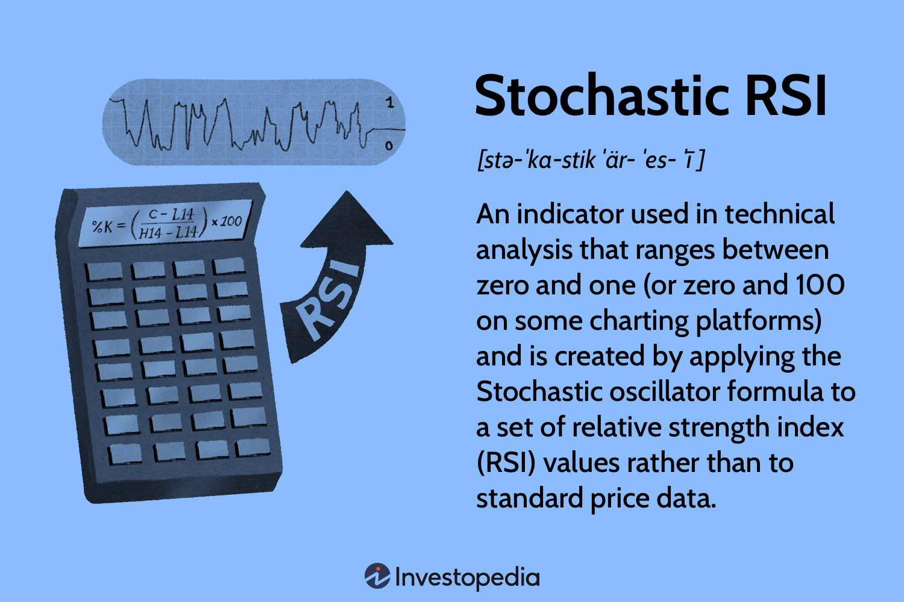

## Table of Contents

## What is the Stochastic RSI?

The Stochastic RSI, or StochRSI, is a technical analysis indicator that combines the Stochastic oscillator and the Relative Strength Index (RSI). It is used to identify overbought or oversold conditions in the market, helping traders determine potential entry and exit points. The StochRSI ranges from 0 to 1, where values close to 1 indicate that the market might be overbought, and values close to 0 suggest that the market could be oversold.

To calculate the StochRSI, you first need to compute the RSI over a specific period, usually 14 days. Then, you apply the Stochastic formula to the RSI values. This process creates a more sensitive indicator that can signal changes in momentum more quickly than the RSI alone. Traders often look for StochRSI values above 0.8 as a sign of overbought conditions and values below 0.2 as a sign of oversold conditions. By using the StochRSI, traders can better time their trades to take advantage of market reversals.

## How does the Stochastic RSI differ from the regular RSI?

The Stochastic RSI and the regular RSI both help traders see if a market is overbought or oversold, but they work a bit differently. The regular RSI measures the speed and change of price movements over a set time, usually 14 days. It gives a number between 0 and 100. If the RSI is over 70, it might mean the market is overbought, and if it's under 30, it might mean it's oversold. The RSI is good at showing general trends but can be slow to react to quick changes in the market.

The Stochastic RSI, on the other hand, takes the RSI and makes it more sensitive. It applies the Stochastic oscillator to the RSI values, creating a new indicator that ranges from 0 to 1. This means the Stochastic RSI can spot changes in momentum faster than the regular RSI. Traders use it to find more precise entry and exit points. For example, a Stochastic RSI value above 0.8 might signal that the market is overbought, while a value below 0.2 could indicate it's oversold. This makes the Stochastic RSI a useful tool for traders who want to act quickly on market movements.

## What are the key components of the Stochastic RSI calculation?

The Stochastic RSI calculation starts with the regular RSI. The RSI is figured out by looking at the average gains and losses of a stock's price over a certain number of days, usually 14. This gives a number between 0 and 100 that shows if the stock might be overbought or oversold. The RSI helps traders see the general trend of the stock's price movement.

Next, the Stochastic oscillator is used on the RSI values. The Stochastic oscillator compares where the RSI is now to its highest and lowest points over a recent period. This makes the Stochastic RSI, which ranges from 0 to 1. A high number, like above 0.8, can mean the stock is overbought, and a low number, like below 0.2, can mean it's oversold. This makes the Stochastic RSI more sensitive and quicker to show changes in the market than the regular RSI.

## How is the Stochastic RSI typically used in trading?

Traders use the Stochastic RSI to spot good times to buy or sell stocks. They look at the Stochastic RSI number, which goes from 0 to 1. If it's above 0.8, it might mean the stock is overbought, so it could be a good time to sell. If it's below 0.2, the stock might be oversold, and it could be a good time to buy. Traders use these numbers to make quick decisions because the Stochastic RSI can change fast.

Traders also watch for when the Stochastic RSI crosses certain lines. If it goes from below 0.2 to above it, that's called an oversold crossover, and it might be a signal to buy. If it goes from above 0.8 to below it, that's an overbought crossover, and it might be a signal to sell. By watching these crossovers and the Stochastic RSI numbers, traders can try to catch the best times to get in and out of the market.

## What are the common settings for the Stochastic RSI?

The most common setting for the Stochastic RSI is to use a 14-day period for the regular RSI calculation. This means the RSI looks at the last 14 days of price data to figure out if the stock is overbought or oversold. After getting the RSI values, the Stochastic oscillator is then applied to these values, often using a 3-day period to make the Stochastic RSI. This setting helps the Stochastic RSI to be sensitive to quick changes in the market.

Traders often use these settings because they balance sensitivity and reliability. A 14-day RSI is standard and widely used, while the 3-day Stochastic period makes the Stochastic RSI quick to show changes. This way, traders can spot good times to buy or sell without getting too many false signals. By sticking to these common settings, traders can compare their results with others and make better trading decisions.

## How can the Stochastic RSI help identify overbought and oversold conditions?

The Stochastic RSI helps traders spot when a stock might be overbought or oversold by giving a number between 0 and 1. If the Stochastic RSI number is above 0.8, it means the stock might be overbought. This is a signal for traders to think about selling because the price might go down soon. On the other hand, if the Stochastic RSI number is below 0.2, it means the stock might be oversold. This is a signal for traders to consider buying because the price might go up soon.

Traders also watch for when the Stochastic RSI number crosses these levels. If it goes from below 0.2 to above 0.2, it's called an oversold crossover. This can be a good time to buy because it shows the stock's price might start going up. If the Stochastic RSI goes from above 0.8 to below 0.8, it's an overbought crossover. This can be a good time to sell because it shows the stock's price might start going down. By watching these numbers and crossovers, traders can make quick decisions to catch the best times to buy or sell.

## What are the basic trading signals generated by the Stochastic RSI?

The Stochastic RSI gives traders clear signals about when to buy or sell a stock. When the Stochastic RSI number goes above 0.8, it means the stock might be overbought. This is a sign for traders to think about selling because the price might go down soon. On the other hand, if the Stochastic RSI number drops below 0.2, it means the stock might be oversold. This is a sign for traders to consider buying because the price might go up soon.

Traders also look for when the Stochastic RSI number crosses these levels. If it goes from below 0.2 to above 0.2, it's called an oversold crossover. This can be a good time to buy because it shows the stock's price might start going up. If the Stochastic RSI goes from above 0.8 to below 0.8, it's an overbought crossover. This can be a good time to sell because it shows the stock's price might start going down. By watching these numbers and crossovers, traders can make quick decisions to catch the best times to buy or sell.

## How can the Stochastic RSI be used in conjunction with other technical indicators?

Traders often use the Stochastic RSI along with other technical indicators to make better trading decisions. One common way is to use it with moving averages. A moving average shows the average price of a stock over a certain number of days. If the Stochastic RSI shows a stock is oversold and the price is also below a key moving average, it might be a strong signal to buy. On the other hand, if the Stochastic RSI shows a stock is overbought and the price is above a key moving average, it might be a strong signal to sell. This helps traders confirm their decisions and avoid false signals.

Another way to use the Stochastic RSI is with the MACD (Moving Average Convergence Divergence). The MACD shows the relationship between two moving averages of a stock's price. If the Stochastic RSI shows a stock is oversold and the MACD line crosses above the signal line, it can be a good time to buy. If the Stochastic RSI shows a stock is overbought and the MACD line crosses below the signal line, it can be a good time to sell. By combining these indicators, traders can get a clearer picture of the market and make more confident trades.

## What are some advanced strategies involving the Stochastic RSI?

One advanced strategy involving the Stochastic RSI is called divergence trading. This strategy looks for times when the price of a stock and the Stochastic RSI are moving in opposite directions. If the stock price is making higher highs but the Stochastic RSI is making lower highs, it's called bearish divergence. This can be a sign that the stock's upward trend might be losing steam, and it might be a good time to sell. On the flip side, if the stock price is making lower lows but the Stochastic RSI is making higher lows, it's called bullish divergence. This can be a sign that the stock's downward trend is weakening, and it might be a good time to buy. By watching for these divergences, traders can spot potential trend reversals before they happen.

Another advanced strategy is using the Stochastic RSI with multiple time frames. Traders might look at the Stochastic RSI on both a shorter time frame, like a 1-hour chart, and a longer time frame, like a daily chart. If the Stochastic RSI on the daily chart shows the stock is oversold and the Stochastic RSI on the 1-hour chart also shows it's oversold, it can be a strong signal to buy. The same goes for selling if both time frames show the stock is overbought. This strategy helps traders confirm their decisions by looking at the bigger picture and the shorter-term movements, giving them more confidence in their trades.

## How does the Stochastic RSI perform in different market conditions?

The Stochastic RSI works well in different market conditions, but how well it works can change depending on if the market is going up, going down, or staying the same. In a trending market, where the stock price is clearly going up or down, the Stochastic RSI can help traders find good times to buy or sell. For example, in a strong uptrend, traders might wait for the Stochastic RSI to show the stock is oversold before buying, because this could mean the stock will keep going up. In a downtrend, they might wait for the Stochastic RSI to show the stock is overbought before selling, because this could mean the stock will keep going down.

In a sideways or range-bound market, where the stock price is moving between two levels without a clear trend, the Stochastic RSI can be very useful. Traders can use it to spot when the stock is at the top of its range and might be ready to go down, or at the bottom of its range and might be ready to go up. This can help them make quick trades to take advantage of these small ups and downs. However, in very choppy or volatile markets, the Stochastic RSI might give too many false signals, so traders need to be careful and use other indicators to confirm their decisions.

## Can you provide examples of successful trades using the Stochastic RSI?

A trader named Sarah used the Stochastic RSI to make a successful trade in a stock she was watching. The stock was in a clear uptrend, and Sarah waited for the Stochastic RSI to show the stock was oversold, which happened when the Stochastic RSI number dropped below 0.2. She bought the stock at this point, and soon after, the Stochastic RSI started to rise again, showing the stock was no longer oversold. The stock price went up as expected, and Sarah sold it for a nice profit when the Stochastic RSI showed the stock was overbought, going above 0.8.

Another example is from a trader named Mike, who used the Stochastic RSI in a range-bound market. He noticed the stock was moving between $50 and $60 without a clear trend. When the Stochastic RSI showed the stock was overbought, going above 0.8 near the top of the range, Mike sold the stock. A few days later, the Stochastic RSI showed the stock was oversold, dropping below 0.2 near the bottom of the range, and Mike bought it back. By repeating this strategy a few times, Mike was able to make small profits from the stock's movements within its range.

## What are the limitations and potential pitfalls of using the Stochastic RSI?

One big problem with the Stochastic RSI is that it can give false signals. This means it might show that a stock is overbought or oversold when it's not really going to change direction. In a choppy market, where the stock price is moving up and down a lot, the Stochastic RSI can be too sensitive and give these false signals. Traders need to be careful and use other tools to check if the signals are right before making a trade.

Another issue is that the Stochastic RSI works best in certain market conditions. It's good in a market that's moving sideways or in a clear trend, but it can be hard to use in a very volatile market. Also, if traders only use the Stochastic RSI without looking at other things like the stock's overall trend or other indicators, they might miss important information. It's important to use the Stochastic RSI along with other tools to make better trading decisions.

## What is the Stochastic RSI?

The Stochastic RSI is a specialized indicator in technical analysis that merges the functionalities of the stochastic oscillator and the relative strength index (RSI). This combined tool is designed to offer a more sensitive gauge of momentum and pinpoint overbought or oversold market conditions. Unlike the standard RSI, which operates directly on price data, the Stochastic RSI applies the stochastic oscillator formula to RSI values. This distinction endows it with enhanced sensitivity, enabling it to range between zero and one, offering traders precise insights into potential market reversals.

The traditional RSI calculates the speed and change of price movements, providing insights into overbought and oversold conditions. However, the Stochastic RSI takes this a step further by refining the RSI data through the stochastic oscillator framework. The result is an indicator that more accurately predicts market reversals, as it can react more nimbly to changes than the standard RSI.

In mathematical terms, the Stochastic RSI is calculated by first determining the RSI over a specified period, typically 14 days. Once the RSI values are established, the stochastic oscillator equation is employed as follows:

$$
\text{Stochastic RSI} = \frac{\text{Current RSI} - \text{Lowest RSI}}{\text{Highest RSI} - \text{Lowest RSI}}
$$

This formula computes a value that oscillates between 0 and 1, providing traders with sharper signals to act on potential market trends. It is this unique approach of manipulating RSI data, rather than price data directly, that makes the Stochastic RSI a powerful instrument in technical analysis, revered for better predicting shifts in market momentum and facilitating timely trading decisions.

## How do you calculate Stochastic RSI?

Calculating the Stochastic RSI involves a series of methodical steps that are essential to understand for accurate implementation in trading strategies. This indicator leverages the sensitivity of the stochastic oscillator applied to the relative strength index (RSI), rather than to the price data directly, thereby creating a more responsive [momentum](/wiki/momentum) indicator.

**Step-by-Step Calculation:**

1. **Calculate RSI Values:**
   Begin by computing the RSI over a designated timeframe, which is typically 14 periods. The RSI is a momentum oscillator that measures the speed and change of price movements, calculated using the formula:
$$
   RSI = 100 - \left(\frac{100}{1 + \frac{\text{Average Gain}}{\text{Average Loss}}}\right)

$$

2. **Identify Extremes in RSI:**
   Once the RSI values for the selected periods are determined, find the highest RSI value (RSI_high) and the lowest RSI value (RSI_low) within this timeframe.

3. **Apply the Stochastic Formula:**
   The Stochastic RSI is computed by applying the stochastic oscillator formula to the RSI values:
$$
   \text{Stochastic RSI} = \frac{\text{Current RSI} - \text{RSI}_\text{low}}{\text{RSI}_\text{high} - \text{RSI}_\text{low}}

$$

   This results in the Stochastic RSI ranging between 0 and 1, where values near 0 indicate potential oversold conditions and values near 1 indicate potential overbought conditions.

**Python Code Example:**

Here is a simple Python snippet to calculate the Stochastic RSI given a list of RSI values:

```python
def stochastic_rsi(rsi_values, period=14):
    stochastic_rsi_values = []
    for i in range(period, len(rsi_values)):
        rsi_slice = rsi_values[i-period:i]
        rsi_min = min(rsi_slice)
        rsi_max = max(rsi_slice)
        current_rsi = rsi_values[i]

        if rsi_max - rsi_min == 0:
            stochastic_rsi_values.append(0)
        else:
            stochastic_rsi = (current_rsi - rsi_min) / (rsi_max - rsi_min)
            stochastic_rsi_values.append(stochastic_rsi)

    return stochastic_rsi_values

# Example RSI data
rsi_values = [30, 40, 45, 50, 55, 60, 65, 70, 68, 66, 64, 62, 60, 57, 54, 52]
stochastic_rsi_values = stochastic_rsi(rsi_values)
print(stochastic_rsi_values)
```

This code generates a series of Stochastic RSI values by iterating over the RSI data and applying the stochastic formula to each subset of values determined by the specified period. It is crucial to suitably configure the period and ensure a comprehensive collection of RSI data to achieve reliable Stochastic RSI calculations.

## What are the advantages of using Stochastic RSI?

The Stochastic RSI, as an enhanced technical analysis tool, provides several advantages over the traditional Relative Strength Index (RSI). One of its primary benefits is the generation of more frequent signals. This increased frequency is particularly advantageous in volatile markets, where timely execution of trades can significantly impact profitability. Unlike the traditional RSI, which tends to smooth out short-term fluctuations, the Stochastic RSI captures more rapid changes, offering traders a sharper view of market dynamics.

Another key advantage is its heightened sensitivity to overbought and oversold conditions. The Stochastic RSI achieves this by applying the stochastic oscillator to RSI values rather than directly to price data. This results in a finer granularity of market conditions, enabling traders to identify potential opportunities with greater precision. The formula for calculating the Stochastic RSI is:

$$
\text{StochRSI} = \frac{\text{Current RSI} - \text{Lowest RSI}}{\text{Highest RSI} - \text{Lowest RSI}}
$$

This enhanced sensitivity allows traders to foresee potential market reversals more accurately. By detecting shifts in momentum ahead of the broader market, traders can capitalize on emerging trends, optimizing entry and [exit](/wiki/exit-strategy) points in their trading strategies.

Moreover, the Stochastic RSI is highly adaptable when combined with other technical indicators, forming a comprehensive trading strategy. For instance, integrating it with moving averages or Bollinger Bands can offer a multi-faceted view of market conditions, thereby refining signal reliability. This synergistic use of multiple indicators helps mitigate the risk of false signals, providing a more robust framework for market analysis.

Overall, the advantages of using the Stochastic RSI lie in its ability to provide frequent, sensitive, and integrated insights into market movements, making it a valuable asset in any trader's toolkit.

## References & Further Reading

[1]: Brown, Constance M. ["Technical Analysis for the Trading Professional, Second Edition: Strategies and Techniques for Today's Turbulent Global Financial Markets"](https://www.amazon.com/Technical-Analysis-Trading-Professional-Second/dp/007175914X). McGraw-Hill Education, 2011.

[2]: Kirkpatrick, Charles D., and Dahlquist, Julie R. ["Technical Analysis: The Complete Resource for Financial Market Technicians"](https://ptgmedia.pearsoncmg.com/images/9780134137049/samplepages/9780134137049.pdf), 3rd Edition. Pearson FT Press, 2015.

[3]: Murphy, John J. ["Technical Analysis of the Financial Markets: A Comprehensive Guide to Trading Methods and Applications"](https://archive.org/details/technicalanalysi0000murp). New York Institute of Finance, 1999.

[4]: Wilder, J. Welles. ["New Concepts in Technical Trading Systems"](https://www.amazon.com/New-Concepts-Technical-Trading-Systems/dp/0894590278). Trend Research, 1978.

[5]: Stoica, Ion, et al. ["Algorithmic Trading: Advances in Technical Analysis and Trading Strategies"](https://www.researchgate.net/publication/378548435_Algorithmic_Trading_and_AI_A_Review_of_Strategies_and_Market_Impact). Springer Briefs in Finance, 2021.