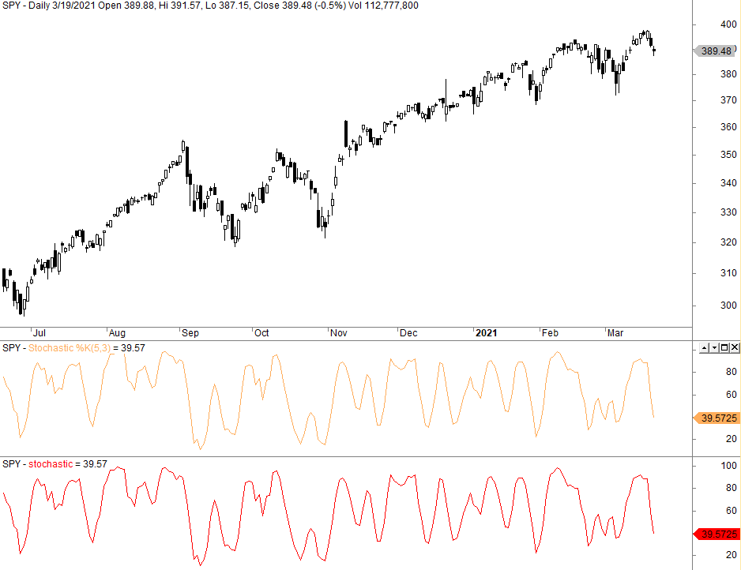

Algorithmic trading, a sophisticated method of trading, utilizes mathematical models and algorithms to make efficient trading decisions. This approach automates the trading process, allowing traders to execute strategies based on predefined criteria without emotional interference. One of the critical components of algorithmic trading is the use of technical indicators, which assist in analyzing market trends and momentum.

Among these indicators, the stochastic oscillator stands out as a widely used momentum indicator. Developed in the late 1950s by analyst George Lane, the stochastic oscillator measures the current closing price of an asset relative to its price range over a specified period. This measure offers insights into the momentum of price movements, indicating potential reversal points.



This article aims to explore stochastic strategies within algorithmic trading, focusing on its practical applications. It will discuss how the stochastic oscillator can be utilized in developing robust trading strategies, considering its ability to signal overbought and oversold conditions. In the sections that follow, we will cover the foundational aspects of the stochastic oscillator, delve into the details of its implementation in algorithmic strategies, and analyze its advantages and potential limitations. Understanding these aspects is crucial for traders aiming to leverage algorithmic strategies that incorporate this popular technical indicator.

## Table of Contents

## Understanding the Stochastic Oscillator

The stochastic oscillator is a technical analysis tool used to measure the momentum of price movements in financial markets. Developed by George Lane in the late 1950s, this oscillator assesses the position of the closing price relative to the high-low range over a specified period. This momentum indicator is instrumental in identifying potential reversal points in market trends by highlighting overbought and oversold conditions.

The stochastic oscillator is composed of two main components: %K and %D lines. The %K line, often referred to as the fast line, is calculated using the formula:

$$
\%K = \left( \frac{\text{Current Close} - \text{Lowest Low}}{\text{Highest High} - \text{Lowest Low}} \right) \times 100
$$

Here, "Current Close" is the most recent closing price, "Lowest Low" is the lowest price over the chosen period, and "Highest High" is the highest price during the same period.

The %D line, or slow line, is typically a 3-day simple moving average of %K, providing a smoothed line to help traders better identify trends. The %D line can be expressed mathematically as:

$$
\%D = \text{SMA of } \%K \text{ over } n \text{ periods}
$$

Traders use these lines to identify overbought and oversold levels. A common practice is to consider a security oversold if the %K or %D falls below 20, and overbought if they rise above 80. These levels can, however, be adjusted based on the asset being analyzed and the trader’s risk tolerance.

Interpreting the stochastic oscillator involves examining the crossovers of the %K and %D lines. A %K line crossing above the %D line can signal a potential buying opportunity, while a cross below may indicate a potential selling opportunity. The oscillator's range-bound nature makes it especially useful for identifying turning points in oscillating (non-trending) markets.

While the stochastic oscillator is a powerful tool for gauging market [momentum](/wiki/momentum), it is essential to corroborate its signals with additional indicators or analysis methods. This approach helps minimize false signals, particularly in markets that show extended trending behavior.

## Implementing Stochastic Strategies in Algo Trading

Incorporating the stochastic oscillator into an [algorithmic trading](/wiki/algorithmic-trading) strategy aims to enhance trade entry and [exit](/wiki/exit-strategy) decisions by leveraging its signal generation capabilities. A basic stochastic trading strategy involves buying when both %K and %D lines are below 20, indicating oversold conditions, and selling when these lines rise above 80, signifying overbought conditions.

To implement this strategy using Python, several libraries can be employed to facilitate data manipulation, retrieval, and visualization:

1. **pandas**: This library is crucial for handling and manipulating data in a tabular form. It allows seamless manipulation of stock price data.

2. **yfinance**: A convenient tool for fetching historical market data from Yahoo Finance, enabling traders to gather the necessary data for implementing and testing their strategies.

3. **Plotly**: Useful for creating interactive, dynamic visualizations of the stock price and indicator data, providing deeper insights into how the strategy performs over time.

Here's a basic outline of how to implement the stochastic oscillator strategy in Python:

```python
import pandas as pd
import yfinance as yf  # For more datasets, visit: https://paperswithbacktest.com/datasets
import matplotlib.pyplot as plt

# Fetch historical data
data = yf.download("AAPL", start="2022-01-01", end="2023-01-01")
data['High-Low'] = data['High'] - data['Low']
data['Close-PrevClose'] = data['Close'].shift(1)

# Calculate %K and %D
low_min = data['Low'].rolling(window=14).min()
high_max = data['High'].rolling(window=14).max()
data['%K'] = 100 * ((data['Close'] - low_min) / (high_max - low_min))
data['%D'] = data['%K'].rolling(window=3).mean()

# Define buy/sell signals
data['Buy_Signal'] = ((data['%K'] < 20) & (data['%D'] < 20)).astype(int)
data['Sell_Signal'] = ((data['%K'] > 80) & (data['%D'] > 80)).astype(int)

# Plotting
plt.figure(figsize=(14,7))
plt.plot(data['Close'], label='Close Price')
plt.plot(data['%K'], label='%K')
plt.plot(data['%D'], label='%D')
plt.scatter(data.index, data['Close'][data['Buy_Signal'] == 1], label='Buy Signal', marker='^', color='g')
plt.scatter(data.index, data['Close'][data['Sell_Signal'] == 1], label='Sell Signal', marker='v', color='r')
plt.title('Stochastic Oscillator Strategy')
plt.legend()
plt.show()
```

Backtesting is essential to evaluate the historical performance and effectiveness of this strategy. It involves simulating trades based on historical prices to assess potential profitability and risks. Backtesting provides a metric-driven overview of the strategy's practical application and can reveal potential weaknesses, such as false signals or issues in specific market conditions.

Once backtested, a refined stochastic strategy can be automated and integrated into existing trading systems to capitalize on market fluctuations dynamically and consistently.

## Backtesting Stochastic Strategies

Backtesting involves simulating a trading strategy on historical data to estimate its potential performance and understand its effectiveness in diverse market conditions. Implementing a stochastic strategy in an algorithmic trading framework requires setting up a [backtesting](/wiki/backtesting) environment that incorporates essential tools and libraries, data selection, and proper evaluation metrics.

### Setting Up a Backtesting Environment with Python

To set up a backtesting environment using Python, key libraries such as `pandas`, `numpy`, `matplotlib`, and `yfinance` are essential. For sophisticated backtesting, `[backtrader](/wiki/backtrader)` or `zipline` can provide advanced functionalities. Below is a step-by-step guide to setting up a basic backtesting environment:

1. **Install Necessary Libraries:**
   Ensure that you have Python and pip installed, and then install the required libraries using:
   ```
   pip install pandas numpy matplotlib yfinance backtrader
   ```

2. **Import Libraries and Retrieve Data:**
   Use `yfinance` for fetching historical stock data:
   ```python
   import yfinance as yf  # For more datasets, visit: https://paperswithbacktest.com/datasets
   import pandas as pd

   data = yf.download('AAPL', start='2020-01-01', end='2023-01-01')
   ```

3. **Calculate the Stochastic Oscillator:**
   Compute the %K and %D lines which are essential for the stochastic oscillator:
   ```python
   def stochastic_oscillator(data, period=14, smooth_k=3):
       low_min = data['Low'].rolling(window=period).min()
       high_max = data['High'].rolling(window=period).max()
       data['%K'] = 100 * (data['Close'] - low_min) / (high_max - low_min)
       data['%D'] = data['%K'].rolling(window=smooth_k).mean()
       return data

   data = stochastic_oscillator(data)
   ```

4. **Implement a Trading Strategy:**
   Define the buy/sell logic based on %K and %D lines:
   ```python
   def trading_strategy(data):
       buy_signals = (data['%K'] < 20) & (data['%D'] < 20)
       sell_signals = (data['%K'] > 80) & (data['%D'] > 80)
       return buy_signals, sell_signals

   buy_signals, sell_signals = trading_strategy(data)
   ```

5. **Backtesting:**
   Integrate the trading signals into a backtesting framework:
   ```python
   import backtrader as bt

   # Define a basic strategy
   class StochasticStrategy(bt.Strategy):
       def __init__(self):
           self.data = self.data0

       def next(self):
           if not self.position and self.data.lines['%K'][0] < 20 and self.data.lines['%D'][0] < 20:
               self.buy()
           elif self.position and self.data.lines['%K'][0] > 80 and self.data.lines['%D'][0] > 80:
               self.sell()

   # Create a Cerebro instance
   cerebro = bt.Cerebro()
   cerebro.addstrategy(StochasticStrategy)

   # Add data to Cerebro
   feed = bt.feeds.PandasData(dataname=data)
   cerebro.adddata(feed)

   # Start backtesting
   cerebro.run()
   cerebro.plot()
   ```

### Data Selection and Evaluation Metrics

- **Selection of Data:**
  Choosing the right stock and period is crucial. Consider diverse market conditions and data quality. Historical data should cover various market cycles to assess strategy robustness.

- **Configuration of Periods:**
  The look-back period for the stochastic oscillator (typically 14 days) and smoothing parameters should match the asset's [volatility](/wiki/volatility-trading-strategies). Testing different periods can help optimize the strategy.

- **Evaluation Metrics:**
  Common metrics include net profit, Sharpe ratio, maximum drawdown, and win rate. These help quantify risk-adjusted returns and overall strategy profitability.

### Case Study: Backtest Results Review

A case study might involve stocks like Apple (AAPL) and Amazon (AMZN) over a period from 2020 to 2023. Backtest results could reveal:

- **Performance Overview:**
  AAPL's stochastic strategy might show a higher Sharpe ratio and a lower drawdown, indicating better risk-adjusted returns. Conversely, AMZN might display periods of underperformance, highlighting its higher volatility.

- **Signal Reliability:**
  The strategy's success rate and false signals indicate how well it adapts to trending or volatile periods. It may perform well in trending markets but produce false signals during sideways movements.

Analyzing backtest results is essential for refining strategies and understanding potential pitfalls. Combining stochastic strategies with other indicators or [machine learning](/wiki/machine-learning) models may enhance performance in diverse markets.

## Advantages and Limitations

Stochastic strategies in algorithmic trading are favored for their simplicity and the ability to generate distinct signals based on market momentum. One of the primary advantages is their capability to identify trends, alongside providing clear entry and exit signals. This makes them adaptable to a variety of markets, enhancing their utility across different trading environments. The stochastic oscillator achieves this by comparing the closing price of a security to its price range over a specific period, offering insights into potential reversals and continuation patterns in market trends.

Despite these advantages, stochastic strategies have notable limitations. One significant drawback is the generation of false signals, particularly in sideways or ranging markets where there are no clear trends. This scenario often results in the oscillator frequently moving in and out of the overbought and oversold zones, leading to misleading trading cues. Furthermore, as a momentum indicator, the stochastic oscillator is inherently a lagging indicator. It relies on past price data, which can lead to delays in signal generation and increased risk of lagging behind fast-paced market changes.

Given these limitations, it is crucial to combine stochastic strategies with other indicators to improve the reliability of trading decisions. For instance, coupling the stochastic oscillator with trend-following indicators, such as moving averages, can provide stronger confirmation of trend direction and help filter out noise from false signals. Additionally, incorporating volatility indicators like the Average True Range (ATR) can further enhance decision-making by adjusting the sensitivity of the stochastic signals according to market conditions.

By integrating the stochastic oscillator with complementary tools, traders can mitigate its inherent drawbacks, adapt to various market scenarios and enhance the robustness of their trading strategies.

## Conclusion

Stochastic strategies offer powerful tools for algorithmic trading, particularly when employed with expertise and caution. Their effective use rests heavily on a trader's comprehension of the stochastic oscillator's mechanics and precise application in the relevant trading environment. Understanding the basic components such as the %K and %D lines, along with their implications for identifying market momentum, is fundamental to leveraging these strategies effectively.

Rigorous testing, commonly known as backtesting, forms an integral part of a successful stochastic strategy. It involves running the strategy against historical data to understand its potential effectiveness and pitfalls. This step is crucial for identifying any shortcomings and refining the strategy to enhance precision and profitability. The significance of backtesting lies not only in validating the strategy but also in fine-tuning parameters, ensuring they are optimized for varying market conditions.

Integrating stochastic strategies with other technical indicators can significantly bolster their efficacy. By combining them with tools like moving averages or RSI (Relative Strength Index), false signals in volatile or sideways markets can be minimized, enhancing the strategy's overall reliability.

Future advancements in stochastic strategies may see the incorporation of machine learning techniques to dynamically optimize stochastic parameters. With machine learning, it is possible to adapt the strategy automatically in response to changing market conditions, thereby maintaining its effectiveness over time. For instance, using [reinforcement learning](/wiki/reinforcement-learning), a model could continuously learn from new data and adjust its signaling to improve performance.

The robust design of a stochastic strategy, enriched by rigorous testing, understanding, and modern technological integrations, can give traders a significant edge. In the ever-evolving landscape of trading, such sophisticated methodologies can make the crucial difference between success and mediocrity. By staying abreast of technological trends and maintaining a commitment to strategic refinement, traders can harness the full potential of stochastic strategies, navigating the complexities of modern markets with confidence.

## Frequently Asked Questions

### Frequently Asked Questions

**What is the primary purpose of the stochastic oscillator in trading?**

The stochastic oscillator is used in trading to determine the momentum of price movements relative to a specific range over a set period. Its primary purpose is to identify potential reversal points by indicating overbought or oversold conditions in the market. By assessing where the closing price stands compared to its high-low range, traders can anticipate potential trend shifts or retracement opportunities, aiding in making informed entry and exit decisions.

**How should one interpret overbought and oversold levels in stochastic strategies?**

Overbought and oversold levels in stochastic strategies are interpreted as signals for potential market reversals. Typically, the levels are set at 80 for overbought and 20 for oversold. When the %K line and %D line of the stochastic oscillator rise above the 80 level and then cross back below, it may be an indication that the asset is overbought, suggesting a potential sell opportunity. Conversely, if these lines fall below the 20 level and cross back above, it may suggest the asset is oversold, indicating a potential buy opportunity. However, traders should be cautious of false signals and consider using additional indicators to confirm trends.

**What are the key considerations when backtesting a stochastic strategy?**

When backtesting a stochastic strategy, several key considerations must be addressed to ensure accuracy and relevance:

1. **Data Selection**: Use a comprehensive dataset that covers various market conditions and spans an adequate historical period to provide a robust analysis.

2. **Configuration of Periods**: Choose appropriate periods for the %K and %D lines that suit the asset's volatility and trading style, typically 14 periods for %K and 3 for %D.

3. **Evaluation Metrics**: Apply metrics such as the Sharpe Ratio, return on investment, and win/loss ratio to evaluate performance effectively.

4. **Risk Management**: Incorporate stop-loss and take-profit levels to simulate realistic trading conditions and manage risk exposure efficiently.

5. **Optimization and Sensitivity Analysis**: Test different parameter configurations to optimize performance and conduct sensitivity analysis to understand the impact of parameter changes.

**Can stochastic strategies be automated and integrated into existing trading platforms?**

Yes, stochastic strategies can be automated and integrated into existing trading platforms. Automation offers the advantage of executing trades quickly and consistently, minimizing the impact of human emotions. By using Python libraries such as `pandas`, `yfinance`, and `ta` for technical analysis, traders can write scripts to execute stochastic strategies. Additionally, integration with platforms like MetaTrader 4/5 or TradingView can be accomplished through APIs or custom-built plugins. Due to the complexities and nuances of algorithmic trading, comprehensive testing and a strong understanding of the strategy are essential before deploying automated systems in live trading environments.

## References & Further Reading

[1]: George C. Lane. ["Lane's Stochastics"](https://en.wikipedia.org/wiki/George_Lane_%28technical_analyst%29) by George C. Lane

[2]: ["Technical Analysis of the Financial Markets: A Comprehensive Guide to Trading Methods and Applications"](https://www.amazon.com/Technical-Analysis-Financial-Markets-Comprehensive/dp/0735200661) by John J. Murphy

[3]: ["Algorithmic Trading: Winning Strategies and Their Rationale"](https://www.wiley.com/en-us/Algorithmic+Trading%3A+Winning+Strategies+and+Their+Rationale-p-9781118460146) by Ernie Chan

[4]: ["Python for Data Analysis: Data Wrangling with Pandas, NumPy, and IPython"](https://wesmckinney.com/book/) by Wes McKinney

[5]: ["Backtest: The New Rules of Algorithmic Trading"](https://www.quantstart.com/articles/Successful-Backtesting-of-Algorithmic-Trading-Strategies-Part-I/) by Michael Gouvalaris