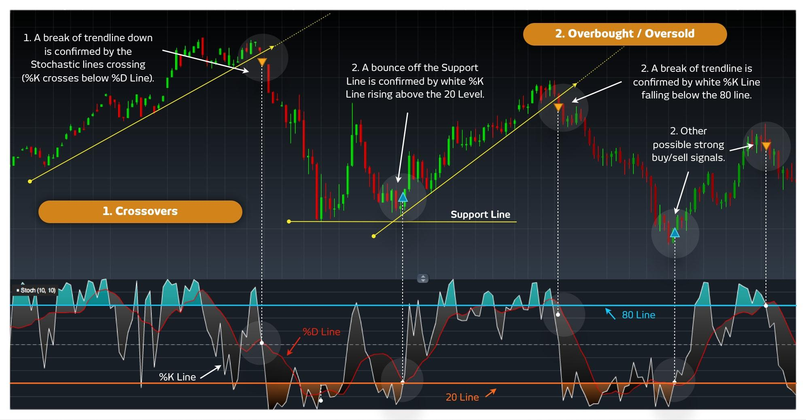

## Table of Contents

## What is a stochastic trading strategy?

A stochastic trading strategy is a way to buy and sell things like stocks or currencies by using a special tool called the stochastic oscillator. This tool helps traders figure out if a stock's price is too high or too low compared to its recent prices. The idea is to find the right time to buy or sell by looking at these price movements. When the stochastic oscillator shows that a stock's price is too low, it might be a good time to buy. When it shows the price is too high, it might be a good time to sell.

Traders use two lines in the stochastic oscillator: the %K line and the %D line. They watch these lines to see when they cross each other. If the %K line goes above the %D line, it can be a signal to buy. If the %K line goes below the %D line, it can be a signal to sell. Traders also look for when these lines move into overbought or oversold areas on the chart. Overbought means the price might be too high and could go down soon, while oversold means the price might be too low and could go up soon. By using these signals, traders try to make smart choices about when to trade.

## How does a stochastic oscillator work?

A stochastic oscillator is a tool that traders use to figure out if a stock's price is too high or too low compared to its recent prices. It works by comparing the closing price of a stock to its price range over a certain period, usually 14 days. The oscillator gives you a number between 0 and 100. If the number is above 80, it means the stock might be overbought, which means its price could be too high and might go down soon. If the number is below 20, it means the stock might be oversold, which means its price could be too low and might go up soon.

The stochastic oscillator uses two lines, called the %K line and the %D line, to help traders make decisions. The %K line shows the current position of the stock's closing price within its recent price range. The %D line is a moving average of the %K line, which smooths out the data to make it easier to read. Traders watch these lines to see when they cross each other. If the %K line crosses above the %D line, it might be a good time to buy the stock. If the %K line crosses below the %D line, it might be a good time to sell the stock. By using these signals, traders try to predict when the stock's price will change and make trades at the best times.

## What are the key components of a stochastic indicator?

The stochastic indicator has two main parts: the %K line and the %D line. The %K line shows where the current closing price of a stock is compared to its highest and lowest prices over a set time, usually 14 days. This line helps traders see if the stock's price is near the top or bottom of its recent range. The %D line is a smoother version of the %K line. It's made by taking an average of the %K line over three periods, which makes it easier to spot trends and reduces small, quick changes in the %K line.

Traders use these two lines to make decisions about buying and selling stocks. They watch for when the %K line crosses the %D line. If the %K line goes above the %D line, it might be a good time to buy the stock because it could mean the price is starting to go up. If the %K line goes below the %D line, it might be a good time to sell because the price could be starting to go down. The stochastic indicator also has levels that show if a stock is overbought or oversold. If the indicator is above 80, the stock might be overbought and its price could drop soon. If it's below 20, the stock might be oversold and its price could rise soon.

## How can beginners use stochastic indicators to make trading decisions?

Beginners can use stochastic indicators to help them decide when to buy or sell stocks by watching two lines on a chart: the %K line and the %D line. These lines move between 0 and 100. When the %K line crosses above the %D line, it might be a good time to buy the stock because it could mean the price is starting to go up. When the %K line crosses below the %D line, it might be a good time to sell because the price could be starting to go down. Beginners should pay attention to these crossing points because they can signal when to make a trade.

Another thing beginners should look at is whether the stochastic indicator is in the overbought or oversold areas. If the indicator is above 80, it means the stock might be overbought, which means its price could be too high and might drop soon. If it's below 20, it means the stock might be oversold, which means its price could be too low and might rise soon. By watching these levels, beginners can get an idea of when the stock's price might change direction. It's important for beginners to practice using the stochastic indicator on a demo account first to get comfortable with how it works before trading with real money.

## What are the differences between fast and slow stochastic indicators?

The fast stochastic indicator and the slow stochastic indicator are two versions of the same tool used in trading. The fast stochastic uses the %K line directly, which can move a lot and change quickly. This means it can give signals to buy or sell faster, but it can also be more confusing because it might give false signals. The fast stochastic is good for traders who want to make quick decisions, but it can be hard to use because it's so sensitive to small changes in the stock's price.

The slow stochastic, on the other hand, uses the %D line, which is a smoother version of the %K line. It's made by taking an average of the %K line over three periods, which makes it less jumpy and easier to read. The slow stochastic gives signals more slowly, but these signals are usually more reliable because they are less likely to be false alarms. Beginners might find the slow stochastic easier to use because it's less confusing and helps them make more steady trading decisions.

## Can you explain the concept of overbought and oversold levels in stochastic trading?

In stochastic trading, the overbought level means that a stock's price might be too high compared to its recent prices. When the stochastic indicator goes above 80, it shows that the stock could be overbought. This means that the price might have gone up too much and could start to go down soon. Traders look for this sign to decide if it's a good time to sell the stock, hoping to avoid a drop in price.

On the other hand, the oversold level means that a stock's price might be too low compared to its recent prices. When the stochastic indicator goes below 20, it shows that the stock could be oversold. This means that the price might have gone down too much and could start to go up soon. Traders look for this sign to decide if it's a good time to buy the stock, hoping to catch the price as it starts to rise again. By watching these levels, traders try to make smart choices about when to trade.

## How do traders use stochastic crossovers to predict market movements?

Traders use stochastic crossovers to help them guess when a stock's price might change direction. A stochastic crossover happens when the %K line and the %D line on the stochastic indicator cross each other. If the %K line goes above the %D line, it's called a bullish crossover. This means the stock's price might start going up, so it could be a good time to buy. If the %K line goes below the %D line, it's called a bearish crossover. This means the stock's price might start going down, so it could be a good time to sell.

By watching these crossovers, traders try to make smart choices about when to trade. They look for these signals to help them decide if they should buy or sell a stock. But it's important to remember that these signals are not always right. Sometimes, the price might not move the way the crossover suggests. That's why traders often use other tools and information along with stochastic crossovers to make their trading decisions.

## What are some common mistakes to avoid when using stochastic trading strategies?

One common mistake beginners make when using stochastic trading strategies is relying too much on the signals without considering other factors. The stochastic indicator can give false signals sometimes, so it's important to use it along with other tools like moving averages or trend lines. For example, if the stochastic shows a buy signal but the overall trend of the stock is going down, it might not be a good time to buy. Traders should look at the bigger picture and not just follow the stochastic signals blindly.

Another mistake is not waiting for confirmation before making a trade. Sometimes, the %K and %D lines might cross, but the price doesn't move as expected right away. It's better to wait for a bit to see if the price really does start to go up or down after the crossover. This can help avoid jumping into trades too quickly and losing money. Being patient and waiting for more signs that the price is moving in the expected direction can make trading decisions more reliable.

## How can stochastic indicators be combined with other technical analysis tools?

Traders often use stochastic indicators together with other tools to make better trading decisions. One popular way is to use them with moving averages. A moving average is a line that shows the average price of a stock over a certain time, like 50 days or 200 days. When the stochastic indicator shows a buy signal and the stock's price is also above the moving average, it can be a stronger sign that the price might keep going up. This helps traders feel more confident about their decision to buy.

Another tool that works well with stochastic indicators is trend lines. Trend lines are lines drawn on a chart to show the direction a stock's price is moving. If the stochastic indicator shows a sell signal and the price is also breaking below a trend line, it can be a good time to sell. By using these different tools together, traders can get a clearer picture of what the stock's price might do next. This can help them make smarter trading choices and avoid relying too much on just one indicator.

## What advanced techniques can experts use to optimize stochastic trading strategies?

Experts can optimize stochastic trading strategies by using multiple time frames. They might look at the stochastic indicator on both a short-term chart, like a 15-minute chart, and a longer-term chart, like a daily chart. If the stochastic indicator shows a buy signal on both time frames, it can be a stronger sign that the stock's price might go up. This helps experts make more reliable trading decisions because they are looking at the bigger picture and not just short-term movements.

Another advanced technique is to use divergence with the stochastic indicator. Divergence happens when the stock's price is moving in one direction, but the stochastic indicator is moving in the opposite direction. For example, if the stock's price is going up but the stochastic indicator is going down, it might mean the price is about to change direction. Experts watch for these signs of divergence to predict when a stock's price might reverse, which can help them decide when to buy or sell at the best times.

## How does the choice of stochastic settings affect trading performance?

The choice of stochastic settings, like the time period and the smoothing periods, can really change how well a trading strategy works. If you use a short time period, like 5 days, the stochastic indicator will move quickly and give you lots of signals to buy or sell. This can be good if you want to make fast trades, but it might also give you false signals that can mess up your trading. On the other hand, if you use a longer time period, like 20 days, the indicator will move more slowly and give fewer signals. This can help you make more steady trades, but you might miss out on some quick price changes.

The smoothing periods for the %K and %D lines also make a difference. The %K line shows where the stock's price is right now compared to its recent highs and lows. The %D line is a smoother version of the %K line, and it's made by taking an average of the %K line over a few days. If you use a short smoothing period, the lines will move quickly and give you more signals, but they might be less reliable. If you use a longer smoothing period, the lines will move more slowly and give you fewer signals, but these signals might be more trustworthy. By choosing the right settings, traders can make the stochastic indicator work better for their trading style.

## Can you discuss case studies or real-world examples of successful stochastic trading strategies?

One real-world example of a successful stochastic trading strategy comes from a trader named John. John used the stochastic oscillator to trade stocks in the tech industry. He set his stochastic indicator to a 14-day period, which is common, and he used the slow stochastic version to smooth out the signals. John looked for times when the %K line crossed above the %D line and the indicator was below 20, which meant the stock was oversold. He bought stocks at these times and sold them when the %K line crossed below the %D line and the indicator was above 80, signaling the stock was overbought. Over a year, John made a good profit by following this simple strategy and combining it with other tools like moving averages to make sure the overall trend was going up.

Another example involves a [forex](/wiki/forex-system) trader named Sarah. Sarah traded currency pairs and used the stochastic oscillator to find entry and [exit](/wiki/exit-strategy) points. She used a 5-day period for her stochastic settings to catch quick price movements in the fast-moving forex market. Sarah paid attention to bullish crossovers, where the %K line crossed above the %D line, and bearish crossovers, where the %K line crossed below the %D line. She also looked at divergence, where the price of the currency pair moved in one direction but the stochastic indicator moved in the opposite direction. This helped her predict when the price might reverse. By using these signals and waiting for confirmation from other indicators like trend lines, Sarah was able to make successful trades and increase her trading account over time.

## What is the Stochastic Oscillator and how does it work?

The stochastic oscillator is a technical analysis tool used to measure the momentum of price movements in financial markets. Developed by George Lane in the late 1950s, this oscillator assesses the position of the closing price relative to the high-low range over a specified period. This momentum indicator is instrumental in identifying potential reversal points in market trends by highlighting overbought and oversold conditions.

The stochastic oscillator is composed of two main components: %K and %D lines. The %K line, often referred to as the fast line, is calculated using the formula:

$$
\%K = \left( \frac{\text{Current Close} - \text{Lowest Low}}{\text{Highest High} - \text{Lowest Low}} \right) \times 100
$$

Here, "Current Close" is the most recent closing price, "Lowest Low" is the lowest price over the chosen period, and "Highest High" is the highest price during the same period.

The %D line, or slow line, is typically a 3-day simple moving average of %K, providing a smoothed line to help traders better identify trends. The %D line can be expressed mathematically as:

$$
\%D = \text{SMA of } \%K \text{ over } n \text{ periods}
$$

Traders use these lines to identify overbought and oversold levels. A common practice is to consider a security oversold if the %K or %D falls below 20, and overbought if they rise above 80. These levels can, however, be adjusted based on the asset being analyzed and the trader’s risk tolerance.

Interpreting the stochastic oscillator involves examining the crossovers of the %K and %D lines. A %K line crossing above the %D line can signal a potential buying opportunity, while a cross below may indicate a potential selling opportunity. The oscillator's range-bound nature makes it especially useful for identifying turning points in oscillating (non-trending) markets.

While the stochastic oscillator is a powerful tool for gauging market [momentum](/wiki/momentum), it is essential to corroborate its signals with additional indicators or analysis methods. This approach helps minimize false signals, particularly in markets that show extended trending behavior.

## References & Further Reading

[1]: George C. Lane. ["Lane's Stochastics"](https://en.wikipedia.org/wiki/George_Lane_%28technical_analyst%29) by George C. Lane

[2]: ["Technical Analysis of the Financial Markets: A Comprehensive Guide to Trading Methods and Applications"](https://www.amazon.com/Technical-Analysis-Financial-Markets-Comprehensive/dp/0735200661) by John J. Murphy

[3]: ["Algorithmic Trading: Winning Strategies and Their Rationale"](https://www.wiley.com/en-us/Algorithmic+Trading%3A+Winning+Strategies+and+Their+Rationale-p-9781118460146) by Ernie Chan

[4]: ["Python for Data Analysis: Data Wrangling with Pandas, NumPy, and IPython"](https://wesmckinney.com/book/) by Wes McKinney

[5]: ["Backtest: The New Rules of Algorithmic Trading"](https://www.quantstart.com/articles/Successful-Backtesting-of-Algorithmic-Trading-Strategies-Part-I/) by Michael Gouvalaris