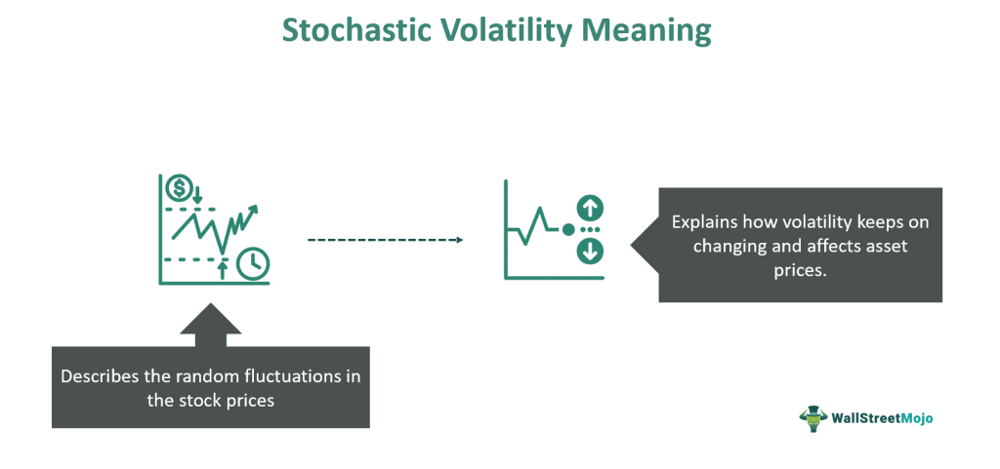

Volatility modeling plays a pivotal role in quantitative finance, particularly concerning stochastic volatility and algorithmic trading. In financial markets, volatility is not merely a measure of risk; it is a dynamic factor that influences pricing, trading strategies, and risk management processes. Understanding the nuanced behavior of volatility allows traders, portfolio managers, and quantitative analysts (quants) to craft sophisticated trading strategies that account for changing market dynamics.

Traditional models, like the Black-Scholes model, assume constant volatility, which limits their effectiveness in reflecting the unpredictable nature of real-world markets. In contrast, stochastic volatility models incorporate randomness, providing a more realistic representation of volatility's variations over time. These models are essential tools for accurate derivative pricing and comprehensive risk assessment, integrating both historical data and market-derived signals such as implied volatility.



This article will explore various aspects of stochastic volatility, offering insights into its fundamental role in financial modeling. Key models, including the Heston, GARCH, and SABR models, will be discussed to illustrate their adoption and application in the field. The emphasis will be on their functionality, how they are calibrated and applied within the landscape of algorithmic trading to elevate decision-making and enhance risk management methodologies.

Moreover, we will consider practical challenges and computational requirements inherent in implementing these models. The insights provided aim to enhance understanding of volatility's dynamic nature, emphasizing its relevance for financial professionals focusing on algorithmic trading and quantitative finance. By the conclusion of this piece, readers will appreciate how stochastic volatility modeling is integral to evolving financial strategies in increasingly complex markets.

## Table of Contents

## What is Stochastic Volatility?

Stochastic volatility refers to the phenomenon where the volatility, or the degree of variation, in the prices of financial instruments is random and not constant over time. This concept stands in contrast to the assumption of constant volatility in the classic Black-Scholes model, which simplifies option pricing by assuming a fixed level of volatility. In reality, market volatility is often highly variable, influenced by numerous factors, making stochastic volatility models a more realistic tool for capturing these variations.

The modeling of stochastic volatility typically involves stochastic processes designed to account for both historical and implied market conditions. These models represent volatility as a random process that evolves over time according to specific probabilistic rules. A common approach is to model volatility using a continuous-time stochastic process, such as a mean-reverting process, which assumes that volatility tends to return to a long-term average level. An example of such a process is the Cox-Ingersoll-Ross (CIR) model, which can be expressed as:

$$

d\sigma_t = \kappa(\theta - \sigma_t)dt + \xi \sigma_t^{0.5} dW_t 
$$

where $\sigma_t$ is the volatility at time $t$, $\kappa$ is the rate of mean reversion, $\theta$ is the long-term mean level of volatility, $\xi$ is the volatility of volatility, and $dW_t$ is a Wiener process.

Stochastic [volatility](/wiki/volatility-trading-strategies) models are particularly important in the context of derivative pricing and market risk assessment. By allowing for a dynamic and non-constant volatility structure, these models provide a more comprehensive framework for understanding market behaviors and risks. They are essential for pricing complex financial derivatives whose value is highly sensitive to volatility levels, such as options. The ability to accurately capture the dynamic nature of volatility also aids in better estimation of risk measures, such as Value at Risk (VaR) and Conditional Value at Risk (CVaR), which are crucial for effective risk management.

## Key Stochastic Volatility Models

Stochastic volatility models are essential tools employed to understand and predict the dynamic behavior of volatility in financial markets. Among the most renowned are the Heston Model, GARCH Models, and the SABR Model, each offering unique advantages for representing volatility processes under varying market conditions.

### The Heston Model

The Heston Model is a widely used stochastic volatility model characterized by allowing volatility to follow a mean-reverting process. Its main advantage is the ability to capture the empirical characteristic of financial markets where volatility tends to fluctuate around a long-term mean. The model is grounded in the following stochastic differential equations (SDEs):

$$
dS_t = \mu S_t dt + \sqrt{v_t} S_t dW_t^S
$$

$$
dv_t = \kappa(\theta - v_t) dt + \sigma \sqrt{v_t} dW_t^v
$$

Here, $S_t$ represents the asset price, $v_t$ is the variance, $\mu$ is the drift term, $\kappa$ is the rate of mean reversion, $\theta$ is the long-term average volatility, $\sigma$ is the volatility of the volatility, and $dW_t^S$ and $dW_t^v$ are two correlated Wiener processes with correlation $\rho$.

### GARCH Models

Generalized Autoregressive Conditional Heteroskedasticity (GARCH) models, introduced by Bollerslev (1986), are powerful tools in time-series analysis and are extensively applied to forecast and assess market risk. They effectively capture the clustering effect of volatility, where high-volatility periods tend to be followed by high-volatility periods. The basic GARCH(1,1) model can be represented as:

$$
\sigma_t^2 = \alpha_0 + \alpha_1 \epsilon_{t-1}^2 + \beta_1 \sigma_{t-1}^2
$$

where $\epsilon_t$ is the asset return shock, $\alpha_0 > 0$, $\alpha_1 \geq 0$, and $\beta_1 \geq 0$ are parameters to be estimated. $\sigma_t^2$ denotes the conditional variance at time $t$.

### SABR Model

The SABR (Stochastic Alpha, Beta, Rho) model is primarily utilized for pricing [interest rate](/wiki/interest-rate-trading-strategies) derivatives. It's versatile, covering a range of volatility behaviors by allowing parameters to change stochastically. The core idea of the SABR model is captured in its SDEs, formulated as:

$$
dF_t = \alpha_t F_t^\beta dW_t^F
$$

$$
d\alpha_t = \nu \alpha_t dW_t^\alpha
$$

where $F_t$ is the forward price, $\alpha_t$ is the stochastic volatility, $\beta$ represents the exponent controlling the elasticity of variance, $\nu$ is the volatility of volatility, and $dW_t^F$ and $dW_t^\alpha$ are two correlated Brownian motions with correlation parameter $\rho$.

### Mathematical Underpinning and Robustness

Each model adopts a distinctive mathematical framework to simulate volatility behavior. The Heston Model employs mean-reverting processes to model stochasticity in variance, offering robust options pricing by incorporating market volatility term structures. GARCH models use time-series techniques to address long-memory properties in volatility, which are vital for predicting future market variability. The SABR model offers flexibility through its ability to adjust model parameters dynamically, aiding in the effective pricing of complex interest rate derivatives.

These models collectively enhance the capability to understand, predict, and manage risks across different financial instruments and market conditions, illustrating their critical role in modern finance.

## Implementation and Calibration of Stochastic Volatility Models

Parameter estimation in stochastic volatility models is a sophisticated process, typically involving advanced statistical techniques such as Maximum Likelihood Estimation (MLE) and Bayesian Inference. These methods are crucial for accurately determining the parameters that characterize the volatility process in these models.

**Maximum Likelihood Estimation (MLE):**

MLE is a widely used method for estimating the parameters of a statistical model. In the context of stochastic volatility, MLE involves finding the parameter values that maximize the likelihood function, which measures how likely it is that the observed data was generated by the model given specific parameters.

Consider a simple example employing a stochastic volatility model:
$$
L(\theta; X) = \prod_{i=1}^{n} f(X_i | \theta)
$$
where $L$ is the likelihood function, $\theta$ represents the parameters, and $X$ is the observed data. The task is to maximize $L$ with respect to $\theta$.

**Bayesian Inference:**

Bayesian Inference offers an alternative approach by incorporating prior beliefs about parameters. It combines prior distributions with the likelihood of observed data to produce a posterior distribution. This method is particularly useful in situations with uncertainty or sparse data.

Bayes' Theorem is expressed as:
$$
P(\theta | X) = \frac{P(X | \theta) P(\theta)}{P(X)}
$$
where $P(\theta | X)$ is the posterior, $P(X | \theta)$ is the likelihood, $P(\theta)$ is the prior, and $P(X)$ is the marginal likelihood.

**Calibration:**

Accurate calibration is integral to model effectiveness, aligning outputs with real market data. This often involves the use of historical data and implied volatility surfaces. Calibration adjusts model parameters to reflect current market conditions.

For example, in calibrating a Heston model, one may employ historical price data and implied volatilities to estimate parameters such as the initial volatility, long-term variance, and rate of mean reversion.

**Numerical Methods:**

When analytical solutions are not feasible, numerical techniques provide valuable tools for solving model equations.

- **Monte Carlo Simulations:** These are utilized to estimate the distribution of future volatility by simulating numerous paths for the stochastic volatility process. This is computationally intensive but essential for handling high-dimensional problems.

- **Finite Difference Methods:** Used for solving partial differential equations (PDEs) derived from the model, these methods approximate PDEs and can be effective in option pricing and risk assessment.

These methodologies are instrumental for aligning stochastic volatility models with market realities, enhancing their predictive capabilities. By accurately representing real-time market behaviors, these models contribute significantly to informed decision-making in trading and risk management. 

In summary, the implementation and calibration of stochastic volatility models hinge on sophisticated parameter estimation and numerical solutions. While these processes are complex and computationally demanding, they are indispensable for capturing the dynamic behaviors of financial markets accurately.

## Applications in Algorithmic Trading

Algorithmic trading plays a pivotal role in modern financial markets by utilizing models of stochastic volatility to forecast market conditions and fine-tune trading strategies. These models help traders identify volatility patterns, allowing them to design algorithms that take advantage of market fluctuations and provide effective hedging strategies. The adaptability of stochastic volatility models is particularly beneficial in rapidly changing markets where traditional models may fall short.

Quantitative firms, such as Two Sigma, exemplify the application of sophisticated stochastic volatility models to refine their trading algorithms and strengthen risk assessment frameworks. By incorporating stochastic elements into their models, these firms can achieve a deeper understanding of market behaviors, enabling them to recognize and exploit fleeting opportunities more effectively. The integration of these complex models facilitates the development of strategies that can accommodate various market conditions, enhancing the firms' ability to manage risk and achieve consistent profit margins.

Incorporating stochastic volatility models also leads to better risk management through enhanced precision in pricing derivatives. By accounting for fluctuating volatility, [algorithmic trading](/wiki/algorithmic-trading) systems can derive more accurate prices for options and other financial derivatives. This accuracy reduces the potential for mispricing, which is crucial for maintaining financial stability and maximizing returns.

An illustration of stochastic volatility model implementation in Python could involve using the Heston Model, which is renowned for its ability to model mean-reverting volatility. Below is a Python snippet demonstrating a simple setup for pricing a European call option using the Heston Model:

```python
import numpy as np
from scipy.stats import norm

def heston_call_price(S0, K, T, r, kappa, theta, sigma, rho, v0):
    dt = 0.01
    n_steps = int(T / dt)
    prices = np.zeros(1000)

    for i in range(1000):
        S, v = S0, v0
        for _ in range(n_steps):
            dW_S = np.random.normal(scale=np.sqrt(dt))
            dW_v = rho * dW_S + np.sqrt(1 - rho**2) * np.random.normal(scale=np.sqrt(dt))
            S += r * S * dt + np.sqrt(v) * S * dW_S
            v += kappa * (theta - v) * dt + sigma * np.sqrt(v) * dW_v
        prices[i] = max(S - K, 0)

    return np.exp(-r * T) * np.mean(prices)

# Example usage
S0 = 100  # Initial stock price
K = 100   # Strike price
T = 1.0   # Time to maturity
r = 0.05  # Risk-free rate
kappa = 2.0  # Rate of mean reversion
theta = 0.02 # Long-term volatility
sigma = 0.1  # Volatility of volatility
rho = -0.7   # Correlation between asset and volatility
v0 = 0.04    # Initial volatility

heston_price = heston_call_price(S0, K, T, r, kappa, theta, sigma, rho, v0)
print(f"Heston Model Call Price: {heston_price}")
```

This code implements a Monte Carlo simulation to price a European call option under the Heston Model, an example of employing stochastic volatility in a trading strategy. Such integrations allow trading systems to better align model outputs with actual market movements, resulting in enhanced financial outcomes. By using advanced computational techniques, trading firms can continuously adapt to market changes, ensuring the robustness and longevity of their trading strategies.

## Challenges and Limitations

Stochastic volatility models, while offering detailed insights into the functioning of financial markets, come with challenges that must be addressed to make accurate predictions and informed trading decisions. First and foremost, the inherent complexity of these models demands significant computational resources and a high level of mathematical and statistical expertise. Implementing models such as the Heston model or GARCH involves solving complex differential equations or estimating parameters that are computationally intensive.

Parameter estimation is another area of concern, as it can be highly sensitive to the input data and prevailing market conditions. This sensitivity sometimes results in overfitting, where the model becomes too tailored to the historical data and loses its predictive power for future market movements. Techniques like Maximum Likelihood Estimation or Bayesian Inference are often employed to obtain reliable parameter estimates, but these methods are not foolproof and can produce varied results under different market scenarios.

Furthermore, the dynamic nature of financial markets necessitates frequent recalibrations of the models to maintain alignment with current market conditions. Market regimes can shift rapidly due to economic, political, or social events, requiring adjustments to the model parameters to preserve their validity and utility. This need for frequent recalibration presents a substantial challenge as it can disrupt model stability and consistency, creating additional overhead for continuous monitoring and updating.

Despite these challenges, the tangible benefits provided by stochastic volatility models—in terms of accurately capturing the volatility dynamics—often justify their complex nature. These models play a crucial role in risk management, option pricing, and enhancing the decision-making processes in algorithmic trading. Thus, while the challenges associated with stochastic volatility models are significant, the insights and competitive advantages they provide make them invaluable tools in quantitative finance.

## Conclusion

Stochastic volatility modeling has significantly reshaped our understanding of financial market dynamics, marking a pivotal advancement in quantitative finance. These models account for the random and time-varying nature of volatility, providing a more comprehensive representation of market behavior compared to constant volatility assumptions. This dynamic approach is crucial as it mirrors the inherent unpredictabilities in financial markets, enabling a more accurate reflection of real-world conditions.

As financial markets continue to evolve in complexity and scale, the application of stochastic volatility models becomes increasingly indispensable. The ability to capture the erratic and fluctuating nature of market volatility provides traders and financial analysts with a formidable tool in developing resilient trading strategies and robust risk management frameworks. The adaptability of these models to shifting market conditions allows for enhanced predictive accuracy, supporting more informed decision-making processes.

The landscape of quantitative finance is also being transformed by ongoing advancements in computational techniques. Enhanced computational power and algorithms facilitate the more efficient implementation and calibration of stochastic volatility models, paving the way for their continued relevance and utility in modern trading and risk management practices. Techniques such as Monte Carlo simulations and finite difference methods have become standard in dealing with complex model equations, thus broadening the practical applicability of stochastic volatility models.

For algorithmic trading and finance professionals, mastering the intricacies of stochastic volatility models is vital. These models not only optimize trading algorithms by providing deeper insights into market conditions but also offer a competitive edge through improved precision in pricing derivatives and assessing risk. As such, the capability to leverage these models effectively is increasingly recognized as a critical skill in achieving success in today's highly competitive financial markets. Through continual learning and adaptation, professionals equipped with this expertise can enhance their strategic decision-making, ultimately leading to superior financial outcomes.

## References & Further Reading

[1]: Heston, S. L. (1993). ["A Closed-Form Solution for Options with Stochastic Volatility with Applications to Bond and Currency Options."](https://wwwf.imperial.ac.uk/~ajacquie/IC_Num_Methods/IC_Num_Methods_Docs/Literature/Heston.pdf) The Review of Financial Studies, 6(2), 327-343.

[2]: Bollerslev, T. (1986). ["Generalized Autoregressive Conditional Heteroskedasticity."](https://www.sciencedirect.com/science/article/pii/0304407686900631) Journal of Econometrics, 31(3), 307-327.

[3]: Hagan, P. S., Kumar, D., Lesniewski, A. S., & Woodward, D. E. (2002). ["Managing Smile Risk."](https://www.researchgate.net/publication/235622441_Managing_Smile_Risk) The Best of Wilmott, 1, 249–296.

[4]: Gatheral, J. (2006). ["The Volatility Surface: A Practitioner's Guide."](https://onlinelibrary.wiley.com/doi/book/10.1002/9781119202073) Wiley.

[5]: Hull, J. C. (2009). ["Options, Futures, and Other Derivatives."](https://www.amazon.com/Options-Futures-Other-Derivatives-9th/dp/0133456315) Pearson Education.