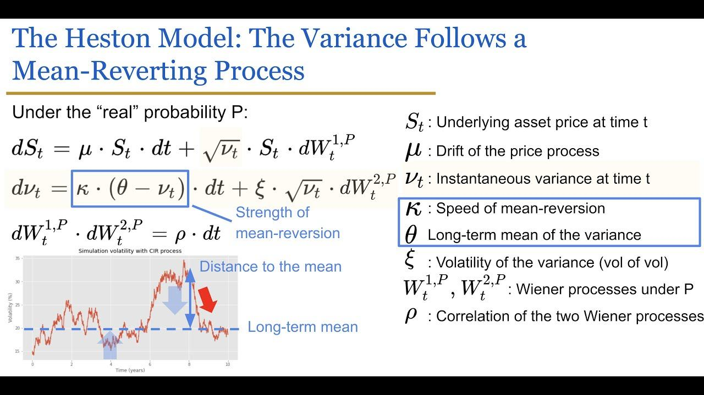

## Table of Contents

## What is stochastic volatility?

Stochastic volatility is a way to describe how the ups and downs of a financial asset, like a stock or a currency, can change over time in a random way. Imagine you are watching the price of a stock. Sometimes, the price might move a lot in a short time, and other times, it might stay pretty stable. Stochastic volatility says that this movement isn't steady; it can get bigger or smaller randomly.

In simple terms, it's like the weather. One day it might be calm and the next day it could be stormy. Just like we can't predict the weather perfectly, we can't predict exactly how the volatility of a stock will change. This idea is important for people who trade or invest because it helps them understand and manage the risks better. They use special math models to try and guess how the volatility might change, even though it's always a bit of a guess.

## How does stochastic volatility differ from constant volatility?

Stochastic volatility and constant volatility are two ways to think about how much a stock's price might move up or down. Constant volatility means that the size of these ups and downs stays the same all the time. It's like saying that no matter what day it is, the stock will always move by the same amount. This makes things easier to predict, but it doesn't match what we see in real life because stock prices can be calm one day and wild the next.

Stochastic volatility, on the other hand, says that these ups and downs can change randomly. One day the stock might move a lot, and another day it might hardly move at all. This idea is more like what actually happens in the stock market, where the amount of movement can be unpredictable. People use special math to try and guess how these changes might happen, but it's always a bit of a guess because it's random.

## What are the key components of a stochastic volatility model?

A stochastic volatility model has a few main parts that help it work. First, there's the price of the asset, like a stock or currency, which can go up or down. This price movement is what we're trying to understand. The model says that this movement isn't just random noise; it's affected by something called volatility, which is how much the price can change. The key thing about stochastic volatility models is that this volatility can change over time in a random way, not staying the same like in simpler models.

The second part is the volatility itself, which is also a random process. Instead of being constant, it can get bigger or smaller, kind of like how the weather can change from calm to stormy. To make this work, the model uses something called a stochastic process to describe how volatility changes. This process usually involves some math to show that the changes in volatility are random but follow certain rules. Together, these parts help people predict how much a stock might move, even though it's never a perfect guess because of the randomness involved.

## Can you explain the concept of volatility clustering in the context of stochastic volatility?

Volatility clustering is a pattern we see in the stock market where times of big price swings tend to happen close together, and times of small price changes also stick together. Imagine you're watching a stock's price. If it's moving a lot one day, it's more likely to keep moving a lot the next day too. On the other hand, if it's pretty calm one day, it's more likely to stay calm the next day. This is what we mean by volatility clustering.

In the context of stochastic volatility, this idea makes a lot of sense. Stochastic volatility models say that the ups and downs of a stock's price can change randomly over time. But these models also show that if the volatility is high today, it's more likely to be high tomorrow too, and if it's low today, it's more likely to stay low. This matches what we see in real life with volatility clustering, where big moves tend to come in groups, and small moves do the same. So, these models help us understand and predict this pattern better.

## What are some common stochastic volatility models used in finance?

One common stochastic volatility model is the Heston model. It's popular because it's good at showing how stock prices and their volatility can change over time. In the Heston model, the price of a stock and its volatility both move in a way that can be predicted using math. The model says that the stock price follows a random path, and the volatility of that stock also follows its own random path. This helps people understand how the ups and downs of a stock can change and cluster together.

Another model is the GARCH (Generalized Autoregressive Conditional Heteroskedasticity) model. GARCH is a bit different because it looks at past data to predict how the volatility of a stock might change in the future. It's like saying, "If the stock moved a lot yesterday, it might move a lot today too." This model is great for spotting patterns in how volatility changes over time, which is useful for people trying to guess what might happen next in the stock market.

The SABR (Stochastic Alpha Beta Rho) model is also used a lot, especially for things like interest rates and currency exchange rates. It's a bit more complicated because it has several parts working together. The SABR model tries to predict how the volatility of an asset can change in a way that matches what we see in real life. It's good at showing how different factors can affect volatility and how these changes can be random but still follow certain rules.

## How is the Heston model applied in stochastic volatility?

The Heston model is a popular way to understand how a stock's price and its ups and downs can change over time. In this model, the stock's price follows a random path, and the amount of movement, or volatility, also follows its own random path. This means that the model can show how the stock's price can go up and down in a way that matches what we see in real life. The Heston model is good at showing something called volatility clustering, where big price swings tend to happen close together, and small changes do the same. This helps people who trade or invest to better guess how much a stock might move in the future.

To use the Heston model, people need to know a few things about the stock they're looking at. They need to know the starting price of the stock, how much the stock's price can move on average, and how fast the volatility can change. The model uses these pieces of information to create a picture of how the stock's price and its volatility might change over time. This picture isn't perfect because the future is always a bit of a guess, but it helps people make better decisions about buying or selling stocks. By understanding how the Heston model works, people can manage the risks of investing more effectively.

## What role does the volatility process play in option pricing under stochastic volatility models?

In option pricing, the volatility process is super important when we use stochastic volatility models. An option is like a bet on how much a stock's price will move by a certain time. The volatility process in these models helps us understand and predict how much the stock's price might go up or down. Since the volatility can change randomly over time, it makes our predictions more realistic. This means we can better guess how much an option might be worth because we're considering that the stock's ups and downs can get bigger or smaller.

Using a stochastic volatility model like the Heston model, we can see how the changing volatility affects the price of an option. For example, if the volatility is high, the option might be worth more because there's a bigger chance the stock's price will move a lot. On the other hand, if the volatility is low, the option might be worth less because the stock's price is less likely to change much. By understanding how the volatility process works, people who trade options can make smarter choices about buying or selling them, knowing that the value of an option can change based on how much the stock's price might move.

## How can stochastic volatility models be estimated and calibrated?

Estimating and calibrating stochastic volatility models involves using math and data to make the model match what we see in real life. To start, people use past data on a stock's price and its ups and downs to guess what the model's numbers should be. This is called estimation. They look at how the stock moved in the past and try to figure out how the volatility changed over time. By doing this, they can get a good idea of what numbers to use in the model to make it work well.

Once they have these initial guesses, people then fine-tune the model to make it even better. This is called calibration. They use special math tools to adjust the numbers in the model so that it matches the real data as closely as possible. They might use things like the prices of options to help them do this, because options give clues about how much people think the stock's price will move in the future. By carefully adjusting the model, people can make it more accurate and useful for predicting how a stock might move and what options might be worth.

## What are the advantages of using stochastic volatility models over simpler models like Black-Scholes?

Stochastic volatility models have some big advantages over simpler models like Black-Scholes. One main advantage is that they can show how the ups and downs of a stock can change over time in a random way. This is more like what we see in real life, where a stock might move a lot one day and stay calm the next. Black-Scholes assumes that the volatility stays the same all the time, which isn't true. By using stochastic volatility models, people can get a better picture of how much a stock might move, which helps them make smarter choices about buying or selling stocks and options.

Another advantage is that stochastic volatility models can show something called volatility clustering. This means that if a stock moves a lot one day, it's more likely to keep moving a lot the next day too. Simpler models like Black-Scholes don't show this pattern, which is important for understanding how the stock market works. By using stochastic volatility models, people can see these patterns and use them to predict how a stock might move in the future. This can help them manage the risks of investing better and make more accurate guesses about what options might be worth.

## How do jumps and stochastic volatility interact in financial modeling?

In financial modeling, jumps and stochastic volatility work together to give a more realistic picture of how stock prices can change. Jumps are sudden, big moves in a stock's price that can happen out of nowhere, like when a company announces some surprising news. Stochastic volatility, on the other hand, shows how the ups and downs of a stock can change over time in a random way. When you put jumps and stochastic volatility together in a model, you can see both the sudden big moves and the gradual changes in how much the stock moves. This helps people understand and predict how a stock might behave better than if they only looked at one of these things.

Using both jumps and stochastic volatility in a model can help explain some things that simpler models can't. For example, a model with just stochastic volatility might not be able to show those sudden big moves that can shake up the market. And a model with just jumps might not show how the normal ups and downs of a stock can change over time. By combining them, the model can show both the big surprises and the normal changes in how much a stock moves. This makes the model more useful for people who are trying to guess what might happen next in the stock market and make smarter decisions about buying or selling stocks and options.

## What are the challenges and limitations of implementing stochastic volatility models in practice?

Implementing stochastic volatility models in practice can be tricky because they are more complicated than simpler models like Black-Scholes. These models need a lot of math to work, and figuring out the right numbers to use can be hard. People have to use past data to guess what the numbers should be, but this isn't always easy because the stock market can be unpredictable. Also, these models need to be fine-tuned, or calibrated, to match real data as closely as possible. This takes time and special tools, which can be a challenge for people who want to use these models.

Another challenge is that even though stochastic volatility models are better at showing how stocks move in real life, they still aren't perfect. They can't predict everything that might happen in the stock market because the future is always a bit of a guess. Sometimes, the models might not catch all the sudden big moves, or jumps, that can happen. And even though they can show how the ups and downs of a stock can change over time, they might not always get it exactly right. So, while these models are helpful, people need to remember that they are just tools and not perfect crystal balls for predicting the future.

## How have recent advancements in computational methods improved the application of stochastic volatility models?

Recent advancements in computational methods have made it easier to use stochastic volatility models. These models need a lot of math to work well, and computers have gotten much faster and better at handling this math. This means people can now use more complicated models that show how stocks move in real life more accurately. They can also use more data to fine-tune these models, making them even better at predicting what might happen next in the stock market. This has made it possible for more people to use these models, even if they don't have a lot of math or computer skills.

Another big change is that new methods like [machine learning](/wiki/machine-learning) and [artificial intelligence](/wiki/ai-artificial-intelligence) have helped improve these models. These methods can find patterns in data that people might miss, which helps make the models more accurate. For example, machine learning can help figure out the best numbers to use in the models or spot when the stock market might have big moves. This makes stochastic volatility models more useful for people who are trying to make smart choices about buying or selling stocks and options. Overall, these advancements have made it easier and more effective to use these models in real life.

## What is Stochastic Volatility?

Stochastic volatility refers to the phenomenon where the volatility, or the degree of variation, in the prices of financial instruments is random and not constant over time. This concept stands in contrast to the assumption of constant volatility in the classic Black-Scholes model, which simplifies option pricing by assuming a fixed level of volatility. In reality, market volatility is often highly variable, influenced by numerous factors, making stochastic volatility models a more realistic tool for capturing these variations.

The modeling of stochastic volatility typically involves stochastic processes designed to account for both historical and implied market conditions. These models represent volatility as a random process that evolves over time according to specific probabilistic rules. A common approach is to model volatility using a continuous-time stochastic process, such as a mean-reverting process, which assumes that volatility tends to return to a long-term average level. An example of such a process is the Cox-Ingersoll-Ross (CIR) model, which can be expressed as:

$$

d\sigma_t = \kappa(\theta - \sigma_t)dt + \xi \sigma_t^{0.5} dW_t 
$$

where $\sigma_t$ is the volatility at time $t$, $\kappa$ is the rate of mean reversion, $\theta$ is the long-term mean level of volatility, $\xi$ is the volatility of volatility, and $dW_t$ is a Wiener process.

Stochastic [volatility](/wiki/volatility-trading-strategies) models are particularly important in the context of derivative pricing and market risk assessment. By allowing for a dynamic and non-constant volatility structure, these models provide a more comprehensive framework for understanding market behaviors and risks. They are essential for pricing complex financial derivatives whose value is highly sensitive to volatility levels, such as options. The ability to accurately capture the dynamic nature of volatility also aids in better estimation of risk measures, such as Value at Risk (VaR) and Conditional Value at Risk (CVaR), which are crucial for effective risk management.

## What are the key stochastic volatility models?

Stochastic volatility models are essential tools employed to understand and predict the dynamic behavior of volatility in financial markets. Among the most renowned are the Heston Model, GARCH Models, and the SABR Model, each offering unique advantages for representing volatility processes under varying market conditions.

### The Heston Model

The Heston Model is a widely used stochastic volatility model characterized by allowing volatility to follow a mean-reverting process. Its main advantage is the ability to capture the empirical characteristic of financial markets where volatility tends to fluctuate around a long-term mean. The model is grounded in the following stochastic differential equations (SDEs):

$$
dS_t = \mu S_t dt + \sqrt{v_t} S_t dW_t^S
$$

$$
dv_t = \kappa(\theta - v_t) dt + \sigma \sqrt{v_t} dW_t^v
$$

Here, $S_t$ represents the asset price, $v_t$ is the variance, $\mu$ is the drift term, $\kappa$ is the rate of mean reversion, $\theta$ is the long-term average volatility, $\sigma$ is the volatility of the volatility, and $dW_t^S$ and $dW_t^v$ are two correlated Wiener processes with correlation $\rho$.

### GARCH Models

Generalized Autoregressive Conditional Heteroskedasticity (GARCH) models, introduced by Bollerslev (1986), are powerful tools in time-series analysis and are extensively applied to forecast and assess market risk. They effectively capture the clustering effect of volatility, where high-volatility periods tend to be followed by high-volatility periods. The basic GARCH(1,1) model can be represented as:

$$
\sigma_t^2 = \alpha_0 + \alpha_1 \epsilon_{t-1}^2 + \beta_1 \sigma_{t-1}^2
$$

where $\epsilon_t$ is the asset return shock, $\alpha_0 > 0$, $\alpha_1 \geq 0$, and $\beta_1 \geq 0$ are parameters to be estimated. $\sigma_t^2$ denotes the conditional variance at time $t$.

### SABR Model

The SABR (Stochastic Alpha, Beta, Rho) model is primarily utilized for pricing [interest rate](/wiki/interest-rate-trading-strategies) derivatives. It's versatile, covering a range of volatility behaviors by allowing parameters to change stochastically. The core idea of the SABR model is captured in its SDEs, formulated as:

$$
dF_t = \alpha_t F_t^\beta dW_t^F
$$

$$
d\alpha_t = \nu \alpha_t dW_t^\alpha
$$

where $F_t$ is the forward price, $\alpha_t$ is the stochastic volatility, $\beta$ represents the exponent controlling the elasticity of variance, $\nu$ is the volatility of volatility, and $dW_t^F$ and $dW_t^\alpha$ are two correlated Brownian motions with correlation parameter $\rho$.

### Mathematical Underpinning and Robustness

Each model adopts a distinctive mathematical framework to simulate volatility behavior. The Heston Model employs mean-reverting processes to model stochasticity in variance, offering robust options pricing by incorporating market volatility term structures. GARCH models use time-series techniques to address long-memory properties in volatility, which are vital for predicting future market variability. The SABR model offers flexibility through its ability to adjust model parameters dynamically, aiding in the effective pricing of complex interest rate derivatives.

These models collectively enhance the capability to understand, predict, and manage risks across different financial instruments and market conditions, illustrating their critical role in modern finance.

## References & Further Reading

[1]: Heston, S. L. (1993). ["A Closed-Form Solution for Options with Stochastic Volatility with Applications to Bond and Currency Options."](https://wwwf.imperial.ac.uk/~ajacquie/IC_Num_Methods/IC_Num_Methods_Docs/Literature/Heston.pdf) The Review of Financial Studies, 6(2), 327-343.

[2]: Bollerslev, T. (1986). ["Generalized Autoregressive Conditional Heteroskedasticity."](https://www.sciencedirect.com/science/article/pii/0304407686900631) Journal of Econometrics, 31(3), 307-327.

[3]: Hagan, P. S., Kumar, D., Lesniewski, A. S., & Woodward, D. E. (2002). ["Managing Smile Risk."](https://www.researchgate.net/publication/235622441_Managing_Smile_Risk) The Best of Wilmott, 1, 249–296.

[4]: Gatheral, J. (2006). ["The Volatility Surface: A Practitioner's Guide."](https://onlinelibrary.wiley.com/doi/book/10.1002/9781119202073) Wiley.

[5]: Hull, J. C. (2009). ["Options, Futures, and Other Derivatives."](https://www.amazon.com/Options-Futures-Other-Derivatives-9th/dp/0133456315) Pearson Education.