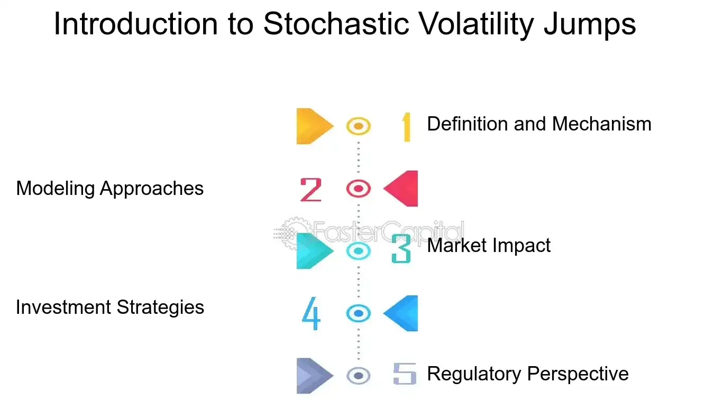

## Table of Contents

## What is stochastic volatility?

Stochastic volatility refers to the idea that the volatility of a financial asset, like a stock or a currency, can change randomly over time. In simpler terms, it means that how much the price of an asset can swing up or down is not fixed and can vary unpredictably. This concept is important because it helps investors and traders understand and predict how risky an investment might be. Traditional models often assume that volatility is constant, but in reality, it fluctuates, which can lead to more accurate pricing and risk management when taken into account.

In practice, stochastic volatility models are used in financial markets to better capture the behavior of asset prices. These models assume that volatility follows its own random process, separate from the asset's price movement. This approach can help in creating more realistic simulations of future price movements and in pricing complex financial instruments like options. By acknowledging that volatility is not just a fixed number but a dynamic and unpredictable element, these models provide a more nuanced view of market behavior, helping to improve decision-making in investment and trading strategies.

## What is a jump in financial modeling?

In financial modeling, a jump refers to a sudden and significant change in the price of an asset. Imagine you're watching a stock's price move smoothly up and down, then suddenly, it jumps to a much higher or lower value. This kind of unexpected movement can happen because of big news, like a company announcing great earnings or a sudden economic event.

Models that include jumps are called "jump-diffusion models." These models help us understand and predict how prices can change not just smoothly, but also with these big sudden moves. By including jumps, these models can better capture what really happens in the markets, where big news can cause prices to move a lot in a short time. This helps traders and investors make better decisions by preparing for these sudden changes.

## How does stochastic volatility differ from constant volatility?

Stochastic volatility means that how much a stock or other asset's price can go up or down changes randomly over time. It's like the weather; some days it's calm, and other days it's stormy. This is different from constant volatility, which assumes that the amount a price can move stays the same all the time. Think of it like a car always driving at the same speed on a highway.

In real life, markets are more like stochastic volatility because things can get more or less wild without warning. If you use a model that thinks volatility is always the same, you might miss out on how prices can suddenly change a lot or calm down. Using stochastic volatility helps you get a better picture of what might happen, making it easier to plan and manage risks in investing.

## What are the basic components of a stochastic volatility jump model?

A stochastic volatility jump model is a way to understand how the price of something like a stock can change over time. It has three main parts. First, there's the price itself, which can move up or down smoothly. Second, there's the volatility, which is how much the price can swing around, and this can change randomly. Third, there are jumps, which are sudden big changes in the price that can happen because of big news or events.

The model works by putting these parts together to show how prices can behave in the real world. The price part is like a car driving on a road, moving smoothly most of the time. The volatility part is like the weather, sometimes calm and sometimes stormy, which can make the car's ride bumpier or smoother. The jumps are like hitting a big pothole or finding a shortcut, causing the car to suddenly jump up or down. By using all these parts, the model helps people see how prices can change in ways that are more like what happens in real markets.

## Can you explain the concept of a jump-diffusion process?

A jump-diffusion process is a way to describe how the price of something, like a stock, can change over time. It's like a mix of two things: a smooth movement and sudden big changes. Imagine you're watching a car drive on a road. Most of the time, it moves smoothly, but sometimes it hits a big bump or finds a shortcut, making it jump suddenly. In the same way, the price of a stock can move smoothly up and down, but then big news or events can cause it to jump a lot in a short time.

This process helps people understand and predict how prices can behave in the real world. By including both the smooth movements and the sudden jumps, it gives a better picture of what might happen. This is useful for people who trade or invest because it helps them prepare for both the normal ups and downs and the big surprises that can happen in the market.

## What are the common types of jump distributions used in stochastic volatility models?

In stochastic volatility models, jump distributions help describe how sudden big changes in prices can happen. One common type of jump distribution is the normal distribution. It's like a bell curve where most jumps are small, but you can still have bigger jumps, though they're less common. Another type is the log-normal distribution, which is useful because it makes sure jump sizes are always positive, which makes sense for things like stock prices that can't go below zero.

Another type of jump distribution used is the double exponential distribution. This one is good because it can show that jumps can be both up and down, and it can handle bigger jumps more easily than the normal distribution. The last common type is the Poisson distribution, which is used to model how often jumps happen, not how big they are. It's like counting how many times a big event happens in a certain time, which helps in understanding how often you might see these big jumps in prices.

## How do stochastic volatility jump models improve upon traditional models like Black-Scholes?

Stochastic volatility jump models do a better job at showing how prices really move compared to older models like Black-Scholes. Black-Scholes assumes that prices move smoothly and that how much they can move stays the same all the time. But in real life, prices can change a lot suddenly because of big news or events, and how much they move can also change randomly. Stochastic volatility jump models take these things into account, making them more like what happens in the real world. They show that prices can have sudden big jumps and that how much prices can move around can change over time.

By using these models, people who trade or invest can make better guesses about what might happen next. They can see that prices don't just move smoothly but can have big surprises. This helps them prepare for these surprises and manage their risks better. The old Black-Scholes model can miss these big changes and how much prices can move around, which can lead to mistakes in planning. So, stochastic volatility jump models give a fuller picture of how markets work, helping people make smarter choices.

## What are the mathematical equations that describe a stochastic volatility jump model?

A stochastic volatility jump model is a way to describe how the price of something like a stock can change over time. The price part of the model is usually described by an equation called a stochastic differential equation (SDE). The basic idea is that the price, let's call it S, changes over time, t. The equation looks like this: dS/S = (μ - λk)dt + σdW + (J-1)dq, where μ is the average return, σ is the volatility, dW is a random movement from a normal distribution, J is the size of a jump, dq is a Poisson process that shows when jumps happen, λ is how often jumps happen, and k is the average size of jumps. This equation shows that the price can move smoothly most of the time but can also have sudden big jumps.

The volatility part of the model, which is how much the price can move around, also changes randomly over time. This is described by another SDE. Let's call the volatility v. The equation for v might look like this: dv = κ(θ - v)dt + ξ√v dZ, where κ is how fast v goes back to its average level θ, ξ is how much v can change, and dZ is another random movement from a normal distribution. This equation shows that the volatility can go up or down randomly, making the price movements bumpier or smoother. Together, these equations help people understand how prices can change in ways that are more like what happens in real markets, with both smooth movements and sudden jumps.

## How can one estimate the parameters of a stochastic volatility jump model?

To estimate the parameters of a stochastic volatility jump model, you need to look at past data of the price movements and try to find the numbers that make the model fit the data best. This is often done using a computer program that tries different values for the parameters like the average return, the volatility, how often jumps happen, and how big the jumps are. The program keeps changing these values until it finds the ones that make the model's predictions match the real data as closely as possible. This process is called calibration, and it's like trying to tune a guitar to make it sound right by adjusting the strings.

One common way to do this is by using a method called maximum likelihood estimation. This method looks at how likely it is that the model with certain parameters would produce the data you have. The computer tries different sets of parameters and picks the ones that make the data most likely. Another way is to use simulation methods like the Markov Chain Monte Carlo (MCMC), where the computer runs many simulations of the model with different parameters and sees which ones fit the data best over time. Both methods need a lot of computer power and careful checking to make sure the results are good and make sense.

## What are the challenges in calibrating stochastic volatility jump models to market data?

Calibrating stochastic volatility jump models to real market data can be tricky because these models have a lot of different parts, like the average return, the volatility, how often jumps happen, and how big the jumps are. Each of these parts needs to be set just right to make the model's predictions match what's happening in the market. If one part is off, the whole model can be wrong, so it's like trying to solve a big puzzle where every piece has to fit perfectly.

Another challenge is that markets can be really unpredictable. Prices can jump around a lot because of news or events that are hard to predict. This means the data you use to set up your model might not be the same as the data you get later. So, even if you do a good job calibrating the model today, it might not work as well tomorrow. It's like trying to hit a moving target, and you need to keep checking and updating your model to make sure it stays accurate.

## How do stochastic volatility jump models perform in predicting market crises compared to other models?

Stochastic volatility jump models can do a better job at predicting market crises compared to simpler models like Black-Scholes. This is because they take into account that prices can suddenly jump a lot, which often happens during a crisis. For example, when big news like a company going bankrupt or a major economic event hits the market, prices can drop or rise very quickly. These models can show these big sudden changes, helping people see that a crisis might be coming.

However, even with these models, predicting a market crisis is still really hard. Markets can be very unpredictable, and even if a model can show that big jumps are possible, it might not be able to tell exactly when or how big the jump will be. So, while stochastic volatility jump models are better than simpler models at showing the kinds of big changes that happen during crises, they're not perfect. People who use these models still need to be careful and keep an eye on the market to make the best guesses about what might happen next.

## What advanced techniques can be used to enhance the accuracy of stochastic volatility jump models?

To make stochastic volatility jump models more accurate, one advanced technique is to use machine learning. Machine learning can look at a lot of data and find patterns that might be hard for people to see. For example, it can learn from past market data how often jumps happen, how big they are, and what might cause them. By using this information, the model can make better guesses about what might happen next. This can help the model be more ready for big changes in the market, like during a crisis.

Another way to improve these models is by using more detailed data. Instead of just looking at the price at the end of each day, you can use data that shows what happened every minute or even every second. This can help the model see smaller changes and jumps that happen during the day, not just at the end. By using this more detailed data, the model can get a better picture of how prices move and be more accurate in its predictions.

## What are the mechanics of market dynamics and volatility?

Market dynamics and volatility are driven by a multitude of factors including economic announcements, geopolitical events, and shifts in investor sentiment. These elements contribute to the overall market behavior, causing fluctuations in asset prices and market indices. Economic announcements, such as [interest rate](/wiki/interest-rate-trading-strategies) decisions by central banks, employment figures, and GDP growth rates, can significantly impact investor expectations and, consequently, market volatility. Investor sentiment, often influenced by news, social media, and general economic outlook, can also drive market movements either by reinforcing trends or initiating reversals.

Traditional models that assume smooth market movements often fail to capture the intricate nature of these dynamics. Consequently, stochastic volatility models have been developed to introduce randomness into asset price modeling, accounting for sudden jumps or spikes in volatility. These models are characterized by their ability to incorporate random processes and sudden changes, reflecting more accurately the unpredictable nature of financial markets.

One of the key aspects of stochastic [volatility](/wiki/volatility-trading-strategies) models is their reliance on stochastic differential equations, where the volatility of the asset is a random process. For example, in a simplistic stochastic volatility model, the volatility $\sigma_t$ itself might follow a diffusion process such as:

$$
d\sigma_t = \kappa (\theta - \sigma_t)dt + \eta dW_t
$$

where $\kappa$ represents the rate of mean reversion, $\theta$ the long-term mean volatility, $\eta$ the volatility of the volatility, and $dW_t$ a Wiener process.

These models are crucial for traders and investors as they enable a better anticipation and management of the risks associated with abrupt market changes. By simulating a range of potential future paths for asset prices, traders can estimate the likelihood and impact of different market scenarios. Risk managers, in turn, can develop hedging strategies that are adaptable to these diverse outcomes, enhancing their ability to safeguard investments against unexpected price movements.

Furthermore, stochastic volatility models allow for enhanced pricing and hedging of derivatives. Unlike simple models that may only account for constant volatility, stochastic volatility models can produce option pricing more aligned with observed market prices. This capability is invaluable when trading options and other derivatives, where volatility plays a significant role in determining the instruments' fair value.

Overall, by incorporating the probability of large, sudden price changes, stochastic volatility models provide a more nuanced tool for understanding and navigating market dynamics. For traders and investors, these models are indispensable in devising strategies that are both resilient to volatility shocks and capable of exploiting market inefficiencies.

## How can stochastic volatility be modeled in financial markets?

Modeling stochastic volatility in financial markets is crucial for addressing the inherent variability in asset price movements over time. Traditional models often assume constant volatility, which fails to capture the real-world fluctuations observed in financial markets. To better address this, models such as the Heston model and jump-diffusion processes are employed.

The Heston model, introduced by Steven Heston in 1993, is one of the most widely used stochastic volatility models. It represents volatility as a stochastic process, allowing it to change over time. The volatility $V_t$ in the Heston model follows a mean-reverting square-root process, defined by:

$$
dV_t = \kappa(\theta - V_t)dt + \sigma \sqrt{V_t}dW_t
$$

where $\kappa$ is the rate of reversion, $\theta$ is the long-term mean level of volatility, $\sigma$ is the volatility of volatility, and $dW_t$ is a Wiener process. The asset price $S_t$ is modeled with a stochastic differential equation using this volatility:

$$
dS_t = \mu S_t dt + \sqrt{V_t} S_t dZ_t
$$

where $\mu$ is the drift term, and $dZ_t$ is another Wiener process, possibly correlated with $dW_t$.

Jump-diffusion models, such as the Merton model, incorporate sudden large movements in asset prices, thus combining both continuous and discontinuous components. This approach extends the basic diffusion models by considering jumps, which are modeled as a Poisson process:

$$
dS_t = \mu S_t dt + \sigma S_t dW_t + J_t S_t dN_t
$$

Here, $J_t$ represents the jump amplitude, and $dN_t$ is the increment of a Poisson process with intensity $\lambda$.

These stochastic models are powerful tools for traders and risk managers, enabling them to develop more accurate pricing, hedging, and risk assessment strategies. For instance, in options pricing, these models can better capture the volatility "smile" observed in market data, leading to more precise valuations.

However, the challenge lies in the accurate calibration of these models to market data. Calibration involves using market prices of liquid derivatives to estimate the model parameters, ensuring that the model accurately reflects observed market behavior. Techniques such as maximum likelihood estimation and the use of optimization algorithms are often employed for this purpose. Python provides various packages like SciPy and PyMC for such tasks, enabling efficient parameter estimation.

Despite the challenges, stochastic volatility models remain integral to modern financial markets, providing insights and tools necessary for navigating the complexities of market dynamics.

## What is the relationship between Risk Management and Stochastic Jumps?

Risk management in the context of stochastic jumps requires sophisticated modeling techniques such as the Merton Jump-Diffusion Model. This model extends the classic Black-Scholes framework by incorporating sudden, random jumps in asset prices, rather than solely relying on continuous price movements. The model is defined as follows:

$$
dS_t = \mu S_t dt + \sigma S_t dW_t + J_t S_t dN_t
$$

Where:
- $S_t$ is the asset price
- $\mu$ is the drift rate
- $\sigma$ is the volatility of the asset price
- $dW_t$ is the standard Wiener process
- $J_t$ represents the random jump size
- $dN_t$ is a Poisson process with intensity $\lambda$, indicating the jump frequency

By incorporating this framework, traders and risk managers can better anticipate the impact of abrupt price changes and adjust their strategies accordingly.

Dynamic hedging is a critical technique employed to mitigate risks from stochastic jumps. This involves frequently rebalancing a portfolio to maintain a delta-neutral position, particularly when the underlying asset experiences sudden price shifts. Using algorithms and advanced trading software, ensuring that the portfolio's sensitivity to asset price movements remains minimal can reduce exposure to risks.

Stop-loss orders provide another layer of defense against unexpected price jumps. These orders automatically trigger the sale of assets when their prices fall to predetermined levels, thus limiting potential losses during significant market fluctuations. For instance, in the volatile trading environment symbolized by events like the Flash Crash of 2010, stop-loss orders can act as an essential risk mitigation tool, preventing substantial financial losses by automatically executing trades when prices drop sharply.

The Flash Crash of 2010 serves as a pertinent example of why robust risk management frameworks are necessary. On May 6, 2010, U.S. stock markets experienced a dramatic and rapid decline, followed by an equally swift recovery, within a matter of minutes. The event highlighted the vulnerabilities within trading systems and the importance of having effective risk management procedures in place. During such turbulent times, systems that incorporate stochastic models, alongside dynamic hedging and stop-loss strategies, prove invaluable in maintaining market stability and safeguarding investments.

Overall, the implementation of these risk management techniques is essential in navigating the complexities of financial markets characterized by stochastic volatility jumps. They provide a structured approach to protect against unexpected market movements, enhance the resilience of trading portfolios, and ensure that investors can respond adaptively to evolving market conditions.

## What are Stochastic Volatility Jumps in Action?

Understanding stochastic volatility jumps is vital for quantitative traders, risk managers, and market analysts as these jumps represent abrupt changes in the volatility of asset prices, deviating from the smooth behavior often assumed by traditional models. These sudden shifts can significantly impact trading strategies and risk assessments.

Models such as the Heston model and the Bates model are instrumental in incorporating stochastic volatility jumps into trading strategies. The Heston model, known for its closed-form solution properties and ability to capture volatility clustering, accounts for stochastic volatility by allowing the variance of asset returns to follow a mean-reverting square root process:

$$

dV_t = \kappa (\theta - V_t) dt + \sigma \sqrt{V_t} dW_t^2 
$$

where $V_t$ represents the variance at time $t$, $\kappa$ is the rate of mean reversion, $\theta$ is the long-term variance, and $\sigma$ is the volatility of volatility. The Bates model extends the Heston framework by integrating jump components into the asset price dynamics, accounting for sudden price shifts:

$$
dS_t = \mu S_t dt + \sqrt{V_t} S_t dW_t^1 + J S_t dq_t 
$$

Here, $S_t$ denotes the asset price, $\mu$ is the drift, $J$ is the jump size, and $dq_t$ is a Poisson process that represents the occurrence of jumps.

Real-world events provide tangible examples of how stochastic volatility jumps impact markets. The Brexit referendum in 2016 serves as a prominent case, where unexpected voting outcomes led to sharp fluctuations in currency and stock markets. Such events underscore the importance of robust models that can anticipate and manage the risks associated with extreme market movements.

Traders and risk managers leverage these models to enhance their understanding of market dynamics, allowing them to develop and implement more resilient trading strategies. By accounting for jumps and stochastic shifts, market participants can better prepare for and navigate through periods of heightened uncertainty and volatility, ultimately improving their decision-making processes and optimizing their market positions.

## What is the future of trading with stochastic volatility models?

Stochastic volatility models have fundamentally transformed trading strategies by enhancing risk assessment and pricing mechanisms. These models introduce randomness into the volatility of asset prices, capturing the unpredictable nature of financial markets more accurately than traditional models. This advancement allows traders and risk managers to gain deeper insights into market dynamics, leading to more robust risk management practices.

At the core of these models is the ability to account for sudden and severe market movements, often termed "jumps." By incorporating stochastic components, these models can simulate the uncertainty inherent in financial markets. For example, the Heston model allows for a stochastic process where volatility evolves over time, driven by a correlation with the asset’s price dynamics. Mathematically, this can be represented as:

$$
dv_t = \kappa(\theta - v_t)dt + \sigma_v \sqrt{v_t}dW_t^v
$$

where $v_t$ represents the variance, $\kappa$ is the mean-reversion speed, $\theta$ is the long-term mean, $\sigma_v$ denotes the volatility of the variance process, and $dW_t^v$ is a Wiener process. 

The integration of Artificial Intelligence (AI) and [machine learning](/wiki/machine-learning) into these stochastic volatility models fosters the development of more sophisticated, adaptive strategies. By utilizing machine learning algorithms, models can continuously learn and adjust to new market conditions, offering traders enhanced predictive capabilities. For example, machine learning techniques can be employed to optimize model parameters, ensuring that the models remain accurately calibrated to current market data. Python, with its extensive libraries such as numpy for numerical computations, pandas for data manipulation, and scikit-learn for machine learning, provides powerful tools for implementing these advanced strategies.

An illustrative Python implementation might involve calibrating the Heston model to market data:

```python
import numpy as np
from scipy.optimize import minimize

def heston_model(params, market_data):
    kappa, theta, sigma_v = params
    # Implement the Heston model formula
    # Compare with market_data to calculate error
    # ...

# Initial parameter guess
initial_params = np.array([0.5, 0.04, 0.1])

# Market data for calibration
market_data = np.array([...])

# Optimize parameters
result = minimize(heston_model, initial_params, args=(market_data,))

calibrated_params = result.x
```

The future of trading with stochastic volatility models lies in their continued refinement through technological advancements. AI-driven approaches promise to provide unprecedented accuracy in forecasting market trends and managing risks. As these models evolve, traders and risk managers who leverage their capabilities will be better positioned to navigate the complexities of modern financial markets, harnessing volatility as both a source of opportunity and a challenge to be managed effectively.

## How can one adapt to an ever-changing market?

Adapting to market dynamics requires strategies that can effectively handle stochastic volatility jumps. These jumps introduce sudden and unpredictable changes in asset prices, posing challenges for risk management and investment strategies.

Quantitative analysts and risk managers play a crucial role in refining models to incorporate jump components. This involves enhancing existing models, such as the Heston model, by integrating stochastic volatility and jump processes. For instance, the Bates model extends the Heston framework by adding a jump diffusion process to account for sudden price shifts. The model can be expressed as:

$$
dS_t = \mu S_t dt + \sqrt{v_t} S_t dW_t^S + J_t dN_t
$$

$$
dv_t = \kappa (\theta - v_t) dt + \sigma \sqrt{v_t} dW_t^v
$$

where $J_t$ represents the jump size and $dN_t$ is a Poisson process indicating jump occurrence.

Agile risk management practices are essential in navigating these unpredictable market conditions. Risk managers must continuously reassess and adjust their risk exposure, employing tools such as dynamic hedging and stress testing. Dynamic hedging involves adjusting portfolio positions in response to market changes to maintain a desired risk level. For example, options can be used to hedge against large market movements, providing protection when a jump occurs.

Investors can also employ stress testing to evaluate the potential impact of various scenarios on their portfolios. By simulating extreme market conditions, stress testing helps identify vulnerabilities and prepare strategies to mitigate potential losses.

Incorporating these practices enables investors to better navigate market uncertainties and capitalize on opportunities that arise from stochastic volatility jumps. As market dynamics evolve, the continuous refinement of models and risk management strategies is critical to maintaining resilience and achieving investment objectives.

## References & Further Reading

[1]: Heston, S. L. (1993). ["A Closed-Form Solution for Options with Stochastic Volatility with Applications to Bond and Currency Options."](https://wwwf.imperial.ac.uk/~ajacquie/IC_Num_Methods/IC_Num_Methods_Docs/Literature/Heston.pdf) The Review of Financial Studies, 6(2), 327-343.

[2]: Merton, R. C. (1976). ["Option Pricing when Underlying Stock Returns are Discontinuous."](https://www.sciencedirect.com/science/article/pii/0304405X76900222) Journal of Financial Economics, 3(1-2), 125-144.

[3]: Gatheral, J. (2006). ["The Volatility Surface: A Practitioner's Guide."](https://onlinelibrary.wiley.com/doi/book/10.1002/9781119202073) Wiley.

[4]: Andersen, T. G., & Benzoni, L. (2008). ["Stochastic Volatility."](https://papers.ssrn.com/sol3/papers.cfm?abstract_id=1076672) The New Palgrave Dictionary of Economics (2nd ed.). 

[5]: Paul Wilmott, J. Dewynne, & S. Howison (1995). ["The Mathematics of Financial Derivatives: A Student Introduction."](https://www.cambridge.org/core/books/mathematics-of-financial-derivatives/7121345D07C5BCE4FBEC91A8A7E6F267) Cambridge University Press.

[6]: Cont, R., & Tankov, P. (2003). ["Financial Modelling with Jump Processes."](https://www.taylorfrancis.com/books/mono/10.1201/9780203485217/financial-modelling-jump-processes-peter-tankov-rama-cont) CRC Press.

[7]: Cizek, P., Härdle, W. K., & Weron, R. (2011). ["Statistical Tools for Finance and Insurance."](https://link.springer.com/book/10.1007/978-3-642-18062-0) Springer.

[8]: Lopez de Prado, M. (2018). ["Advances in Financial Machine Learning."](https://www.amazon.com/Advances-Financial-Machine-Learning-Marcos/dp/1119482089) Wiley.