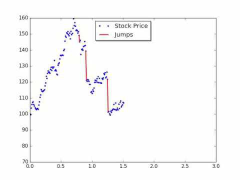

Stochastic volatility jumps are a critical component of financial markets, typified by abrupt changes in asset price volatility. Unlike traditional models that operate under the assumption of smooth and continuous market movements, stochastic volatility jumps introduce complexities that challenge these conventional approaches. Such jumps necessitate the use of advanced modeling techniques to accurately capture and predict the erratic behavior of market prices.

Volatility, the degree of variation of trading prices, is influenced by a multitude of factors including macroeconomic events, geopolitical tensions, and shifts in investor sentiment. When these factors lead to sudden and significant changes in volatility, markets experience what are known as stochastic volatility jumps. These events can result in large, unpredictable changes in asset prices, thereby posing significant challenges for investors and analysts alike.



Traditional models, such as the Black-Scholes model, often assume constant or smoothly changing volatility, which inadequately represents real market conditions under stochastic jumps. As a result, these models can misprice options and other derivatives, leaving market participants exposed to unforeseen risks. This has prompted the development of more sophisticated tools and models, such as the Heston model and the Merton Jump-Diffusion model, which incorporate elements of stochastic volatility and discrete jumps to better account for the observed market behavior.

For traders, quantitative analysts, and retail investors, understanding stochastic volatility jumps is essential. Accurate modeling of these jumps enables better risk assessment and management, allowing for informed decision-making and improved financial strategies. The ability to anticipate such market movements not only aids in mitigating potential losses but also unveils opportunities for profit, particularly in environments characterized by high volatility. As financial markets continue to evolve, the importance of mastering the intricacies of stochastic volatility jumps becomes ever more pronounced, offering a pathway to enhanced financial resilience and strategic advantage.

## Table of Contents

## The Mechanics of Market Dynamics and Volatility

Market dynamics and volatility are driven by a multitude of factors including economic announcements, geopolitical events, and shifts in investor sentiment. These elements contribute to the overall market behavior, causing fluctuations in asset prices and market indices. Economic announcements, such as interest rate decisions by central banks, employment figures, and GDP growth rates, can significantly impact investor expectations and, consequently, market volatility. Investor sentiment, often influenced by news, social media, and general economic outlook, can also drive market movements either by reinforcing trends or initiating reversals.

Traditional models that assume smooth market movements often fail to capture the intricate nature of these dynamics. Consequently, stochastic volatility models have been developed to introduce randomness into asset price modeling, accounting for sudden jumps or spikes in volatility. These models are characterized by their ability to incorporate random processes and sudden changes, reflecting more accurately the unpredictable nature of financial markets.

One of the key aspects of stochastic [volatility](/wiki/volatility-trading-strategies) models is their reliance on stochastic differential equations, where the volatility of the asset is a random process. For example, in a simplistic stochastic volatility model, the volatility $\sigma_t$ itself might follow a diffusion process such as:

$$
d\sigma_t = \kappa (\theta - \sigma_t)dt + \eta dW_t
$$

where $\kappa$ represents the rate of mean reversion, $\theta$ the long-term mean volatility, $\eta$ the volatility of the volatility, and $dW_t$ a Wiener process.

These models are crucial for traders and investors as they enable a better anticipation and management of the risks associated with abrupt market changes. By simulating a range of potential future paths for asset prices, traders can estimate the likelihood and impact of different market scenarios. Risk managers, in turn, can develop hedging strategies that are adaptable to these diverse outcomes, enhancing their ability to safeguard investments against unexpected price movements.

Furthermore, stochastic volatility models allow for enhanced pricing and hedging of derivatives. Unlike simple models that may only account for constant volatility, stochastic volatility models can produce option pricing more aligned with observed market prices. This capability is invaluable when trading options and other derivatives, where volatility plays a significant role in determining the instruments' fair value.

Overall, by incorporating the probability of large, sudden price changes, stochastic volatility models provide a more nuanced tool for understanding and navigating market dynamics. For traders and investors, these models are indispensable in devising strategies that are both resilient to volatility shocks and capable of exploiting market inefficiencies.

## Historical Perspective on Volatility Jumps

Volatility jumps have played a significant role in the development of financial models, tracing their importance back to major market events such as the 1929 stock market crash. These jumps are characterized by abrupt changes in volatility, challenging the assumption of continuous market movements inherent in traditional financial modeling. The crash of 1929 highlighted the limitations of models that could not account for such sudden shifts, paving the way for advancements in incorporating jumps into financial theories.

The need for more robust models led to the introduction of jump-diffusion models in the 1970s, most notably by Robert Merton. Merton's jump-diffusion model was groundbreaking as it merged diffusion processes with Poisson jumps to reflect real-world market behaviors more accurately. The model is mathematically expressed as follows:
$$

dS_t = \mu S_t dt + \sigma S_t dW_t + J S_t dq_t 
$$
where:
- $dS_t$ represents the asset price change;
- $\mu$ is the drift rate;
- $\sigma$ is the volatility of the asset;
- $dW_t$ is a Wiener process, representing continuous stochastic shocks;
- $J$ is the jump size;
- $dq_t$ is a Poisson process, where the jumps occur with a certain intensity or frequency.

This model acknowledged that markets could experience sudden shocks, incorporating stochastic volatility and jumps to provide a more comprehensive framework for financial analysis.

Empirical evidence further underscores the necessity of factoring in volatility jumps, as shown by events like the 2008 financial crisis. The crisis demonstrated that extreme market fluctuations could not be effectively captured by models that disregarded the potential for abrupt changes. Thus, models that include jump components emerged as crucial tools for understanding and managing the complexities of financial markets.

The reliance on models with jump components has become more widespread, as they allow for improved risk management and pricing accuracy. These models help in anticipating market shifts, enhancing the ability of traders, analysts, and investors to navigate market uncertainties. The historical examination of volatility jumps reveals their fundamental impact on financial modeling, encouraging ongoing advancements to meet the challenges posed by an ever-evolving market landscape.

## Modeling Stochastic Volatility in Financial Markets

Modeling stochastic volatility in financial markets is crucial for addressing the inherent variability in asset price movements over time. Traditional models often assume constant volatility, which fails to capture the real-world fluctuations observed in financial markets. To better address this, models such as the Heston model and jump-diffusion processes are employed.

The Heston model, introduced by Steven Heston in 1993, is one of the most widely used stochastic volatility models. It represents volatility as a stochastic process, allowing it to change over time. The volatility $V_t$ in the Heston model follows a mean-reverting square-root process, defined by:

$$
dV_t = \kappa(\theta - V_t)dt + \sigma \sqrt{V_t}dW_t
$$

where $\kappa$ is the rate of reversion, $\theta$ is the long-term mean level of volatility, $\sigma$ is the volatility of volatility, and $dW_t$ is a Wiener process. The asset price $S_t$ is modeled with a stochastic differential equation using this volatility:

$$
dS_t = \mu S_t dt + \sqrt{V_t} S_t dZ_t
$$

where $\mu$ is the drift term, and $dZ_t$ is another Wiener process, possibly correlated with $dW_t$.

Jump-diffusion models, such as the Merton model, incorporate sudden large movements in asset prices, thus combining both continuous and discontinuous components. This approach extends the basic diffusion models by considering jumps, which are modeled as a Poisson process:

$$
dS_t = \mu S_t dt + \sigma S_t dW_t + J_t S_t dN_t
$$

Here, $J_t$ represents the jump amplitude, and $dN_t$ is the increment of a Poisson process with intensity $\lambda$.

These stochastic models are powerful tools for traders and risk managers, enabling them to develop more accurate pricing, hedging, and risk assessment strategies. For instance, in options pricing, these models can better capture the volatility "smile" observed in market data, leading to more precise valuations.

However, the challenge lies in the accurate calibration of these models to market data. Calibration involves using market prices of liquid derivatives to estimate the model parameters, ensuring that the model accurately reflects observed market behavior. Techniques such as maximum likelihood estimation and the use of optimization algorithms are often employed for this purpose. Python provides various packages like SciPy and PyMC for such tasks, enabling efficient parameter estimation.

Despite the challenges, stochastic volatility models remain integral to modern financial markets, providing insights and tools necessary for navigating the complexities of market dynamics.

## Investment Strategies in High Volatility Environments

Investment strategies in high volatility environments require adaptive measures to maintain and enhance portfolio performance amidst market uncertainties. Dynamic asset allocation and volatility hedging are essential tools for investors navigating such complex environments.

Dynamic asset allocation involves regularly adjusting the portfolio composition in response to changing market conditions, ensuring alignment with the investor's risk tolerance and investment goals. This approach allows investors to capitalize on emerging opportunities and cushion against adverse movements. For example, during periods of heightened volatility, investors might increase their holdings in defensive sectors, like utilities or consumer staples, which tend to be less affected by market swings.

Volatility hedging, on the other hand, utilizes financial instruments designed to offset the risks associated with volatile market conditions. The CBOE Volatility Index (VIX) options are popular tools for this purpose. VIX options provide investors with a direct way to hedge against, or speculate on, future changes in market volatility. By doing so, they can manage risks without liquidating their positions during turbulent times.

Contrarian investing is another strategy that gains prominence in volatile markets. This involves taking positions contrary to prevailing market trends, buying undervalued securities during market downturns, and selling overvalued ones during upswings. The underlying principle is that markets tend to overreact to news, creating opportunities for investors who can identify mispricings.

Understanding and managing volatility effectively enable investors to better capitalize on market opportunities. By employing strategies such as timing the market via technical analysis or statistical models like GARCH (Generalized Autoregressive Conditional Heteroskedasticity), investors can predict periods of increased volatility and adjust their strategies accordingly. In Python, a simple GARCH model can be implemented using the `arch` library to estimate volatility clustering and future trends:

```python
import numpy as np
import pandas as pd
from arch import arch_model

# Generate a simple time series of returns
np.random.seed(42)
returns = np.random.normal(0, 1, 1000)

# Fit a GARCH(1, 1) model
am = arch_model(returns, vol='Garch', p=1, q=1)
res = am.fit()

# Print model summary
print(res.summary())
```

In conclusion, thriving in high volatility environments requires a combination of strategic foresight, adaptive investment techniques, and robust risk management practices. Employing dynamic asset allocation, volatility hedging, and contrarian strategies allows investors to navigate volatility effectively, positioning themselves to exploit market inefficiencies and safeguard their investments against abrupt market changes.

## Risk Management and Stochastic Jumps

Risk management in the context of stochastic jumps requires sophisticated modeling techniques such as the Merton Jump-Diffusion Model. This model extends the classic Black-Scholes framework by incorporating sudden, random jumps in asset prices, rather than solely relying on continuous price movements. The model is defined as follows:

$$
dS_t = \mu S_t dt + \sigma S_t dW_t + J_t S_t dN_t
$$

Where:
- $S_t$ is the asset price
- $\mu$ is the drift rate
- $\sigma$ is the volatility of the asset price
- $dW_t$ is the standard Wiener process
- $J_t$ represents the random jump size
- $dN_t$ is a Poisson process with intensity $\lambda$, indicating the jump frequency

By incorporating this framework, traders and risk managers can better anticipate the impact of abrupt price changes and adjust their strategies accordingly.

Dynamic hedging is a critical technique employed to mitigate risks from stochastic jumps. This involves frequently rebalancing a portfolio to maintain a delta-neutral position, particularly when the underlying asset experiences sudden price shifts. Using algorithms and advanced trading software, ensuring that the portfolio's sensitivity to asset price movements remains minimal can reduce exposure to risks.

Stop-loss orders provide another layer of defense against unexpected price jumps. These orders automatically trigger the sale of assets when their prices fall to predetermined levels, thus limiting potential losses during significant market fluctuations. For instance, in the volatile trading environment symbolized by events like the Flash Crash of 2010, stop-loss orders can act as an essential risk mitigation tool, preventing substantial financial losses by automatically executing trades when prices drop sharply.

The Flash Crash of 2010 serves as a pertinent example of why robust risk management frameworks are necessary. On May 6, 2010, U.S. stock markets experienced a dramatic and rapid decline, followed by an equally swift recovery, within a matter of minutes. The event highlighted the vulnerabilities within trading systems and the importance of having effective risk management procedures in place. During such turbulent times, systems that incorporate stochastic models, alongside dynamic hedging and stop-loss strategies, prove invaluable in maintaining market stability and safeguarding investments.

Overall, the implementation of these risk management techniques is essential in navigating the complexities of financial markets characterized by stochastic volatility jumps. They provide a structured approach to protect against unexpected market movements, enhance the resilience of trading portfolios, and ensure that investors can respond adaptively to evolving market conditions.

## Stochastic Volatility Jumps in Action

Understanding stochastic volatility jumps is vital for quantitative traders, risk managers, and market analysts as these jumps represent abrupt changes in the volatility of asset prices, deviating from the smooth behavior often assumed by traditional models. These sudden shifts can significantly impact trading strategies and risk assessments.

Models such as the Heston model and the Bates model are instrumental in incorporating stochastic volatility jumps into trading strategies. The Heston model, known for its closed-form solution properties and ability to capture volatility clustering, accounts for stochastic volatility by allowing the variance of asset returns to follow a mean-reverting square root process:

$$

dV_t = \kappa (\theta - V_t) dt + \sigma \sqrt{V_t} dW_t^2 
$$

where $V_t$ represents the variance at time $t$, $\kappa$ is the rate of mean reversion, $\theta$ is the long-term variance, and $\sigma$ is the volatility of volatility. The Bates model extends the Heston framework by integrating jump components into the asset price dynamics, accounting for sudden price shifts:

$$
dS_t = \mu S_t dt + \sqrt{V_t} S_t dW_t^1 + J S_t dq_t 
$$

Here, $S_t$ denotes the asset price, $\mu$ is the drift, $J$ is the jump size, and $dq_t$ is a Poisson process that represents the occurrence of jumps.

Real-world events provide tangible examples of how stochastic volatility jumps impact markets. The Brexit referendum in 2016 serves as a prominent case, where unexpected voting outcomes led to sharp fluctuations in currency and stock markets. Such events underscore the importance of robust models that can anticipate and manage the risks associated with extreme market movements.

Traders and risk managers leverage these models to enhance their understanding of market dynamics, allowing them to develop and implement more resilient trading strategies. By accounting for jumps and stochastic shifts, market participants can better prepare for and navigate through periods of heightened uncertainty and volatility, ultimately improving their decision-making processes and optimizing their market positions.

## The Future of Trading with Stochastic Volatility Models

Stochastic volatility models have fundamentally transformed trading strategies by enhancing risk assessment and pricing mechanisms. These models introduce randomness into the volatility of asset prices, capturing the unpredictable nature of financial markets more accurately than traditional models. This advancement allows traders and risk managers to gain deeper insights into market dynamics, leading to more robust risk management practices.

At the core of these models is the ability to account for sudden and severe market movements, often termed "jumps." By incorporating stochastic components, these models can simulate the uncertainty inherent in financial markets. For example, the Heston model allows for a stochastic process where volatility evolves over time, driven by a correlation with the asset’s price dynamics. Mathematically, this can be represented as:

$$
dv_t = \kappa(\theta - v_t)dt + \sigma_v \sqrt{v_t}dW_t^v
$$

where $v_t$ represents the variance, $\kappa$ is the mean-reversion speed, $\theta$ is the long-term mean, $\sigma_v$ denotes the volatility of the variance process, and $dW_t^v$ is a Wiener process. 

The integration of Artificial Intelligence (AI) and [machine learning](/wiki/machine-learning) into these stochastic volatility models fosters the development of more sophisticated, adaptive strategies. By utilizing machine learning algorithms, models can continuously learn and adjust to new market conditions, offering traders enhanced predictive capabilities. For example, machine learning techniques can be employed to optimize model parameters, ensuring that the models remain accurately calibrated to current market data. Python, with its extensive libraries such as numpy for numerical computations, pandas for data manipulation, and scikit-learn for machine learning, provides powerful tools for implementing these advanced strategies.

An illustrative Python implementation might involve calibrating the Heston model to market data:

```python
import numpy as np
from scipy.optimize import minimize

def heston_model(params, market_data):
    kappa, theta, sigma_v = params
    # Implement the Heston model formula
    # Compare with market_data to calculate error
    # ...

# Initial parameter guess
initial_params = np.array([0.5, 0.04, 0.1])

# Market data for calibration
market_data = np.array([...])

# Optimize parameters
result = minimize(heston_model, initial_params, args=(market_data,))

calibrated_params = result.x
```

The future of trading with stochastic volatility models lies in their continued refinement through technological advancements. AI-driven approaches promise to provide unprecedented accuracy in forecasting market trends and managing risks. As these models evolve, traders and risk managers who leverage their capabilities will be better positioned to navigate the complexities of modern financial markets, harnessing volatility as both a source of opportunity and a challenge to be managed effectively.

## Adapting to an Ever-Changing Market

Adapting to market dynamics requires strategies that can effectively handle stochastic volatility jumps. These jumps introduce sudden and unpredictable changes in asset prices, posing challenges for risk management and investment strategies.

Quantitative analysts and risk managers play a crucial role in refining models to incorporate jump components. This involves enhancing existing models, such as the Heston model, by integrating stochastic volatility and jump processes. For instance, the Bates model extends the Heston framework by adding a jump diffusion process to account for sudden price shifts. The model can be expressed as:

$$
dS_t = \mu S_t dt + \sqrt{v_t} S_t dW_t^S + J_t dN_t
$$

$$
dv_t = \kappa (\theta - v_t) dt + \sigma \sqrt{v_t} dW_t^v
$$

where $J_t$ represents the jump size and $dN_t$ is a Poisson process indicating jump occurrence.

Agile risk management practices are essential in navigating these unpredictable market conditions. Risk managers must continuously reassess and adjust their risk exposure, employing tools such as dynamic hedging and stress testing. Dynamic hedging involves adjusting portfolio positions in response to market changes to maintain a desired risk level. For example, options can be used to hedge against large market movements, providing protection when a jump occurs.

Investors can also employ stress testing to evaluate the potential impact of various scenarios on their portfolios. By simulating extreme market conditions, stress testing helps identify vulnerabilities and prepare strategies to mitigate potential losses.

Incorporating these practices enables investors to better navigate market uncertainties and capitalize on opportunities that arise from stochastic volatility jumps. As market dynamics evolve, the continuous refinement of models and risk management strategies is critical to maintaining resilience and achieving investment objectives.

## References & Further Reading

[1]: Heston, S. L. (1993). ["A Closed-Form Solution for Options with Stochastic Volatility with Applications to Bond and Currency Options."](https://wwwf.imperial.ac.uk/~ajacquie/IC_Num_Methods/IC_Num_Methods_Docs/Literature/Heston.pdf) The Review of Financial Studies, 6(2), 327-343.

[2]: Merton, R. C. (1976). ["Option Pricing when Underlying Stock Returns are Discontinuous."](https://www.sciencedirect.com/science/article/pii/0304405X76900222) Journal of Financial Economics, 3(1-2), 125-144.

[3]: Gatheral, J. (2006). ["The Volatility Surface: A Practitioner's Guide."](https://onlinelibrary.wiley.com/doi/book/10.1002/9781119202073) Wiley.

[4]: Andersen, T. G., & Benzoni, L. (2008). ["Stochastic Volatility."](https://papers.ssrn.com/sol3/papers.cfm?abstract_id=1076672) The New Palgrave Dictionary of Economics (2nd ed.). 

[5]: Paul Wilmott, J. Dewynne, & S. Howison (1995). ["The Mathematics of Financial Derivatives: A Student Introduction."](https://www.cambridge.org/core/books/mathematics-of-financial-derivatives/7121345D07C5BCE4FBEC91A8A7E6F267) Cambridge University Press.

[6]: Cont, R., & Tankov, P. (2003). ["Financial Modelling with Jump Processes."](https://www.taylorfrancis.com/books/mono/10.1201/9780203485217/financial-modelling-jump-processes-peter-tankov-rama-cont) CRC Press.

[7]: Cizek, P., Härdle, W. K., & Weron, R. (2011). ["Statistical Tools for Finance and Insurance."](https://link.springer.com/book/10.1007/978-3-642-18062-0) Springer.

[8]: Lopez de Prado, M. (2018). ["Advances in Financial Machine Learning."](https://www.amazon.com/Advances-Financial-Machine-Learning-Marcos/dp/1119482089) Wiley.