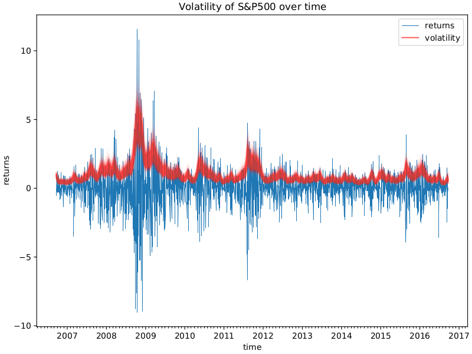

Stochastic volatility modeling is an essential component of algorithmic trading strategies, particularly within the high-frequency trading (HFT) sector. This modeling approach addresses the non-constant nature of volatility in financial markets, allowing traders to adapt to the rapid fluctuations intrinsic to HFT. Traditional models, which assume constant volatility, fail to capture the dynamic shifts observed in contemporary markets. In contrast, stochastic volatility models incorporate random processes to more accurately reflect these changes, providing traders with a robust framework for predicting asset behavior.

These models are critical for developing resilient trading strategies, offering insights that enhance decision-making processes concerning asset pricing and investment strategies. By understanding the fluctuations in market volatility, traders can make informed decisions on purchasing and selling assets, optimizing their portfolios to better manage risk and return.



Technological advancements have been pivotal in enabling the application of stochastic volatility models in real-time trading environments. The integration of sophisticated computational algorithms and high-performance computing platforms allows for the swift processing of complex models, ensuring that traders can react promptly to market changes. Innovations in programming and data analytics further enhance the capabilities of these models, providing traders with tools that lead to superior strategic execution.

As these sophisticated models continue to evolve, traders are presented with opportunities to refine their trading operations continually. By incorporating stochastic volatility modeling into their strategies, traders can effectively navigate the complexities of modern financial markets, achieving optimized performance and maintaining competitiveness in a rapidly evolving landscape.

## Table of Contents

## Understanding Stochastic Volatility

Stochastic volatility refers to the concept where the volatility of a financial instrument is not constant and evolves over time, adhering to a stochastic or random process. This notion contrasts with traditional constant volatility models, such as the Black-Scholes model, which assume volatility remains static. Stochastic volatility is more aligned with the observed behavior of financial markets, which often display volatility clustering and regime shifts that static models fail to capture.

The Heston model is a widely recognized approach to stochastic volatility. It accounts for both stochastic volatility and the possibility of sudden price movements, known as jumps. The model is characterized by the following stochastic differential equations:

$$

dS_t = \mu S_t dt + \sqrt{v_t} S_t dW_t^S 
$$

$$

dv_t = \kappa(\theta - v_t)dt + \sigma \sqrt{v_t} dW_t^v 
$$

Here, $S_t$ is the asset price, $v_t$ represents the instantaneous variance, $\mu$ is the drift rate, $\kappa$ is the rate of mean reversion, $\theta$ is the long-term average variance, and $\sigma$ is the [volatility](/wiki/volatility-trading-strategies) of volatility. The terms $dW_t^S$ and $dW_t^v$ are Brownian motions with a correlation coefficient $\rho$.

Stochastic volatility models, like the Heston model, are indispensable tools in quantitative finance. They improve the accuracy of derivative pricing, assist in managing financial risk, and optimize investment portfolios through more realistic reflections of market conditions. These models, by accounting for fluctuating uncertainty, aid in constructing hedging strategies and assessing [value at risk](/wiki/var-value-at-risk) (VaR) more reliably. Their capacity to model dynamic environments helps align theoretical expectations with real market phenomena, which is essential for effective risk management and strategic investment decisions.

## Role of Stochastic Volatility in Algorithmic Trading

Algorithmic trading has increasingly relied on sophisticated models to enhance precision and adaptability in strategy development. Stochastic volatility models stand out as they provide a dynamic framework, acknowledging the variability and randomness of market volatility. By incorporating stochastic volatility, [algorithmic trading](/wiki/algorithmic-trading) strategies gain the ability to adjust more accurately to market conditions. This adaptability is crucial for devising strategies that are resilient to the unpredictable nature of financial markets.

These models are particularly beneficial for high-frequency trading ([HFT](/wiki/high-frequency-trading-strategies)), where the speed and accuracy of decision-making hold paramount importance. High-frequency traders leverage stochastic volatility models to interpret real-time data, which offers insights into market microstructure. By understanding the minute-by-minute variations in market conditions, traders can react swiftly, optimizing their trading strategies in real-time.

Moreover, stochastic volatility models play a vital role in determining optimal bid and ask prices, which are essential components of [market making](/wiki/market-making). They enable traders to calculate these prices more accurately by considering the fluctuating volatility levels. This calculation ensures that traders can maintain competitive positions while minimizing the risks associated with adverse market movements. Consequently, these models are integral to effective market making, as they provide the foundation for better pricing strategies and inventory management.

In summary, the incorporation of stochastic volatility models into algorithmic trading strategies furnishes traders with the necessary tools to make informed decisions rapidly. Trading operations can be optimized by aligning strategy adjustments to the ever-changing market volatility, thereby enhancing the overall efficiency and profitability of trading activities.

## Stochastic Volatility and High-Frequency Trading

High-frequency trading (HFT) is characterized by rapid trade execution and high turnover rates, relying on cutting-edge technology and sophisticated algorithms to capitalize on fleeting opportunities in the market. Stochastic volatility models are instrumental in this fast-paced environment due to their ability to provide swift and accurate volatility assessments. These models capture the dynamic nature of financial markets, where volatility changes are often unpredictable and can rapidly impact asset prices.

Stochastic volatility models are integral to optimizing limit [order book](/wiki/order-book-trading-strategies) trading strategies, as demonstrated by Aydogan et al. (2022). Their research highlighted the efficiency of these models in high-frequency trading by optimizing the placement and execution of trades based on real-time volatility insights. In this context, the models enable traders to predict short-term price movements more accurately, thereby improving the precision of bid-ask spread management and enhancing market-making operations.

The primary objective of applying stochastic volatility models in HFT is to maximize expected returns while effectively managing inventory risks. Traders utilize these models to adjust their strategies dynamically in response to real-time market conditions, such as sudden changes in trade [volume](/wiki/volume-trading-strategy) or shifts in price trends. The models' capability to swiftly analyze and predict the stochastic nature of asset price volatility assists traders in maintaining balanced portfolios, ensuring that potential profits are maximized while minimizing exposure to adverse price movements.

In practical terms, stochastic volatility models in high-frequency trading involve sophisticated mathematical and computational techniques. For example, they may employ stochastic differential equations to model the volatility process, as seen in the widely used Heston model:

$$
dV_t = \kappa (\theta - V_t) dt + \sigma \sqrt{V_t} dW_t
$$

where $V_t$ represents the volatility at time $t$, $\kappa$ is the rate of mean reversion, $\theta$ is the long-term mean volatility, $\sigma$ is the volatility of volatility, and $W_t$ is a Wiener process. 

Implementing these models requires robust computational systems capable of processing complex algorithms in real-time. Modern high-frequency trading platforms leverage parallel computing and advanced programming languages to ensure efficient model computation and execution. Here is a simplistic example of how one might simulate a Heston model for volatility:

```python
import numpy as np

def simulate_heston(vol_0, kappa, theta, sigma, T, dt):
    num_steps = int(T / dt)
    vol_path = np.zeros(num_steps)
    vol_path[0] = vol_0

    for t in range(1, num_steps):
        z = np.random.normal(0, 1)
        vol_path[t] = vol_path[t-1] + kappa * (theta - vol_path[t-1]) * dt + sigma * np.sqrt(vol_path[t-1] * dt) * z

    return vol_path

# Parameters
vol_0 = 0.04
kappa = 2.0
theta = 0.04
sigma = 0.1
T = 1.0
dt = 0.01

volatility = simulate_heston(vol_0, kappa, theta, sigma, T, dt)
```

In conclusion, stochastic volatility models are a cornerstone of high-frequency trading, enabling traders to swiftly interpret market signals and react accordingly to optimize their trading strategies and portfolio management. The ongoing development of computational technologies continues to enhance the effectiveness and applicability of these models within the trading ecosystem.

## Application of Stochastic Volatility Models

Stochastic volatility models have become instrumental in multiple financial domains, notably in options pricing, risk management, and asset allocation. Their ability to account for varying volatility over time makes them essential for capturing the complex and dynamic nature of financial markets.

In options pricing, stochastic volatility models are employed to address limitations present in constant volatility assumptions, such as those used in the Black-Scholes model. By incorporating stochastic processes, these models provide a more accurate representation of how option prices change with market conditions. Typically, a stochastic differential equation is used to represent the dynamics of volatility, enabling traders to generate better pricing models that adjust for changing market conditions. The model can be expressed mathematically as:

$$
\sigma_t = \sigma_0 + \int_0^t a(\sigma_s, s) \, ds + \int_0^t b(\sigma_s, s) \, dW_s
$$

where $\sigma_t$ represents the volatility at time $t$, $a$ and $b$ are the drift and diffusion coefficients, respectively, and $W_s$ is a standard Wiener process.

For risk management, stochastic volatility models allow financial institutions to predict and mitigate potential risks associated with asset price fluctuations. By understanding the probability distribution of returns over varying timeframes, these models enable firms to establish more robust risk management frameworks. They aid in quantifying Value-at-Risk (VaR) and stress testing financial portfolios under diverse market scenarios.

Asset allocation also benefits from these models, as they enhance portfolio optimization strategies. By reflecting more realistic market dynamics, stochastic volatility models help in determining the optimal allocation of assets to maximize returns while controlling risks. The integration of real-time volatility dynamics into investment frameworks allows for informed decision-making regarding asset diversification and weighting strategies.

The Hamilton-Jacobi-Bellman (HJB) equation plays a critical role in deriving optimal strategies when using stochastic volatility models. The HJB equation is a fundamental tool in dynamic programming and control theory, used to ascertain optimal decision-making in continuous-time settings. It can be represented as:

$$
\frac{\partial V}{\partial t} + \max_u \left\{ f(x, u) + \frac{\partial V}{\partial x} g(x, u) + \frac{1}{2} \text{Tr}\left[ \sigma(x, u)^T \frac{\partial^2 V}{\partial x^2} \sigma(x, u) \right] \right\} = 0
$$

Here, $V$ is the value function, representing the maximum expected return, $f$ is the return of the control system, $g$ represents the control dynamics, and $\sigma$ is the volatility matrix. By solving this equation, portfolio managers can derive strategies that optimize expected returns under constrained risk factors, tailored to varying market conditions.

In summary, the application of stochastic volatility models extends across various facets of financial management, offering enhanced precision in pricing, risk mitigation, and strategic asset distribution. As markets evolve, these models provide the necessary framework to adapt and optimize financial decision-making.

## Challenges and Future Directions

Stochastic volatility models are inherently complex, characterized by their intricate mathematical formulations and significant computational demands. To implement such models effectively, traders and analysts require substantial computational power and proficiency in advanced programming techniques. This complexity arises from the need to capture the inherent randomness and time-varying nature of market volatility, which traditional models often oversimplify.

A primary challenge with stochastic volatility models is ensuring accuracy in dynamic market conditions. Given the random nature of volatility, model risk—stemming from incorrect specifications or parameter estimation—can lead to substantial errors in forecasting and decision-making. To mitigate these risks, researchers are exploring methods to refine model structures, simplified by advanced numerical techniques that offer both precision and computational efficiency.

The integration of [machine learning](/wiki/machine-learning) techniques with stochastic volatility models represents a promising frontier for enhancing predictive capabilities. Machine learning models, particularly those accustomed to large datasets and pattern recognition, can potentially address some limitations of traditional stochastic models by adapting to new information more swiftly. Techniques like neural networks and support vector machines are being investigated for their capacity to improve volatility forecasts and parameter estimation.

For instance, a [neural network](/wiki/neural-network) could be trained to recognize patterns in time-series data corresponding to volatility changes, enhancing the accuracy of future predictions. A simple implementation in Python could utilize libraries such as TensorFlow or PyTorch to develop and train such models. Below is an illustrative example of a Python code snippet for initializing a neural network intended for predicting volatility:

```python
import torch
import torch.nn as nn

class VolatilityPredictor(nn.Module):
    def __init__(self, input_size, hidden_size, output_size):
        super(VolatilityPredictor, self).__init__()
        self.fc1 = nn.Linear(input_size, hidden_size)
        self.relu = nn.ReLU()
        self.fc2 = nn.Linear(hidden_size, output_size)

    def forward(self, x):
        out = self.fc1(x)
        out = self.relu(out)
        out = self.fc2(out)
        return out

# Example usage
input_size = 10  # Number of input features
hidden_size = 5  # Number of neurons in the hidden layer
output_size = 1  # Single output for volatility

model = VolatilityPredictor(input_size, hidden_size, output_size)
```

Continuous advancements in computational technologies are crucial for enabling real-time application of these complex models. Improving computational efficiency—through parallel processing or optimization algorithms—can significantly reduce latency in high-frequency trading environments where timing is critical. Additionally, developing user-friendly programming frameworks and simulation tools can lower the barrier to entry, making these powerful models more accessible to a broader range of financial professionals.

In summary, the future directions for stochastic volatility models focus on balancing computational demands with increased accuracy and responsiveness, employing cutting-edge techniques from both traditional quantitative finance and modern machine learning. As these models evolve, they will undoubtedly enhance the strategic capabilities of traders and portfolio managers in increasingly complex financial markets.

## Conclusion

Stochastic volatility modeling is instrumental in enhancing the precision and effectiveness of trading strategies within algorithmic trading frameworks. These models are invaluable for their ability to dynamically adapt to the ever-shifting conditions of financial markets, enabling traders to maintain a competitive edge. As markets evolve and grow more complex, the necessity for sophisticated tools to analyze market behavior and predict future trends becomes paramount.

Stochastic volatility models contribute to this by offering insights into the fluctuating volatility patterns of financial instruments, thus allowing for more informed decision-making. This capability is critical for achieving desired investment outcomes, particularly in environments where rapid decision execution can lead to significant profit optimization or loss mitigation.

Moreover, the advent of advanced computational technologies plays a crucial role in improving both the efficiency and the applicability of these models. Cutting-edge computer systems and algorithms facilitate real-time processing of vast datasets, allowing for quick recalibrations and refinements in trading strategies. The ongoing developments in machine learning and data analytics further enhance the predictive power of stochastic volatility models, making them increasingly essential components of algorithmic trading systems.

In summary, as technology continues to advance, the potential for stochastic volatility models to contribute to effective trading strategies grows significantly. Their role remains pivotal for traders aiming to navigate the complexities of modern financial markets and achieve strategic investment objectives.

## References & Further Reading

[1]: Gatheral, J. (2006). ["The Volatility Surface: A Practitioner's Guide."](https://github.com/PlamenStilyianov/Quant/blob/master/Gatheral%20J.%20The%20volatility%20surface..%20A%20practitioner%27s%20guide%20(Wiley%2C%202006)(ISBN%200471792519)(210s)_FD_.pdf) Wiley.

[2]: Heston, S. L. (1993). ["A Closed-Form Solution for Options with Stochastic Volatility with Applications to Bond and Currency Options."](https://wwwf.imperial.ac.uk/~ajacquie/IC_Num_Methods/IC_Num_Methods_Docs/Literature/Heston.pdf) The Review of Financial Studies, 6(2), 327-343.

[3]: Fouque, J. P., Papanicolaou, G., & Sircar, K. R. (2000). ["Derivatives in Financial Markets with Stochastic Volatility"](https://www.semanticscholar.org/paper/Derivatives-in-Financial-Markets-with-Stochastic-Fouque-Papanicolaou/6d1e195e57297e9019d62f08dd5732976dd4ef2d) Cambridge University Press.

[4]: Andersen, T. G., & Benzoni, L. (2008). ["Stochastic Volatility Models: A Survey with Applications to Option Pricing and Risk Management."](https://www.researchgate.net/publication/388778453_Identifying_the_underlying_components_of_high-frequency_data_Pure_vs_jump_diffusion_processes) SSRN.

[5]: Black, F., & Scholes, M. (1973). ["The Pricing of Options and Corporate Liabilities."](https://www.cs.princeton.edu/courses/archive/fall09/cos323/papers/black_scholes73.pdf) Journal of Political Economy, 81(3), 637-654.

[6]: Cont, R., & Tankov, P. (2004). ["Financial Modelling with Jump Processes"](https://archive.org/details/financialmodelli0000cont) Chapman & Hall/CRC.

[7]: Lopez de Prado, M. (2018). ["Advances in Financial Machine Learning"](https://www.amazon.com/Advances-Financial-Machine-Learning-Marcos/dp/1119482089) Wiley.

[8]: Jarrow, R. A., & Protter, P. (2004). ["A Short History of Stochastic Integration and Mathematical Finance: The Early Years, 1880-1970."](https://projecteuclid.org/eBooks/institute-of-mathematical-statistics-lecture-notes-monograph-series/A-Festschrift-for-Herman-Rubin/chapter/A-short-history-of-stochastic-integration-and-mathematical-finance/10.1214/lnms/1196285381) IMS Lecture Notes, Monograph Series, Vol. 45, 75-91.