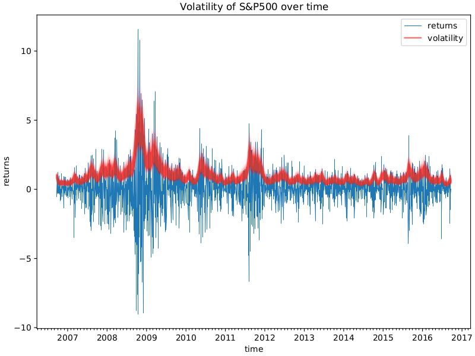

Stochastic Volatility (SV) models are integral tools in financial markets for capturing and describing the dynamic nature of market volatility. Volatility is a key metric, representing the degree of variation in the price of a financial instrument over time, and it plays a critical role in derivative valuation, risk management, and investment decisions. The inherent variability and unpredictability of financial market volatility necessitate sophisticated models, as traditional constant volatility models fail to capture the random and non-stationary patterns observed in real markets.

Financial instruments such as options are significantly impacted by volatility assumptions, as these affect the pricing and hedging strategies employed by market participants. Unlike constant volatility models, such as the Black-Scholes model, Stochastic Volatility models integrate randomness to more accurately reflect the fluctuating nature of market conditions. These models incorporate stochastic processes to represent volatility as a dynamic variable, adapting to the ever-changing market environment.



Understanding and accurately modeling market volatility is essential for financial institutions and traders who seek to optimize their strategies and manage risks effectively. The importance of SV models extends across various facets of finance, including derivative pricing, where they allow for more precise valuations, and risk management, where they support the development of robust strategies to mitigate potential losses. The prediction of financial instrument behavior, particularly under scenarios of high volatility, is enhanced by the use of these advanced models, offering a competitive advantage to practitioners who can implement them effectively.

This article will explore the fundamental concepts of Stochastic Volatility models, their key components, methods for implementation and calibration, real-world applications in financial markets, and the challenges associated with their use in algorithmic trading. Through this examination, the article aims to provide a comprehensive understanding of the role and significance of SV models in modern finance.

## Table of Contents

## Basic Concepts of Stochastic Volatility Models

Stochastic Volatility (SV) models are designed to capture the unpredictable nature of market volatility through the incorporation of various stochastic processes. Unlike constant volatility models, such as the Black-Scholes-Merton model, SV models acknowledge that market volatility is not constant but varies randomly over time. This variability is represented through stochastic processes that model the flow of information and other randomness affecting market prices.

The significance of SV models in finance lies in their ability to enhance the accuracy of derivative pricing, improve risk management practices, and optimize portfolio management. By modeling the volatility fluctuations as stochastic processes, these models are better equipped to reflect the real-world conditions where volatility is influenced by numerous unpredictable factors. This dynamic modeling approach provides a more accurate framework for the prediction and pricing of financial instruments.

One of the core characteristics of these models is their reliance on random processes to simulate the underlying [volatility](/wiki/volatility-trading-strategies). For instance, a basic stochastic volatility model might assume that the volatility $\sigma(t)$ of an asset follows a stochastic differential equation (SDE), distinct from the asset's price process. This could take the form:

$$
d\sigma(t) = \kappa(\theta - \sigma(t))dt + \xi dW(t)
$$

where $\kappa$ represents the rate of mean reversion, $\theta$ denotes the long-term mean of volatility, $\xi$ is the volatility of volatility, and $dW(t)$ is a Wiener process representing the randomness.

The advantage of capturing volatility variations within these models lies in their potential to offer a substantial edge in financial strategy development. By accounting for the stochastic behavior of volatility, SV models enhance the precision of derivative pricing and better accommodate the risk factors pertinent to asset management. This renders them indispensable tools for financial analysts who aim to strategize based on refined volatility forecasting and risk quantification. Consequently, stochastic volatility models play a crucial role in formulating robust financial strategies and provide a more comprehensive understanding of market dynamics.

## Key Components of Stochastic Volatility Models

Stochastic Volatility (SV) models are integral tools in modeling financial market volatility, characterized by their ability to incorporate randomness into the modeling process. Volatility, often modeled as the square root of variance, is a measure of price variation of financial instruments over time. Various stochastic processes are deployed to model this volatility. One of the most commonly utilized processes is the Geometric Brownian Motion, which assumes that the logarithm of stock prices follows a Brownian motion. This process is foundational to models such as Black-Scholes, which assumes constant volatility.

However, SV models extend beyond constant volatility, introducing mean-reverting processes that better capture market realities. Mean-reverting processes are formulated to account for the tendency of a variable, such as volatility, to drift towards a long-term mean. An example of such an approach is the Heston model, a widely adopted SV model. In the Heston model, variance follows a Cox-Ingersoll-Ross (CIR) process, expressed mathematically as: 

$$

dV_t = \kappa(\theta - V_t)dt + \sigma\sqrt{V_t}dW_t 
$$

Here, $V_t$ represents the variance at time $t$, $\kappa$ is the rate of mean reversion, $\theta$ is the long-term mean variance, $\sigma$ is the volatility of the volatility, and $dW_t$ is a Wiener process.

Another important class of stochastic volatility models includes GARCH (Generalized Autoregressive Conditional Heteroskedasticity) models. These models enhance basic Autoregressive Conditional Heteroskedasticity (ARCH) models by incorporating past variances to forecast future volatility, thus capturing temporal patterns in volatility more effectively. A typical GARCH(1,1) model can be represented as:

$$

\sigma_t^2 = \alpha_0 + \alpha_1\epsilon_{t-1}^2 + \beta_1\sigma_{t-1}^2 
$$

where $\sigma_t^2$ is the conditional variance, $\alpha_0$ is a constant, $\alpha_1$ measures the reaction to past shocks, $\beta_1$ captures the persistence of volatility, and $\epsilon_{t-1}$ denotes the past error term.

The SABR (Stochastic Alpha, Beta, Rho) model is another prominent SV model, especially in the context of [interest rate](/wiki/interest-rate-trading-strategies) derivatives. The SABR model is capable of managing different scenarios of volatility behavior by allowing for adjustments in key parameters such as alpha, beta, and rho, which determine the model's responsiveness to changes in market conditions. The SABR model can be expressed by the stochastic differential equations:

$$

dF_t = \sigma_t F_t^\beta dW_t 
$$
$$

d\sigma_t = \nu \sigma_t dZ_t 
$$

where $F_t$ is the forward price, $\sigma_t$ is the volatility, $\beta$ is a parameter controlling the elasticity of the model, $\nu$ is the volatility of volatility, and $dW_t$, $dZ_t$ are correlated Wiener processes.

These stochastic processes provide SV models with the flexibility to reflect the dynamic nature of financial markets, thus offering significant advantages for derivative valuation, risk management, and strategic financial decision-making.

## Implementation and Calibration of Stochastic Volatility Models

Parameter estimation in Stochastic Volatility (SV) models is a complex endeavor, integral to accurately reflecting market dynamics. Sophisticated statistical methods, such as Maximum Likelihood Estimation (MLE) and Bayesian Inference, are typically employed to estimate the parameters that govern these models. MLE aims to find the parameter values that maximize the likelihood function, ensuring that the probability of observing the given set of data is as high as possible under the assumed model. The likelihood function for an SV model can be expressed as:

$$
L(\theta | X) = \prod_{t=1}^{T} p(X_t | X_{t-1}, \theta)
$$

where $\theta$ represents the model parameters, and $X_t$ represents the observed data at time $t$.

Bayesian Inference, on the other hand, incorporates prior distributions over parameters, updating beliefs based on observed data. The posterior distribution is obtained by applying Bayes’ Theorem:

$$
p(\theta | X) = \frac{p(X | \theta) p(\theta)}{p(X)}
$$

Calibration of SV models involves adjusting model parameters to accurately fit market data, a crucial step to ensure the models' predictive power is aligned with real-world observations. This process often utilizes historical data fitting techniques and analysis of implied volatility surfaces, which provide insight into market expectations of future volatility. Implied volatility surfaces represent volatilities implied by market prices of options, reflecting the collective market view on the likelihood of price movements.

Numerical methods, especially Monte Carlo simulations, play a vital role in solving complex pricing equations inherent in SV models. Monte Carlo methods allow for the estimation of expected values of complex financial instruments by simulating a multitude of possible price paths and then averaging the outcomes. This is particularly useful for options pricing within SV frameworks. The basic process of a Monte Carlo simulation can be implemented in Python as follows:

```python
import numpy as np

def simulate_price_paths(S0, T, r, sigma, paths, steps):
    dt = T / steps
    price_paths = np.zeros((paths, steps))
    price_paths[:, 0] = S0

    for t in range(1, steps):
        z = np.random.standard_normal(paths)
        price_paths[:, t] = price_paths[:, t - 1] * np.exp((r - 0.5 * sigma ** 2) * dt + sigma * np.sqrt(dt) * z)

    return price_paths

# Example usage
S0 = 100      # Initial stock price
T = 1.0       # Time to maturity in years
r = 0.05      # Risk-free rate
sigma = 0.2   # Initial volatility
paths = 10000 # Number of simulated paths
steps = 365   # Number of time steps

price_paths = simulate_price_paths(S0, T, r, sigma, paths, steps)
```

This code samples multiple potential paths an asset price may take, incorporating the stochastic nature of volatility through random variables. Such numerical simulations are indispensable for assessing pricing and risk in environments where analytic solutions are not feasible.

Constant recalibration and re-estimation of parameters remain necessary as market conditions and investor sentiment continually evolve, necessitating dynamic adjustments to maintain the accuracy and reliability of SV models in practical applications.

## Applications in Financial Markets

Stochastic Volatility (SV) models are integral to enhancing the precision of derivative pricing by addressing the inherent unpredictability and mean-reverting characteristics of market volatility. Traditional models, which often assume constant volatility, fall short in capturing the nuances of changing market dynamics. SV models, however, incorporate stochastic processes that allow for a more realistic representation of volatility, directly impacting the pricing accuracy of derivatives. In particular, the incorporation of such models allows financial instruments to be priced with adjustments for the unpredictability and variability typical of real-world markets.

Furthermore, SV models provide a dynamic framework essential for effective volatility forecasting. Forecasting volatility accurately is crucial for risk management, as it enables financial institutions to anticipate potential market conditions and adjust their strategies accordingly. By modeling the randomness and mean-reverting tendencies of market volatility, SV models offer financial professionals the ability to develop robust strategies that mitigate risk and optimize portfolio management, particularly during volatile market conditions.

Algorithmic trading heavily relies on SV models to forecast market conditions and devise trading strategies based on volatility patterns. Firms such as Two Sigma exemplify this application, utilizing sophisticated algorithms to analyze massive data sets and derive insights into future market behavior. By leveraging SV models, these firms can exploit volatility trends to their advantage, creating strategies that respond promptly to changes in market conditions. The predictive power stemming from these models aids in identifying profitable trading opportunities, ultimately contributing to a competitive edge in the fast-paced environment of financial markets. 

In summary, the application of SV models in financial markets extends beyond mere pricing improvements. Their ability to predict and leverage market volatility provides profound benefits, particularly in areas of risk management and [algorithmic trading](/wiki/algorithmic-trading), underscoring their importance in modern finance.

## Challenges and Limitations

Stochastic Volatility (SV) models, despite their benefits in capturing market dynamics, present notable challenges and limitations. These challenges primarily stem from their inherent mathematical complexity and demand for computational resources.

One of the principal challenges is the mathematical complexity of SV models. These models often involve intricate stochastic differential equations that handle non-linearities and non-stationarities in volatility dynamics. Solving these equations accurately requires sophisticated numerical methods, such as finite difference methods or Monte Carlo simulations. The computational intensity of these methods can be significant, especially when high precision is needed, thus demanding substantial processing power and time.

Parameter sensitivity further complicates the application of SV models. The accuracy of these models is heavily influenced by parameter estimation, which can vary depending on the methods employed and the historical data used. Methods such as Maximum Likelihood Estimation or Bayesian Inference, while powerful, are sensitive to initial conditions and assumptions made about the data. Changes in parameter values can lead to disparate model outputs, increasing the difficulty of obtaining reliable predictions.

Overfitting is another critical concern. SV models are designed to capture the intricacies of historical volatility data. However, an over-fitting model may lose its predictive power, as it forms a precise but overly complex representation of past events that fails to extrapolate effectively to new scenarios. This phenomenon occurs when the model becomes tailored to noise in the historical data rather than the underlying signal, leading to inaccurate forecasts in changing market conditions.

Moreover, the necessity for constant re-calibration presents a persistent challenge in utilizing SV models. Financial markets are dynamic, with conditions fluctuating due to economic events, policy changes, and other unforeseen factors. To maintain accuracy, SV models must be frequently recalibrated to reflect these evolving conditions. This continual adjustment requires the consistent application of computational resources and expertise in model tuning, which can be resource-intensive.

In summary, while Stochastic Volatility models offer robust tools for understanding financial markets, their practical implementation is hindered by mathematical complexity, parameter sensitivity, risks of overfitting, and the demand for ongoing recalibration. Addressing these challenges is crucial for leveraging SV models effectively in the rapidly changing environment of financial markets.

## Conclusion

Stochastic Volatility (SV) models are pivotal in enriching the comprehension of financial market behaviors by adeptly capturing the dynamic nature of market volatility. These models serve as an essential tool in derivative pricing, risk management, and crafting trading strategies. The intricacies of SV models offer a remarkable ability to reflect the real-world complexities of financial markets as opposed to simpler, constant volatility models like the Black-Scholes formula.

The multifaceted nature of SV models, although inherently complex, presents significant advantages. These advantages are primarily borne from their ability to accurately represent the stochastic processes that govern market volatility. The precision with which they manage to encapsulate volatility behavior, such as randomness and mean reversion, ensures their indispensability in contemporary finance. Financial institutions leverage these models for pricing derivatives accurately, managing portfolio risks, and developing strategic trading methodologies that are finely tuned to market conditions.

Technological progress in computational methods continues to drive enhancements in the application of SV models. Notable developments in areas such as [machine learning](/wiki/machine-learning), numerical techniques, and computational power contribute to the refinement and efficiency of these models. Monte Carlo simulations and other numerical methods significantly benefit from these advancements, making the implementation and calibration of SV models more robust and accessible.

Furthermore, algorithmic trading and financial engineering firms are at the forefront of innovation, driven by sophisticated SV models. These firms utilize the nuanced capabilities of SV models to gain a competitive edge, making informed decisions and deploying algorithms that take into account the complex nature of market volatility. The continuous evolution in computational finance asserts the role of SV models not just as tools for understanding volatility, but as instruments that actively shape and define strategic financial operations.

## References & Further Reading

[1]: Heston, S. L. (1993). ["A Closed-Form Solution for Options with Stochastic Volatility with Applications to Bond and Currency Options."](https://wwwf.imperial.ac.uk/~ajacquie/IC_Num_Methods/IC_Num_Methods_Docs/Literature/Heston.pdf) The Review of Financial Studies, 6(2), 327-343.

[2]: Hull, J., & White, A. (1987). ["The Pricing of Options on Assets with Stochastic Volatilities."](https://onlinelibrary.wiley.com/doi/full/10.1111/j.1540-6261.1987.tb02568.x) The Journal of Finance, 42(2), 281-300.

[3]: Black, F., & Scholes, M. (1973). ["The Pricing of Options and Corporate Liabilities."](https://www.cs.princeton.edu/courses/archive/fall09/cos323/papers/black_scholes73.pdf) Journal of Political Economy, 81(3), 637-654.

[4]: Engle, R. F. (1982). ["Autoregressive Conditional Heteroskedasticity with Estimates of the Variance of United Kingdom Inflation."](https://www.jstor.org/stable/1912773) Econometrica, 50(4), 987-1007.

[5]: Hamilton, J. D. (1994). ["Time Series Analysis."](https://press.princeton.edu/books/hardcover/9780691042893/time-series-analysis) Princeton University Press.

[6]: Hull, J. C. (2018). ["Options, Futures, and Other Derivatives."](https://www.pearson.com/nl/en_NL/higher-education/subject-catalogue/finance/Options-Futures-and-Other-Derivatives-Hull.html) Pearson Education.

[7]: Lopez de Prado, M. (2018). ["Advances in Financial Machine Learning."](https://books.google.com/books/about/Advances_in_Financial_Machine_Learning.html?id=oU9KDwAAQBAJ) Wiley.