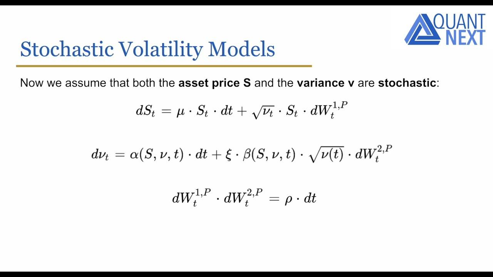

## Table of Contents

## What is a stochastic volatility model?

A stochastic volatility model is a type of financial model used to predict the price movements of assets like stocks or commodities. Unlike simpler models that assume a constant level of volatility, stochastic volatility models recognize that the volatility of an asset's price can change over time in a random way. This makes them more realistic because in real markets, how much prices move up and down can vary a lot.

These models work by including an extra part that tracks and predicts changes in volatility. This part is also random, which is why it's called "stochastic." By doing this, the model can better capture the ups and downs in the market that simpler models might miss. This makes stochastic volatility models very useful for traders and investors who need to understand and predict how risky an asset might be at different times.

## How does stochastic volatility differ from constant volatility?

Stochastic volatility and constant volatility are two ways to think about how much prices might move in the future. Constant volatility means we think the ups and downs of prices will stay the same over time. It's like saying, "The price will keep moving around in the same way it always has." This is simpler but doesn't match real markets well because we know that how much prices move can change a lot.

Stochastic volatility, on the other hand, says that the amount prices move can change in a random way. It's like saying, "The price might move a lot one day and not much the next, and we can't predict it exactly." This idea fits better with what we see in real markets, where sometimes prices jump around a lot and other times they're pretty calm. By using stochastic volatility, models can better show the real ups and downs of the market.

## What are the key components of a stochastic volatility model?

A stochastic volatility model has two main parts: the price part and the volatility part. The price part is about guessing where the price of something, like a stock, might go next. It uses math to say how likely the price is to go up or down. The volatility part is about how much the price might move around. It's not just a guess; it's a random guess that changes over time. This part tries to show that the ups and downs of prices can be big one day and small the next.

To make these models work, they use something called a stochastic process for the volatility part. This means the model thinks of volatility as a random thing that can change in ways we can't predict exactly. The model also needs to link the price part and the volatility part together. This is because when the price moves a lot, it might mean the volatility is high, and when the price is calm, the volatility might be low. By putting these pieces together, the model can give a better picture of how risky an investment might be at different times.

## Can you explain the concept of volatility clustering in the context of stochastic volatility models?

Volatility clustering is a pattern we see in the markets where times of big price moves tend to be followed by more big moves, and times of small moves are followed by more small moves. In the world of stochastic volatility models, this means that if the model sees a lot of ups and downs in the price, it will guess that there will be more ups and downs coming soon. On the other hand, if the price has been moving smoothly without much change, the model will think it's likely to keep doing that for a while.

Stochastic volatility models are good at showing this clustering because they let the volatility change over time in a random way. This means the model can catch onto the idea that big changes in the market often come in groups. By doing this, the model can better predict how risky an investment might be, because it knows that if the market has been wild lately, it's probably going to stay wild for a bit longer.

## What is the Heston model and how does it incorporate stochastic volatility?

The Heston model is a special kind of math tool used to guess how prices of things like stocks might move. It's different from simpler models because it uses the idea of stochastic volatility. This means the Heston model thinks that how much prices move around can change in a random way, not just stay the same. The model has two big parts: one part keeps track of the price of the stock, and the other part keeps track of how much the price moves around, or the volatility. These two parts work together to give a better picture of what might happen next with the price.

In the Heston model, the volatility part is what makes it special. It uses something called a stochastic process to say that the amount the price moves can change over time in ways we can't predict exactly. This helps the model show something called volatility clustering, where big price moves tend to come one after another, and small moves do the same. By letting the volatility change like this, the Heston model can better guess how risky an investment might be, because it knows that if the market has been wild lately, it's probably going to stay wild for a bit longer.

## How do stochastic volatility models improve upon Black-Scholes model assumptions?

The Black-Scholes model is a way to guess how much a stock option might be worth. It assumes that how much the stock price moves around, called volatility, stays the same all the time. This is a big problem because in real life, the amount a stock price moves can change a lot. Stochastic volatility models fix this by letting the volatility change in a random way, which is more like what we see in real markets. This makes their guesses about option prices more accurate because they can better handle the ups and downs of the market.

Stochastic volatility models also do a better job at showing something called volatility clustering. This means that if a stock price has been moving a lot lately, it's likely to keep moving a lot for a while. The Black-Scholes model can't show this because it thinks the volatility stays the same. By letting the volatility change over time, stochastic volatility models can predict that if the market has been wild lately, it's going to stay wild for a bit longer. This helps traders and investors understand and predict how risky an investment might be at different times.

## What are the challenges in calibrating stochastic volatility models?

Calibrating stochastic volatility models can be really tough. It means trying to make the model fit with what we see in the real market. One big problem is that these models have a lot of different parts that can change, like the price and the volatility. Each part needs to be set just right, and if one part is off, it can mess up the whole model. Also, these models need a lot of math and computer power to work well, which can be hard to handle.

Another challenge is that markets can change a lot over time. What works today might not work tomorrow. So, the model needs to be updated and checked all the time to make sure it's still right. This can be a lot of work and needs someone who really knows what they're doing. Plus, sometimes the data we have from the market isn't perfect, which makes it even harder to get the model to fit well.

## Can you discuss the role of the leverage effect in stochastic volatility models?

The leverage effect is something important that stochastic volatility models try to show. It means that when the price of a stock goes down, the amount it moves around, or the volatility, often goes up. This happens because when a company's stock price drops, it can make the company look riskier, so people start to expect bigger ups and downs in the future. Stochastic volatility models can include this effect by making the part that tracks volatility change based on what's happening with the price. This helps the model better guess how risky an investment might be, especially when the price is going down.

Including the leverage effect in these models makes them more realistic. In real markets, we see that when a stock's price falls, it often starts to move around more. By letting the model show this, it can give a better picture of what might happen next with the price. This is really helpful for traders and investors who need to understand and predict how risky an investment might be at different times, especially during times when the market is going down.

## How do you estimate parameters in stochastic volatility models?

Estimating parameters in stochastic volatility models means figuring out the right numbers to use in the model so it matches what we see in the real market. This can be tricky because these models have a lot of different parts, like the price and the volatility, that all need to be set just right. People often use a method called maximum likelihood estimation, which tries different sets of numbers until it finds the ones that make the model's guesses about the market as close as possible to what really happened. This can take a lot of computer power and math skills because you're trying to find the best fit out of a huge number of possibilities.

Another way to estimate parameters is by using Bayesian methods. This approach starts with some guesses about what the parameters might be and then updates those guesses based on new market data. It's like learning as you go, getting better and better at guessing the right numbers. Both methods need a lot of data from the market, and the data has to be good quality. If the data isn't right, it can mess up the whole model. So, getting the parameters right is a big job that needs careful work and a lot of checking to make sure the model is working well.

## What are some advanced stochastic volatility models beyond the Heston model?

Beyond the Heston model, there are other advanced stochastic volatility models that try to better match what we see in real markets. One example is the SABR model, which stands for Stochastic Alpha Beta Rho. This model is good at guessing the price of options that aren't too far from where the price is now. It does this by letting both the price and the volatility change in random ways, and it also lets these changes affect each other. This makes it more realistic because in real life, big price moves can make the market more jumpy, and the SABR model can show that.

Another advanced model is the Hull-White model, which is used a lot for guessing the price of interest rate options. This model lets the volatility change over time in a random way, but it also adds a part that makes the volatility go back to a normal level after a while. This is helpful because it can show that even if the market gets really wild, it usually calms down eventually. By including this feature, the Hull-White model can give a better guess about how risky an investment might be over time, which is really important for people who deal with interest rates.

## How do stochastic volatility models perform in forecasting market volatility compared to other models?

Stochastic volatility models are good at guessing how much prices might move around in the future, or what we call market volatility. They do this better than simpler models like the Black-Scholes model because they let the amount of price movement change in a random way. This matches what we see in real markets, where sometimes prices jump around a lot and other times they're pretty calm. By letting the volatility change like this, stochastic volatility models can catch onto patterns like volatility clustering, where big price moves tend to come one after another. This makes their guesses about how risky an investment might be more accurate.

However, stochastic volatility models aren't perfect. They can be hard to set up right because they have a lot of different parts that need to be adjusted. Also, they need a lot of computer power and good data to work well. Sometimes, other models like GARCH models, which also try to guess how much prices might move, can be easier to use and still give pretty good guesses. GARCH models look at past price moves to predict future volatility, and they can be simpler to set up and run. So, while stochastic volatility models can be more accurate, they might not always be the best choice because of how hard they are to use.

## What are the implications of using stochastic volatility models for risk management and option pricing?

Using stochastic volatility models for risk management and option pricing can make things a lot better. These models let the amount prices move around, or the volatility, change in a random way. This is more like what we see in real markets, where prices can jump around a lot one day and be calm the next. By letting the model show this, it can give a better guess about how risky an investment might be. This is really helpful for people who manage risk because they need to know how much prices might move to make good decisions. For option pricing, these models can make the guesses about what an option might be worth more accurate. This is because they can show that if the market has been wild lately, it's likely to stay wild for a bit longer, which affects how much people are willing to pay for an option.

But, there are also some challenges with using these models. They can be hard to set up right because they have a lot of different parts that need to be adjusted. This means you need a lot of computer power and good data to make them work well. If the data isn't good, the model's guesses can be off. Also, these models need to be checked and updated all the time to make sure they're still right, which can be a lot of work. So, while stochastic volatility models can be really helpful for risk management and option pricing, they also need someone who knows what they're doing to make them work well.

## What are the basic concepts of stochastic volatility models?

Stochastic Volatility (SV) models are designed to capture the unpredictable nature of market volatility through the incorporation of various stochastic processes. Unlike constant volatility models, such as the Black-Scholes-Merton model, SV models acknowledge that market volatility is not constant but varies randomly over time. This variability is represented through stochastic processes that model the flow of information and other randomness affecting market prices.

The significance of SV models in finance lies in their ability to enhance the accuracy of derivative pricing, improve risk management practices, and optimize portfolio management. By modeling the volatility fluctuations as stochastic processes, these models are better equipped to reflect the real-world conditions where volatility is influenced by numerous unpredictable factors. This dynamic modeling approach provides a more accurate framework for the prediction and pricing of financial instruments.

One of the core characteristics of these models is their reliance on random processes to simulate the underlying [volatility](/wiki/volatility-trading-strategies). For instance, a basic stochastic volatility model might assume that the volatility $\sigma(t)$ of an asset follows a stochastic differential equation (SDE), distinct from the asset's price process. This could take the form:

$$
d\sigma(t) = \kappa(\theta - \sigma(t))dt + \xi dW(t)
$$

where $\kappa$ represents the rate of mean reversion, $\theta$ denotes the long-term mean of volatility, $\xi$ is the volatility of volatility, and $dW(t)$ is a Wiener process representing the randomness.

The advantage of capturing volatility variations within these models lies in their potential to offer a substantial edge in financial strategy development. By accounting for the stochastic behavior of volatility, SV models enhance the precision of derivative pricing and better accommodate the risk factors pertinent to asset management. This renders them indispensable tools for financial analysts who aim to strategize based on refined volatility forecasting and risk quantification. Consequently, stochastic volatility models play a crucial role in formulating robust financial strategies and provide a more comprehensive understanding of market dynamics.

## What are the key components of stochastic volatility models?

Stochastic Volatility (SV) models are integral tools in modeling financial market volatility, characterized by their ability to incorporate randomness into the modeling process. Volatility, often modeled as the square root of variance, is a measure of price variation of financial instruments over time. Various stochastic processes are deployed to model this volatility. One of the most commonly utilized processes is the Geometric Brownian Motion, which assumes that the logarithm of stock prices follows a Brownian motion. This process is foundational to models such as Black-Scholes, which assumes constant volatility.

However, SV models extend beyond constant volatility, introducing mean-reverting processes that better capture market realities. Mean-reverting processes are formulated to account for the tendency of a variable, such as volatility, to drift towards a long-term mean. An example of such an approach is the Heston model, a widely adopted SV model. In the Heston model, variance follows a Cox-Ingersoll-Ross (CIR) process, expressed mathematically as: 

$$

dV_t = \kappa(\theta - V_t)dt + \sigma\sqrt{V_t}dW_t 
$$

Here, $V_t$ represents the variance at time $t$, $\kappa$ is the rate of mean reversion, $\theta$ is the long-term mean variance, $\sigma$ is the volatility of the volatility, and $dW_t$ is a Wiener process.

Another important class of stochastic volatility models includes GARCH (Generalized Autoregressive Conditional Heteroskedasticity) models. These models enhance basic Autoregressive Conditional Heteroskedasticity (ARCH) models by incorporating past variances to forecast future volatility, thus capturing temporal patterns in volatility more effectively. A typical GARCH(1,1) model can be represented as:

$$

\sigma_t^2 = \alpha_0 + \alpha_1\epsilon_{t-1}^2 + \beta_1\sigma_{t-1}^2 
$$

where $\sigma_t^2$ is the conditional variance, $\alpha_0$ is a constant, $\alpha_1$ measures the reaction to past shocks, $\beta_1$ captures the persistence of volatility, and $\epsilon_{t-1}$ denotes the past error term.

The SABR (Stochastic Alpha, Beta, Rho) model is another prominent SV model, especially in the context of [interest rate](/wiki/interest-rate-trading-strategies) derivatives. The SABR model is capable of managing different scenarios of volatility behavior by allowing for adjustments in key parameters such as alpha, beta, and rho, which determine the model's responsiveness to changes in market conditions. The SABR model can be expressed by the stochastic differential equations:

$$

dF_t = \sigma_t F_t^\beta dW_t 
$$
$$

d\sigma_t = \nu \sigma_t dZ_t 
$$

where $F_t$ is the forward price, $\sigma_t$ is the volatility, $\beta$ is a parameter controlling the elasticity of the model, $\nu$ is the volatility of volatility, and $dW_t$, $dZ_t$ are correlated Wiener processes.

These stochastic processes provide SV models with the flexibility to reflect the dynamic nature of financial markets, thus offering significant advantages for derivative valuation, risk management, and strategic financial decision-making.

## How are Stochastic Volatility Models implemented and calibrated?

Parameter estimation in Stochastic Volatility (SV) models is a complex endeavor, integral to accurately reflecting market dynamics. Sophisticated statistical methods, such as Maximum Likelihood Estimation (MLE) and Bayesian Inference, are typically employed to estimate the parameters that govern these models. MLE aims to find the parameter values that maximize the likelihood function, ensuring that the probability of observing the given set of data is as high as possible under the assumed model. The likelihood function for an SV model can be expressed as:

$$
L(\theta | X) = \prod_{t=1}^{T} p(X_t | X_{t-1}, \theta)
$$

where $\theta$ represents the model parameters, and $X_t$ represents the observed data at time $t$.

Bayesian Inference, on the other hand, incorporates prior distributions over parameters, updating beliefs based on observed data. The posterior distribution is obtained by applying Bayes’ Theorem:

$$
p(\theta | X) = \frac{p(X | \theta) p(\theta)}{p(X)}
$$

Calibration of SV models involves adjusting model parameters to accurately fit market data, a crucial step to ensure the models' predictive power is aligned with real-world observations. This process often utilizes historical data fitting techniques and analysis of implied volatility surfaces, which provide insight into market expectations of future volatility. Implied volatility surfaces represent volatilities implied by market prices of options, reflecting the collective market view on the likelihood of price movements.

Numerical methods, especially Monte Carlo simulations, play a vital role in solving complex pricing equations inherent in SV models. Monte Carlo methods allow for the estimation of expected values of complex financial instruments by simulating a multitude of possible price paths and then averaging the outcomes. This is particularly useful for options pricing within SV frameworks. The basic process of a Monte Carlo simulation can be implemented in Python as follows:

```python
import numpy as np

def simulate_price_paths(S0, T, r, sigma, paths, steps):
    dt = T / steps
    price_paths = np.zeros((paths, steps))
    price_paths[:, 0] = S0

    for t in range(1, steps):
        z = np.random.standard_normal(paths)
        price_paths[:, t] = price_paths[:, t - 1] * np.exp((r - 0.5 * sigma ** 2) * dt + sigma * np.sqrt(dt) * z)

    return price_paths

# Example usage
S0 = 100      # Initial stock price
T = 1.0       # Time to maturity in years
r = 0.05      # Risk-free rate
sigma = 0.2   # Initial volatility
paths = 10000 # Number of simulated paths
steps = 365   # Number of time steps

price_paths = simulate_price_paths(S0, T, r, sigma, paths, steps)
```

This code samples multiple potential paths an asset price may take, incorporating the stochastic nature of volatility through random variables. Such numerical simulations are indispensable for assessing pricing and risk in environments where analytic solutions are not feasible.

Constant recalibration and re-estimation of parameters remain necessary as market conditions and investor sentiment continually evolve, necessitating dynamic adjustments to maintain the accuracy and reliability of SV models in practical applications.

## References & Further Reading

[1]: Heston, S. L. (1993). ["A Closed-Form Solution for Options with Stochastic Volatility with Applications to Bond and Currency Options."](https://wwwf.imperial.ac.uk/~ajacquie/IC_Num_Methods/IC_Num_Methods_Docs/Literature/Heston.pdf) The Review of Financial Studies, 6(2), 327-343.

[2]: Hull, J., & White, A. (1987). ["The Pricing of Options on Assets with Stochastic Volatilities."](https://onlinelibrary.wiley.com/doi/full/10.1111/j.1540-6261.1987.tb02568.x) The Journal of Finance, 42(2), 281-300.

[3]: Black, F., & Scholes, M. (1973). ["The Pricing of Options and Corporate Liabilities."](https://www.cs.princeton.edu/courses/archive/fall09/cos323/papers/black_scholes73.pdf) Journal of Political Economy, 81(3), 637-654.

[4]: Engle, R. F. (1982). ["Autoregressive Conditional Heteroskedasticity with Estimates of the Variance of United Kingdom Inflation."](https://www.jstor.org/stable/1912773) Econometrica, 50(4), 987-1007.

[5]: Hamilton, J. D. (1994). ["Time Series Analysis."](https://press.princeton.edu/books/hardcover/9780691042893/time-series-analysis) Princeton University Press.

[6]: Hull, J. C. (2018). ["Options, Futures, and Other Derivatives."](https://www.pearson.com/nl/en_NL/higher-education/subject-catalogue/finance/Options-Futures-and-Other-Derivatives-Hull.html) Pearson Education.

[7]: Lopez de Prado, M. (2018). ["Advances in Financial Machine Learning."](https://books.google.com/books/about/Advances_in_Financial_Machine_Learning.html?id=oU9KDwAAQBAJ) Wiley.