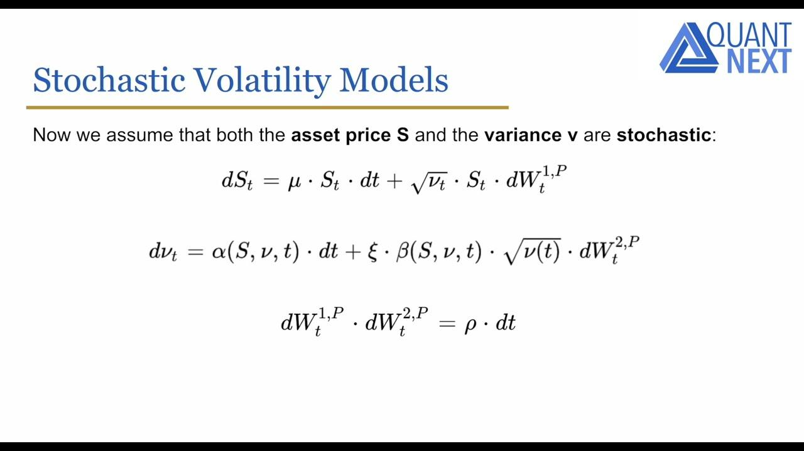

## Table of Contents

## What is stochastic volatility?

Stochastic volatility is a way to describe how the ups and downs of a stock's price can change over time in an unpredictable way. Imagine you're watching a stock's price go up and down. Sometimes, these ups and downs might be small and steady, but other times, they might be big and jumpy. Stochastic volatility says that we can't predict exactly when the stock will have big or small price changes, but we can use math to understand and model these patterns.

In simple terms, stochastic volatility models help us understand that the volatility of a stock's price (how much it moves up or down) is not constant. Instead, it changes randomly over time. This is important for people who invest in stocks or trade options because it helps them make better guesses about future price movements. By using these models, they can better prepare for the unpredictable nature of the stock market.

## How does stochastic volatility differ from constant volatility?

Constant volatility means that the ups and downs of a stock's price stay the same over time. Imagine you're watching a stock, and every day, the price moves up or down by about the same amount. It's like the stock has a steady heartbeat. This idea makes things simpler because you can predict how much the stock might move in the future based on how it's been moving.

Stochastic volatility is different because it says that the ups and downs of a stock's price can change randomly. One day, the stock might move a little, and the next day, it might jump a lot. It's like the stock's heartbeat is unpredictable. This makes it harder to guess future price movements, but it's more realistic because real stock prices often change their volatility over time. Using stochastic volatility helps investors and traders prepare for these unpredictable changes.

## What are some common models used to describe stochastic volatility?

One common model for stochastic volatility is the Heston model. This model says that the volatility of a stock's price changes over time in a way that can be predicted using math. It's like saying the stock's heartbeat can speed up or slow down, but we can use a formula to guess how it might change. The Heston model is popular because it's good at matching what we see in real stock markets, where volatility can go up and down unpredictably.

Another model is the GARCH model, which stands for Generalized Autoregressive Conditional Heteroskedasticity. This model looks at past price changes to guess how much a stock's price might move in the future. It's like looking at a stock's past heartbeats to predict its future ones. GARCH models are useful because they can show how volatility can cluster, meaning big price moves might be followed by more big moves, and small moves by more small moves.

Both the Heston and GARCH models help us understand that a stock's volatility isn't constant. They give us tools to better predict how a stock might behave, even though the stock market can be unpredictable. By using these models, investors and traders can make smarter decisions about buying and selling stocks.

## Can you explain the Heston model and its significance in stochastic volatility?

The Heston model is a way to understand how a stock's price and its volatility change over time. It says that both the stock's price and its volatility can move up and down, but they do so in ways that we can predict using math. In the Heston model, the volatility itself follows a random path, which means it can go up or down unpredictably. But, the model uses a special formula to show how this volatility changes, and it also shows how the stock's price and its volatility can affect each other. This is important because it helps us see that when a stock's price moves a lot, its volatility might also change.

The significance of the Heston model in stochastic volatility is that it gives us a more realistic picture of how stocks behave in real life. Unlike simpler models that assume a stock's volatility stays the same, the Heston model shows that volatility can change over time, which matches what we often see in the stock market. This makes the Heston model very useful for people who trade options or invest in stocks. By using the Heston model, they can better predict how a stock might move in the future, even though the stock market is unpredictable. This helps them make smarter choices about when to buy or sell.

## How is stochastic volatility applied in option pricing?

Stochastic volatility is used in option pricing to make better guesses about how much a stock's price might move in the future. When you're pricing an option, you need to think about how much the stock's price could go up or down. If you use a simple model that says the stock's volatility stays the same, you might miss out on big changes in the stock's price. But with stochastic volatility, you can use models like the Heston model to understand that the stock's volatility can change over time. This helps you price options more accurately because you're taking into account that the stock's price movements can be unpredictable.

Using stochastic volatility in option pricing can make a big difference for people who trade options. When you know that a stock's volatility can go up or down randomly, you can set a better price for an option. This is important because options give you the right to buy or sell a stock at a certain price in the future. If you use a model that accounts for changing volatility, you can predict the stock's price movements more accurately. This helps you decide if an option is a good deal or not, and it can help you make more money when trading options.

## What are the advantages of using stochastic volatility models over Black-Scholes?

Using stochastic volatility models, like the Heston model, can be better than using the Black-Scholes model because they take into account that a stock's ups and downs can change over time. The Black-Scholes model assumes that a stock's volatility stays the same, which can lead to wrong guesses about future price movements. But real stocks often have periods where their prices move a lot, followed by times when they move less. Stochastic volatility models help us understand these changes better, so we can price options more accurately.

This is important for people who trade options because it helps them make better decisions. When you know that a stock's volatility can go up or down randomly, you can set a better price for an option. This means you can predict how much the stock might move in the future more accurately, which helps you decide if an option is a good deal or not. By using stochastic volatility models, traders can make more money and take less risk compared to using the simpler Black-Scholes model.

## How do you calibrate stochastic volatility models to market data?

Calibrating stochastic volatility models to market data means adjusting the model's settings so it matches what we see in the real stock market. Imagine you have a toy car that you can make go faster or slower by turning a dial. When you calibrate a stochastic volatility model, you're turning the dials to make the model's predictions match the real stock prices. You do this by looking at past stock prices and option prices, and then you change the model's settings until its predictions line up with these real numbers.

To do this, you might use a computer to try lots of different settings and see which ones make the model's predictions closest to the real data. It's like playing a game where you keep adjusting the settings until you get the best score. Once you find the right settings, you can use the model to make better guesses about future stock prices and option prices. This helps traders and investors make smarter decisions because the model is now tuned to the real world.

## What are the empirical challenges faced when estimating stochastic volatility?

Estimating stochastic volatility can be tricky because it's hard to see volatility directly. Volatility is about how much a stock's price moves up and down, but we can't measure it exactly like we can measure the stock's price itself. Instead, we have to guess the volatility by looking at how the stock's price has moved in the past. This means we're always a bit behind because we're using old data to guess what's happening now. Plus, since volatility changes randomly, it's hard to be sure our guesses are right.

Another challenge is that different ways of guessing volatility can give different answers. For example, some people might look at how much a stock's price changes from one day to the next, while others might look at how much it changes over longer periods. These different methods can lead to different estimates of volatility, which makes it hard to know which one to trust. On top of that, the stock market can be affected by many things, like news events or economic changes, which can make volatility jump around in ways that are hard to predict. This all adds up to make estimating stochastic volatility a tough job.

## Can you discuss the impact of stochastic volatility on risk management?

Stochastic volatility helps with risk management by giving a better picture of how stock prices might move in the future. When you know that a stock's ups and downs can change over time, you can prepare for bigger or smaller price swings. This is important for people who invest in stocks or trade options because it helps them understand the risks better. If you use a model that says volatility stays the same, you might not be ready for big changes in the stock's price. But with stochastic volatility, you can see that the stock's heartbeat can speed up or slow down, so you can plan your investments more carefully.

Using stochastic volatility in risk management also helps you set better limits on how much you're willing to lose. Imagine you're betting on a stock, and you want to know how much you might lose if things go badly. With stochastic volatility, you can use models like the Heston model to guess how much the stock's price might jump around. This helps you decide how much risk you're comfortable with and set stop-loss orders to protect your money. By understanding that volatility can change randomly, you can make smarter choices about how to manage your risks in the stock market.

## How do jumps and stochastic volatility interact in financial modeling?

In financial modeling, jumps and stochastic volatility work together to give a more realistic picture of how stock prices move. Jumps are sudden big changes in a stock's price, like when a company announces surprising news. Stochastic volatility, on the other hand, says that the ups and downs of a stock's price can change randomly over time. When you put these two ideas together, you get a model that can show both the big sudden jumps and the smaller, more gradual changes in volatility. This helps traders and investors understand that stocks can move in unpredictable ways, and they can use this information to make better guesses about future price movements.

Using models that include both jumps and stochastic volatility can be really helpful for risk management. If you only look at stochastic volatility, you might miss the big jumps that can happen out of nowhere. But if you include jumps in your model, you can prepare for these sudden changes and set better limits on how much you're willing to lose. By understanding that both jumps and changing volatility can affect a stock's price, you can make smarter choices about when to buy or sell, and how to protect your money from big surprises in the market.

## What advanced numerical methods are used to solve stochastic volatility models?

To solve stochastic volatility models, people often use advanced numerical methods like Monte Carlo simulations. Imagine you're trying to guess what might happen to a stock's price in the future. With Monte Carlo simulations, you run lots of different guesses, each one a little different, and see what happens on average. It's like playing a game many times to see how it usually goes. These simulations are good for understanding how a stock's price and its volatility might change over time, even though it's hard to predict exactly what will happen.

Another method is called finite difference methods. These are like solving a big puzzle by breaking it into smaller pieces. You take the math problem of how a stock's price and volatility change and break it down into tiny steps. Then, you solve each step one at a time, putting them all together to see the big picture. This method is useful for figuring out how options should be priced when you take into account that a stock's volatility can change randomly. Both Monte Carlo simulations and finite difference methods help us understand and predict the unpredictable nature of the stock market better.

## What are the current research frontiers in stochastic volatility modeling?

One of the big things researchers are looking at now in stochastic volatility modeling is how to make the models even better at matching what we see in the real stock market. They're trying to figure out how to include more details, like how different stocks might affect each other's volatility, or how news and events can cause sudden big changes in prices. This is important because it can help traders and investors make even smarter guesses about future price movements. They're also working on new ways to use computers to solve these models faster and more accurately, so people can use them in real-time trading.

Another area of research is about making stochastic volatility models easier to use for everyone. Right now, these models can be pretty complicated and hard to understand, so researchers are trying to find simpler ways to explain them. They're also looking at how to make the models work better with other types of financial models, so people can use them together to get a fuller picture of the market. By doing this, they hope to help more people use stochastic volatility models to manage their investments and make better decisions.

## What is Stochastic Volatility?

Stochastic volatility is the concept that the volatility of financial instrument prices is random and fluctuates over time. This contrasts with models such as Black-Scholes, which assume constant volatility. Stochastic volatility models (SV models) aim to reflect the dynamic nature of volatility in the financial markets more accurately. 

In SV models, volatility is represented as a stochastic process, acknowledging that it can change due to various market forces and conditions. A common approach is to use mean-reverting processes to model volatility. The Cox-Ingersoll-Ross (CIR) model is one such process, where the volatility reverts to a long-term mean over time, reflecting observed market behaviors.

The mathematical representation of a mean-reverting process like the CIR model can be given by the stochastic differential equation:

$$

dV_t = \kappa (\theta - V_t) dt + \sigma \sqrt{V_t} dW_t 
$$

where:
- $V_t$ is the stochastic volatility at time $t$.
- $\kappa$ is the rate of mean reversion.
- $\theta$ is the long-term mean level toward which volatility reverts.
- $\sigma$ is the volatility of volatility.
- $dW_t$ is a Wiener process representing the stochastic component.

The inclusion of these stochastic processes allows models to account for [volatility](/wiki/volatility-trading-strategies) clustering observed in financial markets, where periods of high volatility tend to be followed by high volatility and vice versa. Consequently, SV models are crucial for accurately pricing derivatives and making comprehensive assessments of market risk. Risk management and hedging strategies benefit significantly from understanding and employing stochastic volatility, as these models provide a more realistic view of price movement, volatility patterns, and potential risk scenarios.

## What are the key stochastic volatility models?

Stochastic volatility models are critical tools in financial markets, allowing for more accurate modeling of asset price dynamics by accommodating the inherent variability and unpredictability of market volatility. Among these models, the Heston, GARCH, and SABR models stand out due to their widespread applicability and unique characteristics.

The Heston model, introduced by Steven Heston in 1993, is a prominent stochastic volatility model that assumes volatility follows a mean-reverting square root process. Its defining feature is the ability to produce a closed-form solution for European options, which simplifies computation relative to other complex stochastic models. The volatility $v_t$ in the Heston model evolves according to the following stochastic differential equation (SDE):

$$

\mathrm{d}v_t = \kappa(\theta - v_t)\mathrm{d}t + \sigma\sqrt{v_t}\mathrm{d}W_t 
$$

where $\kappa$ is the rate of mean reversion, $\theta$ represents the long-term variance, $\sigma$ is the volatility of volatility, and $W_t$ denotes a Wiener process. The model adeptly captures the observed leverage effect in equity markets, wherein volatility tends to increase as stock prices fall, enhancing its realism over simpler models.

The Generalized Autoregressive Conditional Heteroskedasticity (GARCH) model, developed by Tim Bollerslev in 1986, is another widely used SV model, particularly in the context of time-series data. Unlike the Heston model, GARCH is designed to capture volatility clustering—a phenomenon where periods of high volatility follow other such periods. The standard GARCH(1,1) model expresses future conditional variance $h_t$ by:

$$

h_t = \alpha_0 + \alpha_1 \epsilon_{t-1}^2 + \beta_1 h_{t-1} 
$$

where $\epsilon_{t-1}$ is the past error term, and $\alpha_0$, $\alpha_1$, and $\beta_1$ are parameters that need estimation. GARCH models excel in their ability to adjust rapidly to new information, which is vital for financial market participants managing short-duration trading strategies.

The SABR (Stochastic Alpha, Beta, Rho) model, developed by Patrick Hagan and colleagues, is especially popular in the [interest rate](/wiki/interest-rate-trading-strategies) derivative market. The SABR model accounts for the dynamic behavior of the implied volatility surface, accommodating different levels of skewness and kurtosis in derivative price distributions. The SABR model describes the volatility $\sigma_t$ of a forward rate $F_t$ through the following SDE:

$$

\mathrm{d}F_t = \sigma_t F_t^\beta \mathrm{d}W_t^1, \quad \mathrm{d}\sigma_t = \nu\sigma_t \mathrm{d}W_t^2 
$$

where $\beta$, $\nu$, and $\rho$ are parameters of the model, with $\rho$ denoting the correlation between the two Wiener processes $W_t^1$ and $W_t^2$. This model is appreciated for its flexibility in capturing the complex dynamics of market volatility, enabling traders and risk managers to better hedge and price derivative products under various market conditions.

In summary, the Heston, GARCH, and SABR models each contribute unique qualities and advantages to the modeling of market volatility in [algorithmic trading](/wiki/algorithmic-trading). Their development and continued evolution provide investors and financial analysts with sophisticated tools to better predict and respond to market movements.

## How are Stochastic Volatility Models implemented and calibrated?

Implementation and calibration of stochastic volatility (SV) models are essential steps in harnessing their full potential for financial applications. These processes ensure that models accurately reflect market conditions and provide reliable insights for trading and risk management.

Parameter estimation is a foundational aspect of implementing SV models. Techniques such as Maximum Likelihood Estimation (MLE) and Bayesian Inference are commonly used to estimate the parameters of these models. Maximum Likelihood Estimation involves optimizing the likelihood function to find parameter values that make the observed data most probable. For example, given a dataset of returns $r_t$ assumed to follow a stochastic volatility model, the likelihood function can be expressed as:

$$
L(\theta; r) = \prod_{t=1}^{T} f(r_t | \theta)
$$

where $\theta$ represents the parameters of the model and $f$ denotes the probability density function of the returns conditional on the parameters.

In addition to MLE, Bayesian Inference offers a probabilistic approach to parameter estimation, where prior distributions are updated based on observed data to derive posterior distributions. This method provides a more comprehensive understanding of parameter uncertainty.

Calibration of SV models involves aligning these models with real market data. This process often utilizes historical data fitting and implied volatility surfaces to ensure models reflect current market conditions. One common approach is to calibrate the model parameters to match observed market prices of derivatives, such as options. The implied volatility surface, a three-dimensional plot showing implied volatilities across different strike prices and maturities, is crucial in this context. The calibration aims to minimize the difference between market-observed prices and model-generated prices.

Numerical methods are indispensable for solving the complex equations inherent in SV models. Monte Carlo simulations are frequently employed due to their flexibility in handling high-dimensional problems and providing approximations to expected values. For instance, simulating paths of asset prices and corresponding volatilities over time can be used to estimate option prices under a specific SV model. A simple Python example of a basic Monte Carlo simulation for an SV model might look like this:

```python
import numpy as np

# Parameters for the SV model
S0 = 100  # Initial stock price
V0 = 0.04  # Initial variance
kappa = 0.5  # Rate of mean reversion
theta = 0.04  # Long-term variance
sigma = 0.1  # Volatility of volatility
rho = -0.7  # Correlation
T = 1.0  # Time to maturity
steps = 1000  # Simulation steps
simulations = 10000  # Number of simulations

# Time increment
dt = T / steps

# Simulate paths
S = np.zeros((steps, simulations))
V = np.zeros((steps, simulations))
S[0] = S0
V[0] = V0

# Generate random variables
Z1 = np.random.normal(size=(steps, simulations))
Z2 = np.random.normal(size=(steps, simulations))
W2 = rho * Z1 + np.sqrt(1 - rho**2) * Z2

# Run simulation
for t in range(1, steps):
    V[t] = V[t-1] + kappa * (theta - V[t-1]) * dt + sigma * np.sqrt(V[t-1] * dt) * Z1[t]
    V[t] = np.maximum(V[t], 0)  # Ensure non-negative volatility
    S[t] = S[t-1] * np.exp((V[t-1] - 0.5 * V[t-1]) * dt + np.sqrt(V[t-1] * dt) * W2[t])

# Option pricing, risk management, etc., would follow
```

Finite Difference Methods (FDM) are another frequent choice, offering a systematic approach to approximate solutions of partial differential equations (PDEs) inherent in SV models. FDM is effective in pricing derivatives and calculating sensitivities.

Accurate calibration is critical for the performance of SV models. Poor calibration can lead to inaccurate pricing and risk assessments, undermining the effectiveness of trading decisions. Thus, ensuring models are well-calibrated to current market conditions significantly enhances their utility in quantitative finance.

## References & Further Reading

Heston, S. L. (1993). 'A Closed-Form Solution for Options with Stochastic Volatility with Applications to Bond and Currency Options.' The Review of Financial Studies. This seminal paper introduces one of the foundational models in stochastic volatility, known as the Heston model. With the assumption that volatility itself follows a stochastic process, the model provides a closed-form solution for pricing options, facilitating the analysis of bond and currency options under stochastic volatility. The mathematical formulation has enabled precise calibration and efficient computation in financial markets.

Bollerslev, T. (1986). 'Generalized Autoregressive Conditional Heteroskedasticity.' Journal of Econometrics. Bollerslev's work on GARCH models established a crucial framework for understanding and modeling time-varying volatility in financial time series. By employing autoregressive conditional heteroskedasticity, the GARCH model captures volatility clustering, a common phenomenon in financial markets. This work is essential for its practical applications in risk management and financial forecasting, providing the groundwork for numerous extensions and refinements.

Hagan, P. S., Kumar, D., Lesniewski, A. S., & Woodward, D. E. (2002). 'Managing Smile Risk.' The Best of Wilmott. This article addresses the challenges associated with the volatility smile, a pattern where implied volatility varies with strike price for options. The authors discuss the SABR model, which is instrumental in managing smile risk, particularly in interest rate derivatives. This model is noted for its flexibility in capturing dynamic changes in market volatility and remains a key tool for practitioners dealing with derivative pricing and risk management.

Gatheral, J. (2006). 'The Volatility Surface: A Practitioner's Guide.' Wiley. Gatheral's book is a comprehensive resource for practitioners looking to understand the complexities of the volatility surface. It covers the theoretical underpinnings and practical implications of models such as the Heston and SABR, and provides insights into volatility modeling techniques. The guide is invaluable for financial professionals aiming to master the volatility surface, enabling more accurate derivative pricing and robust risk management strategies.

