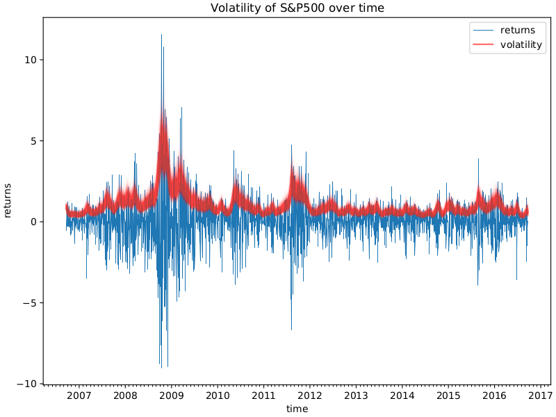

Stochastic volatility (SV) models have emerged as fundamental tools in quantitative finance, playing a vital role in algorithmic trading. Traditional financial models typically assume constant volatility; however, SV models offer a more sophisticated approach by recognizing volatility as a stochastic process. This shift acknowledges the inherent unpredictability and dynamic nature of financial markets, providing a more accurate representation for modeling financial instruments.

SV models are instrumental in various applications, most notably in the valuation of derivatives and risk management strategies. By accommodating the random nature of volatility, these models enhance the precision of derivative pricing, enabling traders and risk managers to make informed decisions. The ability to capture fluctuations in market volatility leads to more resilient trading strategies that are better equipped to navigate uncertain market conditions.



In this article, we will explore several aspects of stochastic volatility in algorithmic trading. We will begin by exploring the definition and significance of SV, followed by a discussion on the prominent models that have been developed. The article will also cover the methodologies for implementing and calibrating these models, as well as their practical applications in algorithmic trading. Finally, we will address the challenges and limitations associated with SV models, providing a comprehensive understanding of their role in modern financial markets.

## Table of Contents

## What is Stochastic Volatility?

Stochastic volatility is the concept that the volatility of financial instrument prices is random and fluctuates over time. This contrasts with models such as Black-Scholes, which assume constant volatility. Stochastic volatility models (SV models) aim to reflect the dynamic nature of volatility in the financial markets more accurately. 

In SV models, volatility is represented as a stochastic process, acknowledging that it can change due to various market forces and conditions. A common approach is to use mean-reverting processes to model volatility. The Cox-Ingersoll-Ross (CIR) model is one such process, where the volatility reverts to a long-term mean over time, reflecting observed market behaviors.

The mathematical representation of a mean-reverting process like the CIR model can be given by the stochastic differential equation:

$$

dV_t = \kappa (\theta - V_t) dt + \sigma \sqrt{V_t} dW_t 
$$

where:
- $V_t$ is the stochastic volatility at time $t$.
- $\kappa$ is the rate of mean reversion.
- $\theta$ is the long-term mean level toward which volatility reverts.
- $\sigma$ is the volatility of volatility.
- $dW_t$ is a Wiener process representing the stochastic component.

The inclusion of these stochastic processes allows models to account for [volatility](/wiki/volatility-trading-strategies) clustering observed in financial markets, where periods of high volatility tend to be followed by high volatility and vice versa. Consequently, SV models are crucial for accurately pricing derivatives and making comprehensive assessments of market risk. Risk management and hedging strategies benefit significantly from understanding and employing stochastic volatility, as these models provide a more realistic view of price movement, volatility patterns, and potential risk scenarios.

## Key Stochastic Volatility Models

Stochastic volatility models are critical tools in financial markets, allowing for more accurate modeling of asset price dynamics by accommodating the inherent variability and unpredictability of market volatility. Among these models, the Heston, GARCH, and SABR models stand out due to their widespread applicability and unique characteristics.

The Heston model, introduced by Steven Heston in 1993, is a prominent stochastic volatility model that assumes volatility follows a mean-reverting square root process. Its defining feature is the ability to produce a closed-form solution for European options, which simplifies computation relative to other complex stochastic models. The volatility $v_t$ in the Heston model evolves according to the following stochastic differential equation (SDE):

$$

\mathrm{d}v_t = \kappa(\theta - v_t)\mathrm{d}t + \sigma\sqrt{v_t}\mathrm{d}W_t 
$$

where $\kappa$ is the rate of mean reversion, $\theta$ represents the long-term variance, $\sigma$ is the volatility of volatility, and $W_t$ denotes a Wiener process. The model adeptly captures the observed leverage effect in equity markets, wherein volatility tends to increase as stock prices fall, enhancing its realism over simpler models.

The Generalized Autoregressive Conditional Heteroskedasticity (GARCH) model, developed by Tim Bollerslev in 1986, is another widely used SV model, particularly in the context of time-series data. Unlike the Heston model, GARCH is designed to capture volatility clustering—a phenomenon where periods of high volatility follow other such periods. The standard GARCH(1,1) model expresses future conditional variance $h_t$ by:

$$

h_t = \alpha_0 + \alpha_1 \epsilon_{t-1}^2 + \beta_1 h_{t-1} 
$$

where $\epsilon_{t-1}$ is the past error term, and $\alpha_0$, $\alpha_1$, and $\beta_1$ are parameters that need estimation. GARCH models excel in their ability to adjust rapidly to new information, which is vital for financial market participants managing short-duration trading strategies.

The SABR (Stochastic Alpha, Beta, Rho) model, developed by Patrick Hagan and colleagues, is especially popular in the [interest rate](/wiki/interest-rate-trading-strategies) derivative market. The SABR model accounts for the dynamic behavior of the implied volatility surface, accommodating different levels of skewness and kurtosis in derivative price distributions. The SABR model describes the volatility $\sigma_t$ of a forward rate $F_t$ through the following SDE:

$$

\mathrm{d}F_t = \sigma_t F_t^\beta \mathrm{d}W_t^1, \quad \mathrm{d}\sigma_t = \nu\sigma_t \mathrm{d}W_t^2 
$$

where $\beta$, $\nu$, and $\rho$ are parameters of the model, with $\rho$ denoting the correlation between the two Wiener processes $W_t^1$ and $W_t^2$. This model is appreciated for its flexibility in capturing the complex dynamics of market volatility, enabling traders and risk managers to better hedge and price derivative products under various market conditions.

In summary, the Heston, GARCH, and SABR models each contribute unique qualities and advantages to the modeling of market volatility in [algorithmic trading](/wiki/algorithmic-trading). Their development and continued evolution provide investors and financial analysts with sophisticated tools to better predict and respond to market movements.

## Implementation and Calibration of Stochastic Volatility Models

Implementation and calibration of stochastic volatility (SV) models are essential steps in harnessing their full potential for financial applications. These processes ensure that models accurately reflect market conditions and provide reliable insights for trading and risk management.

Parameter estimation is a foundational aspect of implementing SV models. Techniques such as Maximum Likelihood Estimation (MLE) and Bayesian Inference are commonly used to estimate the parameters of these models. Maximum Likelihood Estimation involves optimizing the likelihood function to find parameter values that make the observed data most probable. For example, given a dataset of returns $r_t$ assumed to follow a stochastic volatility model, the likelihood function can be expressed as:

$$
L(\theta; r) = \prod_{t=1}^{T} f(r_t | \theta)
$$

where $\theta$ represents the parameters of the model and $f$ denotes the probability density function of the returns conditional on the parameters.

In addition to MLE, Bayesian Inference offers a probabilistic approach to parameter estimation, where prior distributions are updated based on observed data to derive posterior distributions. This method provides a more comprehensive understanding of parameter uncertainty.

Calibration of SV models involves aligning these models with real market data. This process often utilizes historical data fitting and implied volatility surfaces to ensure models reflect current market conditions. One common approach is to calibrate the model parameters to match observed market prices of derivatives, such as options. The implied volatility surface, a three-dimensional plot showing implied volatilities across different strike prices and maturities, is crucial in this context. The calibration aims to minimize the difference between market-observed prices and model-generated prices.

Numerical methods are indispensable for solving the complex equations inherent in SV models. Monte Carlo simulations are frequently employed due to their flexibility in handling high-dimensional problems and providing approximations to expected values. For instance, simulating paths of asset prices and corresponding volatilities over time can be used to estimate option prices under a specific SV model. A simple Python example of a basic Monte Carlo simulation for an SV model might look like this:

```python
import numpy as np

# Parameters for the SV model
S0 = 100  # Initial stock price
V0 = 0.04  # Initial variance
kappa = 0.5  # Rate of mean reversion
theta = 0.04  # Long-term variance
sigma = 0.1  # Volatility of volatility
rho = -0.7  # Correlation
T = 1.0  # Time to maturity
steps = 1000  # Simulation steps
simulations = 10000  # Number of simulations

# Time increment
dt = T / steps

# Simulate paths
S = np.zeros((steps, simulations))
V = np.zeros((steps, simulations))
S[0] = S0
V[0] = V0

# Generate random variables
Z1 = np.random.normal(size=(steps, simulations))
Z2 = np.random.normal(size=(steps, simulations))
W2 = rho * Z1 + np.sqrt(1 - rho**2) * Z2

# Run simulation
for t in range(1, steps):
    V[t] = V[t-1] + kappa * (theta - V[t-1]) * dt + sigma * np.sqrt(V[t-1] * dt) * Z1[t]
    V[t] = np.maximum(V[t], 0)  # Ensure non-negative volatility
    S[t] = S[t-1] * np.exp((V[t-1] - 0.5 * V[t-1]) * dt + np.sqrt(V[t-1] * dt) * W2[t])

# Option pricing, risk management, etc., would follow
```

Finite Difference Methods (FDM) are another frequent choice, offering a systematic approach to approximate solutions of partial differential equations (PDEs) inherent in SV models. FDM is effective in pricing derivatives and calculating sensitivities.

Accurate calibration is critical for the performance of SV models. Poor calibration can lead to inaccurate pricing and risk assessments, undermining the effectiveness of trading decisions. Thus, ensuring models are well-calibrated to current market conditions significantly enhances their utility in quantitative finance.

## Applications in Algorithmic Trading

Stochastic volatility (SV) models significantly enhance algorithmic trading by offering a more accurate prediction of market volatility, which in turn optimizes trading strategies. These models have the capability to forecast volatility in a dynamic and probabilistic manner, providing traders with critical insights necessary for making informed decisions. By capturing the random nature of volatility, SV models enable traders to evaluate market conditions with greater precision.

One of the primary applications of SV models in algorithmic trading is in the precise pricing of derivatives. Derivatives, financial instruments whose value is derived from underlying assets, require accurate volatility predictions for effective pricing and hedging. With better volatility forecasts, trading algorithms can maximize returns by adjusting the pricing strategies in response to market changes. For instance, the Heston SV model, known for its mean-reverting properties, allows traders to derive closed-form solutions for European options, enhancing both efficiency and accuracy in derivative pricing.

Additionally, firms such as Two Sigma employ SV models to refine trading algorithms and enhance risk assessment techniques. By integrating stochastic volatility into their computational frameworks, these firms can more effectively measure and manage risks associated with fluctuating markets. The adaptability of SV models in capturing the evolving nature of market volatility provides a significant competitive advantage, allowing firms to dynamically adjust their strategies to maintain optimal performance across various market conditions.

The ability of SV models to handle market fluctuations lies in their intricate design, which accounts for the stochastic processes governing volatility. This dynamic modeling approach empowers trading systems to react promptly to volatility shifts, thus maintaining robustness in strategy execution. The competitive edge offered by SV models also stems from their capacity to incorporate complex market data, facilitating a comprehensive evaluation of potential trading outcomes.

In summary, the integration of stochastic volatility models into algorithmic trading processes optimizes strategy development through precise volatility predictions and derivative pricing. By refining risk assessments and accommodating market variability, SV models provide a vital tool for traders and firms aiming to excel in the competitive landscape of algorithmic trading.

## Challenges and Limitations

Stochastic volatility (SV) models are essential tools in quantitative finance, yet their implementation and utilization come with significant challenges and limitations. One major complexity of SV models lies in their computational intensity and the need for substantial expertise. These models demand robust computational resources for simulation and estimation, given their inherent complexity and the intricate dynamic processes they seek to capture.

A critical challenge in SV models is their sensitivity to parameter estimation and prevailing market conditions. Accurately estimating model parameters is vital, as incorrect estimations can lead to significant errors and potential overfitting. Overfitting occurs when a model captures noise instead of the underlying process, often resulting from fitting too closely to a particular data set. This can particularly affect SV models, where parameter values are crucial for depicting volatility patterns.

Frequent recalibrations of SV models are required to ensure they reflect current and dynamic market conditions. Calibration involves adjusting model parameters so that the model's outputs align with observed data, such as market prices or implied volatilities. However, these recalibrations can impact the stability and reliability of the models, as they may introduce an element of time-dependency and require continual adjustments to stay relevant.

Despite these challenges, the advantages of using SV models in quantitative finance often outweigh their computational demands. The insights and accuracy they deliver enable improved decision-making in derivative pricing, risk management, and strategy development. Their capacity to represent volatility as a stochastic process provides a more nuanced understanding of market dynamics compared to models assuming constant volatility. 

These challenges necessitate sophisticated computational techniques and ongoing research to enhance the feasibility of SV models, ensuring they remain powerful and practical tools in the fast-paced world of finance.

## Conclusion

Stochastic volatility (SV) modeling has significantly advanced the comprehension of financial market dynamics by offering a nuanced representation of volatility that surpasses the limitations of constant volatility assumptions. These models are invaluable for forming robust trading strategies and sustaining effective risk management frameworks within financial trading. Unlike traditional models that oversimplify volatility as static, SV models recognize the fluctuating nature of market conditions, offering a more accurate depiction of risk and volatility.

The continuous development in computational techniques has significantly increased the feasibility and efficiency of implementing SV models. The evolution from basic numerical methods to advanced [machine learning](/wiki/machine-learning) algorithms has enhanced the precision of parameter estimation and model calibration. This progression allows for more accurate simulations and predictive analyses, facilitating the integration of SV models into real-time trading systems. Efficient computational approaches, like neural networks and genetic algorithms, are being leveraged to optimize model parameters, ensuring alignment with the ever-changing market data.

For financial professionals, acquiring expertise in SV modeling is becoming increasingly vital for success in modern trading environments. As markets evolve and demand greater precision in risk assessment and strategy formulation, proficiency in SV modeling equips professionals with the tools necessary to navigate complexity and uncertainty. This expertise not only supports the development of sophisticated algorithmic trading strategies but also strengthens risk management processes, ultimately providing a competitive edge in financial markets. Thus, the capability to effectively utilize and master SV models is essential for those aspiring to excel in today's intricate trading landscapes.

## References & Further Reading

Heston, S. L. (1993). 'A Closed-Form Solution for Options with Stochastic Volatility with Applications to Bond and Currency Options.' The Review of Financial Studies. This seminal paper introduces one of the foundational models in stochastic volatility, known as the Heston model. With the assumption that volatility itself follows a stochastic process, the model provides a closed-form solution for pricing options, facilitating the analysis of bond and currency options under stochastic volatility. The mathematical formulation has enabled precise calibration and efficient computation in financial markets.

Bollerslev, T. (1986). 'Generalized Autoregressive Conditional Heteroskedasticity.' Journal of Econometrics. Bollerslev's work on GARCH models established a crucial framework for understanding and modeling time-varying volatility in financial time series. By employing autoregressive conditional heteroskedasticity, the GARCH model captures volatility clustering, a common phenomenon in financial markets. This work is essential for its practical applications in risk management and financial forecasting, providing the groundwork for numerous extensions and refinements.

Hagan, P. S., Kumar, D., Lesniewski, A. S., & Woodward, D. E. (2002). 'Managing Smile Risk.' The Best of Wilmott. This article addresses the challenges associated with the volatility smile, a pattern where implied volatility varies with strike price for options. The authors discuss the SABR model, which is instrumental in managing smile risk, particularly in interest rate derivatives. This model is noted for its flexibility in capturing dynamic changes in market volatility and remains a key tool for practitioners dealing with derivative pricing and risk management.

Gatheral, J. (2006). 'The Volatility Surface: A Practitioner's Guide.' Wiley. Gatheral's book is a comprehensive resource for practitioners looking to understand the complexities of the volatility surface. It covers the theoretical underpinnings and practical implications of models such as the Heston and SABR, and provides insights into volatility modeling techniques. The guide is invaluable for financial professionals aiming to master the volatility surface, enabling more accurate derivative pricing and robust risk management strategies.

