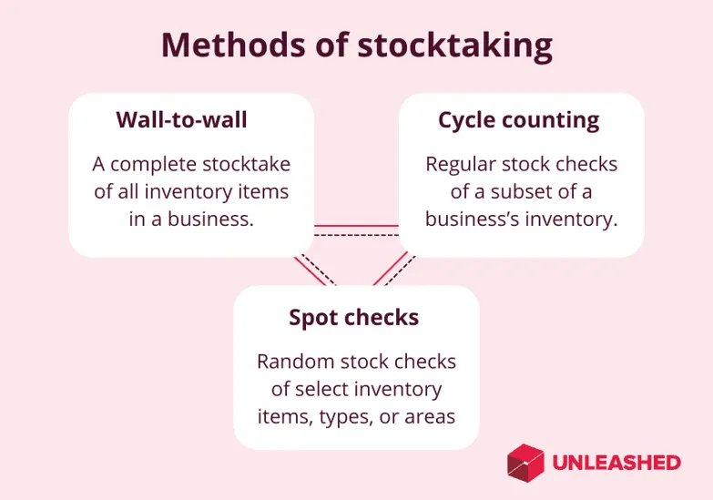

## Table of Contents

## What is Stock Ahead?

Stock Ahead is a tool that helps people make better choices about buying and selling stocks. It uses information and predictions to tell users if a stock's price might go up or down in the future. This can be really helpful for people who want to invest their money wisely and make more of it.

The tool looks at a lot of different things to make its predictions. It checks news, what people are saying on social media, and other important information. By putting all this together, Stock Ahead gives users a good idea of what might happen with stock prices. This way, people can decide when to buy or sell their stocks to get the best results.

## How does Stock Ahead work?

Stock Ahead works by collecting a lot of information from different places. It looks at news articles, what people are saying on social media, and other important data. All this information helps Stock Ahead understand what is happening with different companies and their stocks. By putting all this data together, Stock Ahead can see patterns and trends that might affect stock prices.

Once Stock Ahead has all this information, it uses special math and computer programs to make predictions. These predictions tell users if a stock's price might go up or down in the future. This helps people decide when to buy or sell their stocks. For example, if Stock Ahead predicts a stock will go up, someone might want to buy it now to make more money later. If it predicts a stock will go down, someone might want to sell it before it loses value.

## What are the main features of Stock Ahead?

Stock Ahead has a few main features that help people make smart choices about stocks. One big feature is its ability to predict if a stock's price will go up or down. It does this by looking at a lot of information like news and social media. This helps users know when might be a good time to buy or sell a stock.

Another important feature is how easy it is to use. Stock Ahead makes its predictions simple to understand, so anyone can use it, even if they are new to investing. It also updates its information all the time, so users always have the newest data to help them make decisions.

## Who can benefit from using Stock Ahead?

People who want to invest in stocks can really benefit from using Stock Ahead. It helps them know if a stock's price might go up or down. This is useful for people who are just starting to invest because it makes things easier to understand. They can see predictions and decide when to buy or sell their stocks without needing to be experts.

Even people who already know a lot about stocks can use Stock Ahead. It gives them more information to help make better choices. By looking at news and what people are saying online, Stock Ahead can spot trends that might not be easy to see otherwise. This way, experienced investors can still learn something new and maybe make more money.

## How does Stock Ahead differ from traditional stock market analysis tools?

Stock Ahead is different from traditional stock market analysis tools because it uses a lot more information to make predictions. Traditional tools often look at numbers like a company's earnings, how much it's worth, and what the stock has done in the past. Stock Ahead goes further by also checking news articles and what people are saying on social media. This gives a fuller picture of what might happen with a stock's price.

Another way Stock Ahead stands out is how easy it is to use. Traditional tools can be hard to understand, especially for people new to investing. They might need to learn a lot of special terms and do a lot of math. Stock Ahead makes its predictions simple and clear, so anyone can use it. It also updates its information all the time, so users always have the latest data to help them make choices about buying or selling stocks.

## What are the system requirements for using Stock Ahead?

To use Stock Ahead, you need a device that can connect to the internet, like a computer, tablet, or smartphone. It works on most modern web browsers, so you don't need to download any special software. You just need a good internet connection to make sure the information updates quickly and you can see the latest predictions.

Stock Ahead doesn't need a lot of space on your device because it runs online. It's designed to be light and fast, so even if your device isn't the newest, you should still be able to use it without problems. Just make sure your device meets the basic requirements for running a web browser, and you'll be ready to start using Stock Ahead to help with your stock market decisions.

## Can Stock Ahead be integrated with other financial tools and platforms?

Stock Ahead can work together with other financial tools and platforms. It has special ways to connect with other systems, so you can use it along with the tools you already like. This means you can see Stock Ahead's predictions right next to the information from your other financial apps, making it easier to make smart choices about your stocks.

The way Stock Ahead connects with other tools is through something called an API. This is like a special language that lets different computer programs talk to each other. So, if you use other financial platforms, you can set them up to get information from Stock Ahead. This helps you have all your important stock market information in one place, making it simpler to manage your investments.

## What kind of data does Stock Ahead use to make predictions?

Stock Ahead uses a lot of different information to make its predictions about stock prices. It looks at news articles to see what is happening with companies and the economy. It also checks what people are saying on social media because that can show what people think about a company. Stock Ahead even looks at things like how much a company is making, how much it's worth, and what the stock has done in the past.

All this information helps Stock Ahead see patterns and trends that might affect stock prices. By putting everything together, it can tell if a stock's price might go up or down. This way, people using Stock Ahead can make better choices about when to buy or sell their stocks.

## How accurate are the predictions made by Stock Ahead?

Stock Ahead's predictions are pretty good, but they are not perfect. It uses a lot of information like news and what people say on social media to guess what might happen to stock prices. This means its predictions can be more accurate than just guessing, but stocks can be hard to predict because so many things can change.

Sometimes, Stock Ahead might get it right, and other times it might not. It's important to remember that even with all the information it uses, the stock market can be surprising. So, while Stock Ahead can help you make better choices, it's always a good idea to think about other information too and not just rely on one tool.

## What are the costs associated with using Stock Ahead?

Using Stock Ahead costs money, but it's not too expensive. You can choose to pay every month or every year. The monthly plan is good if you want to try it out without spending a lot at first. The yearly plan is cheaper in the long run if you plan to use Stock Ahead for a while.

There's also a free trial you can use to see if you like Stock Ahead before you start paying. After the trial, you'll need to pick a plan to keep using it. The prices are set so that most people who want to invest can afford it, but it's still a good idea to check the latest prices on their website because they might change.

## Are there any case studies or success stories of Stock Ahead users?

One success story is about a person named John. John was new to investing and used Stock Ahead to help him make choices. He started with a small amount of money and followed the predictions from Stock Ahead. Over time, he saw his investments grow because he bought stocks that went up in price and sold ones that were about to go down. John was happy because he made more money than he thought he would, and he said Stock Ahead made investing easy to understand.

Another case study is about a company called GreenTech. They used Stock Ahead to make decisions about their stock. The company's leaders saw that Stock Ahead's predictions were often right, so they used it to plan when to buy back their own stock. This helped them save money and make their stock price go up. GreenTech's CEO said that using Stock Ahead gave them a big advantage in the stock market.

## What future developments can we expect from Stock Ahead?

Stock Ahead is always working on new things to make it even better for people who use it. One thing they are thinking about is adding more types of predictions. Right now, Stock Ahead tells you if a stock's price might go up or down. In the future, it might also tell you how much the price could change and for how long. This would help people make even smarter choices about when to buy or sell their stocks.

Another thing Stock Ahead might do is make it easier to use on phones and tablets. Right now, it works on these devices, but they want to make it even simpler and faster. They are also thinking about adding new ways to connect with other financial tools. This would let people see all their important stock information in one place, making it easier to manage their investments.

## References & Further Reading

[1]: Beattie, S. (2021). ["Algorithmic Trading and Its Impact on Financial Markets."](https://www.researchgate.net/publication/378548435_Algorithmic_Trading_and_AI_A_Review_of_Strategies_and_Market_Impact) The Balance Small Business.

[2]: Fernandez, P. M., et al. (2020). ["Algorithmic Trading in Modern Supply Chains: A Review and Research Agenda."](https://www.researchgate.net/publication/378548435_Algorithmic_Trading_and_AI_A_Review_of_Strategies_and_Market_Impact) Journal of Business Logistics.

[3]: Bermúdez, J. D., & Segura, J. V. (2019). ["Supply Chain Management and Advanced Algorithms: The New Era."](https://www.sciencedirect.com/science/article/pii/S0168851024002549) Computational Management Science.

[4]: ["Advances in Financial Machine Learning"](https://www.amazon.com/Advances-Financial-Machine-Learning-Marcos/dp/1119482089) by Marcos Lopez de Prado.

[5]: ["Machine Learning for Algorithmic Trading: Predictive models to extract signals from market and alternative data for systematic trading strategies with Python, 2nd Edition"](https://www.amazon.com/Machine-Learning-Algorithmic-Trading-alternative/dp/1839217715) by Stefan Jansen.

[6]: Lacity, M., & Willcocks, L. (2016). ["A New Approach to Automating Services."](https://eprints.lse.ac.uk/68135/1/Willcocks_New%20approach_2016.pdf) MIT Sloan Management Review.