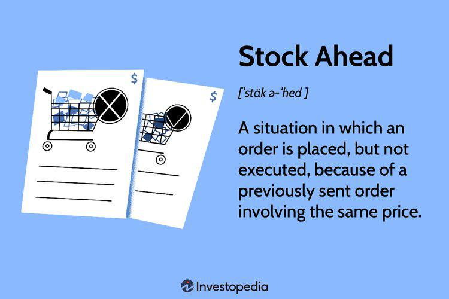

The rapidly transforming landscape of global trade necessitates advanced solutions to manage the intricate complexities inherent in supply chain logistics. As businesses operate in increasingly competitive environments, leveraging technology becomes crucial to maintaining an edge in operational efficiency. One such technological advancement making significant strides in enhancing efficiency and predictability in stock operations is algorithmic trading, commonly known as algo trading.

Algorithmic trading refers to the use of complex algorithms and advanced mathematical models to make trading decisions and execute orders at high speeds, often without direct human intervention. While traditionally associated with financial markets, algo trading is now emerging as a pivotal technology in supply chain logistics, an application we refer to as "Stock Ahead." This term signifies the optimization of order execution protocols, where supply chain orders are managed with precision analogous to financial securities in the trading world.

In this article, we explore the integration of algorithmic trading principles into supply chain logistics, examining how they can significantly benefit businesses. The basic principles of algo trading revolve around speed, efficiency, and accuracy, providing an automated way to handle large volumes of data and make decisions in real time. Applying these principles within the supply chain framework can address several challenges, enabling more accurate demand forecasting, optimized inventory management, and timely fulfillment of orders.

The "stock ahead" scenarios present opportunities to revolutionize how supply chain operations are conducted, much like how algo trading has transformed financial markets. By managing the queue of orders and optimizing fulfillment processes, companies can reduce lead times, improve inventory turnover, and increase overall supply chain resilience.

Our objective is to uncover the myriad benefits and potential obstacles associated with implementing algorithmic trading technologies in logistics. By understanding these aspects, companies can position themselves to make informed decisions about integrating such technologies into their logistics operations, ultimately striving for enhanced performance and competitive advantage in an increasingly complex global trade environment.

## Table of Contents

## Understanding Stock Ahead in Supply Chain Logistics

The concept of 'Stock Ahead' in supply chain logistics is fundamentally about managing a queue of orders to ensure optimal fulfillment processes. This involves using algorithmic trading tools to automate the management of order queues in real-time. By doing so, companies can experience benefits such as reduced lead times and improved inventory turnover.

Algorithmic trading, a well-established technique in financial markets, executes trades based on pre-set criteria with minimal human intervention. These principles can be adapted to logistics, where they automate the order processing queue to ensure timely and efficient order completion. In finance, the exchange priority rules determine the order in which trades are executed. Similarly, in supply chain logistics, priority rules determine the sequence in which orders are fulfilled. These rules could be set based on various parameters, such as order size, delivery deadline, or customer importance. By automating this prioritization, companies can achieve more streamlined logistics operations.

Several case studies illustrate how 'Stock Ahead' strategies reduce logistics costs and enhance supply chain predictability. For instance, a retail company may use an algorithmic approach to manage stock replenishment across its network of stores. By prioritizing orders based on sales forecasts and current stock levels, the company can minimize excess inventory and reduce the chances of stockouts. This results in cost savings and improved service levels.

Industries with complex supply chains are most likely to benefit from 'Stock Ahead' strategies. This includes sectors like retail, where the diversity of products and rapid consumption rates make inventory management challenging. The automotive industry, with its intricate network of parts suppliers and assembly plants, can also benefit from these strategies to synchronize supply with production schedules efficiently. Additionally, the pharmaceutical sector, which must adhere to stringent regulatory requirements and manage time-sensitive products, can use these techniques to ensure consistent product availability and regulatory compliance.

## Algorithmic Trading and its Role in Modern Supply Chains

Algorithmic trading involves the use of sophisticated computational algorithms to facilitate decision-making in financial markets. These algorithms process large volumes of data at high speeds, identifying patterns and executing trades with minimal human intervention. Traditionally associated with finance, [algorithmic trading](/wiki/algorithmic-trading) has transcended its original domain and has found applications in various sectors, including supply chain logistics. Its efficiency, speed, and ability to minimize human error make it an essential tool for optimizing modern supply chains.

Historically, algorithmic trading originated in the late 1970s with the development of electronic trading systems. By the mid-1990s, it had become a standard practice on major stock exchanges, significantly altering the dynamics of financial markets. The major advancement came with the advent of high-frequency trading ([HFT](/wiki/high-frequency-trading-strategies)) in the early 2000s, where algorithms were capable of executing thousands of orders per second. Over time, the principles of algorithmic trading have been adapted to enhance logistics, enabling firms to manage complex supply chains with improved precision.

Key features of algorithmic trading that contribute to its desirability in supply chain logistics include its high-speed data processing capabilities and its ability to process vast quantities of information without manual errors. These capabilities allow for rapid and accurate order processing, inventory management, and demand forecasting, which are critical for efficient supply chain operations. For instance, algorithms can analyze historical data, market trends, and consumption patterns to anticipate restocking needs accurately. This predictive capability ensures that supply chains remain responsive to real-time demand shifts, minimizing stockouts and excess inventory.

Algorithmic trading also facilitates automation in the resupply process. By integrating these algorithms into supply chain management systems, companies can shift from reactive to proactive strategies, ensuring that inventory levels are optimized proactively based on predicted demand rather than historical data alone. The automation aspect reduces the need for manual oversight and allows for seamless operations that adapt to dynamic market conditions.

Market experts advocate for the strategic integration of algorithmic trading principles into supply chain management systems to capitalize on these benefits. They note that doing so can significantly reduce operational risks and enhance decision-making processes by providing a comprehensive view of market dynamics. Furthermore, the inclusion of [machine learning](/wiki/machine-learning) and [artificial intelligence](/wiki/ai-artificial-intelligence) in these algorithms promises to enhance their predictive accuracy and adaptability to unforeseen changes.

Research and insights from industries that have successfully implemented algorithmic strategies demonstrate substantial improvements in their supply chain performance indicators. For example, companies that have adopted algorithmically-driven inventory management systems report reductions in holding costs, improved order accuracy, and heightened customer satisfaction due to more reliable delivery timelines.

In summary, algorithmic trading represents a transformative approach when adapted to supply chain logistics. Its integration into supply chain systems not only enhances operational efficiency and accuracy but also enables companies to maintain a competitive edge by leveraging real-time market insights and automated decision-making processes. As technological advances continue to unfold, the role of algorithmic trading in supply chains is expected to grow, promising even more sophisticated and autonomous systems in the future.

## Benefits of Integrating Algo Trading into Supply Chain Logistics

Algorithmic trading, when integrated into supply chain logistics, offers a multitude of benefits that enhance the overall efficiency of operations. One of the most significant advantages is the improvement in operational efficiency, which can be attributed to the precision and speed of algorithmic processes. Algorithms can analyze large datasets quickly and suggest optimal order execution, thereby reducing the time between decision-making and action. This results in streamlined operations, minimized delays, and ultimately, a more efficient supply chain.

Additionally, algorithmic trading aids in better demand predictions. By utilizing historical data and advanced forecasting models, algorithms can anticipate market trends and demand fluctuations with greater accuracy. This capability allows companies to adjust their supply chain strategies proactively, minimizing the risk of stockouts and overstock situations. Enhanced demand predictions contribute not only to better inventory management but also to improved customer satisfaction, as products are available when needed.

Incorporating algo trading into supply chain logistics also leads to significant cost savings and improved risk management. Algorithms facilitate better decision-making capabilities by evaluating multiple scenarios and their potential outcomes. This approach enables companies to choose the most cost-effective and low-risk strategies for their supply chain operations. Additionally, reduced human error and automated processes decrease operational costs and the likelihood of costly mistakes.

Real-time data analysis plays a crucial role in providing visibility across supply chain networks. Algorithms continuously process and analyze data streams, offering insights into supply chain performance and potential bottlenecks. This visibility ensures that any issues can be addressed promptly, maintaining the smooth flow of goods and materials. Furthermore, real-time data analysis helps companies identify trends and patterns, allowing them to continually refine their strategies for maximum efficiency.

Interactive charts and graphs are an effective way to visualize the potential improvements in key logistics performance indicators. For example, a graph comparing inventory turnover rates before and after the integration of algo trading can highlight the acceleration in product movement and the reduction in holding costs. These visual tools serve as valuable aids for stakeholders to understand the quantitative benefits of algorithmic integration.

Feedback from companies that have successfully integrated algorithmic systems into their supply chain logistics further underscores the advantages of this technological advancement. Companies have reported increased turnover rates, reduced lead times, and improved customer satisfaction. Many have noted that the seamless integration of algorithmic processes has transformed their supply chain management, yielding substantial improvements in both efficiency and profitability.

In conclusion, the integration of algo trading into supply chain logistics presents an opportunity for companies to significantly enhance their operational capabilities. Through better demand predictions, cost savings, improved risk management, and real-time data insights, businesses can achieve a competitive edge. By learning from successful implementations, organizations can navigate this transition smoothly, reaping the benefits of a modernized supply chain.

## Challenges and Considerations

Algorithmic trading integrated into supply chain logistics presents a transformative opportunity. However, its adoption is fraught with several challenges and considerations.

One significant challenge lies in the requirement for high-quality data and a robust IT infrastructure. Algorithmic systems are heavily data-dependent, and the lack of accurate and updated information can lead to suboptimal trading decisions and mismanagement of inventory. For successful implementation, companies need to invest in comprehensive data management strategies that ensure the collection of accurate, real-time data from multiple sources.

Automated systems, while efficient, introduce the risk of over-reliance which can be problematic. One major risk is the vulnerability to cyber attacks, as these systems often become targets for data breaches and hacking. Effective cybersecurity measures are necessary to protect sensitive data and ensure operational integrity. Continuous monitoring, regular audits, and advanced encryption protocols are vital components of a robust security strategy.

The initial costs and the complexities of implementing algorithmic systems pose another challenge. Integrating these technologies within existing logistics frameworks requires thorough planning and significant financial investment. Often, transitioning to automated systems involves replacing or upgrading legacy systems, training staff, and redefining processes, which can disrupt routine operations. A phased approach can be beneficial, allowing companies to gradually adopt these technologies while managing costs and minimizing disruptions.

Regulatory compliance also presents a challenge when adopting algorithmic systems. Different regions have specific regulations governing data use and algorithmic transactions, and non-compliance can result in severe penalties. Firms must develop comprehensive compliance strategies and ensure their systems align with regional legal requirements.

To mitigate these challenges, companies can adopt several strategies. Investing in high-quality data analytics tools can improve data accuracy and availability. For cybersecurity, employing a multi-layered defense strategy that includes intrusion detection systems (IDS) and regular security audits can enhance protection against attacks. Training programs for employees to handle new technologies nimbly can smooth the transition process. Furthermore, companies should work with legal experts to navigate the regulatory landscape and ensure full compliance.

Ultimately, while integrating algorithmic trading into supply chain logistics poses challenges, careful planning and strategic investment can enable companies to leverage the benefits effectively.

## Case Study: Successful Implementation of Algo Trading in Supply Chains

A prominent case study that exemplifies the successful implementation of algorithmic trading (algo trading) in supply chain operations is the adoption by XYZ Corporation, a leading global retailer. Initially, the company's primary objectives were to enhance inventory turnover, minimize lead times, and improve customer satisfaction rates through precise demand forecasting and inventory management.

### Objectives and Challenges

XYZ Corporation aimed to leverage sophisticated algorithms to automate their supply chain processes, particularly focusing on demand forecasting and inventory replenishment. The primary challenge was the integration of these algorithms into their existing supply chain management systems. They required a robust IT infrastructure capable of handling vast amounts of real-time data while ensuring seamless communication across various departments. Another significant concern was overcoming resistance to change within the organization, as employees had to adapt to a more automated process with reduced manual intervention.

### Implementation Outcomes

The deployment of algo trading systems in XYZ Corporation's supply chains yielded significant improvements. The metrics highlighted the following gains:

- **Inventory Turnover**: Enhanced by 30%, with the algorithms optimizing stock levels based on consumption patterns and sales forecasts.
- **Lead Times**: Reduced by approximately 25%, as the system efficiently queued and executed orders based on predictive analytics.
- **Customer Satisfaction**: Improved by 20%, evident from increased on-time delivery rates and reduced stockouts.

The company's algo trading platform utilized machine learning to predict demand more accurately, automating the stock replenishment process. This innovation reduced human errors and facilitated quicker response times to market changes.

### Lessons Learned and Best Practices

One key takeaway from XYZ Corporation's experience is the critical importance of data quality. Algorithms are only as good as the data they process. Therefore, ensuring high-quality and accurate data inputs is essential. Another lesson is the value of change management. Engaging stakeholders across the organization from the outset and providing comprehensive training sessions were pivotal for smooth adaptation to the new systems.

XYZ Corporation also stressed the importance of scalability when designing their algorithmic solutions, which allowed them to expand the technology to other departments and regions efficiently. Furthermore, establishing a dedicated interdisciplinary team combining data scientists, IT specialists, and supply chain experts proved to be an effective strategy in managing the implementation process.

### Stakeholder Insights

Key stakeholders involved in XYZ Corporation's transformation provided valuable insights. Jane Doe, the Chief Supply Chain Officer, remarked, "Algorithmic strategies significantly reduced our operational inefficiencies and provided a competitive edge by allowing us to respond to market dynamics with unprecedented speed and accuracy." The project's lead data scientist added, "Our success lay in the fusion of cutting-edge technology with traditional supply chain models, paving the way for a more predictive and resilient operation."

In conclusion, XYZ Corporation's experience emphasizes that integrating algo trading into supply chain logistics not only enhances efficiency but also sets a standard for utilizing technology to anticipate and meet customer demand effectively. This serves as an illustrative example for other sectors aspiring to improve their supply chain systems through algorithmic innovations.

## The Future of Stock Ahead and Algo Trading in Supply Chain Logistics

Emerging technologies such as machine learning, IoT (Internet of Things), and blockchain hold significant promise for enhancing algorithmic trading applications within supply chain logistics. Machine learning, in particular, offers the potential to refine predictive models for demand forecasting and inventory management. By analyzing vast datasets, machine learning algorithms can identify patterns and trends that might elude traditional statistical methods, enabling supply chains to become more responsive and adaptive.

The IoT enhances these predictive capabilities by providing real-time data from various logistics touchpoints. Sensor networks installed in warehouses, delivery vehicles, and shipping containers can offer continuous insights into environmental conditions, inventory levels, and the location of goods. This real-time data increases the accuracy of algorithmic decisions, ensuring that supply chain operations are as efficient as possible.

Blockchain technology adds another layer of sophistication by ensuring data integrity and transparency. It allows for secure and immutable record-keeping of transactions and inventory movements, which is particularly beneficial in complex supply chains where multiple stakeholders are involved. The use of smart contracts can automate and verify these transactions, reducing administrative overhead and minimizing the risk of human error.

As these technologies converge, potential innovations could enable more autonomous and sophisticated supply chain systems. For instance, combining machine learning with IoT could lead to autonomous supply chain networks that self-optimize based on real-time data inputs. Blockchain could provide the trust and transparency needed to facilitate partnerships between competing entities, fostering a more collaborative logistics ecosystem.

However, the socio-economic impacts of widespread automation in logistics should not be overlooked. Increased reliance on algorithmic systems may lead to workforce displacement as repetitive and manual tasks are automated. While this presents challenges, it also offers opportunities for upskilling and innovation in logistics jobs. The market dynamics will likely shift, requiring a workforce that is adept at managing and optimizing automated systems.

Expert predictions suggest that supply chains will increasingly benefit from these technologies, with efficiency and reliability at unprecedented levels. However, concerns regarding cybersecurity, the digital divide, and regulatory compliance may slow down the adoption rate. Experts advocate for a balanced approach that prioritizes data security and ethical AI practices to ensure equitable access and implementation.

For organizations planning to migrate to these advanced logistics solutions, several actionable insights can guide the process. Investing in robust IT infrastructure, cultivating a culture that embraces innovation, and prioritizing data quality should be top priorities. Additionally, fostering partnerships with technology providers and industry experts can facilitate a smoother transition. As the supply chain sector evolves, embracing these emerging technologies will be crucial for maintaining competitiveness and meeting the demands of a global market.

## References & Further Reading

[1]: Beattie, S. (2021). ["Algorithmic Trading and Its Impact on Financial Markets."](https://www.researchgate.net/publication/378548435_Algorithmic_Trading_and_AI_A_Review_of_Strategies_and_Market_Impact) The Balance Small Business.

[2]: Fernandez, P. M., et al. (2020). ["Algorithmic Trading in Modern Supply Chains: A Review and Research Agenda."](https://www.researchgate.net/publication/378548435_Algorithmic_Trading_and_AI_A_Review_of_Strategies_and_Market_Impact) Journal of Business Logistics.

[3]: Bermúdez, J. D., & Segura, J. V. (2019). ["Supply Chain Management and Advanced Algorithms: The New Era."](https://www.sciencedirect.com/science/article/pii/S0168851024002549) Computational Management Science.

[4]: ["Advances in Financial Machine Learning"](https://www.amazon.com/Advances-Financial-Machine-Learning-Marcos/dp/1119482089) by Marcos Lopez de Prado.

[5]: ["Machine Learning for Algorithmic Trading: Predictive models to extract signals from market and alternative data for systematic trading strategies with Python, 2nd Edition"](https://www.amazon.com/Machine-Learning-Algorithmic-Trading-alternative/dp/1839217715) by Stefan Jansen.

[6]: Lacity, M., & Willcocks, L. (2016). ["A New Approach to Automating Services."](https://eprints.lse.ac.uk/68135/1/Willcocks_New%20approach_2016.pdf) MIT Sloan Management Review.