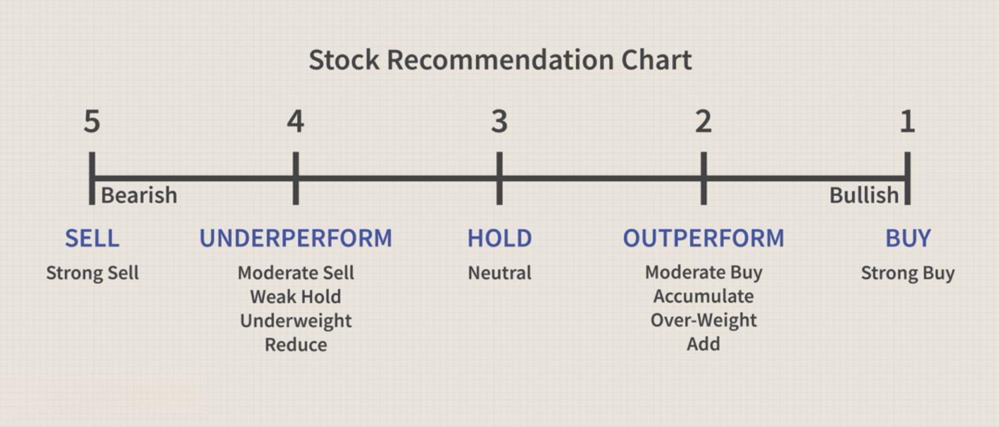

In the world of investing, understanding the insights provided by stock analysts can be pivotal. These professionals assess company performance, industry trends, and economic factors to provide informed opinions on stock performance. Analyst recommendations often come with terms like 'buy', 'sell', and 'hold', which can guide investment decisions. 'Buy' suggests the belief that a stock will outperform the market, 'sell' indicates potential underperformance, and 'hold' suggests aligning performance with the market. However, the interpretation of these ratings is not always straightforward, with each firm having unique rating scales and terminologies.

Algorithmic trading plays a significant role in interpreting these recommendations by using computerized algorithms to analyze and act upon rating changes swiftly. These algorithms factor in analyst insights as one of many inputs, allowing for rapid and data-driven decision-making. This capability enhances the ability to capitalize efficiently on rating shifts.



This article aims to shed light on what these ratings truly mean, the complexities of different rating scales, the role of algorithmic trading in processing these recommendations, and how investors can leverage this information to make informed financial decisions. By exploring these facets, investors can better understand how to align analyst opinions with personal investment strategies and goals.

## Table of Contents

## Understanding Analyst Ratings: Buy, Sell, Hold

Analyst ratings serve as a concise tool for investors to gauge the prevailing sentiment surrounding a particular stock. These ratings are frequently employed by financial analysts who evaluate companies based on various quantitative and qualitative factors, rendering judgments that can significantly influence investment decisions.

A 'buy' recommendation is an indicator that the analyst expects the stock to outperform the broader market or its sector peers. This evaluation is typically rooted in the anticipation of future growth potential, underpinned by strong financial health, competitive positioning, or favorable market conditions.

In contrast, a 'sell' rating suggests that the stock is projected to underperform when compared to the overall market or similar companies. Analysts may arrive at this conclusion due to declining business prospects, adverse market conditions, or perceived overvaluation of the stock.

A 'hold' rating indicates an expectation that the stock will perform in line with the market or comparable companies. This neutral stance suggests that the analyst believes the stock's current price accurately reflects its intrinsic value and future prospects, neither warranting a purchase nor a sale.

These ratings provide a streamlined assessment, summarizing complex analyses into a simple recommendation that can assist investors in making informed choices. However, it's crucial for investors to understand the context and methodology underlying these ratings to align them accurately with their investment goals and risk tolerance.

## The Intricacies of Analyst Rating Scales

Analyst rating scales are used by financial institutions and investment firms to convey their views on stock performance potential, with a primary objective of guiding investment decisions. Unlike a standardized framework, rating scales can vary among firms, leading to possible differences in interpretation.

A typical analyst rating scale might include terms such as "strong buy," "buy," "hold," "sell," and "strong sell." However, some firms opt for alternative terminology like "outperform" and "underperform." The use of different terms for essentially similar recommendations can create misunderstandings if investors are not familiar with each firm's specific scale.

For instance, a "strong buy" rating is often considered more emphatic than a standard "buy" recommendation, suggesting a higher conviction in a stock's predicted strong performance relative to the market. Similarly, a "strong sell" indicates a firm belief that the stock is likely to perform significantly worse than its peers.

The differences in rating scales are not merely a matter of vocabulary; they reflect the firm's methodological approach and analytical rigor. Some investment houses may apply quantitative models that weigh various financial metrics differently, resulting in divergent ratings for the same stock. Understanding these methodologies can be integral to interpreting the meaning behind the ratings.

To aid in understanding the spectrum of analyst ratings, investors may find it valuable to explore the historical accuracy and performance of each analyst or firm. Analyzing past recommendations can give insight into how firms phrase their advisories and their tendency to be optimistic or conservative in their forecasts.

Ultimately, recognizing the idiosyncrasies of each firm's rating scale allows investors to better interpret the advice given. This understanding can then be integrated into broader investment strategies, ensuring that the guidance from analyst ratings is both contextualized and actionable.

## The Role of Algorithmic Trading with Analyst Recommendations

Algorithmic trading utilizes sophisticated computer algorithms to interpret financial data, including analyst ratings, and execute trades with high efficiency and reduced latency. These algorithms are capable of processing large volumes of information quickly, integrating various data points such as historical stock prices, market trends, and analyst recommendations to make informed trading decisions. This technological prowess provides a competitive edge, as it allows for the swift adaptation to market changes and timely execution of trades.

A key feature of [algorithmic trading](/wiki/algorithmic-trading) is its ability to incorporate analyst ratings as one of the numerous variables considered. Analysts' recommendations, which are reflections of their assessments about the future performance of stocks, can serve as critical inputs in the algorithms. By evaluating these ratings alongside other market indicators, trading algorithms can adjust their strategies to either capitalize on favorable upgrades or mitigate potential losses from downgrades.

The efficiency of algorithmic trading over manual trading techniques is profound. Human traders are limited by cognitive bandwidth and the speed at which they can process information and execute trades. Algorithms, however, face no such constraints, enabling them to not only absorb vast sets of data but also perform complex analytical computations on-the-fly. This ability is crucial in volatile markets where the reaction time to new information is a decisive [factor](/wiki/factor-investing).

For example, Python libraries such as NumPy and pandas can facilitate the handling and processing of large datasets, while [machine learning](/wiki/machine-learning) models available through libraries like scikit-learn can be used to predict stock movements based on historical and real-time data. Below is a simple illustration of how a trading algorithm might be structured to respond to analyst ratings:

```python
import pandas as pd
from sklearn.linear_model import LinearRegression

# Sample market data
data = pd.DataFrame({
    'rating_change': [1, 0, -1, 1, -1],  # 1 for upgrade, 0 for hold, -1 for downgrade
    'price_change': [2, 0.5, -1.5, 2.2, -0.8]
})

# Define independent (X) and dependent variable (y)
X = data[['rating_change']]
y = data['price_change']

# Train model
model = LinearRegression().fit(X, y)

# Predict price change based on a new rating change
new_rating = pd.DataFrame({'rating_change': [1]})
predicted_change = model.predict(new_rating)

print(f"Predicted price change: {predicted_change[0]}%")
```

This approach enhances the ability to capitalize on rating changes with greater precision and speed than traditional methods. Consequently, algorithmic trading can significantly impact market dynamics by systematically converting analyst insights into actionable trading strategies, ultimately contributing to more efficient markets.

## Real-world Examples: Analyst Ratings Impact

Analyst ratings have historically had the power to significantly influence stock market movements, particularly during critical periods for companies. One notable example occurred with Coca-Cola, where an analyst upgrade led to substantial changes in its stock performance. When a well-regarded financial institution announced a "buy" recommendation for Coca-Cola, citing strong future earnings potential and innovative product strategies, the stock experienced a notable uptick. This positive revision attracted considerable attention from both institutional and retail investors, who interpreted the upgrade as a sign of underlying company strength. As a result, Coca-Cola's share price rose substantially, reflecting increased investor confidence.

On the other hand, companies such as Starbucks have experienced the consequences of analyst downgrades. During periods of strategic transition or financial uncertainty, an analyst might issue a "sell" rating, prompting a negative impact on the stock. For instance, when an analyst downgraded Starbucks citing concerns about its growth strategy and competitive pressures, the market reaction was swift and visible. Investors, wary of potential risks highlighted in the downgrade report, began to offload shares, leading to a decline in the stock's value.

These instances illustrate how analyst ratings can act as catalysts, affecting investor sentiment and driving market behavior. The immediate responses by investors following rating changes highlight the perceived authority and expertise analysts hold, potentially magnifying the effects of their recommendations. 

Investors can leverage these insights by monitoring analyst ratings for signals that might precede broader market reactions. Understanding trends and the timing of analyst revisions can equip investors to better anticipate the market's response. Such awareness allows for strategic positioning, whether through defensive moves in anticipation of downgrades or opportunistic strategies following upgrades.

These examples serve as reminders of the high impact that analyst ratings can have on stock performance, emphasizing the need for investors to consider these ratings as one of many tools in their investment decision-making process.

## Should You Act on Analyst Recommendations?

While analyst ratings are grounded in extensive research and expert analysis, they are not without limitations. It's crucial for investors to recognize that these ratings, although valuable, do not guarantee outcomes due to the inherent unpredictability of financial markets.

One primary consideration is the importance of consensus. A solitary analyst's recommendation might reflect their unique perspective or bias. Therefore, evaluating the consensus from multiple analysts can provide a more balanced view. This aggregated insight can be mathematically modeled to enhance decision-making. For example, one could calculate a weighted average rating based on the trust and past accuracy of individual analysts:

$$
\text{Weighted Average Rating} = \frac{\sum (r_i \times w_i)}{\sum w_i}
$$

where $r_i$ is the rating given by analyst $i$ and $w_i$ is the weight assigned to that analyst based on their historical predictive success.

Furthermore, aligning these recommendations with personal investment strategies is crucial. An aggressive investor with a high-risk appetite may prioritize stocks with high growth potential, possibly acting on 'buy' recommendations more frequently. Conversely, a conservative investor might lean towards 'hold' ratings to maintain steady, less volatile returns. The alignment can be systematized using Python algorithms to simulate portfolio adjustments based on varying risk appetites.

```python
def adjust_portfolio(rating, risk_level):
    if rating == 'buy' and risk_level > 0.6:
        return "Increase position size"
    elif rating == 'hold':
        return "Maintain current position"
    elif rating == 'sell' or risk_level < 0.4:
        return "Reduce position size"
    else:
        return "Custom strategy based on further analysis"

# Example Usage
risk_level = 0.5  # 0 (low risk) to 1 (high risk)
analyst_rating = 'buy'
portfolio_action = adjust_portfolio(analyst_rating, risk_level)
print(portfolio_action)
```

Ultimately, the decision to act on an analyst's recommendation should also consider the investor's financial goals and time horizon. Long-term investors might withstand short-term [volatility](/wiki/volatility-trading-strategies) in favor of anticipated longer-term gains, while short-term traders might prioritize immediate market signals. Balancing these factors requires a comprehensive investment strategy that doesn't solely rely on analyst ratings but integrates them as an informative component of a larger decision-making framework.

## Conclusion

Buy, sell, and hold ratings serve as valuable tools for investors seeking direction in a complex financial landscape. These recommendations, grounded in comprehensive analysis, can inform strategic investment decisions. However, they should not be relied upon in isolation. Successful investment strategies require a holistic approach, integrating these analyst insights with a broader understanding of market conditions and personal financial objectives.

Incorporating algorithmic trading presents a significant advantage in acting swiftly on analyst recommendations. Algorithmic systems can process vast amounts of data in real-time, incorporating various influencing factors such as market trends, economic indicators, and rating adjustments. By automating trade executions, these systems can capitalize on short-lived opportunities that may arise from shifts in analyst sentiment.

Yet, the ultimate success in investing hinges on aligning trades with one's financial goals and risk tolerance. An informed decision-making process involves assessing the consensus of multiple analyst opinions and considering one's unique risk profile. This due diligence ensures that each investment aligns with both long-term objectives and an individual's capacity for risk.

In conclusion, while buy, sell, and hold ratings provide important guidance, they are most effective when integrated into a comprehensive investment strategy. By combining analytical insights with automated trading capabilities and personal financial planning, investors can navigate the market with confidence and prudence.

## References & Further Reading

[1]: Bergstra, J., Bardenet, R., Bengio, Y., & Kégl, B. (2011). ["Algorithms for Hyper-Parameter Optimization."](https://dl.acm.org/doi/10.5555/2986459.2986743) Advances in Neural Information Processing Systems 24.

[2]: ["Advances in Financial Machine Learning"](https://www.amazon.com/Advances-Financial-Machine-Learning-Marcos/dp/1119482089) by Marcos Lopez de Prado

[3]: ["Evidence-Based Technical Analysis: Applying the Scientific Method and Statistical Inference to Trading Signals"](https://books.google.com/books/about/Evidence_Based_Technical_Analysis.html?id=MeoJAQAAMAAJ) by David Aronson

[4]: ["Machine Learning for Algorithmic Trading"](https://github.com/stefan-jansen/machine-learning-for-trading) by Stefan Jansen

[5]: ["Quantitative Trading: How to Build Your Own Algorithmic Trading Business"](https://www.amazon.com/Quantitative-Trading-Build-Algorithmic-Business/dp/1119800064) by Ernest P. Chan