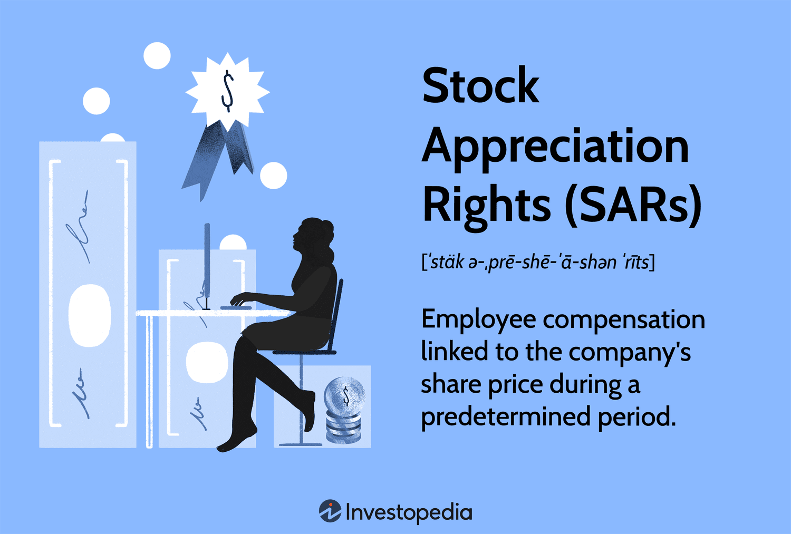

## Table of Contents

## What are Stock Appreciation Rights (SARs)?

Stock Appreciation Rights (SARs) are a type of employee compensation linked to the performance of the company's stock. They give employees the right to receive the increase in the value of a set number of shares over a specific period. This means if the stock price goes up, employees can get a payout equal to that increase, without having to buy the stock themselves.

SARs are often used by companies as a way to reward and keep their employees. They work a bit like stock options but are simpler because employees don't need to buy the stock to benefit from its growth. When SARs are exercised, the payout can be in cash or shares, depending on what the company decides. This makes SARs a flexible tool for companies to motivate their workforce.

## How do Stock Appreciation Rights work?

Stock Appreciation Rights (SARs) are a way for companies to reward their employees based on how well the company's stock does. When an employee gets SARs, they are given the right to the increase in value of a certain number of shares over a set time. For example, if the stock price goes up from $10 to $15, the employee can get the $5 increase for each share they have rights to. They don't need to buy the stock to get this benefit, which makes SARs different from stock options.

When it's time to use the SARs, the company figures out how much the stock has gone up since the SARs were given. If the stock price has increased, the employee gets a payout equal to that increase. This payout can be in cash or in shares, depending on what the company decides. SARs help keep employees motivated because they can share in the company's success without having to spend their own money to buy stock.

## What is the difference between SARs and stock options?

Stock Appreciation Rights (SARs) and stock options are both ways for companies to reward employees, but they work differently. With SARs, employees get the increase in the value of the company's stock without having to buy the stock. For example, if the stock price goes up from $10 to $15, the employee gets the $5 increase for each share they have rights to. This payout can be in cash or shares, and the employee doesn't need to spend any money to get it.

On the other hand, stock options give employees the right to buy the company's stock at a set price, called the exercise price. If the stock price goes up above the exercise price, the employee can buy the stock at the lower price and then sell it at the higher market price to make a profit. But, to get this profit, the employee has to buy the stock first, which means they need to spend money. This is different from SARs, where no money needs to be spent upfront.

In summary, SARs are simpler and less risky for employees because they don't have to buy the stock to benefit from its growth. Stock options, however, require employees to invest money to exercise their options and potentially profit from the stock's increase in value. Both methods aim to motivate employees by linking their rewards to the company's performance, but they do so in different ways.

## Who typically receives Stock Appreciation Rights?

Stock Appreciation Rights (SARs) are usually given to employees, especially those in higher positions like executives and managers. Companies use SARs to keep these important employees happy and motivated. By giving them a chance to earn more money if the company does well, it encourages them to work hard and stay with the company.

Sometimes, SARs are also given to other key employees who are not in top management but are still very important to the company's success. This can include people in roles like sales, engineering, or other areas where their work directly affects how well the company does. Giving SARs to a wider group of employees can help spread the motivation and make everyone feel like they have a stake in the company's future.

## What are the tax implications of SARs for employees?

When employees get paid from Stock Appreciation Rights (SARs), they have to pay taxes on that money. The payout from SARs is considered part of their income. This means it gets added to their regular pay, and they pay income tax on it. The tax rate depends on how much money they make in total. If the payout is in cash, it's straightforward. But if it's in shares, the tax situation can get a bit more complicated.

If the payout from SARs is in shares, employees might have to pay taxes right away on the value of those shares. This is called ordinary income tax. After that, if they hold onto the shares and they go up in value, they might have to pay capital gains tax when they sell them. The rate for capital gains tax is usually lower than for ordinary income, but it depends on how long they keep the shares. It's a good idea for employees to talk to a tax advisor to understand exactly how much they'll need to pay in taxes and when.

## How are SARs valued and what factors affect their value?

The value of Stock Appreciation Rights (SARs) depends on how much the company's stock price goes up. When an employee gets SARs, they are given a certain number of rights, and the value of those rights is based on the difference between the stock price when the SARs were given and the stock price when they are used. For example, if the stock was $10 when the SARs were given and it goes up to $15 when they are used, the value of each SAR would be $5. The total value of the SARs would be the number of rights times the $5 increase.

Several things can affect the value of SARs. The main one is how well the company is doing, because that affects the stock price. If the company does well and the stock price goes up a lot, the SARs will be worth more. Other things that can affect the stock price, and therefore the value of SARs, include the overall economy, how the company is seen by investors, and any news or events that might change how people think about the company. Because SARs are tied to the stock price, anything that makes the stock go up or down will change their value.

## What are the advantages of using SARs for a company?

Using Stock Appreciation Rights (SARs) can be a good way for a company to keep its employees happy and motivated. SARs let employees share in the company's success without having to buy the stock themselves. This means the employees don't have to spend their own money to benefit from the company doing well. When employees know they can earn more if the company's stock goes up, they might work harder and stay with the company longer. This can help the company keep its best people and make them feel like they are part of the company's future.

SARs are also easier for companies to manage than other kinds of employee rewards. With SARs, the company doesn't have to give out actual shares, which can be complicated and might dilute the value of the stock for other shareholders. Instead, the company can choose to pay out the value of the SARs in cash or shares, depending on what works best for them. This flexibility makes SARs a useful tool for companies to reward their employees in a way that fits their needs and helps everyone do better.

## What are the potential drawbacks of SARs for both the company and the employee?

For a company, using Stock Appreciation Rights (SARs) can have some downsides. One big problem is that if the stock price goes up a lot, the company might have to pay out a lot of money to employees. This can be hard on the company's budget, especially if they have to pay in cash. Also, if the stock price doesn't go up, the SARs won't be worth much, and employees might get upset or leave the company. This can make it hard for the company to keep its employees happy and motivated.

For employees, SARs can also have some drawbacks. If the stock price doesn't go up, the SARs won't be worth anything, and the employee won't get any extra money. This can be disappointing, especially if they were counting on that money. Also, when it's time to use the SARs, the employee might have to pay a lot of taxes on the payout. This can be a surprise and might make the reward less exciting. It's important for employees to understand how SARs work and what they might have to pay in taxes.

## How do companies typically structure SAR plans?

Companies usually set up Stock Appreciation Rights (SAR) plans to reward their employees based on how well the company's stock does. When they start a SAR plan, they decide how many rights each employee gets, which is often based on their job level or how important they are to the company. They also set a starting price for the stock, called the grant price, which is used to figure out how much the stock has gone up when the SARs are used. The company decides how long the employees have to wait before they can use their SARs, which is called the vesting period. This can be a few years, and it's meant to keep employees working hard and staying with the company.

Once the SARs are vested, employees can use them to get a payout if the stock price has gone up. The payout is the difference between the stock price now and the grant price, times the number of SARs the employee has. Companies can choose to pay this out in cash or in shares, depending on what works best for them. Some companies might also put limits on how much employees can get from their SARs, to make sure the payouts don't get too big. This way, SAR plans help companies reward their employees while also managing their costs.

## What are the legal and regulatory considerations for implementing SARs?

When a company wants to start using Stock Appreciation Rights (SARs), they need to think about the laws and rules that apply. Different countries have different rules about how companies can give out SARs and what they need to tell their employees. In the United States, for example, the company needs to follow rules from the Securities and Exchange Commission (SEC) if they are giving out SARs to top executives. They also need to make sure they are following the tax rules from the Internal Revenue Service (IRS), because SARs can affect how much tax employees have to pay.

Besides following the laws, companies also need to be clear and honest with their employees about how SARs work. They should explain things like how the SARs are valued, when employees can use them, and what taxes they might have to pay. This helps employees understand what they are getting and makes sure everything is fair. Companies might also need to get advice from lawyers to make sure they are doing everything right and following all the rules.

## How do SARs impact financial reporting and accounting for a company?

When a company uses Stock Appreciation Rights (SARs), it has to think about how to show them in its financial reports. SARs are seen as a cost to the company, and this cost needs to be shown in the company's financial statements. The cost is figured out by guessing how much the SARs will be worth when employees use them. This guess is based on how much the company thinks the stock price will go up. The cost is then spread out over the time it takes for the SARs to vest, which means the company adds a little bit of the cost to its expenses each year until the SARs can be used.

Showing SARs in financial reports can make the company's expenses look higher, which might make it seem like the company is not doing as well as it could be. But it's important for the company to be honest about its costs, so it has to include the value of the SARs. When employees use their SARs, the company might have to pay out money, and this can affect the company's cash flow. If the payouts are in cash, the company needs to make sure it has enough money to cover them. If the payouts are in shares, the company needs to think about how this might change the value of the stock for other shareholders.

## What advanced strategies can be used with SARs for wealth maximization?

One advanced strategy for using Stock Appreciation Rights (SARs) to maximize wealth is timing when to use them. Employees can wait until the stock price is at its highest before using their SARs. This way, they get the biggest possible payout. They can keep an eye on the stock price and use the SARs when they think the price won't go up much more. Another part of this strategy is understanding the vesting period. If the SARs vest over time, employees can use some of them as soon as they vest and keep the rest to use later when the stock price might be higher.

Another strategy is to use SARs as part of a bigger plan for managing money. Employees can take the money they get from SARs and invest it in other things, like stocks, bonds, or real estate. This can help them grow their wealth even more. They can also use the money to pay off debts or save for the future. It's important for employees to think about their overall financial goals and how SARs can help them reach those goals. Talking to a financial advisor can help them make the best choices about when to use their SARs and what to do with the money they get.

## References & Further Reading

[1]: Balsam, S., & Miharjo, S. (2007). ["The effect of equity compensation on voluntary executive turnover."](https://www.sciencedirect.com/science/article/pii/S0165410106000875) Journal of Accounting and Economics, 43(2-3), 279-312.

[2]: Hull, J. C. (2018). ["Options, Futures, and Other Derivatives."](https://www.semanticscholar.org/paper/Options%2C-Futures%2C-and-Other-Derivatives-Hull/89bdee500c8623864fc9eb7a471546aa713acc44) Pearson Education.

[3]: De Prado, M. L. (2018). ["Advances in Financial Machine Learning."](https://www.amazon.com/Advances-Financial-Machine-Learning-Marcos/dp/1119482089) Wiley.

[4]: Dimitrios, K. (2008). ["Algorithmic Trading and DMA: An Introduction to Direct Access Trading Strategies."](https://archive.org/details/algorithmictradi0000john) 4Myeloma Press.

[5]: Giles, W. (2006). ["Accounting for stock-based compensation."](https://rsmus.com/insights/financial-reporting/a-guide-for-accounting-for-stock-compensation.html) Journal of Financial Reporting and Accounting, 4(2), 99-122.