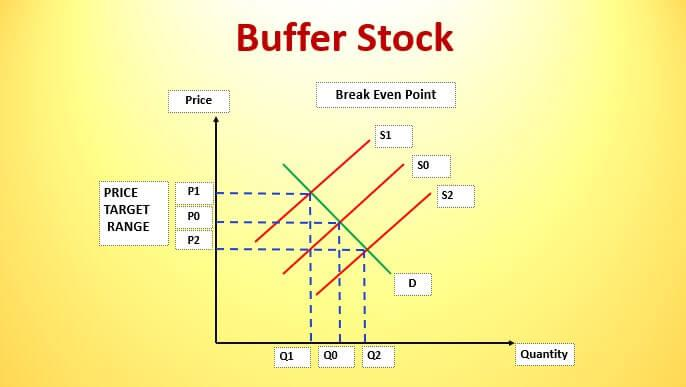

Market manipulation refers to the orchestration of activities designed to artificially modify the price of financial assets. These practices primarily aim to generate profits for the manipulator at the expense of average investors who rely on truthful market dynamics and transparent information. One key player in the contemporary trading landscape is algorithmic trading, known for its rapid execution of trades utilizing complex algorithms. While this technological advancement has improved market liquidity and efficiency, it also has the potential to affect market stability due to its capacity to execute high-frequency trades that can alter price movements significantly.

Another approach within market manipulation is stock bashing, where individuals or groups disseminate false or misleading information regarding a company's prospects. By devaluing the security through negative rumors, manipulators can profit by buying at lower prices—or aiding others to do so—only to sell when the stock rebounds post clarification of the misinformation.

This article will provide a comprehensive overview of market manipulation by examining the intricacies of stock bashing and the impact of algorithmic trading. By understanding these practices, we gain insights into their influence on stock market dynamics, which is vital for developing strategies to safeguard market integrity and protect investment interests.

## Table of Contents

## Understanding Stock Market Manipulation

Market manipulation encompasses a range of deceptive strategies aimed at creating artificial price movements in stocks to benefit manipulators often at the expense of unsuspecting investors. These practices can significantly distort market behavior, leading to inefficiencies and a loss of confidence among investors.

One prevalent form of market manipulation is the "pump and dump" scheme. This involves inflating the price of a stock through false or misleading information, encouraging other investors to buy in, thus driving up the price. Once the stock reaches a certain price level, the manipulators sell their holdings at a profit, leaving other investors with devalued securities. This fraudulent activity can be especially rampant in low-volume or penny stocks where small trades can induce significant price changes.

Another common tactic is wash trading, where a trader simultaneously buys and sells a security to create an illusion of high trading activity. This practice can temporarily generate interest in a particular stock, misleading investors into perceiving it as a viable investment. Although wash trades often result in negligible net positions, they serve to artificially inflate trading volumes, potentially influencing market perceptions and decisions.

Spreading misinformation is another form of manipulation that involves distributing false news or data about a company to affect its stock price. For instance, disseminating negative rumors about a company's financial health can lead to a sell-off, depreciating its stock value. Conversely, false positive news might inflate the stock price, attracting uninformed investors. In today's digital age, the rapid circulation of information through social media and online forums amplifies the potential impact of misinformation.

The implications of these manipulative tactics extend beyond individual investors to undermine the broader market integrity. When market participants manipulate stock prices, they distort the natural forces of supply and demand that should govern trading activities. This distortion poses significant risks to the price discovery process, where the true value of a security is determined by market dynamics.

Moreover, such manipulative behaviors can erode investor confidence. If investors perceive the market as an uneven playing field, trust in market operations diminishes, potentially reducing participation and [liquidity](/wiki/liquidity-risk-premium). Over time, this can impact not only individual portfolios but also the overall health of financial markets, as reduced confidence can lead to decreased investment and ultimately hinder economic growth.

Thus, understanding and identifying market manipulation is crucial for both regulators and investors. Detecting these activities early can help maintain the integrity of markets and protect investors from falling victim to deceptive practices. As market environments continue to evolve with advancing technologies, so too must the mechanisms and strategies to combat market manipulation.

## Stock Bashing: A Closer Look

Stock bashing represents a troubling aspect of market manipulation where individuals or groups deliberately spread negative rumors or false information about a company to adversely impact its stock price. This practice is often executed through online platforms, taking advantage of the reach and immediacy of forums and social media. By generating doubt and fear about a company’s prospects, stock bashers aim to trigger a sell-off, driving the stock price downward to benefit their positions or those of their employers.

This manipulative practice often involves the systematic posting of misleading or fabricated information across multiple platforms. Examples include creating fictitious reports about financial instability, fraudulent activities, or pending negative news about the company. The strategic nature of these activities can have a substantial impact, especially when targeting less-liquid stocks, which are more susceptible to price [volatility](/wiki/volatility-trading-strategies) from sudden shifts in market sentiment.

Stock bashers operate in various forms. Some act independently, motivated by the potential to profit from short selling or buying shares at a reduced price after the stock falls. Others may be employed by competitors, short sellers, or other entities with a vested interest in damaging the company's market perception and financial standing. The anonymity provided by the internet makes it challenging for regulators and companies to identify and counteract these manipulators promptly.

Tools such as specialized algorithms can be utilized to automate the dissemination of these narratives across multiple channels, amplifying the perceived legitimacy and reach of the false information. This systematic approach to spreading disinformation exploits the algorithms of social media and online forums designed to promote content based on engagement levels, further exacerbating the impact.

To counter stock bashing, regulatory bodies like the U.S. Securities and Exchange Commission (SEC) and the Financial Industry Regulatory Authority (FINRA) have put mechanisms in place to monitor suspicious activities and pursue legal action against offenders. However, the effort is complicated by the rapid evolution of online platforms and the sophistication of those who engage in such practices, necessitating continuous advancement in regulatory strategies and technologies.

## Algorithmic Trading and its Role in Market Dynamics

Algorithmic trading, commonly referred to as algo trading, is a technological advancement in financial markets that utilizes pre-programmed instructions to execute trades at incredibly high speeds. These algorithms can process various market variables, including price, timing, and [volume](/wiki/volume-trading-strategy), allowing traders to optimize their strategies and reduce transaction costs. The primary advantage of [algorithmic trading](/wiki/algorithmic-trading) is its ability to enhance market liquidity and trading efficiency by facilitating faster and more frequent transactions.

Despite these benefits, algorithmic trading is not without its drawbacks. One significant concern is its potential role in market manipulation. High-frequency trading algorithms can exploit [arbitrage](/wiki/arbitrage) opportunities by executing large volumes of trades in milliseconds, which can lead to artificial price movements. This practice raises ethical concerns and questions about market fairness, as it often leaves slower, retail investors at a disadvantage.

Flash crashes are a prime example of how algorithmic trading can disrupt markets. Flash crashes are sudden, severe price downturns within a very short time frame, often caused by the rapid execution and cancellation of trades by algorithms reacting to market data. One of the most cited instances is the Flash Crash of May 6, 2010, when the Dow Jones Industrial Average plummeted nearly 1,000 points in minutes before recovering just as quickly. This incident underscored the vulnerabilities of financial markets to high-frequency algorithmic trading and highlighted the need for robust regulatory frameworks to mitigate such risks.

Regulators have since implemented measures to curb potential manipulative practices associated with algorithmic trading. These include circuit breakers to halt trading during extreme volatility, as well as enhancements in the surveillance of trading activities to detect and deter manipulative behavior. Nevertheless, the debate continues on balancing innovation and fairness in markets increasingly dominated by trading algorithms.

## Regulatory Challenges and Efforts

Authorities such as the U.S. Securities and Exchange Commission (SEC) and the Financial Industry Regulatory Authority (FINRA) play vital roles in monitoring and penalizing illegal market manipulation activities. Market manipulation undermines fairness and transparency, which is essential for the proper functioning of financial markets. These regulatory bodies utilize various tools and technologies to detect, investigate, and prosecute offenders, thereby maintaining market integrity.

One significant challenge is the anonymous nature of online platforms, which complicates tracking and prosecuting individuals engaged in stock bashing and other manipulative practices. The proliferation of online forums and social media has created new avenues for misinformation and rumor-mongering. Regulators must develop advanced methods to pierce this anonymity barrier, often requiring collaboration with internet service providers and legal systems to obtain the necessary information.

To counteract these challenges, regulatory agencies continuously enhance their surveillance systems. For example, FINRA's Market Regulation Technology platform employs sophisticated algorithms to detect unusual trading patterns that may indicate manipulation. Similarly, the SEC uses the Market Information Data Analytics System (MIDAS) to collect and analyze trading data. These systems are integral to identifying and investigating suspicious activities in real-time.

In addition to surveillance, regulators are imposing stricter penalties to deter manipulation. Fines, trading bans, and criminal charges are some measures used to penalize offenders. Furthermore, the Dodd-Frank Wall Street Reform and Consumer Protection Act has empowered regulators with enhanced enforcement capabilities, enabling them to impose greater sanctions for violations.

The continuous evolution of market dynamics necessitates adaptive and proactive regulatory measures. As technological advancements introduce new trading methods and platforms, regulators must remain agile, updating laws and techniques to effectively combat market manipulation. This ongoing effort ensures that financial markets remain robust and trustworthy, safeguarding the interests of investors.

## Case Study: The Flash Crash of 2010

The Flash Crash of May 6, 2010, remains a pivotal event that underscores the profound impact algorithmic trading can have on financial markets. On this day, the U.S. stock markets experienced an unprecedented plunge and recovery within a span of approximately 36 minutes. The Dow Jones Industrial Average saw a drastic drop of nearly 1,000 points, marking one of the most volatile moments in market history.

The rapid descent in stock prices was later attributed to a practice known as "spoofing," a manipulative tactic where traders place large orders they have no intention of executing to create a false impression of demand or supply, only to cancel these orders moments later. This strategy can influence the trading algorithms of other market participants, triggering large-scale buying or selling activities.

In the case of the Flash Crash, investigations by regulatory bodies like the U.S. Securities and Exchange Commission (SEC) revealed that a single trader, Navinder Singh Sarao, had contributed significantly to the crash using spoofing techniques. By placing and then retracting large-volume futures orders, Sarao manipulated the market dynamics, causing high-frequency traders' algorithms to react aggressively, thereby accelerating the market's downturn.

The Flash Crash highlighted the vulnerabilities of high-frequency trading systems, which rely on speed and automated decisions without a comprehensive understanding of market context. These systems can exacerbate price movements when bombarded with misleading signals, as they did on May 6, 2010.

In response to the incident, regulators intensified their scrutiny of algorithmic trading practices. Post-crash investigations and analyses led to several regulatory reforms aimed at mitigating the risks posed by high-speed trading. The SEC and the Commodity Futures Trading Commission (CFTC) implemented measures such as circuit breakers, which temporarily halt trading if a stock's price fluctuates beyond a certain threshold within a short period. These mechanisms are designed to stabilize markets during periods of excessive volatility.

Moreover, advancements in technology have enabled regulators to enhance real-time surveillance and detection systems to identify suspicious trading activities swiftly. Despite these efforts, the Flash Crash serves as a cautionary tale, reminding market participants of the potential for algorithms to destabilize markets swiftly and the ongoing need for regulatory vigilance.

## Conclusion

Market manipulation, stock bashing, and algorithmic trading present significant challenges to the stability and fairness of financial markets. However, informed investors can take proactive steps to mitigate these risks by maintaining a comprehensive understanding of market dynamics and staying alert to signs of manipulative behavior. Educating oneself on the latest trends, tools, and techniques used in manipulation can empower investors to make more informed decisions.

Regulatory authorities, such as the U.S. Securities and Exchange Commission (SEC) and the Financial Industry Regulatory Authority (FINRA), are crucial in safeguarding market integrity. These organizations continuously strive to address and curb illegal activities through surveillance, enforcement, and education. Despite these efforts, the anonymous nature and global reach of online platforms, where much of the manipulation occurs, pose ongoing challenges. This underscores the critical need for enhanced surveillance systems and more robust international cooperation to detect and penalize manipulative activities effectively.

As financial markets grow and adopt innovative technologies, the tactics used by manipulators are likely to evolve, necessitating adaptive and forward-thinking measures from both regulators and market participants. The deployment of advanced technologies like [artificial intelligence](/wiki/ai-artificial-intelligence) and [machine learning](/wiki/machine-learning) in regulatory practices holds promise for real-time detection and analysis of market manipulation patterns. By embracing these technologies, regulators, and participants can better anticipate and respond to emerging manipulative strategies, thus fostering a more secure and fair trading environment.

In summary, while the risks associated with market manipulation, stock bashing, and algorithmic trading are undeniable, they can be managed through ongoing education, vigilance, and cooperation between investors and regulatory bodies. Ensuring the integrity of financial markets in the future demands both resilience and innovation, emphasizing the importance of continuous adaptation to new challenges and opportunities.

## References & Further Reading

[1]: Middleton, J. (2019). ["Stock Manipulation and Electronic Trading Systems."](https://dl.acm.org/doi/10.1145/3427228.3427241) Federal Trade Commission.

[2]: Budish, E., Cramton, P., & Shim, J. (2015). ["The High-Frequency Trading Arms Race: Frequent Batch Auctions as a Market Design Response."](https://academic.oup.com/qje/article/130/4/1547/1916146) The Quarterly Journal of Economics.

[3]: Biais, B., Foucault, T., & Moinas, S. (2015). ["Equilibrium Fast Trading."](https://www.sciencedirect.com/science/article/pii/S0304405X15000288) The Review of Financial Studies.

[4]: Fox, M. B., Glosten, L. R., & Rauterberg, G. V. (2019). ["Cheap-Stock Tactics to Avoid the Successor Shareholder-to-Successor Shareholder Sales."](https://repository.law.umich.edu/articles/1978/) National Bureau of Economic Research.

[5]: U.S. Securities and Exchange Commission (2010). ["Findings Regarding the Market Events of May 6, 2010 Report of the Staffs of the CFTC and SEC to the Joint Advisory Committee on Emerging Regulatory Issues."](https://www.sec.gov/news/studies/2010/marketevents-report.pdf) SEC.gov.