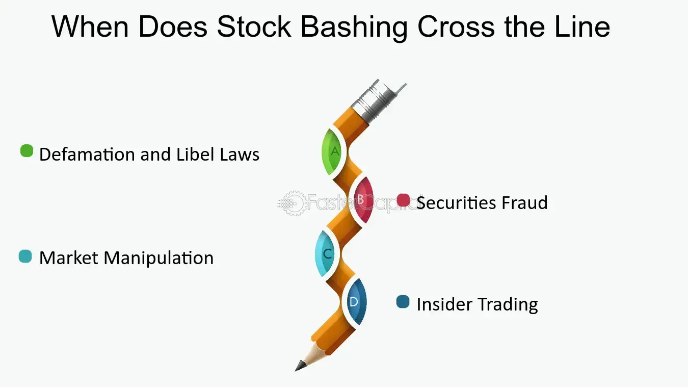

## Table of Contents

## What is stock bashing?

Stock bashing is when people spread bad things about a company's stock to make its price go down. They might say the company is doing badly or that it's not worth investing in, even if these things aren't true. People who do this might want to buy the stock at a lower price later or they might be paid to say these bad things.

This can hurt the company a lot because if enough people believe the bad things being said, they might sell their stocks, making the price drop even more. It's a problem because it can trick people into making bad choices with their money. It's important for investors to check if the information they hear is true before they decide to buy or sell stocks.

## Who typically engages in stock bashing?

Stock bashing is often done by people who want to make money from the stock market in a tricky way. These could be short sellers, who borrow stocks and sell them, hoping to buy them back later at a lower price. If they spread bad news about a company, it can make the stock price go down, which helps them make a profit when they buy the stocks back cheaper. Sometimes, people or companies that are competing with the company being bashed might also spread bad rumors to hurt their rival's stock price and make their own business look better.

Another group that might engage in stock bashing are paid promoters or bashers. These are people who get money to say good or bad things about a stock. If someone pays them to bash a stock, they will spread negative information, even if it's not true, to influence the stock's price. This can be very harmful because it can trick regular investors into selling their stocks at a loss or not buying stocks that could be good investments. It's important for investors to be careful and check the facts before making decisions based on what they hear.

## What are the motives behind stock bashing?

People who bash stocks usually want to make money in a sneaky way. One common reason is that they are short sellers. Short sellers borrow stocks and sell them, hoping to buy them back later at a lower price. If they can make the stock price go down by spreading bad news, they can buy the stocks back cheaper and make a profit. Another reason could be that they work for a company that competes with the one being bashed. By making the rival company's stock price drop, they can make their own company look better and maybe even take over more of the market.

Sometimes, people get paid to bash stocks. These are called paid promoters or bashers. Someone might pay them to say bad things about a stock, even if those things aren't true. This can trick other people into selling their stocks at a lower price or not buying them at all. It's a way for the people paying the bashers to make money by influencing the stock market. This can be really harmful because it can lead regular investors to make bad choices with their money, based on false information.

## How does stock bashing affect stock prices?

When people bash a stock, they spread bad news or rumors about a company to make its stock price go down. If enough people believe the bad things being said, they might start selling their shares. This can make the stock price drop because there are more people wanting to sell than to buy. It's like if everyone at a store suddenly decided they didn't want a certain toy anymore; the store would have to lower the price to get rid of it.

The effect on stock prices can be really big if the bashing is done well. If the bad news spreads quickly, like on social media or in the news, it can make the stock price fall even faster. This can hurt the company a lot because a lower stock price can make it harder for them to get money they need to grow or even just keep running. It's important for people to check if the bad news is true before they decide to sell their stocks, so they don't get tricked into making bad choices.

## What are common tactics used in stock bashing?

People who bash stocks often use different tricks to make the stock price go down. One common way is spreading rumors or false information about the company. They might say the company is doing badly, has big problems, or that its leaders are doing something wrong. This can make people worry and sell their stocks. Another trick is using social media and online forums to spread these bad stories quickly. If a lot of people see and believe the rumors, it can make the stock price drop even faster.

Sometimes, people who bash stocks also make up fake news stories or reports that look real. They might even create fake websites or use fake accounts to make their stories seem more believable. This can trick more people into thinking the bad news is true. Also, some people might pay others to say bad things about a stock, which can make it seem like lots of different people are worried about the company, when really it's just a few people trying to make money.

## Can stock bashing be considered illegal?

Stock bashing can be illegal if it involves spreading false information on purpose to trick people and make money. In many countries, it's against the law to lie about a company to change its stock price. This is called market manipulation, and it's a big problem because it can hurt a lot of people who invest their money honestly.

The laws about stock bashing can be different in different places, but the main idea is the same: you can't lie to make money from stocks. If someone gets caught doing this, they might have to pay big fines or even go to jail. It's important for people to know this so they can be careful and check if the information they hear about stocks is true.

## How can investors identify stock bashing?

Investors can spot stock bashing by looking out for rumors or bad news that seems too dramatic or not backed up by facts. If someone is saying really bad things about a company but can't show any proof, it might be stock bashing. Also, if the bad news is spreading really fast on social media or online forums, it's a good idea to be careful. Sometimes, people who bash stocks use fake accounts or made-up news stories to make their lies seem more real.

Another way to spot stock bashing is to check if the same bad news is being repeated by lots of different people. If it seems like everyone is suddenly saying the same bad things about a company, it could be a sign that someone is paying people to bash the stock. Investors should always do their own research and look at reports from trusted sources before deciding to sell their stocks because of bad news.

## What are the psychological impacts of stock bashing on investors?

Stock bashing can make investors feel really worried and scared. When people hear bad things about a company they've invested in, they might start to panic. They could think their money is in danger and rush to sell their stocks, even if the bad news isn't true. This fear can make them make quick decisions without thinking, which might lead to losing money.

On top of feeling scared, investors might also feel tricked or cheated if they find out the bad news was made up. This can make them lose trust in the stock market and be more careful about where they put their money in the future. It's important for investors to stay calm and check if the bad news is true before they decide what to do with their stocks.

## How can companies protect themselves from stock bashing?

Companies can protect themselves from stock bashing by being open and honest with their investors. They should share regular updates about how the company is doing, including any good or bad news. This way, if someone tries to spread false rumors, investors can compare it to the real information from the company and see that it's not true. Companies can also use social media and their websites to quickly respond to any bad rumors and explain the truth to their investors.

Another way companies can fight stock bashing is by working with the law. If they think someone is spreading lies about their stock on purpose, they can report it to the people who watch over the stock market. These people can look into it and stop anyone who is breaking the law. By doing this, companies can help keep the stock market fair and protect their investors from being tricked.

## What role do social media and online forums play in stock bashing?

Social media and online forums are big places where stock bashing happens. People can spread bad news or rumors about a company really fast on these sites. If a lot of people see and believe the bad things being said, it can make the stock price go down quickly. It's easy for someone to start a rumor on social media because they can use fake accounts or pretend to be someone else. This makes it hard for people to know if the information is true or not.

Because of how fast information spreads on social media and online forums, it can be really hard for companies to stop stock bashing. Once a bad rumor starts, it can go all over the internet in no time. Companies need to be quick to tell their side of the story and show the truth to their investors. But even then, it can be tough because some people might still believe the bad things they read online.

## How do regulatory bodies respond to stock bashing?

Regulatory bodies, like the ones that watch over the stock market, take stock bashing very seriously. They know it can hurt investors and make the market unfair. If they find out someone is spreading lies about a stock on purpose to make money, they can step in. They might start an investigation to see if the person broke any laws. If they did, the regulatory body can make them pay big fines or even send them to jail. This helps keep the stock market honest and safe for everyone.

Sometimes, it's hard for regulatory bodies to catch people who bash stocks because they can hide behind fake accounts or made-up news. But these groups still try their best to find and stop anyone who is doing this. They might work with the police or other groups to track down the people spreading false information. By doing this, they hope to protect investors and keep the stock market a fair place where people can trust the information they see.

## What are the long-term effects of stock bashing on the market?

Stock bashing can hurt the stock market in the long run. When people spread lies about a company to make its stock price go down, it can make the whole market seem less safe. Investors might start to worry that they can't trust the information they see, and this can make them less likely to invest their money. If lots of people feel this way, it can slow down the whole market because fewer people are buying and selling stocks. This can make it harder for companies to get the money they need to grow and create new jobs.

Over time, if stock bashing keeps happening, it can make the market less stable. When the stock prices go up and down a lot because of false rumors, it can scare people away from investing. This can lead to fewer people wanting to put their money in the stock market, which can make it harder for the economy to grow. Regulatory bodies try to stop stock bashing to keep the market fair and trustworthy, but it's a big challenge because it's hard to catch everyone who does it.

## References & Further Reading

[1]: Middleton, J. (2019). ["Stock Manipulation and Electronic Trading Systems."](https://dl.acm.org/doi/10.1145/3427228.3427241) Federal Trade Commission.

[2]: Budish, E., Cramton, P., & Shim, J. (2015). ["The High-Frequency Trading Arms Race: Frequent Batch Auctions as a Market Design Response."](https://academic.oup.com/qje/article/130/4/1547/1916146) The Quarterly Journal of Economics.

[3]: Biais, B., Foucault, T., & Moinas, S. (2015). ["Equilibrium Fast Trading."](https://www.sciencedirect.com/science/article/pii/S0304405X15000288) The Review of Financial Studies.

[4]: Fox, M. B., Glosten, L. R., & Rauterberg, G. V. (2019). ["Cheap-Stock Tactics to Avoid the Successor Shareholder-to-Successor Shareholder Sales."](https://repository.law.umich.edu/articles/1978/) National Bureau of Economic Research.

[5]: U.S. Securities and Exchange Commission (2010). ["Findings Regarding the Market Events of May 6, 2010 Report of the Staffs of the CFTC and SEC to the Joint Advisory Committee on Emerging Regulatory Issues."](https://www.sec.gov/news/studies/2010/marketevents-report.pdf) SEC.gov.