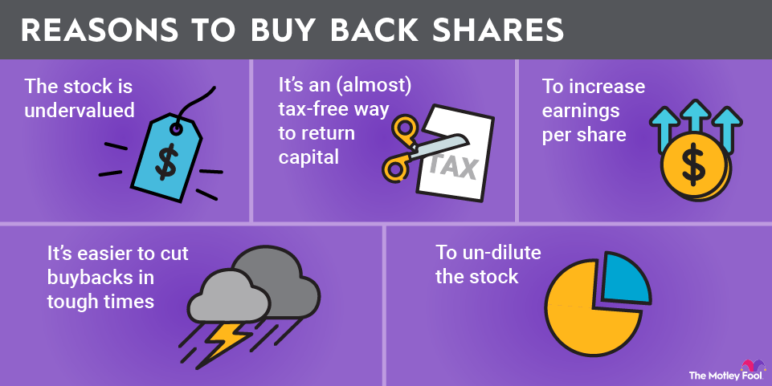

## Table of Contents

## What is a stock buyback?

A stock buyback, also known as a share repurchase, is when a company buys back its own shares from the marketplace. This means the company is spending its money to take some of its stock off the market. When a company does a buyback, it uses its cash to buy shares, often because it believes the stock is undervalued and a good investment.

Buybacks can be good for shareholders because they can increase the value of the remaining shares. When a company buys back its stock, the total number of shares goes down. This can make each share worth more because the company's earnings are now spread over fewer shares. However, buybacks can also be controversial if the company uses too much money on them instead of investing in growing the business or paying down debt.

## Why do companies engage in stock buybacks?

Companies engage in stock buybacks for a few main reasons. One big reason is that they think their stock is a good deal. If the company's leaders believe the stock price is lower than it should be, they might buy back shares because it's like getting their own company at a discount. This can be a smart way to use the company's money if they think it's the best investment they can make.

Another reason is to make the remaining shares more valuable. When a company buys back its stock, it reduces the total number of shares out there. With fewer shares, each one represents a bigger piece of the company. This can make the value of each share go up, which is good for the shareholders who keep their shares. It's like slicing a pie into fewer pieces; each piece gets bigger.

Sometimes, companies also use buybacks to show they are confident about their future. By spending money to buy back shares, they are telling investors that they believe in the company's future success. This can make investors feel more confident too, which might make the stock price go up. But, it's important for companies to balance buybacks with other needs, like investing in new projects or paying off debts.

## How does a stock buyback affect a company's share price?

When a company does a stock buyback, it can make the share price go up. This happens because the company is buying its own shares from the market, which means there are fewer shares left for people to buy. With fewer shares available, each share becomes more valuable because the company's earnings are now divided among fewer shares. It's like if you have a pizza and you take away some slices, the remaining slices are a bigger part of the pizza.

Also, when a company buys back its shares, it can send a message to investors that the company thinks its stock is a good deal. This can make investors feel more confident about the company, which might make them want to buy more shares. If more people want to buy the stock, the price can go up because of higher demand. But, it's important to remember that many things can affect a stock's price, and a buyback is just one factor.

## What are the different methods companies use to execute stock buybacks?

Companies can use different ways to buy back their shares. One common way is through open market purchases. This means the company buys its shares just like any other investor, by trading on the stock market. They might do this over time, buying a little bit here and there. This method is easy because it doesn't disrupt the market much and the company can choose when to buy based on the stock price.

Another way is through a tender offer. In a tender offer, the company tells its shareholders that it wants to buy back a certain number of shares at a specific price. Shareholders can then choose to sell their shares back to the company at that price. This method can be faster than open market purchases because it happens all at once, but it can also be more complicated and might need special approval from the board of directors.

Sometimes, companies use a Dutch auction to buy back shares. In a Dutch auction, the company sets a range of prices and asks shareholders to say how many shares they would sell at each price in that range. The company then picks the lowest price that lets them buy back the number of shares they want. This method can be good because it lets the company buy back shares at a fair price that works for both the company and the shareholders.

## How do stock buybacks impact earnings per share (EPS)?

When a company does a stock buyback, it can make the earnings per share (EPS) go up. EPS is a number that shows how much money the company made for each share of its stock. When a company buys back its shares, it is taking some of the shares off the market. This means there are fewer shares left, but the company's total earnings stay the same. So, if you divide the same amount of earnings by fewer shares, each share gets a bigger piece of the earnings. This makes the EPS go up, which can make the stock look more valuable to investors.

However, it's important to remember that just because the EPS goes up doesn't mean the company is doing better overall. If the company spends too much money on buying back shares instead of investing in its business or paying down debts, it might not be the best use of its money. So, while buybacks can make the EPS look better, it's just one part of the bigger picture of how well a company is doing.

## What are the tax implications of stock buybacks for shareholders?

When a company does a stock buyback, it can change how much tax shareholders have to pay. If you sell your shares back to the company during a buyback, you might have to pay capital gains tax. This tax depends on how much your shares went up in value since you bought them. If you made a profit, you'll pay tax on that profit. The tax rate can be different based on how long you owned the shares. If you held them for more than a year, you might pay a lower long-term capital gains tax rate. But if you held them for less than a year, you'll pay a higher short-term capital gains tax rate, which is the same as your regular income tax rate.

On the other hand, if you don't sell your shares during a buyback, you won't owe any taxes right away. But the buyback might still affect your taxes later. When a company buys back its shares, it can make the value of the remaining shares go up. If you sell those shares later at a higher price, you might have a bigger capital gain to pay taxes on. So, even if you don't sell during the buyback, it's good to think about how it might change your taxes in the future.

## How do stock buybacks influence a company's capital structure?

When a company does a stock buyback, it changes its capital structure. Capital structure is about how a company uses different kinds of money, like debt and equity, to run its business. When a company buys back its shares, it uses its cash, which is part of its equity, to take shares off the market. This means the company's equity goes down because there are fewer shares. If the company uses debt to pay for the buyback, like taking out a loan, then its debt goes up. So, a buyback can make the company have more debt compared to its equity, which is called having a higher debt-to-equity ratio.

This change in the capital structure can affect how risky the company looks to investors. If the company has more debt after a buyback, it might be seen as riskier because it has to pay back that debt. But, if the company uses its cash to buy back shares and doesn't take on more debt, it might not change the risk much. The key thing is that buybacks can make the company's financial situation more complicated, and it's important for the company to think about how it will affect its overall health and how investors see it.

## What are the regulatory requirements and limitations on stock buybacks?

There are rules that companies need to follow when they want to do a stock buyback. In the United States, the main rule comes from the Securities and Exchange Commission (SEC). They have something called Rule 10b-18, which gives companies a safe way to buy back their shares without breaking other rules. This rule says that companies can't buy back too many shares in one day, and they have to do it at certain times and in certain ways. They also have to tell everyone when they are doing a buyback so that it's all out in the open and fair.

There are also other rules that companies need to think about. For example, if a company knows something important that other people don't know, like good or bad news about the company, they can't do a buyback until everyone knows that information. This is to stop companies from using secret information to their advantage. Some countries have their own rules too, which might be different from the ones in the U.S. So, companies need to check all the rules in the places where they do business to make sure they are following the law.

## How do stock buybacks affect the overall market and economy?

When companies do stock buybacks, it can affect the whole stock market and even the economy. If a lot of companies are buying back their shares, it can make the stock market go up. This is because buybacks take shares off the market, which makes the remaining shares more valuable. When the stock market goes up, people might feel richer because their investments are worth more. This can make them spend more money, which is good for the economy. But if companies spend too much money on buybacks instead of investing in new projects or paying workers more, it might slow down the economy in the long run.

Stock buybacks can also change how money is used in the economy. When companies use their cash to buy back shares, that money isn't going into other things like building new factories or hiring more people. This can be a problem if the economy needs more investment to grow. Also, if companies borrow money to do buybacks, it can make them more risky. If something goes wrong, like a drop in the stock market, these companies might have a hard time paying back their debts. So, while buybacks can help the stock market in the short term, they need to be balanced with other ways of using money to make sure the economy stays healthy.

## What are the criticisms and controversies surrounding stock buybacks?

Some people don't like stock buybacks because they think companies are using them the wrong way. They say that instead of buying back shares, companies should be spending their money on things that help the economy grow, like building new factories or hiring more workers. Critics argue that buybacks mostly help the rich people who own a lot of stock, because it makes their shares worth more. They also say that when companies borrow money to do buybacks, it can make the company more risky if things go wrong.

Another big criticism is that buybacks can be used to make the company's numbers look better without actually improving the business. For example, a company might do a buyback to make its earnings per share go up, which can make it look like they are doing better than they really are. This can trick investors into thinking the company is healthier than it is. Some people also worry that company leaders might do buybacks just to make their own bonuses go up, because their pay is often tied to the stock price. So, there's a lot of debate about whether buybacks are good or bad for the economy and for shareholders.

## How can investors identify when a stock buyback might be beneficial or detrimental to their investment?

Investors can figure out if a stock buyback is good or bad for their investment by looking at a few things. First, they should check if the company is buying back its shares at a good price. If the stock price is low and the company thinks it's a good deal, the buyback can be a smart move. It can make the value of the remaining shares go up, which is good for investors. Also, if the company is doing well and has extra cash, using some of that cash for buybacks might be better than letting it sit around or investing it in risky projects.

But, investors need to be careful too. If a company is borrowing a lot of money to do a buyback, it might be taking on too much risk. This can be bad if the company can't pay back the debt later. Also, if the company is spending too much on buybacks and not enough on growing the business or paying its workers, it might hurt the company in the long run. Investors should look at the whole picture, including the company's financial health and its plans for the future, to decide if a buyback is really in their best interest.

## What advanced financial metrics should be considered when analyzing the impact of stock buybacks on a company's valuation?

When looking at how stock buybacks affect a company's value, investors should pay attention to some key financial numbers. One important number is the price-to-earnings (P/E) ratio. This ratio shows how much investors are willing to pay for each dollar of the company's earnings. When a company does a buyback, the earnings per share (EPS) can go up because there are fewer shares to divide the earnings by. If the P/E ratio stays the same, the stock price should go up. But, if the P/E ratio goes up too much, it might mean the stock is getting too expensive compared to its earnings.

Another thing to look at is the return on equity (ROE). This number shows how well the company is using its money to make profits. When a company buys back its shares, it's using its cash to reduce the total equity. If the buyback is done at a good price, it can make the ROE go up because the company is making the same profit with less equity. But, if the company borrows money to do the buyback, it might not be as good because the debt can make the company riskier. So, investors need to check if the buyback is really making the company's money work better or if it's just making things more complicated.

## What are the benefits and drawbacks of stock buybacks?

Stock buybacks, also known as share repurchases, present several benefits that can enhance shareholder value and impact a company's financial metrics positively. One of the primary advantages is the potential increase in earnings per share (EPS). When a company buys back its shares, it reduces the number of outstanding shares, which can lead to a higher EPS assuming net income remains constant. The formula for EPS is:

$$
\text{EPS} = \frac{\text{Net Income}}{\text{Outstanding Shares}}
$$

By reducing the denominator in this equation, a company can effectively enhance its EPS, which may be appealing to investors and can lead to an increase in the firm's stock price.

Another notable benefit of stock buybacks is the potential for tax advantages. Dividends are typically taxed as income to the shareholders, while buybacks can provide a tax-efficient way of returning capital to shareholders, as they may result in capital gains, which are often taxed at a lower rate than income. This can make buybacks a more attractive option for distributing excess cash to investors.

Moreover, stock buybacks can signal to the market that management believes the company's shares are undervalued. Such signals can bolster investor confidence and potentially lead to a boost in stock price. This perception of value can be particularly advantageous in volatile or bearish markets, where investor sentiment is crucial.

However, stock buybacks are not devoid of drawbacks. One significant concern is the potential for market manipulation. Companies may engage in buybacks to artificially inflate share prices without reflecting an actual improvement in business performance. This can mislead investors and distort the true financial health of a company.

Additionally, the resources allocated to buybacks could potentially divert funds from long-term growth initiatives. For instance, money spent on repurchasing shares might otherwise be invested in research and development, capital improvements, or expansion projects, which could offer sustained growth and competitiveness. This misallocation can hinder the long-term growth potential of a company if not strategically balanced.

Therefore, it is crucial for companies to find a balance between returning capital to shareholders through buybacks and investing in their future growth. Sustainable growth requires strategic planning, ensuring that immediate financial benefits do not overshadow long-term objectives. Understanding the inherent trade-offs in stock buybacks allows investors and companies to make informed decisions that align with long-term strategic goals.

## References & Further Reading

[1]: Lazonick, W. (2014). ["Profits Without Prosperity."](https://hbr.org/2014/09/profits-without-prosperity) Harvard Business Review.

[2]: ["Advances in Financial Machine Learning"](https://www.amazon.com/Advances-Financial-Machine-Learning-Marcos/dp/1119482089) by Marcos Lopez de Prado.

[3]: Jegadeesh, N., & Titman, S. (1993). ["Returns to Buying Winners and Selling Losers: Implications for Stock Market Efficiency."](https://www.jstor.org/stable/2328882) Journal of Finance.

[4]: ["Machine Learning for Algorithmic Trading"](https://github.com/stefan-jansen/machine-learning-for-trading) by Stefan Jansen.

[5]: ["The New Buyback Economy: How Stock Buybacks Can Shape the Future of Your Investments"](https://www.forbes.com/sites/dereksaul/2024/05/09/what-are-stock-buybacks-the-apple-led-strategy-is-expected-to-swell-to-1-trillion-by-2025/) by Robert Ayres and Michael Olenick.

[6]: Chan, E. P. (2009). ["Quantitative Trading: How to Build Your Own Algorithmic Trading Business."](https://github.com/ftvision/quant_trading_echan_book) John Wiley & Sons.

[7]: Fishman, M. J., & Hagerty, K. M. (1996). ["The Mandatory Disclosure of Trades and Market Liquidity."](https://www.semanticscholar.org/paper/The-Mandatory-Disclosure-of-Trades-and-Market-Fishman-Hagerty/90f796dd302a96f95a8d3f8ef86d82893abe7509) Review of Financial Studies.