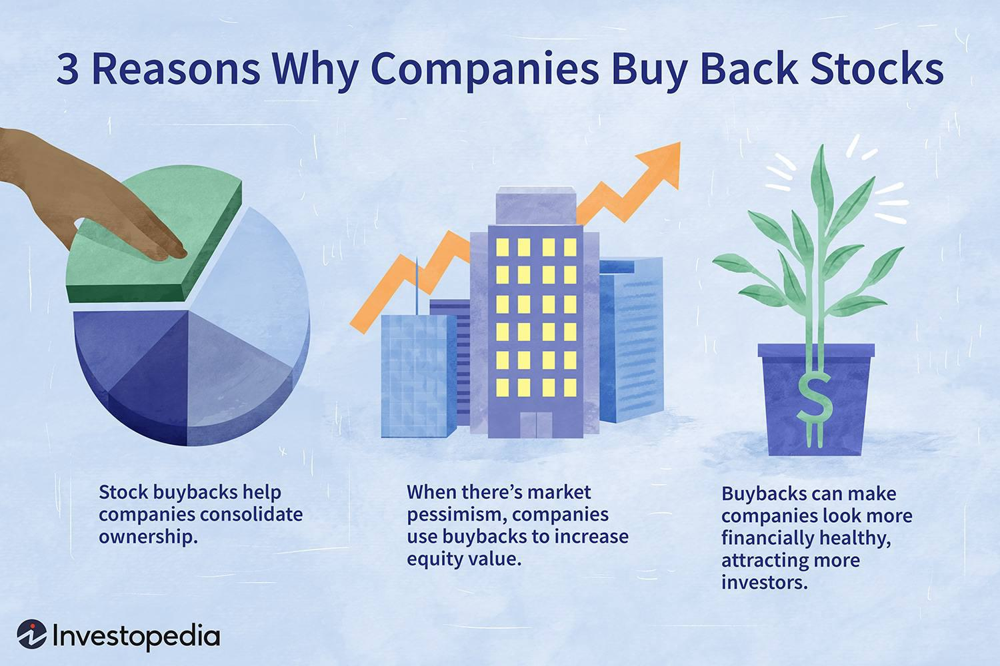

In investing, adopting innovative strategies is crucial for maximizing returns and managing risks. Two of the most significant strategies that have transformed modern financial markets are stock buybacks and algorithmic trading.

Stock buybacks, also known as share repurchases, involve a company purchasing its own shares from the market. This move often reduces the number of outstanding shares, which can potentially increase the value of remaining shares and benefit existing shareholders. When companies engage in buybacks, it may signal to investors that the management believes the company is undervalued. This can result in increased earnings per share (EPS) and offer tax benefits compared to dividends. However, buybacks should be conducted with a strong understanding of the company's financial health to avoid perceptions of market manipulation.



Algorithmic trading leverages advanced algorithms to execute trades with high speed and precision, becoming increasingly popular with both institutional and retail investors. This approach eliminates human error and emotional biases present in traditional trading methods, allowing for a more systematic strategy. Algorithms can analyze vast amounts of data in real time to execute trades based on predefined criteria, thus optimizing trading efficiency.

Understanding both stock buybacks and algorithmic trading, as well as their interplay, provides investors with insights vital for optimizing their portfolios. This combination of strategies can enhance investment performance by strategically timing stock buybacks and executing trades efficiently. The subsequent sections will provide a comprehensive overview of these strategies, their mechanisms, benefits, and challenges, equipping investors with the knowledge needed to effectively incorporate them into their investment practices.

## Table of Contents

## Understanding Stock Buybacks

Stock buybacks, also known as share repurchases, involve a company purchasing its own outstanding shares from the market. This tactic can lead to a reduction in the number of shares available to the public. By reducing the overall number of outstanding shares, a buyback can increase the value of the remaining shares. When a company reduces its share count, each remaining share represents a larger ownership stake in the company, potentially increasing the earnings per share (EPS) as profits are distributed over fewer shares.

Mathematically, the effect of a buyback on EPS can be illustrated as follows:
$$

\text{EPS} = \frac{\text{Net Income}}{\text{Outstanding Shares}}
$$
After a share repurchase, assuming net income remains constant, a decrease in the denominator (i.e., the number of outstanding shares) results in a higher EPS.

One of the primary motivations for stock buybacks is the potential tax efficiency compared to dividends. While dividends are typically taxed at the time of distribution, buybacks can be more tax-advantageous for shareholders who might defer capital gains taxes until they sell their appreciated shares at a future date.

Additionally, stock buybacks are often interpreted as a sign of corporate confidence. They may signal that management believes the company is undervalued and that reinvesting money into its shares is the best use of capital, rather than investing in new projects or expanding operations. This confidence can resonate positively with investors, potentially boosting the company's stock price in anticipation of future growth.

Despite their advantages, stock buybacks also [carry](/wiki/carry-trading) potential downsides. They can raise concerns about market manipulation, especially if executed when the company's financial performance is not aligned with such activities. Inappropriately timed buybacks might be used to artificially inflate stock prices, benefiting insiders rather than improving the firm's long-term value. This can divert funds away from essential investments in research and development or expansion, thereby stunting company growth.

Thus, while stock buybacks can contribute positively to a company's financial strategy, they necessitate careful consideration and alignment with the company's overall financial health and strategic goals to avoid adverse outcomes and ensure sustainable growth.

## Algorithmic Trading: A Modern Approach

Algorithmic trading has become an integral component of contemporary financial markets, leveraging advanced computational methods to execute trades rapidly and with high precision. This approach uses sophisticated algorithms to analyze market data and execute orders based on predetermined criteria, effectively minimizing human error and emotional influence in trading decisions.

Speed and precision are among the most significant advantages of [algorithmic trading](/wiki/algorithmic-trading). By employing algorithms, traders can exploit fleeting market opportunities that might be missed by manual trading. Automated systems can evaluate multiple indicators and execute trades within milliseconds, ensuring that decisions are made and acted upon instantaneously.

Several strategies are prevalent in algorithmic trading, each catering to different types of market conditions and trader objectives. Momentum trading, for instance, seeks to capitalize on trends in market prices, operating on the assumption that securities that have shown an upward trend will continue to rise. Statistical [arbitrage](/wiki/arbitrage) involves a more sophisticated approach, using statistical methods to identify price inefficiencies between related financial instruments. Market making, another common strategy, involves providing [liquidity](/wiki/liquidity-risk-premium) to the markets by simultaneously placing buy and sell orders, profiting from the bid-ask spread.

Implementing algorithmic trading requires a deep understanding of market structures and dynamics, along with expertise in data analysis. Proficiency in programming languages is also crucial, as developing and maintaining the trading algorithms involves coding complex models. Python is widely favored in the financial industry due to its extensive libraries and frameworks that simplify handling large datasets and modeling financial instruments.

An example of a simple [momentum](/wiki/momentum) trading strategy in Python can illustrate the basic process:

```python
import pandas as pd
import numpy as np

def calculate_momentum(prices, window=10):
    return prices.pct_change(periods=window)

# Load market data (e.g., stock prices)
prices = pd.read_csv("historical_prices.csv", index_col="Date", parse_dates=True)

# Calculate momentum
momentum = calculate_momentum(prices['Close'], window=10)

# Generate buy/sell signals
signal = np.where(momentum > 0.01, 'Buy', np.where(momentum < -0.01, 'Sell', 'Hold'))

print(signal)
```

In this example, momentum is calculated as the percentage change over a rolling window of 10 days. The strategy generates buy or sell signals if the momentum exceeds a certain threshold, thus automating trading decisions based on observed price trends.

The incorporation of algorithmic trading into investment strategies demands continuous learning, as technological advancements and market evolutions persistently alter the trading landscape. Comprehensive knowledge in financial markets, coupled with coding expertise, can significantly enhance the efficacy of algorithmic trading systems.

## Benefits and Drawbacks of Stock Buybacks

Stock buybacks, also known as share repurchases, present several benefits that can enhance shareholder value and impact a company's financial metrics positively. One of the primary advantages is the potential increase in earnings per share (EPS). When a company buys back its shares, it reduces the number of outstanding shares, which can lead to a higher EPS assuming net income remains constant. The formula for EPS is:

$$
\text{EPS} = \frac{\text{Net Income}}{\text{Outstanding Shares}}
$$

By reducing the denominator in this equation, a company can effectively enhance its EPS, which may be appealing to investors and can lead to an increase in the firm's stock price.

Another notable benefit of stock buybacks is the potential for tax advantages. Dividends are typically taxed as income to the shareholders, while buybacks can provide a tax-efficient way of returning capital to shareholders, as they may result in capital gains, which are often taxed at a lower rate than income. This can make buybacks a more attractive option for distributing excess cash to investors.

Moreover, stock buybacks can signal to the market that management believes the company's shares are undervalued. Such signals can bolster investor confidence and potentially lead to a boost in stock price. This perception of value can be particularly advantageous in volatile or bearish markets, where investor sentiment is crucial.

However, stock buybacks are not devoid of drawbacks. One significant concern is the potential for market manipulation. Companies may engage in buybacks to artificially inflate share prices without reflecting an actual improvement in business performance. This can mislead investors and distort the true financial health of a company.

Additionally, the resources allocated to buybacks could potentially divert funds from long-term growth initiatives. For instance, money spent on repurchasing shares might otherwise be invested in research and development, capital improvements, or expansion projects, which could offer sustained growth and competitiveness. This misallocation can hinder the long-term growth potential of a company if not strategically balanced.

Therefore, it is crucial for companies to find a balance between returning capital to shareholders through buybacks and investing in their future growth. Sustainable growth requires strategic planning, ensuring that immediate financial benefits do not overshadow long-term objectives. Understanding the inherent trade-offs in stock buybacks allows investors and companies to make informed decisions that align with long-term strategic goals.

## The Role of Algorithmic Trading in Investment Strategies

Algorithmic trading plays an influential role in modern investment strategies by efficiently identifying and exploiting market inefficiencies. Utilizing computer algorithms to analyze data and execute trades offers a significant advantage in terms of speed and precision compared to traditional trading methods. The primary advantage lies in its ability to process and respond to market movements in fractions of a second, thereby enabling traders to capitalize on fleeting opportunities that would otherwise remain untapped.

Cost efficiency is another paramount benefit of algorithmic trading. By automating the trading process, it significantly reduces transaction costs and eliminates the need for human intervention. This automation leads to lower fees and tighter spreads, benefiting traders by ensuring the consistent application of their strategies without the detrimental impact of emotional biases. Decision-making is thus driven solely by data and well-defined parameters.

Despite its advantages, algorithmic trading presents challenges, particularly in managing risks associated with market [volatility](/wiki/volatility-trading-strategies) and technical failures. Algorithms operate under the assumption that market conditions will remain consistent, yet markets can be unpredictable and subject to sudden changes. Therefore, traders must implement robust risk management strategies to mitigate potential losses. Furthermore, technical failures, such as system malfunctions and connectivity issues, can result in significant financial losses if not properly managed. Redundancy systems and regular system audits are essential to ensure reliability.

Incorporating algorithmic trading into investment strategies necessitates a thorough understanding of market mechanisms, a strong foundation in data analysis, and proficiency in programming languages such as Python. This skill set enables traders to customize and refine algorithms, ensuring adaptability to ever-evolving market conditions.

In summary, while algorithmic trading offers substantial benefits by enhancing execution speed, reducing costs, and minimizing biases, investors must navigate its inherent risks through strategic planning and technical oversight. This dual approach ensures the effective integration of algorithmic trading into a balanced and optimized investment strategy.

## Synergizing Buybacks and Algo Trading

Combining stock buybacks with algorithmic trading provides investors with a powerful strategy to optimize returns through precise timing and execution. Stock buybacks, or share repurchases, inherently require strategic timing to be effective; this is where algorithmic trading can play a crucial role. By employing sophisticated algorithms, investors can better identify favorable market conditions for buybacks. These conditions may include low share prices indicating potential undervaluation, which algorithms can detect by analyzing vast datasets and market indicators swiftly.

For instance, [machine learning](/wiki/machine-learning) models can be employed to predict optimal buyback windows by considering factors such as historical price trends, [volume](/wiki/volume-trading-strategy) data, and macroeconomic indicators. A typical algorithm might scan large volumes of trading data, using techniques like moving averages or Bollinger Bands, to suggest opportune moments for executing buybacks. Python's libraries, such as pandas and scikit-learn, provide robust tools for building such predictive models:

```python
import pandas as pd
from sklearn.model_selection import train_test_split
from sklearn.ensemble import RandomForestClassifier

# Example stock data
data = pd.read_csv("stock_data.csv")
X = data[['price', 'volume', 'indicator1', 'indicator2']]
y = data['buyback_decision']

# Splitting the data
X_train, X_test, y_train, y_test = train_test_split(X, y, test_size=0.2, random_state=42)

# Training the model
model = RandomForestClassifier(n_estimators=100, random_state=42)
model.fit(X_train, y_train)

# Predicting buyback opportunities
predictions = model.predict(X_test)
```

Moreover, algorithmic trading can assist in executing buybacks at opportune moments, thus ensuring that they contribute effectively to enhancing share value. This precision is vital as it minimizes market impact and optimizes the cost-efficiency of the buyback process.

However, realizing the benefits of combining stock buybacks and algorithmic trading necessitates a thorough understanding of market dynamics and regulatory frameworks. Regulations vary across markets and jurisdictions, impacting how buybacks can be conducted. For example, certain buyback regulations necessitate transparency to avoid market manipulation concerns, requiring algorithms to be programmed to adhere to such constraints. 

To successfully synergize these strategies, continuous monitoring and adjustment are necessary. Investors should remain vigilant of market changes and technological advancements, recalibrating algorithms to align with evolving market conditions and policies. This adaptability not only ensures compliance but also maximizes the potential for return enhancement through this innovative strategy integration.

## Conclusion

Integrating stock buybacks and algorithmic trading into an investment strategy offers significant potential for enhancing performance. Stock buybacks can lead to increased earnings per share (EPS) and potentially boost shareholder value, while algorithmic trading provides enhanced speed and precision, enabling rapid response to market changes. Together, they offer a robust framework for optimizing portfolio returns.

Investors must remain informed and adaptable to evolving market conditions and technologies. The financial environment is constantly changing, driven by regulatory shifts, technological advancements, and global economic trends. Staying updated on these changes allows investors to make informed decisions and adjust their strategies accordingly.

Continual education and strategic optimization are necessary for navigating the complexities of modern financial landscapes. As new trading technologies and methodologies emerge, investors should seek to understand and integrate these innovations into their existing frameworks. Online courses, seminars, and financial literature offer valuable resources for gaining insights into contemporary investment practices.

Incorporating mathematical models and algorithms is increasingly essential in refining investment strategies. For instance, the use of Python libraries like NumPy and pandas for data analysis can improve the robustness of algorithmic trading strategies. An example in Python to analyze historical price data might look as follows:

```python
import pandas as pd
import numpy as np

# Load the dataset
data = pd.read_csv('historical_prices.csv')
# Calculate moving averages
data['SMA_50'] = data['Close'].rolling(window=50).mean()
data['SMA_200'] = data['Close'].rolling(window=200).mean()

# Define a simple strategy
data['Signal'] = 0
data.loc[data['SMA_50'] > data['SMA_200'], 'Signal'] = 1  # Buy signal
data.loc[data['SMA_50'] < data['SMA_200'], 'Signal'] = -1  # Sell signal

# Evaluate strategy
data['Strategy_Returns'] = data['Signal'].shift(1) * data['Returns']
strategy_performance = data['Strategy_Returns'].cumsum().apply(np.exp)

print(strategy_performance)
```

This script illustrates a basic moving average crossover strategy, a common algorithmic trading approach, to signal potential buy or sell opportunities. Regularly refining such algorithms in response to back-testing results or real-world performance can significantly improve their effectiveness.

Investors who embrace these strategies are better equipped to navigate the intricacies of modern markets, making timely and strategic decisions that capitalize on market opportunities. This proactive and informed approach is essential for achieving long-term financial success.

## References & Further Reading

[1]: Lazonick, W. (2014). ["Profits Without Prosperity."](https://hbr.org/2014/09/profits-without-prosperity) Harvard Business Review.

[2]: ["Advances in Financial Machine Learning"](https://www.amazon.com/Advances-Financial-Machine-Learning-Marcos/dp/1119482089) by Marcos Lopez de Prado.

[3]: Jegadeesh, N., & Titman, S. (1993). ["Returns to Buying Winners and Selling Losers: Implications for Stock Market Efficiency."](https://www.jstor.org/stable/2328882) Journal of Finance.

[4]: ["Machine Learning for Algorithmic Trading"](https://github.com/stefan-jansen/machine-learning-for-trading) by Stefan Jansen.

[5]: ["The New Buyback Economy: How Stock Buybacks Can Shape the Future of Your Investments"](https://www.forbes.com/sites/dereksaul/2024/05/09/what-are-stock-buybacks-the-apple-led-strategy-is-expected-to-swell-to-1-trillion-by-2025/) by Robert Ayres and Michael Olenick.

[6]: Chan, E. P. (2009). ["Quantitative Trading: How to Build Your Own Algorithmic Trading Business."](https://github.com/ftvision/quant_trading_echan_book) John Wiley & Sons.

[7]: Fishman, M. J., & Hagerty, K. M. (1996). ["The Mandatory Disclosure of Trades and Market Liquidity."](https://www.semanticscholar.org/paper/The-Mandatory-Disclosure-of-Trades-and-Market-Fishman-Hagerty/90f796dd302a96f95a8d3f8ef86d82893abe7509) Review of Financial Studies.