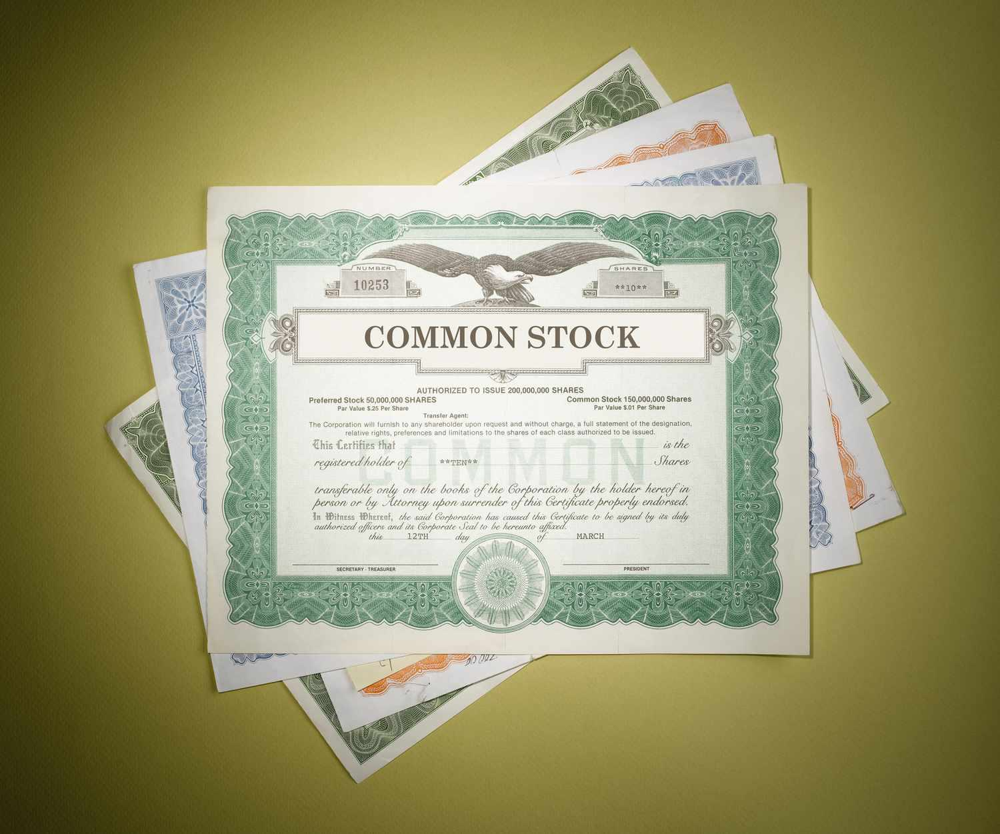

In the ever-evolving world of finance, understanding the transformation of investment tools and strategies is crucial for both established investors and newcomers in the financial markets. Historically, stock certificates served as tangible proof of ownership in companies, symbolizing an investor's stake and rights within the enterprise. These certificates featured essential information including the shareholder’s name, the number of shares owned, and the date of issuance. Over time, technological advancements have transitioned these physical documents into electronic records, significantly streamlining the process of ownership transfer and record-keeping in the stock market. This shift not only increased efficiency but also transformed how investors interact with their portfolios.

Parallel to this evolution in stock ownership documentation, the rise of algorithmic trading introduced a new paradigm in the execution of trades. Algorithmic trading, often referred to as algo trading, employs sophisticated computer algorithms to automate and optimize the buying and selling of securities. This technology-driven approach allows traders to process large volumes of data and execute transactions at unprecedented speeds, minimizing costs and maximizing efficiency. However, the widespread adoption of algorithmic trading also presents unique challenges and risks, including market volatility and the potential for systemic failures during times of financial stress.



By examining these fundamental shifts within the financial landscape—from the digitization of stock certificates to the proliferation of algorithmic trading—investors can develop a more nuanced understanding of investment evaluation and risk management. These insights are vital for navigating the complexities of modern financial markets, where the interplay between traditional investment practices and cutting-edge technology defines new strategies for success.

## Table of Contents

## Understanding Stock Certificates

Stock certificates historically served as tangible evidence of a shareholder's ownership in a corporation. These documents bore essential details, including the number of shares owned, the date of issuance, and the shareholder's name. They effectively functioned as a legal proof of investment and ownership, providing a traceable record of an individual's stake in a company. The use of physical stock certificates was a standard practice before the advent of electronic trading and digital record-keeping systems.

The transition from paper to electronic formats marked a significant evolution in securities trading. Technology streamlined ownership recording processes, removing the need for physical certificates. Electronic registration improves efficiency by allowing for faster trades, easier transferability of shares, and better security against loss or theft. One prime example of this is the Depository Trust Company (DTC) in the United States, which holds the vast majority of stock in electronic form.

Despite their apparent obsolescence, stock certificates offer an insight into how investment practices have developed over time. Their use reflects a period when the physical handling of securities was crucial to the operation of financial markets, emphasizing the challenges of managing and transferring physical assets across various locations. Additionally, these certificates were often designed for security and aesthetic purposes, sometimes with intricate artwork, making them collectibles beyond their financial value in the context of historical financial memorabilia.

Understanding the past role of stock certificates not only highlights the impact of technological advances in the financial sector but also underscores the ongoing evolution towards more efficient methods of stock ownership and trading. As the industry shifts towards more sophisticated and faster electronic systems, the legacy of stock certificates continues to remind investors of the foundational changes that have shaped the current investment landscape.

## Evaluating the Financial Worth of Stock Certificates

Stock certificates have historically served as evidence of ownership stakes in a corporation, with their worth intricately linked to the performance and valuation of the issuing company. A strong understanding of how this worth is evaluated is essential for any investor. In contemporary finance, two pivotal methods employed to assess the financial value of stocks are the Price-to-Earnings (P/E) ratio and Discounted Cash Flow (DCF) analysis.

The P/E ratio is a critical metric in stock evaluation, indicating the market value of a stock relative to the company's earnings. It is calculated using the formula:

$$
\text{P/E Ratio} = \frac{\text{Market Price per Share}}{\text{Earnings per Share (EPS)}}
$$

A higher P/E ratio may suggest that a stock is overvalued, or that investors are expecting high growth rates in the future. Conversely, a low P/E ratio might indicate undervaluation or challenges faced by the company.

Discounted Cash Flow (DCF) analysis is another robust method which calculates the present value of expected future cash flows. The principle behind DCF is that a dollar today is worth more than a dollar in the future due to its potential [earning](/wiki/earning-announcement) capacity. The DCF formula is expressed as:

$$
\text{DCF} = \frac{CF_1}{(1 + r)^1} + \frac{CF_2}{(1 + r)^2} + \cdots + \frac{CF_n}{(1 + r)^n}
$$

where $CF$ is the cash flow for each period and $r$ is the discount rate. This method provides a comprehensive view of a stock’s intrinsic value and helps investors make informed purchasing decisions.

Beyond these quantitative metrics, qualitative factors play a crucial role in evaluating the financial worth of stock certificates. Assessments of management quality, corporate governance, and market competition are fundamental. Skilled management teams can innovate and adapt to market changes, potentially elevating a company's performance and stock value.

Thus, a comprehensive appraisal of a stock's financial worth integrates both quantitative measures like P/E ratio and DCF, and qualitative evaluations such as leadership effectiveness and market position. By employing a balanced approach, investors can gain deeper insights into a company's true financial health and potential, aiding in more accurate investment decision-making.

## The Rise of Algorithmic Trading

Algorithmic trading, commonly referred to as 'algo trading,' represents a significant evolution in the way financial transactions are executed. It leverages computer algorithms to conduct trades automatically, based on pre-defined parameters such as timing, price, or even complex mathematical models. This mechanized approach allows for the processing of large volumes of data efficiently and the execution of trades at speeds unattainable by human traders, thereby reducing transaction costs and enhancing the optimization of trading strategies.

At its core, [algorithmic trading](/wiki/algorithmic-trading) eliminates human emotion from trading decisions, which can often lead to errors or hesitations. Algorithms operate on explicitly programmed rules, enabling systematic trading that follows a stringent methodology without divergence due to human sentiments like fear or greed. For instance, a basic algorithm might stipulate purchasing stocks when the 50-day moving average surpasses the 200-day moving average, a technical indicator of potential upward trends.

Despite its formidable advantages, algorithmic trading is not without its challenges. One primary concern is market [volatility](/wiki/volatility-trading-strategies). Algorithms, executing trades in fractions of a second, can lead to rapid and substantial market movements, especially when multiple algorithms respond similarly to market signals. This was notably observed during events such as the "Flash Crash" of May 6, 2010, when the U.S. stock market experienced a sudden and severe decline, exacerbated by high-frequency trading and rapidly executed algorithms.

Moreover, algorithmic trading introduces enhanced risks during systemic failures. The interconnectivity of algorithms across various trading platforms means that a glitch or error could propagate quickly through the market, potentially leading to widespread impacts. Systems must be robustly designed and tested under various scenarios to mitigate these risks. Furthermore, regulatory oversight is crucial to prevent unethical trading strategies, such as spoofing, where traders place deceptive orders to manipulate market prices without intending to execute them.

As technology continues to advance, algorithmic trading systems are becoming increasingly sophisticated, incorporating [machine learning](/wiki/machine-learning) and [artificial intelligence](/wiki/ai-artificial-intelligence) to predict market trends and adapt to new information in real-time. These systems learn from historical data and adjust trading strategies dynamically, providing a competitive edge in rapidly changing market conditions.

In summary, algorithmic trading has transformed financial markets by introducing efficiency and speed. However, it also requires careful management of associated risks to prevent potential market disruptions. The role of regulatory bodies and continuous technological enhancements will be critical in shaping the future impact of algorithmic trading on global financial landscapes.

## Impact of Algo Trading on Market Dynamics

Algorithmic trading has become a transformative force in modern financial markets, primarily due to its rapid execution capabilities and data-driven strategies. These high-frequency systems utilize algorithms to assess vast datasets, making it possible to execute trades within milliseconds. Such speed and precision significantly impact market [liquidity](/wiki/liquidity-risk-premium), often enhancing it by providing continuous quotes and narrowing bid-ask spreads. Increased liquidity, in turn, reduces trading costs and facilitates the efficient allocation of resources across markets.

Despite these advantages, algorithmic trading can also contribute to market volatility. During periods of market stress, such as financial crises or unexpected economic announcements, algorithms may react to the same signals simultaneously, amplifying price movements. This synchronized behavior can lead to phenomena such as "flash crashes," where markets experience rapid, temporary price declines. For instance, the Flash Crash of May 6, 2010, saw the Dow Jones Industrial Average plunge nearly 1,000 points within minutes before recovering just as quickly.

The impact of algorithmic trading on market stability also includes the potential for systemic risk. Algorithmic traders often rely on complex models that assume stable market conditions. When these conditions do not hold, algorithms may act unpredictably, magnifying market fluctuations. Moreover, the interconnectedness of financial markets means that issues in one domain can quickly propagate through others, disrupting broader market dynamics.

However, algorithmic trading's influence is not uniformly negative. The integration of machine learning and artificial intelligence into trading strategies has improved market efficiency by enabling predictions about price movements based on historical data patterns. These advances help in absorbing shocks more effectively, as automated systems can adjust to new information faster than traditional human-led trading methods.

The interaction between algorithmic strategies and traditional market forces continues to shape the investment landscape. While algorithms contribute to both efficiency and volatility, they also create opportunities for artificial intelligence-driven risk management techniques and hybrid strategies, combining human insight with machine precision. Future market dynamics will likely hinge on how well these elements are integrated to harness the benefits of technological advancements while mitigating associated risks.

## Strategies for Successful Investment Evaluation

Successful investment evaluation necessitates a comprehensive approach that combines traditional financial analysis with cutting-edge algorithmic tools. This synergy enables investors to generate more accurate market assessments and make informed decisions, overcoming the limitations of relying solely on either approach.

Traditional analysis techniques, such as [fundamental analysis](/wiki/fundamental-analysis), provide a robust framework for evaluating a company's intrinsic value. These methods often involve examining financial statements, assessing economic conditions, and evaluating qualitative aspects like management quality. A core aspect of traditional analysis is the Price-to-Earnings (P/E) ratio, which helps in comparing the relative value of companies. Despite its utility, traditional analysis might not fully capture short-term market dynamics or operational risks effectively addressed by algorithmic strategies.

Algorithmic inputs leverage data-driven insights, offering high-speed processing of extensive datasets for real-time decision-making. Algorithms can analyze market trends and execute trades based on pre-defined conditions, enhancing an investor's ability to respond promptly to market shifts. For instance, moving average convergence divergence (MACD) is a popular algorithmic tool used to detect changing [momentum](/wiki/momentum) in stock prices, providing timely buy and sell signals.

The integration of technical analysis with algorithmic insights enriches an investor’s toolkit. Technical analysis, focusing on price movements and patterns, dovetails with algorithms that detect and respond to these changes efficiently. For example, a combination of technical indicators like the Relative Strength Index (RSI) and stochastic oscillators can be programmed into algorithms to trigger trading signals, thereby automating responses that might be missed if assessed manually.

Dynamic investment strategies further enhance evaluation by flexibly adapting to market fluctuations, leveraging machine learning models to refine predictions continually. Such strategies can be augmented with human intuition, allowing for contextual and situational adjustments. A [reinforcement learning](/wiki/reinforcement-learning) approach could iteratively improve trading strategies by learning from successful and failed trades over time. In Python, this might involve using libraries like TensorFlow or PyTorch to implement these models:

```python
import tensorflow as tf
from tensorflow.keras.models import Sequential
from tensorflow.keras.layers import Dense

# Sample model for reinforcement learning in trading
model = Sequential([
    Dense(units=64, activation='relu', input_dim=state_size),
    Dense(units=32, activation='relu'),
    Dense(units=action_size, activation='linear')
])

model.compile(optimizer='adam', loss='mse')
```

These models analyze historical data to predict future trends, providing investors with a strategic edge. By simulating various market scenarios, they can adapt strategies to reduce potential losses and capitalize on opportunities.

In conclusion, incorporating both traditional financial analysis and algorithmic strategies allows for a more nuanced and flexible investment evaluation process. By balancing these approaches, investors can make decisions that are both strategic and adaptable to real-time market conditions, effectively managing risks and maximizing investment potential.

## Conclusion

The financial landscape is continually shaped by historical practices and modern technological advancements. Stock certificates, once the tangible validation of ownership and investment, illustrate the foundational role such documents played in the architecture of traditional markets. Understanding their evolution reveals the intricate frameworks that underlie current investment mechanisms. Even in a world dominated by digital records, the legacy of these certificates provides crucial insights into the lineage of shareholder engagement and corporate accountability.

Equally transformative is the rise of algorithmic trading, a breakthrough that has redefined trading efficiency and market dynamics. The ability of algorithms to process enormous datasets with speed and precision offers a significant advantage but also necessitates a strategic balance. The rapid execution of trades optimizes liquidity and market efficiency; however, the inherent risks and potential for increased volatility during market stress highlight the need for comprehensive risk management. Investors and financial institutions must harmonize these advancements with traditional analytical techniques to navigate these complexities effectively.

Comprehensive investment evaluation today necessitates this fusion of old and new methodologies. Traditional techniques, such as fundamental and technical analysis, remain critical in providing a solid foundation for investment decisions. Meanwhile, cutting-edge technology enhances the decision-making process with data-driven insights and predictive modeling. Collaborative strategies that integrate both approaches empower investors to respond nimbly to changing market conditions, optimize performance, and manage risk sustainably.

In summary, embracing both the historical context and modern innovations allows investors to better understand market dynamics and make informed decisions. By synthesizing conventional wisdom with algorithmic precision, they position themselves advantageously within the fluctuating financial ecosystem, maximizing potential gains while mitigating risks. This integrated approach not only capitalizes on technological progress but also ensures vigilant adaptation to evolving market landscapes.

## References & Further Reading

Bergstra, J., Bardenet, R., Bengio, Y., & Kégl, B. discuss algorithms for hyper-parameter optimization in their work, which is pivotal for refining the efficiency and accuracy of algorithmic trading models. Understanding these algorithms enhances the ability to optimize trading strategies by fine-tuning the parameters that govern trading decisions.

'Advances in Financial Machine Learning' by Marcos Lopez de Prado offers a comprehensive overview of how machine learning techniques are transforming financial markets. The book emphasizes the application of data science methods to develop innovative trading strategies, which are essential for adapting to the complex and evolving nature of financial markets.

David Aronson's 'Evidence-Based Technical Analysis: Applying the Scientific Method and Statistical Inference to Trading Signals' challenges traditional technical analysis by advocating for a more rigorous, scientific approach. This work aims to improve the reliability of trading signals through statistical testing and evidence-based methodologies, providing traders with a more robust framework for evaluating market opportunities.

'Machine Learning for Algorithmic Trading' by Stefan Jansen provides practical insights into leveraging machine learning techniques in trading strategies. The book covers a wide range of topics, from data processing and feature selection to implementing ML models for predictive analytics. This resource is invaluable for traders seeking to integrate sophisticated machine learning tools into their investment processes.

Ernest P. Chan's 'Quantitative Trading: How to Build Your Own Algorithmic Trading Business' serves as a practical guide for aspiring quantitative traders. It covers various aspects of setting up and managing an algorithmic trading venture, from strategy development to risk management and performance evaluation. Chan's work is instrumental for those looking to build or refine a [quantitative trading](/wiki/quantitative-trading) business using advanced computational techniques.