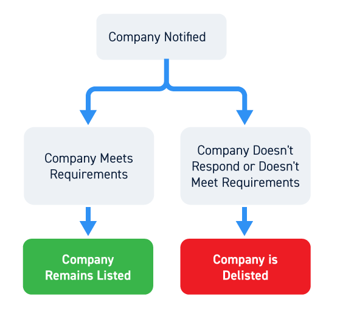

## Table of Contents

## What is stock delisting?

Stock delisting is when a company's shares are removed from a stock exchange. This means the company's stock can no longer be traded on that exchange. There are many reasons why a company might be delisted. It could be because the company did not follow the rules of the exchange, or because it is not doing well financially. Sometimes, a company might choose to delist its stock on purpose, maybe because it wants to go private or because it thinks it will be better off not being on the exchange.

When a stock is delisted, it can be hard for investors. They might find it difficult to sell their shares because there are fewer places to trade them. The value of the shares might go down a lot, too. But, delisting doesn't always mean the company is in trouble. Some companies delist to save money or to have more control over their business. It's important for investors to understand why a company is being delisted and what it might mean for their investment.

## Why do companies get delisted from stock exchanges?

Companies get delisted from stock exchanges for many reasons. One big reason is if they don't follow the rules of the exchange. These rules can be about how much money the company has, how it tells people about its business, or how it runs its meetings. If a company breaks these rules, the exchange might decide to kick it off. Another reason is if the company is not doing well financially. If its stock price stays too low for a long time, or if it can't pay its bills, the exchange might delist it.

Sometimes, a company might choose to delist itself on purpose. This can happen if the company wants to go private, which means it doesn't want its shares to be traded anymore. Going private can help the company save money on the costs of being on the exchange and give its owners more control over the business. Other times, a company might delist because it thinks it will do better if it is not on the exchange. This can be a good move if the company believes it will be more successful without the pressure and rules of the stock exchange.

In summary, delisting can happen because a company breaks the rules, isn't doing well financially, or decides it's better off not being on the exchange. Each situation is different, and it's important for investors to understand why a company is being delisted and what it might mean for their investment.

## What are the common reasons for voluntary delisting?

Companies sometimes choose to delist their stocks on purpose. One common reason is to go private. When a company goes private, it means its shares are no longer traded on a public stock exchange. This can save the company a lot of money because they don't have to pay fees to the exchange or follow all the rules that public companies have to follow. Going private can also give the owners more control over the business because they don't have to answer to public shareholders anymore.

Another reason for voluntary delisting is to reduce costs and focus on long-term goals. Being on a stock exchange can be expensive and time-consuming. Companies have to spend a lot of time and money on reports, meetings, and other things that public companies need to do. By delisting, a company can save money and spend more time on growing the business. Sometimes, a company might think it will do better without the pressure of meeting the short-term goals that public shareholders often want.

## How does involuntary delisting occur?

Involuntary delisting happens when a stock exchange decides to remove a company's shares from trading on its platform. This usually happens because the company did not follow the rules of the exchange. These rules can be about how much money the company has, how it tells people about its business, or how it runs its meetings. If a company breaks these rules, the exchange might warn them first. If the company doesn't fix the problem, the exchange can decide to delist the company's stock.

Another reason for involuntary delisting is if the company is not doing well financially. If the stock price stays too low for a long time, or if the company can't pay its bills, the exchange might decide to delist it. This is because the exchange wants to make sure that the companies listed on it are strong and trustworthy. When a company is delisted because it's not doing well, it can be a big problem for investors because the value of their shares might go down a lot, and it can be hard to sell them.

## What is the process of delisting a stock?

The process of delisting a stock starts with a decision. If a company wants to delist voluntarily, it usually tells the stock exchange first. They have to follow certain steps, like telling their shareholders and getting their okay. This can take a few months. The company might also need to buy back the shares from the shareholders who want to sell. Once everything is done, the stock exchange will remove the company's stock from its list, and the shares won't be traded there anymore.

If a company is being delisted involuntarily, the stock exchange usually warns the company first. They tell the company what rules it broke or why it's not doing well enough to stay listed. The company gets a chance to fix the problem. If they can't fix it in time, the exchange will start the delisting process. They will tell the public and the company's shareholders about the delisting. After that, the stock will be removed from the exchange, and it will no longer be traded there.

After a stock is delisted, it might still be traded on other, smaller markets called over-the-counter (OTC) markets. These markets are not as big or as well-known as the main stock exchanges, so it can be harder for shareholders to buy and sell the stock. The value of the stock might go down a lot, too. It's important for investors to understand what's happening and what it might mean for their money.

## What are the regulatory requirements for delisting a stock?

When a company wants to delist its stock voluntarily, it has to follow certain rules set by the stock exchange and sometimes by the government. First, the company usually has to tell the exchange about its plan. Then, it has to let its shareholders know and often needs to get their approval. This can involve holding a meeting where shareholders vote on the delisting. If most shareholders agree, the company can move forward. The company might also have to buy back shares from shareholders who want to sell. This whole process can take several months and involves a lot of paperwork and legal steps to make sure everything is done right.

If a company is being delisted involuntarily, the rules are a bit different. The stock exchange will usually warn the company first, telling them what rules they broke or why they are not doing well enough to stay listed. The company then gets a chance to fix the problem within a certain time. If they can't fix it, the exchange will start the delisting process. They will tell the public and the company's shareholders about the delisting. After that, the stock will be removed from the exchange. The whole process is overseen by regulators to make sure it follows the law and is fair to everyone involved.

## How does delisting affect shareholders?

When a company's stock gets delisted, it can be tough for shareholders. They might find it harder to sell their shares because there are fewer places to trade them. This can make the value of their shares go down a lot. If the company was delisted because it's not doing well financially, shareholders might lose a lot of money. They might also feel worried and unsure about what to do next with their investment.

But, delisting doesn't always mean bad news for shareholders. If a company chooses to delist on purpose, like to go private, it might be trying to save money or focus on long-term goals. In these cases, shareholders might get a chance to sell their shares back to the company at a fair price. Still, it's important for shareholders to understand why the company is being delisted and what it might mean for their investment. They should think carefully about their options and maybe talk to a financial advisor to make the best choice.

## What options do shareholders have when a company is delisted?

When a company is delisted, shareholders have a few options. One option is to sell their shares back to the company if it's a voluntary delisting and the company offers to buy them back. This can be a good choice if the company offers a fair price. Another option is to keep the shares and hope the company does well in the future. This might be a riskier choice, especially if the company was delisted because it's not doing well financially. Shareholders might also try to sell their shares on over-the-counter (OTC) markets, but these markets can be less active and it might be harder to find a buyer.

If the delisting is involuntary and the company is in trouble, shareholders might need to be ready to lose money. They can try to sell their shares on OTC markets, but the price might be very low. Sometimes, shareholders can join together with other investors to take legal action against the company if they think the delisting was not handled fairly. No matter what, it's important for shareholders to stay informed and think carefully about their options. Talking to a financial advisor can help them make the best decision for their situation.

## How can a company be relisted after delisting?

If a company wants to get relisted on a stock exchange after being delisted, it has to follow a lot of steps. First, the company needs to fix whatever problem caused it to be delisted in the first place. This could mean getting more money, following the rules better, or making the business stronger. Once the company thinks it's ready, it has to apply to the stock exchange again. The exchange will look at the company's application very carefully to make sure it meets all the rules and is a good fit for the exchange.

The process of getting relisted can take a long time and cost a lot of money. The company might need to hire lawyers and other experts to help with the application. They also have to tell their shareholders about the plan to get relisted and might need their approval. If the stock exchange says yes, the company's stock can start trading on the exchange again. But if the exchange says no, the company might have to try again later or look for other ways to get its stock traded, like on smaller markets.

## What are the financial implications of delisting for a company?

When a company gets delisted, it can save money because it doesn't have to pay fees to the stock exchange anymore. It also doesn't have to spend as much time and money on reports and meetings that public companies need to do. This can help the company focus on growing its business and making more money in the long run. But, delisting can also make it harder for the company to get new money. When a company is on a stock exchange, it can sell more shares to raise money. If it's delisted, it might have to find other ways to get money, which can be harder and more expensive.

On the other hand, delisting can hurt the company's image. People might think the company is in trouble if it gets delisted, even if it's not. This can make it harder for the company to do business and make money. If the company was delisted because it's not doing well financially, it might have a hard time getting back on track. The company might need to work hard to fix its problems and show people that it's doing better before it can think about getting relisted on a stock exchange.

## How do market conditions influence the decision to delist?

Market conditions can play a big role in a company's decision to delist. If the market is doing badly, a company's stock price might go down a lot. This can make it hard for the company to stay listed on the stock exchange because many exchanges have rules about how low a stock price can be. If the company thinks the market will keep doing badly, it might decide to delist to avoid these problems. Also, if the market is not interested in the company's type of business anymore, the company might find it hard to raise money by selling more shares. In this case, delisting and going private might be a better choice.

On the other hand, if the market is doing well, a company might still choose to delist for different reasons. For example, if the company thinks it can do better without the pressure of meeting the short-term goals that public shareholders often want, it might decide to delist. The company might also see that the costs of staying on the exchange are too high compared to the benefits, especially if the market is very competitive. In a good market, the company might find it easier to get money from other sources, like private investors, making delisting a good option.

## What are the long-term effects of delisting on a company's operations and reputation?

When a company gets delisted, it can change how it runs its business in the long run. Without the rules and costs of being on a stock exchange, the company can focus more on its long-term goals. It might save money and spend more time growing the business. But, delisting can also make it harder for the company to get new money. When a company is on a stock exchange, it can sell more shares to raise money easily. If it's delisted, it might have to find other ways to get money, which can be harder and more expensive.

Delisting can also affect a company's reputation. If the company was delisted because it's not doing well financially, people might think the company is in trouble. This can make it harder for the company to do business and make money. Customers, suppliers, and partners might not want to work with a company that seems risky. On the other hand, if a company chooses to delist on purpose to go private or save money, it might be seen as a smart move. But, the company will still need to work hard to show people that it's doing well and can be trusted, even after delisting.

## References & Further Reading

[1]: ["The Impact of Delisting on Stock Market Prices and Investor Behavior"](https://www.jstor.org/stable/pdf/10.1086/593386.pdf), Journal of Empirical Finance.

[2]: Perez-Quiros, G., & Timmermann, A. (2000). ["Firm Size and Cyclical Variations in Stock Returns"](https://onlinelibrary.wiley.com/doi/abs/10.1111/0022-1082.00246). The Review of Financial Studies, 13(3), 559-587.

[3]: Chong, B.S., Liu, M.H., & Tan, K.J.K. (2006). ["The Impact of Mergers and Acquisitions on the Performance of the Stock Market: Evidence from Singapore"](https://pubmed.ncbi.nlm.nih.gov/31792424/). International Review of Economics & Finance, 15(1), 63-76.

[4]: Lopez de Prado, M. (2018). ["Advances in Financial Machine Learning"](https://www.amazon.com/Advances-Financial-Machine-Learning-Marcos/dp/1119482089). Wiley.

[5]: Chan, E.P. (2009). ["Quantitative Trading: How to Build Your Own Algorithmic Trading Business"](https://github.com/ftvision/quant_trading_echan_book). Wiley.

[6]: Jansen, S. (2020). ["Machine Learning for Algorithmic Trading"](https://github.com/stefan-jansen/machine-learning-for-trading). Packt Publishing.

[7]: Aronson, D.R. (2006). ["Evidence-Based Technical Analysis: Applying the Scientific Method and Statistical Inference to Trading Signals"](https://www.amazon.com/Evidence-Based-Technical-Analysis-Scientific-Statistical/dp/0470008741). Wiley.