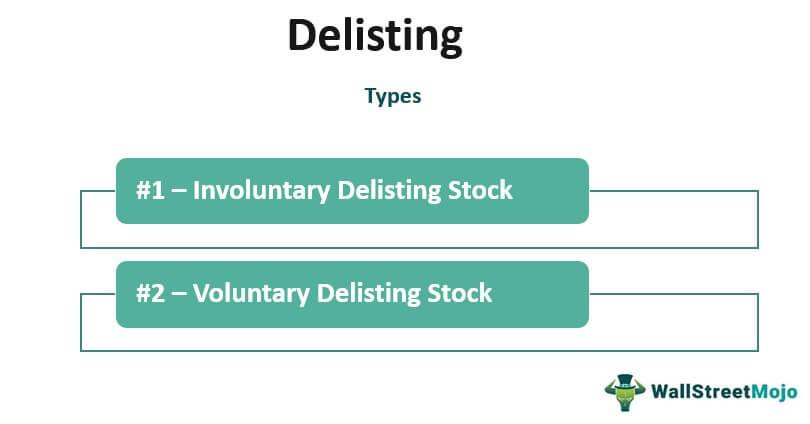

The financial markets are a hub of activity, where billions of transactions occur daily, involving the buying and selling of a vast array of securities. These dynamic environments facilitate the mobilization of capital and serve as the lifeblood for economies globally. Integral to the functioning of these markets is the listing and subsequent delisting of stocks. Listing involves a company offering its shares to the public through an exchange, enabling investors to buy and sell these shares. Conversely, stock delisting, an equally significant event, entails the removal of a company's shares from a stock exchange, affecting both the company and its investors.

Understanding stock delisting is vital for investors as it directly impacts their ability to trade shares and can influence the value of their investments. Delisting may occur for various reasons, such as a company choosing to go private, failing to meet the regulatory requirements of the exchange, or engaging in corporate restructuring like mergers or acquisitions. Each scenario presents distinct challenges and opportunities for stakeholders, necessitating a thorough comprehension of the process and its implications.



Furthermore, the financial landscape includes the sophisticated domain of algorithmic trading, where computer algorithms are employed to execute trading strategies at high speeds. In this rapidly changing market, the removal of a stock from an exchange can create volatility that algorithmic trading systems must quickly adapt to. As such, grasping the relationship between stock delisting and algorithmic trading provides a strategic edge for investors and traders, enabling them to leverage technology to address market shifts effectively.

This article will explore the complexities of stock delisting, the removal of shares, and the transformative potential of algorithmic trading within financial markets. Through a comprehensive examination, investors can better navigate these intricate financial landscapes and turn potential hurdles into advantages.

## Table of Contents

## Understanding Stock Delisting

Stock delisting refers to the removal of a company's shares from a stock exchange, signifying that they can no longer be publicly traded on that particular platform. This process can be categorized into two primary types: voluntary and involuntary delisting.

Voluntary delisting occurs when a company decides to remove its own shares from the exchange. This can happen for several reasons, such as a strategic shift towards becoming a privately held entity, which may be driven by a desire to reduce public scrutiny or eliminate the costs and obligations associated with maintaining a public listing. Additionally, voluntary delisting often occurs during mergers and acquisitions, where the acquiring company intends to absorb the target company and streamline operations without the complex requirements of public trading.

Involuntary delisting, on the other hand, is enforced by the stock exchange due to a company's failure to comply with the regulatory requirements set by the exchange. These could include failure to meet minimum financial thresholds, such as maintaining a certain share price or market capitalization, or non-compliance with reporting and governance standards. A company might also face involuntary delisting if it undergoes bankruptcy or has its assets liquidated.

For shareholders, delisting has significant implications. On a stock exchange, shares trade with substantial [liquidity](/wiki/liquidity-risk-premium) and transparency, allowing investors to buy and sell with relative ease. When a stock is delisted, this liquidity is often significantly reduced, making it challenging for shareholders to sell their holdings at fair market value, especially in the case of involuntary delisting.

An additional aspect of delisting revolves around regulatory compliance and the costs associated with it. Maintaining a public listing requires meeting stringent disclosure requirements and corporate governance standards, which can be expensive and resource-intensive. For some companies, especially smaller entities or those undergoing financial distress, the benefits of remaining listed do not outweigh these costs, prompting a shift away from public trading.

In summary, understanding the mechanisms and motivations behind stock delisting is crucial for investors aiming to manage their portfolios effectively. Delisting impacts the liquidity and accessibility of investments, thereby affecting shareholders’ ability to trade and realize the value of their investments.

## Process and Consequences of Delisting

The process of delisting a stock from a stock exchange begins with the company being notified if it fails to meet the exchange's listing requirements. These requirements can include maintaining a minimum stock price, minimum market capitalization, and timely filing of financial reports. If a company cannot rectify these issues within a specific timeframe, the exchange may proceed with delisting the stock.

Delisting can be voluntary, where the company chooses to remove its stock from the exchange, often due to mergers or acquisitions, or a strategic decision to go private. On the other hand, involuntary delisting occurs when a company fails to comply with listing standards or is involved in financial distress or fraudulent activities.

One of the primary consequences of delisting is reduced liquidity for the shares. Once delisted, shares do not have the benefit of being traded on well-regulated and high-visibility platforms like the major stock exchanges. Instead, they often move to over-the-counter (OTC) markets. OTC markets generally lack the same level of transparency and liquidity as formal exchanges, making it more challenging for shareholders to find buyers. The absence of regular buyers and sellers can lead to increased [volatility](/wiki/volatility-trading-strategies) and wider bid-ask spreads in the trading of these shares.

As a result, investors holding delisted stocks may face difficult situations, such as a decline in the stock's market value and a lack of readily available market information. These conditions can further discourage potential investors, exacerbating the liquidity issues. Therefore, investors dealing with delisted stocks should become familiar with OTC market structures, evaluate the remaining value of their investments meticulously, and consider the continuous financial performance and announcements from the delisted company. Being proactive about understanding these dynamics can help mitigate the adverse effects of stock delisting on an investment portfolio.

## Algorithmic Trading: Adapting to Market Changes

Algorithmic trading utilizes computer algorithms to execute trading orders automatically according to a set of predetermined instructions, including timing, price, or quantity. This technology aims to leverage the speed and precision of execution to benefit from price discrepancies and market trends. The adaptation of [algorithmic trading](/wiki/algorithmic-trading) systems to market changes, such as stock delisting, is crucial for maintaining their effectiveness.

When a company announces its stock delisting, it can introduce sudden market volatility and altered liquidity conditions. Algorithmic systems must be designed to swiftly recalibrate their strategies to manage these changes efficiently. For example, when a stock is set to be delisted, it may become less liquid, making it challenging to find buyers or sellers at a desired price. Algorithms must recognize these conditions and adjust execution tactics to minimize slippage, the difference between the expected price of a trade and the actual price.

Effective algorithmic trading systems utilize real-time data analysis and [machine learning](/wiki/machine-learning) techniques to recognize patterns and predictive indicators of market changes. For instance, a basic algorithm may consider technical indicators like moving averages or relative strength index (RSI) to inform its trading decisions. More sophisticated models might incorporate natural language processing to assess the sentiment from news articles or social media to anticipate market impacts.

Python's versatility makes it popular for developing such trading algorithms. A simple moving average crossover strategy in Python might look like this:

```python
import pandas as pd

def moving_average_crossover(data, short_window, long_window):
    signals = pd.DataFrame(index=data.index)
    signals['price'] = data['price']
    signals['short_mavg'] = data['price'].rolling(window=short_window, min_periods=1).mean()
    signals['long_mavg'] = data['price'].rolling(window=long_window, min_periods=1).mean()
    signals['signal'] = 0.0
    signals['signal'][short_window:] = np.where(signals['short_mavg'][short_window:] 
                                                 > signals['long_mavg'][short_window:], 1.0, 0.0)   
    signals['positions'] = signals['signal'].diff()
    return signals

# Example usage
# data is a DataFrame with a 'price' column containing stock prices
# signals = moving_average_crossover(data, short_window=40, long_window=100)
```

This code provides a binary signal indicating entry and [exit](/wiki/exit-strategy) points based on the crossover of short and long-term moving averages. However, considering delisting events, algorithms must also incorporate additional decision layers such as stop-loss mechanisms or exclusion of delisted stocks from trading lists.

The ability to turn market volatility into opportunities relies on dynamic algorithms that adjust strategies in real-time. They must account for changes in trading [volume](/wiki/volume-trading-strategy), unexpected corporate actions like delisting, and macroeconomic news. By programming these contingencies, algorithmic trading systems can not only mitigate risks but also exploit conditions that human traders may find too rapid to react profitably. The seamless adaptation of these algorithms is vital for maintaining competitive advantage in the fast-paced financial markets.

## Impact of Delisting on Investors

Investors may encounter significant challenges when a stock they hold is delisted, primarily due to the potential reduction in portfolio value. This can occur because the delisting event usually signals a decrease in market confidence in the company. As a result, the liquidity of these stocks diminishes, making it more difficult for investors to sell them at favorable prices. The direct consequence is an increase in the bid-ask spread, which indicates the cost of buying versus selling the asset becomes steeper, adversely affecting an investor's ability to exit positions efficiently.

Navigating delisted stocks effectively requires a thorough understanding of Over-the-Counter (OTC) markets. Unlike traditional exchanges, OTC markets do not operate on a centralized trading floor, and instead, trades are executed via a network of dealers. This decentralized nature leads to lower liquidity and less transparency. Investors must research to find brokers who deal in OTC stocks and understand the pricing mechanisms and regulations governing these markets.

An essential aspect for investors is assessing the remaining investment potential of delisted shares. This involves conducting a detailed analysis of the company's financial health and the reasons behind the delisting. For instance, if a company is delisted due to failing to meet stock exchange criteria but shows strong fundamentals, it might present a speculative opportunity for recovery or privatization prospects. Conversely, if the delisting is due to bankruptcy or severe financial distress, the likelihood of recovery could be slim.

Investors should maintain vigilance regarding company announcements and market trends to mitigate risks associated with delisted stocks. Continued monitoring of financial reports, management decisions, and industry developments can provide crucial insights. Additionally, considerations such as insider buying or strategic reorientation can indicate the potential for a turnaround. Investors can implement algorithmic tools to track news feeds and social media, providing real-time updates on market sentiments and company-specific developments.

In summary, dealing with delisted stocks demands a proactive approach, encompassing a solid understanding of OTC markets, critical evaluation of the remaining value potential, and constant attention to market signals. By adopting these strategies, investors can navigate the complexities of delisted stocks and potentially transform challenges into strategic opportunities.

## Conclusion

Stock delisting is a significant event with considerable impacts on both market dynamics and individual investor portfolios. When a stock is delisted, it can result in diminished liquidity and transparency, which may pose challenges for investors looking to manage their portfolios effectively. Delisting can be triggered by various factors such as mergers and acquisitions, a company’s failure to meet the regulatory requirements of the exchange, or a strategic decision to privatize.

Possessing an understanding of the delisting process and its consequences can empower investors to strategize effectively. For instance, when a publicly traded company is moved to Over-The-Counter (OTC) markets, investors need to evaluate the risks and opportunities presented by the lower liquidity and transparency commonly associated with these markets. They must pay close attention to company announcements and trends in financial markets to mitigate potential financial losses.

Algorithmic trading offers a practical avenue for navigating the complexities associated with stock delisting. These sophisticated trading systems can rapidly adapt to changes in the market by executing trades based on pre-defined parameters. This adaptability is essential for capitalizing on the volatility that often accompanies a delisting event. Effective algorithms are designed to adjust in real-time, identifying opportunities and altering strategies to minimize risks and optimize potential gains in a shifting market.

By integrating insights on delisting processes with algorithmic trading methodologies, investors are better equipped to handle the inherent volatility of financial markets. As such, remaining informed and maintaining flexibility are crucial to transforming challenges posed by events like stock delisting into viable strategic opportunities. In a landscape where market conditions can change abruptly, these principles offer a pathway to sustaining and potentially enhancing investor value amidst uncertainty.

## References & Further Reading

[1]: ["The Impact of Delisting on Stock Market Prices and Investor Behavior"](https://www.jstor.org/stable/pdf/10.1086/593386.pdf), Journal of Empirical Finance.

[2]: Perez-Quiros, G., & Timmermann, A. (2000). ["Firm Size and Cyclical Variations in Stock Returns"](https://onlinelibrary.wiley.com/doi/abs/10.1111/0022-1082.00246). The Review of Financial Studies, 13(3), 559-587.

[3]: Chong, B.S., Liu, M.H., & Tan, K.J.K. (2006). ["The Impact of Mergers and Acquisitions on the Performance of the Stock Market: Evidence from Singapore"](https://pubmed.ncbi.nlm.nih.gov/31792424/). International Review of Economics & Finance, 15(1), 63-76.

[4]: Lopez de Prado, M. (2018). ["Advances in Financial Machine Learning"](https://www.amazon.com/Advances-Financial-Machine-Learning-Marcos/dp/1119482089). Wiley.

[5]: Chan, E.P. (2009). ["Quantitative Trading: How to Build Your Own Algorithmic Trading Business"](https://github.com/ftvision/quant_trading_echan_book). Wiley.

[6]: Jansen, S. (2020). ["Machine Learning for Algorithmic Trading"](https://github.com/stefan-jansen/machine-learning-for-trading). Packt Publishing.

[7]: Aronson, D.R. (2006). ["Evidence-Based Technical Analysis: Applying the Scientific Method and Statistical Inference to Trading Signals"](https://www.amazon.com/Evidence-Based-Technical-Analysis-Scientific-Statistical/dp/0470008741). Wiley.