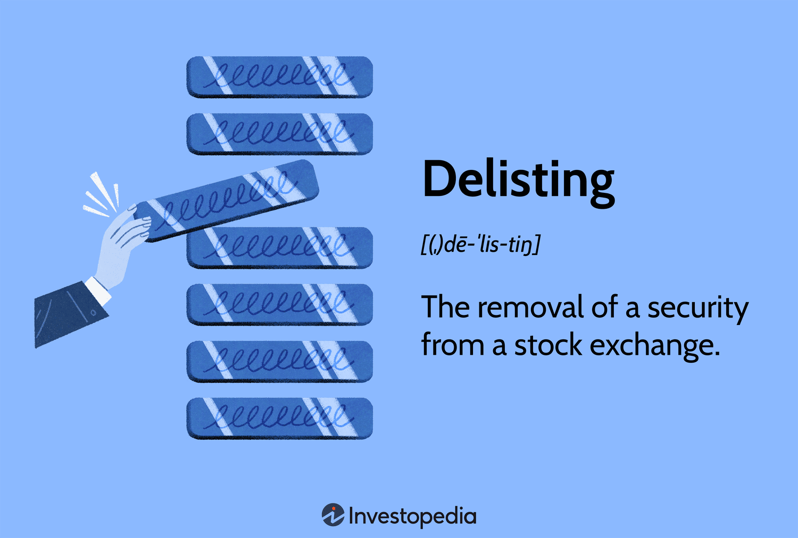

## Table of Contents

## What does it mean when a stock is delisted?

When a stock is delisted, it means that the company's shares are removed from a stock exchange, like the New York Stock Exchange or NASDAQ. This can happen for a few reasons, such as the company not meeting the exchange's rules, going bankrupt, or being bought by another company. Once delisted, the stock can no longer be traded on that exchange.

After a stock is delisted, it might still be possible to buy and sell the shares, but it becomes much harder. The stock might move to a smaller, less regulated market called the over-the-counter (OTC) market. Trading on the OTC market can be riskier because there are fewer rules and less information available about the company. This can make it more difficult for investors to make good decisions about buying or selling the stock.

## What are the common reasons for a stock to be delisted?

A stock can be delisted from an exchange for several reasons. One common reason is if the company fails to meet the exchange's listing requirements. These requirements might include having a minimum share price, a certain market capitalization, or a specific number of shareholders. If a company's stock price drops too low or if it doesn't have enough shareholders, the exchange might decide to delist it.

Another reason for delisting is if the company goes bankrupt. When a company can't pay its debts, it might have to file for bankruptcy. This often leads to the company's stock being removed from the exchange. Additionally, a company might be delisted if it is bought by another company. In this case, the acquiring company might choose to take the stock off the exchange as part of the merger or acquisition process.

Lastly, a company might be delisted due to unethical behavior or fraud. If a company is found to have broken laws or engaged in fraudulent activities, the exchange might decide to remove its stock to protect investors. This kind of delisting can happen quickly and can have serious consequences for the company and its shareholders.

## Who has the authority to delist a stock?

The main group that can delist a stock is the stock exchange where the stock is traded. This could be a big exchange like the New York Stock Exchange or NASDAQ. They have rules that companies must follow to stay listed. If a company does not follow these rules, the exchange can decide to remove the stock.

Sometimes, other groups can also have a say in delisting. For example, if a company goes bankrupt, a court might be involved in deciding to delist the stock. Also, if a company is bought by another company, the new owner might choose to delist the stock as part of the deal. So, while the stock exchange has the main power, other situations can lead to a stock being delisted too.

## What are the financial criteria that can lead to delisting?

One main financial reason a stock can be delisted is if its share price falls too low. Stock exchanges have rules about the minimum price a stock needs to stay listed. For example, if a stock's price stays below $1 for too long, the exchange might decide to remove it. This is because low-priced stocks can be risky and hard to trade. Another financial reason is if the company's total value, called market capitalization, drops too low. Exchanges set a minimum market cap that companies must meet to stay listed. If a company's market cap falls below this level, it might get delisted.

Another financial criterion is the number of shareholders a company has. Exchanges require a company to have a certain number of shareholders to stay listed. If the number of shareholders falls below this requirement, the stock might be removed from the exchange. Additionally, a company might be delisted if it fails to file required financial reports on time. These reports are important because they give investors information about the company's financial health. If a company misses these deadlines too often, the exchange might decide to delist its stock to protect investors.

## How does a company get notified about potential delisting?

When a company might be delisted, the stock exchange sends them a letter. This letter tells the company that they are not meeting the rules and gives them a chance to fix the problem. The company has a certain amount of time, usually a few months, to make things right. If they can't fix the issues, the exchange will start the process to remove the stock.

If the company still doesn't meet the rules after the warning, the exchange will send another letter. This second letter tells the company that they will be delisted if they don't take action quickly. The company can ask for a hearing to explain their situation and try to stay listed. If the hearing doesn't work, the stock will be removed from the exchange.

## What steps can a company take to avoid delisting?

When a company gets a warning about possible delisting, they need to act fast to fix the problems. If the issue is a low stock price, the company might do a reverse stock split. This means they combine several shares into one to make the price higher. If the problem is not enough shareholders, the company might try to attract more investors by doing things like advertising or offering new shares. They also need to make sure they file all their financial reports on time to show they are following the rules.

If the company can't fix the problems quickly, they can ask for more time from the exchange. They might also ask for a hearing to explain why they should stay listed. During the hearing, they can show what they are doing to fix the issues and why they think they should keep their stock on the exchange. If the company can prove they are working hard to meet the rules, the exchange might give them more time or even let them stay listed.

## What is the process of delisting a stock from a stock exchange?

When a company might be delisted, the stock exchange sends them a warning letter. This letter says the company isn't following the rules and gives them time to fix the problem. The company usually has a few months to make things right. If they can't fix it, the exchange sends another letter saying the stock will be delisted if they don't act fast. The company can then ask for a hearing to explain why they should stay listed. If the hearing doesn't help, the stock will be removed from the exchange.

If the stock gets delisted, it can no longer be traded on that exchange. The company might move the stock to a smaller market called the over-the-counter (OTC) market. Trading on the OTC market can be riskier because there are fewer rules and less information about the company. This makes it harder for investors to decide if they should buy or sell the stock. The whole process of delisting can take several months, from the first warning to the final removal of the stock from the exchange.

## How does delisting affect shareholders?

When a stock gets delisted, it can be hard for shareholders. They can't buy or sell the stock on the big exchange anymore. This makes it harder to find someone to trade with. If the stock moves to a smaller market like the OTC market, there might be less information about the company. This can make it riskier to keep the stock. Shareholders might also see the value of their stock go down because fewer people want to buy it.

Sometimes, shareholders can still sell their stock after it's delisted, but it might be at a lower price. If the company goes bankrupt, shareholders might lose all their money. But if another company buys the delisted company, shareholders might get some money or new shares in the new company. It all depends on what happens to the company after it's delisted.

## What are the differences in delisting rules between major stock exchanges like NYSE and NASDAQ?

The New York Stock Exchange (NYSE) and NASDAQ have some different rules for delisting. For the NYSE, a company's stock can be delisted if the average closing price is less than $1 for 30 trading days in a row. They also need to have at least 1.1 million publicly held shares and a market value of at least $100 million. If a company doesn't meet these rules, the NYSE will send a warning and give them time to fix the problem. If the company can't fix it, they might get delisted.

NASDAQ has similar rules but with some differences. For NASDAQ, a stock can be delisted if the price stays below $1 for 30 straight trading days. They also need at least 1.25 million publicly held shares and a market value of at least $45 million. Like the NYSE, NASDAQ will send a warning and give the company time to fix things. If the company can't meet the rules after the warning, NASDAQ will start the delisting process. Both exchanges want to make sure companies meet certain standards to protect investors, but the exact numbers and time frames can be a bit different.

## Can a delisted stock be traded on other platforms, and if so, how?

Yes, a delisted stock can still be traded, but it usually moves to a smaller market called the over-the-counter (OTC) market. The OTC market is not as big or as regulated as the main stock exchanges like the NYSE or NASDAQ. This means there are fewer rules and less information about the companies. Because of this, trading on the OTC market can be riskier for investors. They need to be careful because it might be harder to find out if the company is doing well or not.

To trade a delisted stock on the OTC market, investors can use a broker that offers OTC trading. Not all brokers do this, so they need to find one that does. Once they have the right broker, they can buy and sell the stock just like they would on a bigger exchange. But because there are fewer buyers and sellers on the OTC market, it might be harder to find someone to trade with, and the price of the stock might not be as stable.

## What are the long-term implications for a company after being delisted?

When a company gets delisted, it can have a big impact on its future. The company might find it harder to raise money because it's not on a big stock exchange anymore. Without being on a big exchange, fewer investors might want to buy its stock. This can make it tough for the company to grow or even stay in business. The company might also have a harder time getting loans or other kinds of money because banks and lenders might see it as riskier.

On the other hand, a delisted company might try to fix its problems and get listed again. If they can do this, it shows they've made big changes and can be a good thing for the company. But if they can't get back on a big exchange, they might have to stay on a smaller market like the OTC market. This can make it harder for them to attract investors and grow. In the end, being delisted can make a company's future more uncertain and challenging.

## How do international delisting rules vary, and what are some examples?

Delisting rules can be different in different countries. In the United States, the NYSE and NASDAQ have rules about the lowest price a stock can be and how many shareholders a company needs. If a company doesn't follow these rules, it might get delisted. In the UK, the London Stock Exchange has its own rules. They might delist a company if its stock price is too low or if it doesn't have enough shareholders, but the exact numbers can be different from the US. In Japan, the Tokyo Stock Exchange also has its own rules, which might focus more on the company's financial health and how well it's doing.

For example, in the UK, the London Stock Exchange might delist a company if its stock price stays below 1 penny for a long time. They also look at how many shares are being traded and how much the company is worth. In Japan, the Tokyo Stock Exchange might delist a company if it's losing a lot of money or if it's not following the rules about reporting its finances. Each country's stock exchange wants to make sure companies are doing well and following the rules, but the exact rules can be different.

## References & Further Reading

[1]: Davidoff Solomon, S., & McQueen, M. (2021). ["Understanding Stock Delisting: Voluntary and Involuntary Processes"](https://papers.ssrn.com/sol3/papers.cfm?abstract_id=3561164) Harvard Law School Forum on Corporate Governance.

[2]: Nasdaq. (n.d.). ["Continued Listing Guide"](https://listingcenter.nasdaq.com/assets/continuedguide.pdf)

[3]: New York Stock Exchange. (n.d.). ["How Companies are Listed"](https://www.nyse.com/listings_directory/stock)

[4]: Roberts, L. (2021). ["The Impact of Delisting on Market Participants: A Comprehensive Review"](https://pubmed.ncbi.nlm.nih.gov/33791270/) Investopedia.

[5]: Securities and Exchange Commission (SEC). (2021). ["Delisting and Going Private"](https://corpgov.law.harvard.edu/2022/01/08/new-rules-for-mandatory-trading-suspension-of-us-listed-chinese-companies/)

[6]: Duffie, D., & Singleton, K. J. (1999). ["Modeling Term Structures of Defaultable Bonds"](https://www.jstor.org/stable/pdfplus/2645962.pdf) Econometrica, 67(4), 637-660.

[7]: Amihud, Y. (2002). ["Illiquidity and stock returns: cross-section and time-series effects"](https://www.sciencedirect.com/science/article/pii/S1386418101000246)00242-6) Journal of Financial Markets, 5(1), 31-56.