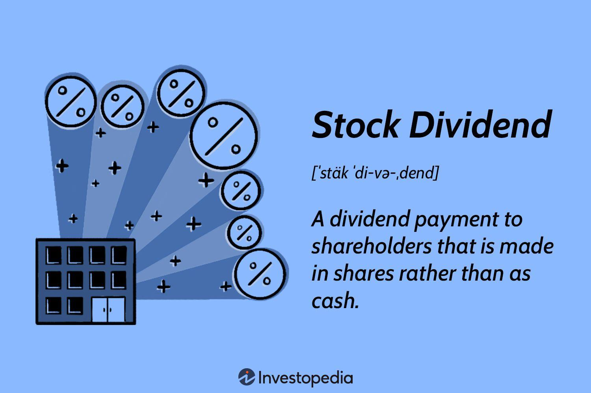

In today's dynamic financial landscape, investors are continuously exploring strategies to maximize returns while managing risk. Among the myriad of investment strategies, stock dividend investment and algorithmic trading have gained significant popularity due to their distinct advantages and potential for synergy. Stock dividends provide a steady stream of income, reflecting a company's profitability and financial health, while algorithmic trading offers precision and speed, leveraging technology to execute trades with minimal human intervention.

The intersection of stock dividends and algorithmic trading presents a compelling opportunity for investors. By integrating these approaches, there is potential for creating robust investment portfolios that benefit from the reliability of dividends and the efficiency of automated trading systems. This combination empowers investors to make informed and timely decisions, enhancing their ability to navigate the complexities of the financial markets.



Furthermore, understanding the underlying principles of these components is crucial for investors aiming to achieve optimal outcomes. Stock dividends serve as a fundamental building block of many portfolios, offering not just regular income but also potential tax advantages. On the other hand, algorithmic trading harnesses vast data sets and sophisticated algorithms to identify market trends and execute trades at high speeds, opening up new avenues for portfolio optimization.

In this article, we will explore the connections between stock dividends, investment strategies, modern finance, and algorithmic trading. By examining these interrelated concepts, investors can gain insights into how to strategically leverage both to enhance their investment performance. Through this understanding, investors are better positioned to navigate and capitalize on opportunities in an ever-evolving financial environment.

## Table of Contents

## Understanding Stock Dividends

Stock dividends represent a distribution of a portion of a company's earnings to shareholders. Unlike cash dividends, which are paid out in currency, stock dividends are disbursed in the form of additional shares. This type of dividend can be an essential tool for investors seeking steady income as well as capital appreciation over time.

### Basics of How Stock Dividends Work

When a company decides to issue a stock dividend, it determines a specific ratio for distribution. For example, with a 5% stock dividend, a shareholder owning 100 shares would receive an additional 5 shares. The issuance of stock dividends is typically accompanied by a proportional adjustment in stock price to maintain the overall market capitalization. Consequently, the market value of an investor's holdings remains unchanged immediately post-dividend, though the number of shares increases.

### Strategic Benefits of Stock Dividends

1. **Income Generation and Capital Growth:** Stock dividends enable investors to increase their shareholdings without additional cash outlay. Over time, these additional shares can augment an investor's portfolio through capital appreciation, especially in growing companies.

2. **Signalling Effect:** Stock dividends may indicate a company’s robust financial position. Regularly issuing dividends suggests that a company is generating sufficient earnings to support expansion, satisfy liabilities, and share profits with shareholders. Such an approach can enhance investor confidence and attract more stakeholders.

3. **Tax Efficiency:** Depending on jurisdiction, stock dividends might offer certain tax advantages. In some cases, taxes on stock dividends are deferred until the shares are sold, unlike cash dividends, which might be subject to immediate taxation.

### Factors to Consider When Investing in Dividend Stocks

1. **Dividend Yield:** This metric, calculated as $\frac{\text{Annual Dividends Per Share}}{\text{Price Per Share}}$, helps investors assess the income generated relative to the share price. High yield may suggest attractive income prospects but could also indicate potential risk if unsustainably high.

2. **Payout Ratio:** This ratio, $\frac{\text{Dividends}}{\text{Net Income}}$, measures the proportion of earnings paid out as dividends. A high payout ratio could mean limited opportunities for reinvestment into the company's growth, signaling potential vulnerability to economic fluctuations.

3. **Dividend Growth Rate:** Companies that consistently increase their dividends suggest a stable growth trajectory. Investors may prioritize these stocks for not only the income potential but also the compounding effect on their long-term investment returns.

4. **Company's Financial Health:** Before investing, it's crucial to evaluate a company’s overall financial health, including its debt levels, cash flow, and profitability. A company with strong fundamental indicators is more likely to sustain dividend payments through varied market conditions.

Investment in dividend stocks, therefore, requires comprehensive analysis and a strategic approach to maximize benefits while considering associated risks and market dynamics.

## Investment Finance Fundamentals

Investment finance revolves around the strategic management of assets and securities to achieve specific financial objectives. This discipline encompasses various elements, including assessment and acquisition of investments, risk management, and the optimization of investment returns. A fundamental understanding of investment finance is vital for evaluating dividend stocks and their integration into a broader financial strategy.

Dividend stocks yield a return to shareholders in the form of periodic payments, reflecting a portion of a company's earnings. To assess the feasibility and attractiveness of these stocks, investors rely on key financial metrics such as yield, payout ratio, and return on investment.

**Dividend Yield**

The dividend yield is a financial ratio that measures the cash dividends paid out by a company relative to its market value. It is calculated as follows:

$$
\text{Dividend Yield} = \left( \frac{\text{Annual Dividends Per Share}}{\text{Price Per Share}} \right) \times 100
$$

This metric enables investors to estimate the income generated from an investment concerning its price. Higher yields might attract income-focused investors, but it's crucial to evaluate yield alongside other factors to avoid potential risks associated with unsustainable dividends.

**Payout Ratio**

The payout ratio indicates the proportion of earnings that a company distributes as dividends:

$$
\text{Payout Ratio} = \left( \frac{\text{Dividends Per Share}}{\text{Earnings Per Share (EPS)}} \right) \times 100
$$

A high payout ratio can signal that a company is confident in its earnings and its ability to sustain dividend payments. Conversely, an exceedingly high ratio may indicate that the company is returning most of its earnings to shareholders, potentially at the expense of reinvestment and future growth.

**Return on Investment (ROI)**

ROI is a measure of an investment's profitability and efficiency:

$$
\text{ROI} = \left( \frac{\text{Net Profit}}{\text{Cost of Investment}} \right) \times 100
$$

For dividend stocks, ROI accounts for capital gains and dividend income, helping investors judge the overall profitability of their investments. A comprehensive analysis of ROI in conjunction with dividend yield and payout ratio provides greater insight into a stock's performance and potential.

These metrics significantly influence the value and allure of dividend stocks within a portfolio. By examining dividend yield, payout ratio, and ROI collectively, investors can discern the potential income, sustainability, and growth prospects of their investments. This holistic approach equips investors with the knowledge required to make informed decisions, ultimately contributing to a well-balanced and effective investment strategy.

## Algorithmic Trading in Modern Finance

Algorithmic trading involves the utilization of computer algorithms to automate and optimize the process of buying and selling securities. These algorithms can process vast amounts of data at high speed, executing trades more efficiently than human traders. The primary goal of algo trading is to maximize returns while minimizing associated costs such as transaction fees and market impact.

At its core, [algorithmic trading](/wiki/algorithmic-trading) leverages quantitative models and statistical methods to determine the optimal timing, price, and quantity of trades. These algorithms can perform complex calculations rapidly, allowing them to capitalize on fleeting market opportunities. For instance, a mean reversion strategy might use statistical techniques to identify stocks that are diverging significantly from their historical price patterns, anticipating a return to the mean.

The increased adoption of algorithmic trading has reshaped the financial landscape. One of its significant advantages is the reduction of human errors and emotional biases that often lead to suboptimal trading decisions. By executing trades based on predefined criteria and models, algorithmic trading ensures consistency and precision. This systematic approach can be particularly beneficial in high-frequency trading ([HFT](/wiki/high-frequency-trading-strategies)), where firms execute numerous transactions in fractions of a second to capture small price discrepancies.

Integrating algorithmic trading with dividend investing presents an intriguing opportunity for investors. Dividend stocks offer regular income, which can be enhanced through the efficient execution of trades. Algorithms can screen for high-yield dividend stocks by analyzing financial metrics such as dividend yield, payout ratio, and historical performance. They can also assist in timing investments by detecting favorable market conditions or technical signals that may indicate potential price movements.

However, this integration is not without challenges. Algorithms need to be meticulously designed to handle the unique aspects of dividend investing, such as ex-dividend dates and dividend reinvestment plans. Additionally, the dynamic nature of financial markets requires continuous adjustments and refinements of algorithms to adapt to changing conditions.

Incorporating real-world applications highlights how algo trading can be used effectively with dividend stocks. For example, a [hedge fund](/wiki/hedge-fund-trading-strategies) might employ an algorithm to automatically rebalance its portfolio to maintain a target dividend yield while optimizing for capital gains. Alternatively, an algorithm could be programmed to execute trades based on earnings announcements, aiming to capture positive [momentum](/wiki/momentum) in dividend-paying stocks.

Despite its advantages, algorithmic trading also presents specific risks and considerations. Market [volatility](/wiki/volatility-trading-strategies), technological failures, and algorithmic biases can potentially impact performance. Therefore, investors must employ robust risk management frameworks and stay informed about regulatory developments to ensure compliance and mitigate potential challenges.

Overall, algorithmic trading continues to transform the investment landscape by enhancing the efficiency and effectiveness of trading strategies. Its integration with dividend investing holds promise for those aiming to optimize returns and manage risks in an increasingly competitive market environment.

## Integrating Dividend Stocks with Algo Trading

Integrating dividend stocks with algorithmic trading presents opportunities to maximize portfolio performance by seamlessly blending distinctive investment strategies and technology. This combination leverages algorithms' precision and speed with the long-term growth and income potential offered by dividend stocks. 

### Leveraging Algorithms for Dividend Stock Optimization

To optimize dividend stock investments using algorithmic methods, various strategies can be employed:

**1. Screening Dividend Stocks:**
Algorithms can be designed to screen dividend stocks based on specific criteria, such as dividend yield, payout ratio, and dividend growth rate. This systematic approach allows investors to identify stocks that meet predefined financial health and sustainability criteria. Python libraries such as `pandas` and `numpy` can be utilized to manage and analyze large datasets efficiently. For example:

```python
import pandas as pd

def screen_dividend_stocks(df):
    return df[(df['dividend_yield'] > 0.03) & (df['payout_ratio'] < 0.6) & (df['dividend_growth_rate'] > 0.05)]

# Example dataframe structure
data = {'stock': ['A', 'B', 'C'],
        'dividend_yield': [0.025, 0.035, 0.04],
        'payout_ratio': [0.55, 0.65, 0.45],
        'dividend_growth_rate': [0.04, 0.06, 0.07]}
df = pd.DataFrame(data)

selected_stocks = screen_dividend_stocks(df)
print(selected_stocks)
```

**2. Timing Investments:**
Algorithmic trading systems can be calibrated to execute trades when conditions contingent on dividend payouts and market indicators are favorable. These systems often employ techniques such as moving averages or sentiment analysis to determine entry and [exit](/wiki/exit-strategy) points.

```python
# Example of simple moving average crossover strategy
import numpy as np

def trade_signal(prices, short_window=40, long_window=100):
    signals = pd.DataFrame(index=prices.index)
    signals['signal'] = 0.0

    # Create simple moving averages
    signals['short_mavg'] = prices.rolling(window=short_window, min_periods=1, center=False).mean()
    signals['long_mavg'] = prices.rolling(window=long_window, min_periods=1, center=False).mean()

    # Generate buy/sell signals
    signals['signal'][short_window:] = np.where(signals['short_mavg'][short_window:] > signals['long_mavg'][short_window:], 1.0, 0.0)   
    signals['positions'] = signals['signal'].diff()

    return signals

# Assuming prices is a DataFrame of stock prices
# signals = trade_signal(prices)
```

**3. Rebalancing Portfolios:**
Algorithmic systems can facilitate the rebalance of portfolios by continuously evaluating the composition and performance of holdings. Rebalancing occurs when asset allocations diverge from targets due to fluctuations in market prices or corporate actions, such as dividend payments.

### Real-World Applications and Case Studies

Investors and financial institutions have successfully applied these techniques, achieving improved returns and optimized risk profiles. For instance, quant funds have developed proprietary algorithms to screen, monitor, and rebalance dividend-focused portfolios, helping maintain alignment with financial goals.

Algorithms can process and analyze vast amounts of data, enabling quicker adaptation to market changes than manual strategies. This dynamic response to real-time data can reduce exposure to downside risks, ensuring that high-dividend yielding assets continue to contribute meaningfully to portfolio performance.

In summary, by integrating dividend stock selection with sophisticated algorithmic strategies, investors can enhance their ability to manage risks and capitalize on investment opportunities, fostering a resilient and yield-generating portfolio.

## Risks and Considerations

Combining stock dividends and algorithmic trading, while potentially lucrative, involves certain risks and challenges that investors must navigate carefully. 

One primary concern is market volatility. Stock prices can fluctuate significantly due to economic changes, geopolitical events, or unexpected company announcements. These price movements can affect dividend yields and the profitability of algorithmic trading strategies. Investors should consider employing volatility indicators, such as the VIX (Volatility Index), to monitor and manage these risks. Additionally, algorithms might incorporate conditional scripts to halt trading during periods of extreme volatility to protect capital.

Technological risks are another significant consideration. Algorithmic trading relies heavily on stable internet connectivity, reliable software, and accurate data feeds. Any disruptions can lead to delays in executing trades or executing strategies based on outdated information. To mitigate these risks, investors should implement redundant systems and maintain regular backups of critical data. Testing trading algorithms in a simulated environment can also help identify potential flaws before they are deployed in real-world scenarios.

Algorithmic biases can also impact trading outcomes. These biases stem from the data sets and assumptions used to develop trading models. If an algorithm is trained on historical data that does not represent future market conditions, it may underperform or cause substantial losses. Investors should periodically retrain their algorithms using relevant and up-to-date data sets. Furthermore, including diverse market scenarios in the model training process can provide more robust and adaptable strategies.

Regulatory considerations play a crucial role in navigating the complexities of algorithmic trading. Financial authorities have established guidelines to monitor and regulate this trading style to prevent market manipulation and ensure fair trading practices. Investors should be well-informed about these regulations and ensure their algorithmic strategies comply. Staying updated with regulatory changes and participating in financial training can help maintain compliance and avoid potential legal issues.

Ethical concerns are also inherent in the use of algorithmic trading. High-frequency trading, for example, can lead to unequal market participation, where large institutional investors may gain advantages over smaller investors due to faster execution speeds and access to sophisticated technology. Addressing these concerns involves promoting transparency in trading strategies and supporting policies that ensure fair market access for all participants.

In conclusion, while integrating stock dividend investments with algorithmic trading offers potential benefits, it requires a comprehensive understanding of the associated risks and proactive measures to mitigate them. By being aware of market volatility, technological risks, algorithmic biases, regulatory requirements, and ethical implications, investors can better protect their investment capital and contribute to a more equitable trading environment.

## Conclusion

In the ever-evolving financial landscape, stock dividend investment, paired with algorithmic trading, offers investors an innovative avenue to potentially increase financial returns. By merging these strategies, investors can achieve heightened efficiency in their portfolio management and decision-making processes.

Stock dividend investment provides a reliable means of passive income generation, as it involves regularly receiving portions of a company's earnings. Meanwhile, algorithmic trading utilizes advanced computer algorithms to execute trades with precision and speed, thereby reducing human error and leveraging market opportunities more adeptly. Together, these strategies can complement each other, where algorithmic trading enhances the timing and selection of dividend stocks to optimize portfolio performance.

The future trajectory of finance is decidedly oriented towards the integration of technology and data-driven methodologies. Financial markets are becoming increasingly complex and data-intensive, thereby amplifying the importance of harnessing technology to process and analyze large datasets for strategic decision-making. Algorithmic trading algorithms can process vast amounts of financial data to identify patterns and trends that might be invisible to the human eye, offering a significant edge in today's competitive markets.

For investors, staying informed and adaptable is paramount. As financial technologies evolve, understanding their implications and applications to investment strategies will be vital. This includes being cognizant of the risks inherent in algorithmic trading, such as market volatility and technological failures, and understanding how to mitigate these to safeguard investment capital.

In conclusion, the combination of dividend investing and algorithmic trading represents a compelling strategy for the contemporary investor. As the financial industry continues to evolve, investors who embrace these innovative approaches and remain agile in their strategies are likely to thrive in the challenging and competitive market environment.

## References & Further Reading

[1]: ["Advances in Financial Machine Learning"](https://www.amazon.com/Advances-Financial-Machine-Learning-Marcos/dp/1119482089) by Marcos Lopez de Prado

[2]: ["Evidence-Based Technical Analysis: Applying the Scientific Method and Statistical Inference to Trading Signals"](https://www.amazon.com/Evidence-Based-Technical-Analysis-Scientific-Statistical/dp/0470008741) by David Aronson

[3]: ["Machine Learning for Algorithmic Trading"](https://github.com/stefan-jansen/machine-learning-for-trading) by Stefan Jansen

[4]: ["Quantitative Trading: How to Build Your Own Algorithmic Trading Business"](https://www.amazon.com/Quantitative-Trading-Build-Algorithmic-Business/dp/1119800064) by Ernest P. Chan

[5]: Bergstra, J., Bardenet, R., Bengio, Y., & Kégl, B. (2011). ["Algorithms for Hyper-Parameter Optimization."](https://dl.acm.org/doi/10.5555/2986459.2986743) Advances in Neural Information Processing Systems 24.