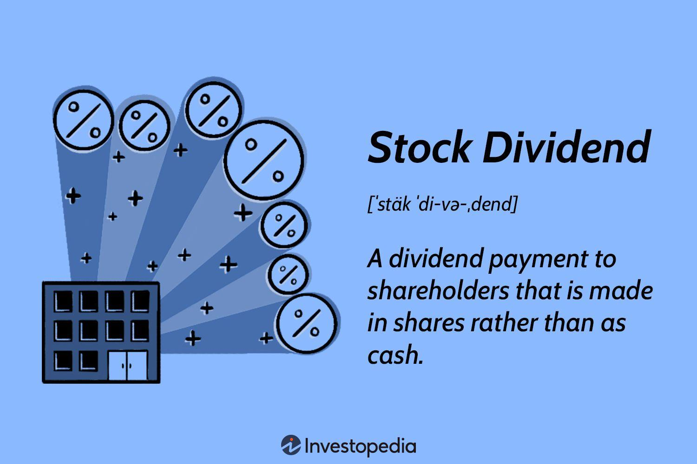

Dividend payment investments represent a strategic approach to enhancing your investment portfolio by allowing investors to capitalize on a company's profits through regular payouts. These dividends, often expressed as a percentage of the stock price, are distributed either as cash payments or additional shares, thereby offering potential for both income and growth. Many companies, particularly those with a steady cash flow and solid financial performance, opt to reward their shareholders periodically through dividends, signifying financial health and stability.

At the core of understanding stock dividends is knowing how these payments are executed. Dividends are typically issued based on a per-share basis, allowing for proportional distribution among shareholders. The main dates essential to dividend transactions include the declaration date when the company announces its intent to distribute dividends; the ex-dividend date, which determines eligibility based on whether the share is purchased prior to this date; the record date, serving as the cutoff for shareholder registration; and the payment date, when the dividends are disbursed to eligible shareholders.



The integration of algorithmic trading into dividend stocks has transformed traditional investment approaches, providing a sophisticated means to optimize the benefits derived from these financial instruments. Through algorithmic trading, investors can apply quantitative models and automated systems to predict price movements, efficiently capture dividends, and enhance returns. Algorithms can be programmed to capitalize on the regularity and predictability of dividend payouts, identifying optimal buying and selling points to maximize dividend capture strategies.

This guide outlines these concepts and aims to equip you with the necessary knowledge to navigate dividend investments effectively. By understanding both the basics of dividend payments and the advanced methodologies enabled by algorithmic tools, you can leverage these opportunities to enhance your financial portfolio. Whether you are a novice or an experienced investor, grasping these principles is key to making informed decisions in dividend investment strategies.

## Table of Contents

## Understanding Dividend Payment Investment

Dividends represent a distribution of a portion of a company's earnings to shareholders, serving as a tangible reward for investing in the company's equity. Companies decide to distribute dividends based on several factors, including profitability, cash flow, growth prospects, and board policy. Typically, mature companies with stable earnings and fewer growth opportunities are more inclined to distribute dividends compared to high-growth companies that might reinvest profits into expanding operations.

There are critical dates associated with dividend payments that investors must understand. The declaration date is when a company formally announces a dividend and its amount. Following this, the ex-dividend date is crucial; it determines whether a shareholder is eligible to receive the declared dividend. To be eligible, investors must own the stock before the ex-dividend date. The record date is typically set a few days after the ex-dividend date, marking the official cutoff for determining the shareholders entitled to the dividend. Finally, the payment date is when the dividend is actually distributed to eligible shareholders.

Dividends contribute significantly to total returns, combining both income and capital appreciation. This can be expressed through the formula for total return:

$$
\text{Total Return} = \left(\frac{\text{Ending Price} - \text{Beginning Price} + \text{Dividends}}{\text{Beginning Price}}\right) \times 100
$$

This formula highlights how dividends supplement the returns investors receive from stock price appreciation, making them an essential component of a comprehensive investment strategy. Additionally, dividends provide a cushion during market [volatility](/wiki/volatility-trading-strategies), serving as an income stream irrespective of stock price movements.

## Types of Dividends and Their Impact

Dividends serve as a crucial component of a firm's policy for distributing profits to its shareholders. They come primarily in two forms: stock dividends and cash dividends, each with distinct characteristics and implications for both the issuing company and its investors.

### Stock Dividends vs. Cash Dividends

**Stock Dividends**: These involve the distribution of additional shares to existing shareholders, instead of cash. Stock dividends increase the total number of shares outstanding while allowing companies to retain cash for reinvestment or operational needs. This can be particularly appealing to investors looking for capital gains, as stock dividends typically increase an individual's total shareholding without any immediate tax consequences. However, the increase in the number of shares can lead to a dilution of earnings per share (EPS), which may affect the stock's market perception.

**Cash Dividends**: In contrast, cash dividends consist of direct payments made to shareholders, reflecting a company’s immediate profit-sharing and liquidity capacity. Cash dividends provide an immediate source of income, making them attractive for income-focused investors such as retirees. These dividends are typically taxed in the year they are received, which is an important consideration for shareholders.

### Impact of Dividends on Stock Prices and Investor Decisions

Dividends influence stock prices through both direct and indirect mechanisms. Generally, the announcement of a dividend can lead to a price increase, as it may signal a company's strong financial health and commitment to returning value to shareholders. Conversely, the declaration of lower-than-expected dividends or a dividend cut can result in a decline in stock prices, reflecting negatively on market sentiment.

Investors often interpret dividend announcements as indicators of a company's performance and future prospects. Companies that consistently pay and increase dividends are perceived as financially stable, attracting long-term investors. On the other hand, high dividends might also be viewed skeptically if they are not supported by sustainable earnings growth, potentially leading to strategic shifts in portfolio management.

### Dividend Yield and Payout Ratio

To assess the attractiveness of dividend-paying stocks, investors often use metrics such as dividend yield and payout ratio.

**Dividend Yield $Y$** is calculated using the formula:

$$

Y = \frac{\text{Annual Dividends per Share}}{\text{Price per Share}} \times 100 
$$

This metric measures the return on investment based solely on the dividends received relative to the stock price. A higher dividend yield is generally attractive to investors seeking regular income. However, it is crucial to analyze the sustainability of these yields, as very high yields might be unsustainable.

**Payout Ratio $P$** is another key metric, calculated as:

$$

P = \frac{\text{Dividends per Share}}{\text{Earnings per Share (EPS)}} \times 100 
$$

The payout ratio indicates the proportion of a company’s earnings distributed as dividends. A moderate payout ratio suggests that the company retains enough earnings for growth initiatives while rewarding shareholders. In contrast, an excessively high payout ratio might suggest that the company is prioritizing short-term shareholder returns at the expense of long-term growth and stability.

In conclusion, dividends are a multifaceted tool in investment strategies. By understanding the nuances of stock and cash dividends, and by leveraging key evaluation metrics like dividend yield and payout ratio, investors can make informed decisions to optimize their portfolios.

## Algorithmic Trading and Dividend Stocks

Algorithmic trading has revolutionized how investors approach dividend stocks, offering several advantages over traditional methods. The primary benefit of [algorithmic trading](/wiki/algorithmic-trading) is its ability to process vast amounts of data at rapid speeds, executing trades based on predetermined criteria without the need for human intervention. This efficiency can optimize the capture of dividends, which is especially important for strategies like dividend [arbitrage](/wiki/arbitrage).

One key strategy in dividend investing is the dividend capture strategy, which aims to purchase a stock just before it goes ex-dividend and sell it shortly after, benefiting from the dividend payout without committing to long-term investment. Algorithms can enhance this strategy by identifying optimal entry and [exit](/wiki/exit-strategy) points, analyzing historical price patterns, and mitigating risks associated with this timing. Algorithms can incorporate [machine learning](/wiki/machine-learning) techniques to predict price movements and adjust trading actions based on forecasted volatility or changes in stock [liquidity](/wiki/liquidity-risk-premium) around the ex-dividend date.

Real-world examples of algorithmic strategies in dividend stocks include high-frequency trading ([HFT](/wiki/high-frequency-trading-strategies)) algorithms that execute trades in fractions of a second to capitalize on small price discrepancies. For instance, an algorithm may be programmed to track the lead-up to the ex-dividend date and adapt its parameters based on current market conditions and other factors like interest rates or market sentiment dynamics.

Another strategy is [statistical arbitrage](/wiki/statistical-arbitrage), where algorithms use statistical and mathematical models to identify price discrepancies among dividend stocks that are expected to revert to a mean. By leveraging mean reversion strategies, algorithms can efficiently manage portfolios by dynamically rebalancing positions to exploit temporary mispricings in stocks around dividend dates.

Python, a popular language in finance for developing trading algorithms due to its libraries like Pandas, NumPy, and Scikit-learn, allows traders to design and test sophisticated models with ease. A simple Python algorithm for a dividend capture strategy might look like this:

```python
import pandas as pd

# Sample stock data and ex-dividend dates
stock_data = pd.DataFrame({
    'Date': pd.date_range(start='2023-01-01', periods=120),
    'Price': [100 + i for i in range(120)]  # Sample price data
})

ex_dividend_dates = ['2023-01-10', '2023-02-20', '2023-03-15']

# Function to execute a basic dividend capture strategy
def dividend_capture(data, ex_dates):
    for ex_div_date in ex_dates:
        ex_date_index = data.index[data['Date'] == pd.to_datetime(ex_div_date)].tolist()[0]
        buy_price = data.at[ex_date_index-1, 'Price']
        sell_price = data.at[ex_date_index+1, 'Price']
        print(f"Bought at {buy_price} and sold at {sell_price} around ex-dividend date {ex_div_date}")

# Run the strategy
dividend_capture(stock_data, ex_dividend_dates)
```

This code represents a basic algorithm where a stock is purchased one day before the ex-dividend date and sold one day after, illustrating the dividend capture concept.

Overall, algorithmic trading provides a powerful tool for optimizing investments in dividend stocks through strategies that maximize returns and manage risks more effectively than traditional methods.

## Dividend Reinvestment Plans (DRIPs)

Dividend Reinvestment Plans (DRIPs) offer a strategy for investors seeking to reinvest their cash dividends into additional shares or fractional shares of the underlying stock on the dividend payment date. This approach has several distinct advantages. 

**Advantages of Enrolling in DRIPs**

One of the primary benefits of DRIPs is the compounding effect. By consistently reinvesting dividends, investors purchase more shares, which can lead to an exponential increase in the total value of the investment over time. The compounding effect can be expressed through the formula:

$$
A = P \left(1 + \frac{r}{n}\right)^{nt}
$$

where $A$ is the amount of money accumulated after n years, including interest. $P$ is the principal investment amount, $r$ is the annual interest rate (expressed as a decimal), $n$ is the number of times that interest is compounded per unit $t$, and $t$ is the time the money is invested for. While this formula is typically used for interest calculations, it illustrates the potential growth of reinvested dividends.

Furthermore, DRIPs typically allow investors to purchase shares without brokerage fees or at a reduced cost, thereby lowering the overall investment expenses over time. This cost-effectiveness is particularly advantageous for long-term investors seeking to maximize their portfolio value without being eroded by transaction fees.

**Suitability of DRIPs for Different Types of Investors**

DRIPs are more suitable for investors with a long-term focus as they capitalize on the benefits of compounding growth. Younger investors, or those who are not reliant on current income from dividends, might find DRIPs especially beneficial for building wealth over time. These plans offer an automatic and disciplined approach to investing, which can be particularly advantageous for investors who prefer not to actively manage their portfolio.

Conversely, investors who require immediate income from their investments, such as retirees, might find DRIPs less suitable. These individuals may prefer receiving dividend payments directly as cash to support their lifestyle. Additionally, DRIPs may not be ideal for investors seeking to diversify their portfolio across multiple asset classes quickly, as the reinvestment focuses specifically on the company issuing the dividends.

In conclusion, DRIPs can be a valuable tool for many investors, particularly those with a long-term investment horizon and a focus on growth through reinvestment. By reducing transaction costs and benefiting from compounding returns, DRIPs suit investors who are less reliant on dividend income and more interested in accumulating wealth over time.

## Tax Implications of Dividends

Dividends are returns paid by corporations to shareholders, representing a portion of the company's earnings. Understanding the tax implications of these dividends is crucial for optimizing investment returns. Taxation of dividends depends primarily on the type of account in which they are held and the length of the holding period.

**Types of Accounts:**

1. **Taxable Accounts:** Dividends in taxable accounts are subject to federal and state income taxes. The exact tax rate depends on whether the dividends are qualified or non-qualified.

2. **Tax-Advantaged Accounts:**
   - **Individual Retirement Accounts (IRAs):** Dividends in IRAs aren't immediately taxed upon receipt. Traditional IRAs have taxes deferred until withdrawals are made, while Roth IRAs typically allow for tax-free withdrawals, including growth from dividends, provided certain conditions are met.
   - **401(k) Accounts:** Similar to IRAs, dividends within a 401(k) grow tax-deferred and are taxed upon withdrawal in retirement based on ordinary income tax rates.

**Holding Period:**

The holding period plays a role in determining whether a dividend is classified as qualified or non-qualified, affecting the tax rate applied.

1. **Qualified Dividends:** These are taxed at the more favorable long-term capital gains tax rates, which range from 0% to 20% depending on taxable income. For a dividend to qualify, the investor must hold the associated stock for a minimum period, typically more than 60 days during the 121-day period beginning 60 days before the ex-dividend date.

2. **Non-Qualified Dividends:** These are taxed at the individual's ordinary income tax rates, which can be higher than rates applied to qualified dividends.

**Importance of Qualified Dividends:**

Qualified dividends benefit from lower tax rates compared to non-qualified dividends, making them a key consideration in tax-efficient investing. Investors should structure their portfolios or select funds that have a higher likelihood of distributing qualified dividends to reduce overall tax liabilities.

**Minimizing Tax Liabilities:**

Reducing the tax burden associated with dividends can be achieved through several strategies:

- **Utilize Tax-Advantaged Accounts:** Maximizing contributions to tax-advantaged accounts can defer or eliminate taxes on dividends.

- **Select Funds and Stocks Wisely:** Choose investments that yield primarily qualified dividends.

- **Tax Loss Harvesting:** Offset taxable dividend income by realizing losses on other investments in a taxable account.

- **Strategic Asset Location:** Place dividend-paying investments in tax-advantaged accounts when possible.

Adopting a strategic approach to account types, holding periods, and investment choices can effectively optimize the after-tax returns from dividend investments.

## Risks and Considerations

Dividend investing carries specific risks that investors should carefully consider. Among these, market volatility is a significant concern. Dividend-paying stocks, while often perceived as stable investments, are not immune to fluctuations in the broader market. During periods of economic downturn or high volatility, the prices of these stocks can be adversely affected. This can lead to reduced market value and, in some cases, dividend cuts or suspensions if companies experience financial strain.

Furthermore, [interest rate](/wiki/interest-rate-trading-strategies) fluctuations can influence dividend stocks. Rising interest rates can make fixed-income investments like bonds more attractive, potentially leading investors to shift from dividend stocks, thereby decreasing their prices. Companies may also struggle with higher borrowing costs in a high-interest-rate environment, impacting their ability to maintain dividend payments.

Another risk associated with dividend investing is company-specific risk. While some companies have a long history of stable dividend payments, there is no guarantee of future payouts. A company may reduce or eliminate dividends due to poor financial performance, changes in corporate strategy, or economic challenges.

To mitigate these risks, diversification is a key strategy. Investors should construct a diversified portfolio encompassing various sectors and industries, reducing the impact of a downturn in any individual area. It's also advisable to focus on companies with strong cash flows and a solid history of maintaining and growing dividends.

Investors should monitor financial performance and payout ratios closely when selecting dividend-paying stocks. Companies with a high payout ratio may be less able to sustain dividend payments during economic hardship. The payout ratio is calculated as follows:

$$
\text{Payout Ratio} = \left(\frac{\text{Dividends Per Share}}{\text{Earnings Per Share}}\right) \times 100
$$

Moreover, investors can employ algorithmic trading strategies to optimize entry and exit points in dividend stocks, thus potentially improving returns while managing risk exposure. Additionally, using Dividend Reinvestment Plans (DRIPs) can help compound growth and diminish the impact of short-term market volatility by averaging down the cost of shares over time.

By understanding and addressing these risks, investors can better position themselves to reap the benefits of dividend stocks while minimizing potential downsides.

## Conclusion

Dividend payment investments offer a dual benefit of income generation and potential capital appreciation, which can significantly enhance an investment portfolio. Throughout this guide, we've explored various facets of dividend investing, highlighting the basic concepts of stock dividends and illustrating how algorithmic trading can further optimize these investments.

Algorithmic trading, with its ability to swiftly analyze vast datasets and execute trades at optimal times, serves as a powerful tool in maximizing dividend capture strategies. By leveraging such strategies, investors can enhance the predictability and efficiency of their dividend income streams. These sophisticated methods can result in improved returns and reduced risks, particularly when dealing with volatile markets or complex financial instruments.

Dividend-focused strategies can also contribute to long-term portfolio growth. Through mechanisms like Dividend Reinvestment Plans (DRIPs), investors can effectively compound their returns, often at reduced costs. DRIPs allow dividends to be automatically reinvested into additional shares, thereby increasing potential returns through the power of compounding.

Considering tax implications remains crucial in dividend investing. Understanding the differences between qualified and non-qualified dividends, and adjusting strategies accordingly, can minimize tax liabilities. Being aware of the holding period requirements for qualified dividends is particularly essential to optimize tax efficiency.

Despite the associated risks, such as market volatility and dividend cuts, informed strategies can help mitigate these challenges. Diversification across sectors and regions, regular portfolio reviews, and a keen understanding of company financial health are vital risk management practices.

To further deepen your understanding of dividend investments, consider sources like "The Intelligent Investor" by Benjamin Graham, which provides comprehensive insights into value investing. Additionally, financial platforms such as Yahoo Finance and Bloomberg offer real-time data and expert analyses on dividend stocks. Online courses and tutorials from platforms such as Coursera or Khan Academy can also offer structured learning pathways for both novice and experienced investors.

By incorporating dividend-focused strategies, aligning with personal financial goals and risk tolerance, you can potentially reap the rewards of a robust, income-generating investment portfolio.

## References & Further Reading

[1]: Graham, B. (2006). ["The Intelligent Investor: The Definitive Book on Value Investing."](https://www.amazon.com/Intelligent-Investor-Definitive-Investing-Essentials/dp/0060555661) HarperBusiness.

[2]: Lopez de Prado, M. (2018). ["Advances in Financial Machine Learning"](https://www.amazon.com/Advances-Financial-Machine-Learning-Marcos/dp/1119482089). Wiley.

[3]: Aronson, D. R. (2007). ["Evidence-Based Technical Analysis: Applying the Scientific Method and Statistical Inference to Trading Signals"](https://onlinelibrary.wiley.com/doi/book/10.1002/9781118268315). Wiley.

[4]: Jansen, S. (2020). ["Machine Learning for Algorithmic Trading: Predictive Models to Extract Signals from Market and Alternative Data for Systematic Trading Strategies with Python"](https://www.amazon.com/Machine-Learning-Algorithmic-Trading-alternative/dp/1839217715). Packt Publishing.

[5]: Chan, E. P. (2008). ["Quantitative Trading: How to Build Your Own Algorithmic Trading Business"](https://github.com/ftvision/quant_trading_echan_book). Wiley.

[6]: Bodie, Z., Kane, A., & Marcus, A. J. (2014). ["Investments"](https://www.mheducation.com/highered/product/investments-bodie-kane/M9781264412662.html). McGraw-Hill Education.

[7]: Fabozzi, F. J., Focardi, S. M., & Kolm, P. N. (2006). ["Financial Modeling of the Equity Market: From CAPM to Cointegration"](https://www.semanticscholar.org/paper/Financial-Modeling-of-the-Equity-Market%3A-From-CAPM-Fabozzi-Focardi/33b695c42a8097e1c990ff35927e73ba5ad24b15). Wiley.

[8]: Yahoo Finance. (n.d.). [Dividend Stocks](https://finance.yahoo.com/news/seeking-least-8-dividend-yield-100352296.html).

[9]: Bloomberg. (n.d.). [Markets: Dividend Stocks](https://money.usnews.com/investing/articles/high-paying-dividend-stocks-in-the-s-p-500).