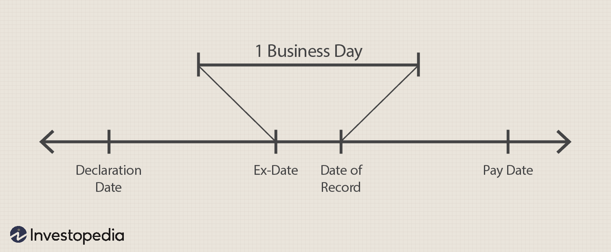

## Table of Contents

## What is a stock dividend?

A stock dividend is when a company gives its shareholders more shares instead of money. Imagine you own 100 shares of a company, and they decide to give a 10% stock dividend. You would get 10 more shares, so you would then have 110 shares. This is different from a cash dividend, where the company would give you money instead of more shares.

The main reason companies give stock dividends is to keep the money they would have paid out as cash dividends. This can help the company grow or pay off debts. For shareholders, getting more shares can be good because it increases the number of shares they own without costing them anything. However, the price of each share usually goes down a bit after a stock dividend, so the total value of their investment might not change right away.

## Why do companies issue stock dividends?

Companies issue stock dividends mainly to keep their cash. Instead of giving money to shareholders, they give more shares. This helps the company save money that can be used for other things like growing the business or paying off debts. It's like choosing to reinvest in the company instead of giving the profits to shareholders directly.

For shareholders, getting more shares can be good because it increases the number of shares they own without them having to spend more money. However, right after a stock dividend, the price of each share usually goes down a bit. This means the total value of their investment might not change right away. Over time, if the company does well, the value of all the shares could go up, making the stock dividend beneficial for shareholders.

## How often are stock dividends typically distributed?

Stock dividends are not given out as often as cash dividends. Companies might give stock dividends once in a while, maybe once a year or even less often. It depends on what the company wants to do with its money and how it wants to reward its shareholders.

When a company decides to give a stock dividend, it usually tells everyone in advance. This way, shareholders know when they will get more shares. The company's board of directors makes this decision, and they look at the company's financial health and plans before deciding to issue stock dividends.

## What is the process for determining stock dividend amounts?

The process for deciding how many stock dividends a company gives starts with the company's board of directors. They look at the company's money situation and decide if they want to give out stock dividends. They might think about how much money the company has, how it's doing financially, and what plans they have for the future. After thinking about all these things, they choose a percentage for the stock dividend. For example, they might decide on a 5% stock dividend, which means shareholders get 5 more shares for every 100 shares they own.

Once the board decides on the percentage, they tell everyone about it. They set a date when shareholders need to own the stock to get the dividend, called the record date. Shareholders who own the stock on or before this date will get the extra shares. After the record date, the company gives out the new shares to the shareholders. The number of new shares each shareholder gets is based on how many shares they owned on the record date and the percentage the board chose.

## How does a company announce a stock dividend?

When a company decides to give a stock dividend, they start by telling everyone about it. The company's board of directors makes the decision and then shares it with the public. They usually do this through a press release or an official announcement on their website. This announcement includes important details like the percentage of the stock dividend, the date when shareholders need to own the stock to get the dividend, and when the new shares will be given out.

After the announcement, the company sets a record date. This is the day when shareholders need to own the stock to be eligible for the stock dividend. Shareholders who own the stock on or before this date will get the extra shares. Once the record date passes, the company then issues the new shares to the shareholders. The number of new shares each shareholder gets depends on how many shares they owned on the record date and the percentage of the stock dividend that was announced.

## What is the record date in the context of stock dividends?

The record date is an important day for stock dividends. It's the day when the company checks who owns their stock. If you own the stock on or before this date, you will get the stock dividend. If you buy the stock after the record date, you won't get the extra shares.

The company announces the record date when they tell everyone about the stock dividend. This gives shareholders time to make sure they own the stock by that date if they want to get the extra shares. After the record date, the company will give out the new shares to the people who were on the list of shareholders on that day.

## What is the ex-dividend date and how does it affect stock dividend eligibility?

The ex-dividend date is the first day when a stock trades without its upcoming dividend. If you buy the stock on or after this date, you won't get the stock dividend because you won't be on the company's list of shareholders on the record date. The ex-dividend date is usually set one business day before the record date. This gives the stock market time to settle trades so the company knows who gets the dividend.

This date is important because it helps everyone know when they need to buy the stock to get the dividend. If you want to get the extra shares from a stock dividend, you need to buy the stock before the ex-dividend date. If you buy it on or after that date, you'll miss out on the dividend because you won't be a shareholder on the record date.

## How are stock dividends distributed to shareholders?

When a company decides to give a stock dividend, they first tell everyone about it. They say how many extra shares shareholders will get and when they need to own the stock to get those shares. This date is called the record date. If you own the stock on or before the record date, you will get the extra shares. The company checks who owns their stock on this date and then gives out the new shares to those people.

After the record date, the company adds the new shares to the accounts of the shareholders who were eligible. The number of new shares each shareholder gets depends on how many shares they owned on the record date and the percentage of the stock dividend that was announced. For example, if the company gives a 10% stock dividend and you owned 100 shares, you would get 10 more shares. The company does all of this behind the scenes, and the new shares just show up in the shareholders' accounts.

## What are the tax implications of receiving stock dividends?

When you get stock dividends, it can affect your taxes. In many places, stock dividends are treated like regular dividends for tax purposes. This means you might have to pay taxes on the value of the new shares you get, even though you didn't get any money. The tax you owe depends on how much the new shares are worth when you get them and what the tax rules are where you live.

For example, if you get 10 new shares as a stock dividend and each share is worth $10, you might have to pay taxes on $100. But, you don't have to pay the tax right away. You only pay when you sell the new shares. If you hold onto the new shares for a while before selling them, you might pay a lower tax rate, depending on the tax laws in your country. It's a good idea to talk to a tax advisor to understand exactly how stock dividends will affect your taxes.

## How can stock dividends impact the stock price?

When a company gives out stock dividends, it usually makes the stock price go down a bit right away. This happens because the company is giving more shares to shareholders, so there are more shares out there. If nothing else changes, more shares mean each share is worth a little less. For example, if a company gives a 10% stock dividend, the stock price might drop by about 10% after the dividend is given out. This doesn't mean the total value of your investment goes down right away, because even though each share is worth less, you now have more shares.

Over time, the effect of stock dividends on the stock price can be different. If the company keeps doing well and making more money, the stock price might go up again. This can make the total value of your investment go up, even with the initial drop in price per share. Stock dividends can also make shareholders feel good because they get more shares without spending more money, which might make more people want to buy the stock. But, it's important to remember that the stock price can go up or down for many reasons, not just because of stock dividends.

## What are the differences between stock dividends and cash dividends?

Stock dividends and cash dividends are two ways companies can give money back to their shareholders. With stock dividends, the company gives shareholders more shares instead of money. For example, if you own 100 shares and the company gives a 10% stock dividend, you get 10 more shares. This doesn't cost you any money, but it does mean there are more shares out there, so the price of each share usually goes down a bit right away. On the other hand, cash dividends are when the company gives you actual money for each share you own. If you own 100 shares and the company gives a $1 cash dividend per share, you get $100.

The main reason companies give stock dividends instead of cash dividends is to keep their money. By giving more shares, the company can use the money they would have paid out to grow the business or pay off debts. For shareholders, getting more shares can be good because it increases the number of shares they own without them having to spend more money. However, the total value of their investment might not change right away because of the drop in the stock price. With cash dividends, shareholders get money they can spend or invest however they want, but the company has less money to use for other things. Both types of dividends have different effects on the company and the shareholders, and the choice between them depends on the company's goals and financial situation.

## How do stock dividends affect a company's financial statements and ratios?

When a company gives out stock dividends, it changes some parts of its financial statements. On the balance sheet, the company moves money from the retained earnings account to the common stock and additional paid-in capital accounts. Retained earnings go down because the company is giving part of its profits to shareholders. Common stock and additional paid-in capital go up because the company is giving more shares to shareholders. This doesn't change the total amount of equity on the balance sheet, just how it's divided up. On the income statement, stock dividends don't show up as an expense, so they don't affect the company's net income.

Stock dividends also change some financial ratios. The earnings per share (EPS) ratio goes down because there are more shares out there, so the company's total earnings are spread over more shares. The book value per share might go down too, for the same reason. The price-to-earnings (P/E) ratio could go up because the stock price usually drops after a stock dividend, and if the earnings stay the same, the P/E ratio goes up. The debt-to-equity ratio doesn't change because the total equity stays the same, even though it's split up differently. These changes can make the company look different to investors, but they don't change the company's actual financial health.

## What is Understanding Dividend Payment Investment?

Dividends represent a distribution of a portion of a company's earnings to shareholders, serving as a tangible reward for investing in the company's equity. Companies decide to distribute dividends based on several factors, including profitability, cash flow, growth prospects, and board policy. Typically, mature companies with stable earnings and fewer growth opportunities are more inclined to distribute dividends compared to high-growth companies that might reinvest profits into expanding operations.

There are critical dates associated with dividend payments that investors must understand. The declaration date is when a company formally announces a dividend and its amount. Following this, the ex-dividend date is crucial; it determines whether a shareholder is eligible to receive the declared dividend. To be eligible, investors must own the stock before the ex-dividend date. The record date is typically set a few days after the ex-dividend date, marking the official cutoff for determining the shareholders entitled to the dividend. Finally, the payment date is when the dividend is actually distributed to eligible shareholders.

Dividends contribute significantly to total returns, combining both income and capital appreciation. This can be expressed through the formula for total return:

$$
\text{Total Return} = \left(\frac{\text{Ending Price} - \text{Beginning Price} + \text{Dividends}}{\text{Beginning Price}}\right) \times 100
$$

This formula highlights how dividends supplement the returns investors receive from stock price appreciation, making them an essential component of a comprehensive investment strategy. Additionally, dividends provide a cushion during market [volatility](/wiki/volatility-trading-strategies), serving as an income stream irrespective of stock price movements.

## What are the types of dividends and what is their impact?

Dividends serve as a crucial component of a firm's policy for distributing profits to its shareholders. They come primarily in two forms: stock dividends and cash dividends, each with distinct characteristics and implications for both the issuing company and its investors.

### Stock Dividends vs. Cash Dividends

**Stock Dividends**: These involve the distribution of additional shares to existing shareholders, instead of cash. Stock dividends increase the total number of shares outstanding while allowing companies to retain cash for reinvestment or operational needs. This can be particularly appealing to investors looking for capital gains, as stock dividends typically increase an individual's total shareholding without any immediate tax consequences. However, the increase in the number of shares can lead to a dilution of earnings per share (EPS), which may affect the stock's market perception.

**Cash Dividends**: In contrast, cash dividends consist of direct payments made to shareholders, reflecting a company’s immediate profit-sharing and liquidity capacity. Cash dividends provide an immediate source of income, making them attractive for income-focused investors such as retirees. These dividends are typically taxed in the year they are received, which is an important consideration for shareholders.

### Impact of Dividends on Stock Prices and Investor Decisions

Dividends influence stock prices through both direct and indirect mechanisms. Generally, the announcement of a dividend can lead to a price increase, as it may signal a company's strong financial health and commitment to returning value to shareholders. Conversely, the declaration of lower-than-expected dividends or a dividend cut can result in a decline in stock prices, reflecting negatively on market sentiment.

Investors often interpret dividend announcements as indicators of a company's performance and future prospects. Companies that consistently pay and increase dividends are perceived as financially stable, attracting long-term investors. On the other hand, high dividends might also be viewed skeptically if they are not supported by sustainable earnings growth, potentially leading to strategic shifts in portfolio management.

### Dividend Yield and Payout Ratio

To assess the attractiveness of dividend-paying stocks, investors often use metrics such as dividend yield and payout ratio.

**Dividend Yield $Y$** is calculated using the formula:

$$

Y = \frac{\text{Annual Dividends per Share}}{\text{Price per Share}} \times 100 
$$

This metric measures the return on investment based solely on the dividends received relative to the stock price. A higher dividend yield is generally attractive to investors seeking regular income. However, it is crucial to analyze the sustainability of these yields, as very high yields might be unsustainable.

**Payout Ratio $P$** is another key metric, calculated as:

$$

P = \frac{\text{Dividends per Share}}{\text{Earnings per Share (EPS)}} \times 100 
$$

The payout ratio indicates the proportion of a company’s earnings distributed as dividends. A moderate payout ratio suggests that the company retains enough earnings for growth initiatives while rewarding shareholders. In contrast, an excessively high payout ratio might suggest that the company is prioritizing short-term shareholder returns at the expense of long-term growth and stability.

In conclusion, dividends are a multifaceted tool in investment strategies. By understanding the nuances of stock and cash dividends, and by leveraging key evaluation metrics like dividend yield and payout ratio, investors can make informed decisions to optimize their portfolios.

## What are Dividend Reinvestment Plans (DRIPs)?

Dividend Reinvestment Plans (DRIPs) offer a strategy for investors seeking to reinvest their cash dividends into additional shares or fractional shares of the underlying stock on the dividend payment date. This approach has several distinct advantages. 

**Advantages of Enrolling in DRIPs**

One of the primary benefits of DRIPs is the compounding effect. By consistently reinvesting dividends, investors purchase more shares, which can lead to an exponential increase in the total value of the investment over time. The compounding effect can be expressed through the formula:

$$
A = P \left(1 + \frac{r}{n}\right)^{nt}
$$

where $A$ is the amount of money accumulated after n years, including interest. $P$ is the principal investment amount, $r$ is the annual interest rate (expressed as a decimal), $n$ is the number of times that interest is compounded per unit $t$, and $t$ is the time the money is invested for. While this formula is typically used for interest calculations, it illustrates the potential growth of reinvested dividends.

Furthermore, DRIPs typically allow investors to purchase shares without brokerage fees or at a reduced cost, thereby lowering the overall investment expenses over time. This cost-effectiveness is particularly advantageous for long-term investors seeking to maximize their portfolio value without being eroded by transaction fees.

**Suitability of DRIPs for Different Types of Investors**

DRIPs are more suitable for investors with a long-term focus as they capitalize on the benefits of compounding growth. Younger investors, or those who are not reliant on current income from dividends, might find DRIPs especially beneficial for building wealth over time. These plans offer an automatic and disciplined approach to investing, which can be particularly advantageous for investors who prefer not to actively manage their portfolio.

Conversely, investors who require immediate income from their investments, such as retirees, might find DRIPs less suitable. These individuals may prefer receiving dividend payments directly as cash to support their lifestyle. Additionally, DRIPs may not be ideal for investors seeking to diversify their portfolio across multiple asset classes quickly, as the reinvestment focuses specifically on the company issuing the dividends.

In conclusion, DRIPs can be a valuable tool for many investors, particularly those with a long-term investment horizon and a focus on growth through reinvestment. By reducing transaction costs and benefiting from compounding returns, DRIPs suit investors who are less reliant on dividend income and more interested in accumulating wealth over time.

## What are the risks and considerations?

Dividend investing carries specific risks that investors should carefully consider. Among these, market volatility is a significant concern. Dividend-paying stocks, while often perceived as stable investments, are not immune to fluctuations in the broader market. During periods of economic downturn or high volatility, the prices of these stocks can be adversely affected. This can lead to reduced market value and, in some cases, dividend cuts or suspensions if companies experience financial strain.

Furthermore, [interest rate](/wiki/interest-rate-trading-strategies) fluctuations can influence dividend stocks. Rising interest rates can make fixed-income investments like bonds more attractive, potentially leading investors to shift from dividend stocks, thereby decreasing their prices. Companies may also struggle with higher borrowing costs in a high-interest-rate environment, impacting their ability to maintain dividend payments.

Another risk associated with dividend investing is company-specific risk. While some companies have a long history of stable dividend payments, there is no guarantee of future payouts. A company may reduce or eliminate dividends due to poor financial performance, changes in corporate strategy, or economic challenges.

To mitigate these risks, diversification is a key strategy. Investors should construct a diversified portfolio encompassing various sectors and industries, reducing the impact of a downturn in any individual area. It's also advisable to focus on companies with strong cash flows and a solid history of maintaining and growing dividends.

Investors should monitor financial performance and payout ratios closely when selecting dividend-paying stocks. Companies with a high payout ratio may be less able to sustain dividend payments during economic hardship. The payout ratio is calculated as follows:

$$
\text{Payout Ratio} = \left(\frac{\text{Dividends Per Share}}{\text{Earnings Per Share}}\right) \times 100
$$

Moreover, investors can employ [algorithmic trading](/wiki/algorithmic-trading) strategies to optimize entry and [exit](/wiki/exit-strategy) points in dividend stocks, thus potentially improving returns while managing risk exposure. Additionally, using Dividend Reinvestment Plans (DRIPs) can help compound growth and diminish the impact of short-term market volatility by averaging down the cost of shares over time.

By understanding and addressing these risks, investors can better position themselves to reap the benefits of dividend stocks while minimizing potential downsides.

## References & Further Reading

[1]: Graham, B. (2006). ["The Intelligent Investor: The Definitive Book on Value Investing."](https://www.amazon.com/Intelligent-Investor-Definitive-Investing-Essentials/dp/0060555661) HarperBusiness.

[2]: Lopez de Prado, M. (2018). ["Advances in Financial Machine Learning"](https://www.amazon.com/Advances-Financial-Machine-Learning-Marcos/dp/1119482089). Wiley.

[3]: Aronson, D. R. (2007). ["Evidence-Based Technical Analysis: Applying the Scientific Method and Statistical Inference to Trading Signals"](https://onlinelibrary.wiley.com/doi/book/10.1002/9781118268315). Wiley.

[4]: Jansen, S. (2020). ["Machine Learning for Algorithmic Trading: Predictive Models to Extract Signals from Market and Alternative Data for Systematic Trading Strategies with Python"](https://www.amazon.com/Machine-Learning-Algorithmic-Trading-alternative/dp/1839217715). Packt Publishing.

[5]: Chan, E. P. (2008). ["Quantitative Trading: How to Build Your Own Algorithmic Trading Business"](https://github.com/ftvision/quant_trading_echan_book). Wiley.

[6]: Bodie, Z., Kane, A., & Marcus, A. J. (2014). ["Investments"](https://www.mheducation.com/highered/product/investments-bodie-kane/M9781264412662.html). McGraw-Hill Education.

[7]: Fabozzi, F. J., Focardi, S. M., & Kolm, P. N. (2006). ["Financial Modeling of the Equity Market: From CAPM to Cointegration"](https://www.semanticscholar.org/paper/Financial-Modeling-of-the-Equity-Market%3A-From-CAPM-Fabozzi-Focardi/33b695c42a8097e1c990ff35927e73ba5ad24b15). Wiley.

[8]: Yahoo Finance. (n.d.). [Dividend Stocks](https://finance.yahoo.com/news/seeking-least-8-dividend-yield-100352296.html).

[9]: Bloomberg. (n.d.). [Markets: Dividend Stocks](https://money.usnews.com/investing/articles/high-paying-dividend-stocks-in-the-s-p-500).