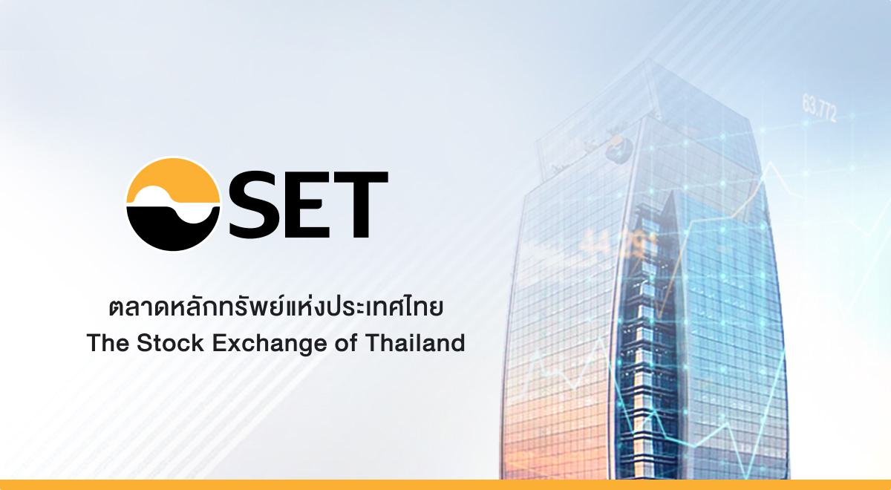

The Stock Exchange of Thailand (SET), established in 1975, serves as the principal securities trading platform in Thailand. It plays a crucial role in the country's economic growth by facilitating capital mobilization, which aids in industrialization and overall economic expansion. Over the years, SET has become an integral component of Thailand's financial infrastructure, aiding in the development and stabilization of the national economy by providing a platform for companies to raise capital and for investors to participate in the financial markets.

In contemporary financial markets, algorithmic trading—executing orders through pre-programmed trading instructions—has become increasingly prevalent. This trading strategy is not limited to developed markets; it has also made significant inroads into emerging markets such as Thailand. The use of algorithms in trading brings numerous advantages, including increased execution speed and the ability to rapidly capitalize on market opportunities. These factors contribute to the growing adoption of algorithmic trading on the SET.



This article examines the multifaceted impact of algorithmic trading on the Stock Exchange of Thailand. It considers the regulatory frameworks governing such activities, the advantages and efficiencies brought by algorithmic trading, as well as the challenges and risks inherent in this form of trading. Through this exploration, we aim to provide a comprehensive understanding of how algorithmic trading integrates with the SET and its implications for the future of financial trading in Thailand.

## Table of Contents

## History of the Stock Exchange of Thailand

The concept of a securities market in Thailand has its roots in the early 1960s when the country was undergoing significant economic planning and development. During this period, there was an increasing recognition of the need for a formalized market for securities to facilitate economic growth and industrialization. This led to discussions and initiatives aimed at establishing a structured trading platform.

The process towards formalizing the stock market materialized with the ratification of the Securities Exchange of Thailand Act in 1974. This legislative act provided the legal framework necessary for the creation and operation of a stock exchange, setting the groundwork for a modern securities market in Thailand. It was a pivotal step in the country's economic history, laying the foundation for a regulated environment where investors could engage in securities trading.

Following the enactment of this crucial legislation, the Stock Exchange of Thailand (SET) was officially established. The SET commenced operations on April 30, 1975. This date marks a significant milestone not only for the Thai capital market but also for the broader economic landscape of Thailand. The establishment of the SET provided a centralized venue for securities trading, enhancing capital mobilization and contributing to Thailand's economic development by attracting both local and foreign investment.

Since its inception, the SET has been a key player in the financial development of Thailand, adapting to various changes in the economic environment and continuously evolving to meet the demands of modern financial markets. This historical foundation set the stage for expansion and innovation, making the SET a crucial component of Thailand's ongoing economic strategy.

## Growth and Development of SET

Over the years, the Stock Exchange of Thailand (SET) has experienced significant growth and development, positioning itself as a pivotal component of the Thai financial landscape. Initially instituted to facilitate the mobilization of capital and contribute to the nation's economic industrialization, SET has embraced a multi-faceted approach to expand its operations.

SET's progression is marked by its diversification into various financial instruments beyond traditional equities. It has introduced derivatives, bonds, and mutual funds, providing a broader spectrum of investment avenues for traders and investors. Additionally, the Thai futures market, known as the Thailand Futures Exchange (TFEX), operates under SET, offering futures and options as strategic hedging tools, thereby enhancing the robustness of financial product offerings ([Stock Exchange of Thailand](https://www.set.or.th)).

In parallel with its diversified financial instruments, SET has prioritized the adoption of modern technologies and trading systems to boost the efficiency and transparency of its operations. The implementation of advanced trading platforms and real-time market surveillance systems has enabled SET to maintain high standards of operational excellence. These technological advancements have played a crucial role in shortening trading cycles and streamlining the dissemination of market information, thus facilitating informed decision-making by market participants.

In recent years, SET has also made strides in digital transformation initiatives. Efforts to adopt blockchain technology aim to enhance the settlement processes and decentralize record-keeping, promising increased security and reduced counterparty risks. Furthermore, risk management practices have been reinforced through innovative data analytics and monitoring systems, ensuring higher resilience against market volatilities.

On the regulatory front, SET's growth strategy encompasses strict adherence to international standards, fostering a secure and transparent trading environment. This comprehensive framework not only safeguards investor interests but also enhances SET's credibility in the global market, potentially attracting foreign investments.

Overall, the continual growth and development of SET exemplify a commitment to evolving with global financial trends. By expanding its financial instruments and embracing cutting-edge technologies, SET has solidified its role as a central actor in facilitating capital flow and fostering economic development in Thailand.

 to Algorithmic Trading

Algorithmic trading refers to the use of computer programs to execute trading orders based on pre-defined criteria, often encompassing mathematical models, complex algorithms, and a diversified set of trading rules. This approach revolutionizes traditional trading by significantly increasing the speed and efficiency of transactions. By automating the trading process, [algorithmic trading](/wiki/algorithmic-trading) enables market participants to respond instantaneously to market movements and leverage opportunities in real time.

The main benefit of algorithmic trading lies in its capacity to process vast amounts of market data at high speeds, allowing for trade execution in fractions of a second. This is crucial in today's fast-paced financial markets where price fluctuations occur rapidly. The automation aspect ensures that trades are implemented based on quantitative and technical factors rather than human emotions, which can result in emotional biases and errors in decision-making.

In practical terms, an algorithmic trading system might look like a set of directives coded in Python. For example:

```python
# Example of a simple moving average crossover strategy
def moving_average_crossover(data, short_window, long_window):
    data['short_moving_avg'] = data['price'].rolling(window=short_window).mean()
    data['long_moving_avg'] = data['price'].rolling(window=long_window).mean()

    data['signal'] = 0
    data['signal'][short_window:] = np.where(data['short_moving_avg'][short_window:] 
                                              > data['long_moving_avg'][short_window:], 1, -1)

    data['positions'] = data['signal'].diff()
    return data

# Data is a pandas DataFrame containing price data
```

This script represents a simple moving average crossover strategy, where trades are placed when a shorter-term moving average crosses a longer-term one, which is a common technique used in algorithmic trading. The execution of these strategies depends heavily on computational algorithms, which can evaluate numerous data points and execute trades accordingly, with little to no human intervention.

Moreover, the efficiency of algorithmic trading reduces transaction costs due to decreased market impact and improved order precision. This precision is achieved through various strategies such as statistical [arbitrage](/wiki/arbitrage), market-making, and trend-following algorithms, contributing to the creation of [liquidity](/wiki/liquidity-risk-premium) and healthy market dynamics. These strategies are aided by the sophisticated hardware and software infrastructure provided by financial exchanges.

In summary, algorithmic trading is a cutting-edge technique that enhances trading activities by leveraging speed, precision, and adaptability through automated systems, providing a substantial edge to traders navigating the complexities of modern financial markets.

## Impact of Algorithmic Trading on SET

Algorithmic trading has significantly transformed the Stock Exchange of Thailand (SET) by improving various facets of market operations. One of the primary impacts of algorithmic trading is the enhancement of market liquidity. By automating trade executions, algorithms facilitate a higher [volume](/wiki/volume-trading-strategy) of trades that are processed instantaneously. This increase in trading frequency and volume contributes to deeper liquidity, allowing market participants to buy or sell large blocks of securities with minimal price impact. This is crucial for maintaining market stability and ensuring that prices reflect the true value of traded securities.

Moreover, algorithmic trading has led to reduced transaction costs on SET. Traditional trading methods often involve substantial costs related to human intervention, such as brokerage fees and market impact costs. Algorithms, however, can execute trades with efficiency and precision, minimizing these expenses. As a result, traders and investors benefit from tighter bid-ask spreads and lower overall costs, making the market more attractive for both domestic and international investors.

The automation of trade processes also ensures increased precision in trade execution. Algorithms operate according to predefined criteria, executing trades based on precise calculations and eliminating human errors. This results in consistent and accurate trade executions that align closely with the trader's strategic intentions. The reliability and speed of algorithmic trading mean that opportunities for arbitrage can be more effectively exploited, and sudden price fluctuations can be addressed instantaneously.

In addition to liquidity and cost benefits, algorithmic trading contributes to improved market dynamics on SET. By participating in the price discovery process, algorithms help to incorporate new information swiftly into asset prices. This leads to a more efficient market, where prices more accurately reflect available information. Furthermore, the presence of algorithms in trading can lead to more robust market structures as they facilitate high-frequency trading strategies that often provide continuous market presence and stability.

In summary, algorithmic trading has had a profound impact on the Stock Exchange of Thailand by enhancing liquidity, reducing transaction costs, increasing trade execution precision, and improving market dynamics. These contributions play a vital role in fostering a more efficient and attractive marketplace, supporting the overall growth and development of the Thai financial environment.

## Regulations Governing Algorithmic Trading on SET

The Stock Exchange of Thailand (SET) employs a robust regulatory framework to oversee algorithmic trading activities. This framework is designed to maintain market integrity and protect investors. It includes comprehensive guidelines and risk management practices to prevent market manipulation and ensure a fair trading environment.

SET's algorithmic trading regulations focus on several critical areas. Firstly, firms engaged in algorithmic trading must ensure their trading systems are reliable and have the necessary capacity to handle the scale of operations without introducing systemic risks. This requirement involves rigorous stress testing and regular system audits.

Risk management is another cornerstone of SET's regulations. Firms must implement real-time monitoring systems to oversee trading algorithms and detect potential anomalies or errors promptly. These systems help mitigate risks associated with erroneous trades and can automatically pause or cease trading if predefined thresholds are exceeded.

To prevent market manipulation, SET imposes strict rules regarding the deployment of algorithms. These rules include prohibitions against practices such as spoofing, where misleading orders are placed with no intention of execution to influence asset prices. Compliance with these rules is monitored continuously, with severe penalties for violations.

Additionally, firms must maintain detailed records of their algorithmic trading activities. These records assist in audit trails and ensure transparency in trading operations. Such documentation is crucial in investigating any market incidents and reinforces firms’ accountability.

SET also requires algorithmic trading firms to establish a robust governance structure, which includes a clear delineation of responsibilities and oversight by senior management. This structure ensures that there is comprehensive oversight over the development, deployment, and operation of algorithmic trading systems.

The regulatory framework is complemented by SET's efforts in investor education, which aim to enhance market participants' understanding of algorithmic trading. Through educational initiatives, investors are made aware of the potential benefits and risks associated with algorithmic trading, promoting informed decision-making.

Overall, SET's regulations for algorithmic trading are designed to foster a safe and efficient trading environment while enabling the market to reap the benefits of advanced trading technologies. The continuous evolution of these regulations reflects SET's commitment to adapt to technological advancements and emerging market practices.

## Challenges and Risks of Algorithmic Trading

Algorithmic trading, while offering substantial advantages such as increased liquidity and reduced transaction costs, also presents several challenges and risks on the Stock Exchange of Thailand (SET). One primary concern is the potential for heightened market [volatility](/wiki/volatility-trading-strategies). The high speed and volume of trades executed by algorithms can sometimes lead to rapid price movements, exacerbating volatility during market fluctuations. For instance, algorithmic strategies, like high-frequency trading, can exploit minor price discrepancies, but during periods of stress, they might amplify price swings due to their speed and scale.

Another significant challenge is systemic risk. The interconnected nature of financial markets means that a failure or malfunction in one algorithm can potentially lead to widespread disruptions. An example is the "flash crash" phenomenon, where rapid, automated trading can spark drastic and sudden declines in stock prices. These events highlight the susceptibility of markets to algorithm-induced disruptions, raising concerns about the stability and resilience of financial systems.

To mitigate these risks, SET has established a comprehensive regulatory framework that includes stringent guidelines and risk management practices. These measures are aimed at preventing market manipulation and ensuring fair trading conditions. SET's regulations focus on continuous monitoring of trading activities to detect and address suspicious market behaviors promptly. They also emphasize investor education, helping market participants understand the implications of algorithmic trading and the mechanisms in place to safeguard their investments.

An essential part of this regulatory effort is stress testing and circuit breakers, which are designed to temporarily halt trading in the event of extreme price movements, allowing time for stabilization and preventing further volatility. Additionally, SET encourages transparency in algorithmic strategies, requiring firms to disclose their trading algorithms and ensure they are robust against market disruptions.

Despite these precautions, challenges remain in anticipating and managing the full spectrum of risks associated with algorithmic trading. The pace of technological advancement necessitates continuous updates to the regulatory framework and trading practices. By doing so, SET aims to balance the benefits of algorithmic trading with the imperative of maintaining market integrity and investor confidence.

## The Future of Algorithmic Trading on SET

The future of algorithmic trading on the Stock Exchange of Thailand (SET) is poised for significant evolution, driven by advancements in technology and changes in regulatory frameworks. As algorithmic trading continues to mature, the integration of [artificial intelligence](/wiki/ai-artificial-intelligence) (AI) and [machine learning](/wiki/machine-learning) (ML) is expected to become increasingly prominent. These technologies offer the potential to augment trading strategies by analyzing vast datasets to identify patterns and optimize decision-making processes. For instance, AI can be utilized to enhance predictive analytics, thereby enabling traders to anticipate market trends and execute trades with improved accuracy.

As the trading landscape becomes more complex, continuous innovation in trading strategies will be crucial. Future developments may include the use of sophisticated algorithms capable of processing high-frequency data and performing tasks traditionally managed by humans, such as risk assessment and portfolio optimization. Additionally, the application of natural language processing (NLP) could allow systems to interpret news and market sentiment, further refining the strategic approaches used in algorithmic trading.

A significant aspect of the future involves the evolution of regulatory frameworks to keep pace with technological advancements. Regulatory bodies, including the SET, are likely to adopt a proactive approach in monitoring and managing the risks associated with algorithmic trading. This may involve the enhancement of existing guidelines and the introduction of new policies that address emerging challenges such as cybersecurity threats and the ethical use of AI in trading systems.

To illustrate, consider a Python-based algorithm that employs machine learning for stock price prediction:

```python
import pandas as pd
from sklearn.ensemble import RandomForestRegressor
from sklearn.model_selection import train_test_split
from sklearn.metrics import mean_squared_error

# Load dataset
data = pd.read_csv('stock_data.csv')
features = data.drop('Price', axis=1)
target = data['Price']

# Split dataset
X_train, X_test, y_train, y_test = train_test_split(features, target, test_size=0.2, random_state=42)

# Initialize and train model
model = RandomForestRegressor(n_estimators=100, random_state=42)
model.fit(X_train, y_train)

# Make predictions
predictions = model.predict(X_test)
mse = mean_squared_error(y_test, predictions)

print(f'Mean Squared Error: {mse}')
```

This code exemplifies how machine learning models can be applied to predict stock prices, indicating the potential for leveraging technology to develop more refined trading strategies.

In conclusion, the future of algorithmic trading on SET will be shaped by the dual forces of technological innovation and regulatory oversight. As AI and ML continue to evolve, they will play a pivotal role in redefining the capabilities of algorithmic trading systems, while ongoing regulatory updates will ensure these practices align with market integrity and security. Through the harmonious integration of technology and regulation, the Stock Exchange of Thailand is likely to witness a robust and dynamic trading environment in the years to come.

## Conclusion

Algorithmic trading has become an indispensable facet of the Stock Exchange of Thailand, playing an essential role in cultivating a more robust and dynamic financial market. Through the implementation of advanced technologies and comprehensive regulations, SET has been adept in leveraging the advantages provided by algorithmic trading, such as enhanced liquidity, improved trade execution precision, and reduced transaction costs. These benefits have resulted in more efficient market operations and fostered an environment conducive to economic growth and investor confidence.

SET's strategic focus on integrating sophisticated algorithmic trading systems is further complemented by its commitment to maintaining market integrity through stringent regulatory frameworks. These regulations are designed to prevent market manipulation and mitigate systemic risks, thereby ensuring a transparent and equitable trading environment for all market participants. By continually refining its risk management practices and promoting investor education, SET demonstrates its dedication to safeguarding the interests of both institutional and retail investors.

Looking ahead, the Stock Exchange of Thailand is poised to capitalize on the growing adoption of technology in trading. Innovations in artificial intelligence and machine learning are expected to drive the evolution of algorithmic trading strategies, offering new opportunities for market participants to achieve superior trading outcomes. As these technological advancements unfold, SET's proactive approach in updating its regulatory frameworks and technologies will be vital in harnessing the full potential of algorithmic trading while preserving market stability.

In summary, the integration of algorithmic trading into the Stock Exchange of Thailand signifies a critical development in the progression of the Thai financial market. SET's balanced approach—embracing technological advancements and enforcing rigorous regulations—positions it to continue benefiting from the efficiencies and growth opportunities offered by algorithmic trading, all while maintaining the essential tenets of market fairness and integrity.

## References & Further Reading

[1]: Charoenwong, C., Ding, D. K., & Thompson, J. (2006). ["The Impact of Algorithmic Trading on the Market Quality of the Stock Exchange of Thailand."](https://www.scribd.com/document/812556697/Bailey-Et-Al-2018-Social-Connectedness-Measurement-Determinants-and-Effects) Social Science Research Network.

[2]: Hasbrouck, J., & Saar, G. (2013). ["Low-latency trading."](https://www.sciencedirect.com/science/article/abs/pii/S1386418113000165) The Review of Financial Studies, 26(9), 2095-2136.

[3]: Cartea, Á., Jaimungal, S., & Penalva, J. (2015). ["Algorithmic and High-Frequency Trading."](https://assets.cambridge.org/97811070/91146/frontmatter/9781107091146_frontmatter.pdf) Cambridge University Press.

[4]: Lopez de Prado, M. (2018). ["Advances in Financial Machine Learning."](https://www.amazon.com/Advances-Financial-Machine-Learning-Marcos/dp/1119482089) Wiley.

[5]: Hendershott, T., Jones, C. M., & Menkveld, A. J. (2011). ["Does Algorithmic Trading Improve Liquidity?"](https://onlinelibrary.wiley.com/doi/full/10.1111/j.1540-6261.2010.01624.x) The Journal of Finance, 66(1), 1-33.

[6]: Zohar, A., & Roth, A. E. (2015). ["The Future of Algorithmic Trading: A Legal Perspective."](https://scholar.google.com/citations?user=lUAGHd4AAAAJ&hl=en) The Journal of Trading, 10(3), 23-32. 

[7]: Arnuk, S., & Saluzzi, J. (2012). ["Broken Markets: How High Frequency Trading and Predatory Practices on Wall Street are Destroying Investor Confidence and Your Portfolio."](https://ptgmedia.pearsoncmg.com/images/9780132875240/samplepages/0132875241.pdf) FT Press.