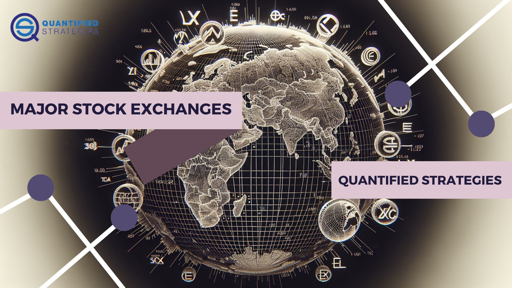

The financial markets have long been the backbone of modern economies, providing essential infrastructure for capital allocation and investment opportunities. These markets facilitate the transfer of funds from savers to businesses and governments, which are in need of capital for expansion and development projects. This system not only supports economic growth but also enables individuals and institutions to realize returns on investments.

In today's rapidly evolving financial ecosystem, stock exchange trading platforms and algorithmic trading play vital roles. Stock exchanges serve as marketplaces where securities, such as stocks and bonds, are bought and sold, ensuring liquidity and efficient price discovery. This structured environment allows investors to enter and exit positions in a regulated and transparent manner, thereby fostering confidence and stability in the financial markets.



The advancement of technology has significantly influenced trading activities. Traders and investors now leverage sophisticated tools to optimize their strategies, allowing for more efficient market participation. Algorithmic trading, in particular, has emerged as a critical component of modern market operations. By utilizing computer algorithms, traders can execute large numbers of trades at speeds and volumes unimaginable through manual means. This method reduces human error and emotional biases, enhancing decision-making and market efficiency.

This article will explore the fundamentals of stock exchanges, the functionality of trading platforms, and the innovative approaches in algorithmic trading. Understanding these components is essential for investors aiming to navigate and harness financial markets more effectively. Whether for individual investors managing personal portfolios or large institutions overseeing vast assets, the integration of technology in trading presents numerous opportunities for improved market outcomes. As we examine these domains, it becomes evident that knowledge and strategic planning are indispensable tools for success in the trading landscape.

## Table of Contents

## Understanding Stock Exchanges

Stock exchanges serve as crucial marketplaces where securities, such as stocks, bonds, and other financial instruments, are bought and sold. They play a pivotal role in the global economy by facilitating capital raising for companies and ensuring liquidity for investors. The origins of stock exchanges can be traced back to 17th-century Amsterdam. The Amsterdam Stock Exchange, established in 1602, was the first truly organized exchange, allowing for the trade of shares of the Dutch East India Company. Over the centuries, these exchanges have evolved into complex, digital environments that underpin modern financial markets.

One of the fundamental concepts of stock exchanges is the distinction between primary and secondary markets. In the primary market, securities are issued and sold for the first time, often through initial public offerings (IPOs). This process enables companies to raise capital by issuing shares to investors. The secondary market, on the other hand, involves the buying and selling of previously issued securities. Stock exchanges provide a platform for these transactions, offering liquidity by allowing investors to readily buy and sell shares.

Initial public offerings are a significant event for companies, marking the transition from private to public ownership. IPOs are conducted on stock exchanges, providing companies with access to a broad pool of investors and the capital needed for expansion and operational growth.

Market indices are another key concept associated with stock exchanges. Indices, such as the S&P 500, Dow Jones Industrial Average, and the Nasdaq Composite, track the performance of a selected group of stocks and serve as benchmarks for the overall market or specific sectors. Investors use these indices to gauge market trends, compare investment performance, and develop investment strategies.

Major stock exchanges, like the New York Stock Exchange (NYSE) and Nasdaq, dominate global trading activity. The NYSE, often considered the world's leading stock exchange, is characterized by its large market capitalization and traditional auction-based trading system. The Nasdaq, in contrast, operates as a fully electronic exchange, pioneering technological advancements in trading. Both exchanges provide a platform for high-[volume](/wiki/volume-trading-strategy) trading, enabling price discovery and efficient market operation.

An analysis of stock exchange operations reveals their impact on equity investing and economic health. Stock exchanges contribute to economic growth by facilitating capital formation, which companies can use for innovation, job creation, and expansion. By providing a venue for price discovery and [liquidity](/wiki/liquidity-risk-premium), exchanges enhance market efficiency and investor confidence. They also play a critical role in the regulatory framework, ensuring transparency and fair trading practices.

Overall, understanding the mechanics and significance of stock exchanges is essential for investors aiming to navigate the financial markets effectively, as these platforms continue to shape the landscape of equity investing and economic development.

## Types of Trading Platforms

Trading platforms are essential tools for executing buy and sell orders within financial markets, acting as intermediaries between traders and the vast network of markets. These platforms can be categorized into several types, each offering specific features and trading methodologies to suit the diverse needs of investors.

Traditional brokerage services are among the oldest and most established forms of trading platforms. They typically provide full-service capabilities, including access to a wide range of financial instruments, personalized investment advice, and in-depth research resources. Traditional brokers often cater to investors who prefer a more hands-on approach, offering customized services for managing investment portfolios. These platforms may not offer the same speed as more modern systems but excel in providing tailored support and expertise.

Electronic exchanges represent the modern evolution of trading platforms, offering automated and highly efficient trade execution. These platforms facilitate the trading of stocks, commodities, and other securities on organized exchanges like the New York Stock Exchange (NYSE) and Nasdaq. Electronic exchanges have revolutionized the trading landscape by drastically reducing transaction times and bringing transparency to market activities. They enable high-volume trading and are favored by institutional investors and high-frequency traders due to their reliability and operational efficiency.

Over-the-counter (OTC) markets offer a different trading experience by enabling transactions directly between parties without a centralized exchange. OTC platforms are often used for trading less liquid securities or customized financial products such as derivatives and currencies. This type of trading provides flexibility, allowing the negotiation of terms and prices between the buyer and seller. However, the lack of standardization and centralized oversight can introduce risks associated with counterparty defaults.

The advent of digital platforms has significantly increased the speed and efficiency of trading, introducing a plethora of tools designed for market analysis. These platforms often include real-time data feeds, advanced charting tools, and [algorithmic trading](/wiki/algorithmic-trading) capabilities. The integration of technology has facilitated the creation of mobile and web-based trading solutions that enable investors to trade on the go, broadening access to the financial markets.

Understanding the variety of trading platforms and their functionalities is crucial for investors as it enables them to align their trading environment with their specific investment strategies. Selecting the right platform involves considering factors such as cost, availability of research tools, ease of use, and the level of service provided. By choosing a platform that complements their trading objectives, investors can enhance their ability to execute informed investment decisions effectively.

## The Evolution of Algorithmic Trading

Algorithmic trading has fundamentally transformed the financial marketplace by implementing automated trading activities through sophisticated algorithms. These algorithms execute pre-defined trade instructions, harnessing real-time market data to minimize human error and emotional biases prevalent in traditional trading strategies. At the core, algorithmic systems rely on computer programs to facilitate rapid execution of trades, managing volumes unattainable through manual methods.

A primary advantage of algorithmic trading lies in its ability to perform consistent, unemotional market analysis. Traders construct detailed sets of rules or algorithms that guide when and how transactions are made. The process involves various strategies such as [trend following](/wiki/trend-following), where algorithms capitalize on the historical [momentum](/wiki/momentum) of security prices, and mean reversion, which bet on prices to revert to their historical average levels. 

The adaptability of algorithmic strategies makes them suitable for various market conditions. Trend-following strategies, for instance, might incorporate moving averages, where a short-term moving average crossing over a long-term average generates trade signals. This method hinges on the assumption that asset prices trending upwards or downwards will continue their trajectory for some time. In contrast, mean reversion algorithms identify securities that deviate significantly from historical averages, predicting a 'reversion' towards these averages.

Consider a simple Python snippet illustrating the construction of a basic trend-following algorithm using moving averages:

```python
def moving_average(trades, period):
    return sum(trades[-period:]) / period

def signal_strategy(prices, short_period, long_period):
    short_ma = moving_average(prices, short_period)
    long_ma = moving_average(prices, long_period)
    if short_ma > long_ma:
        return "Buy"
    elif short_ma < long_ma:
        return "Sell"
    else:
        return "Hold"
```

In this code, the strategy calculates short-term and long-term moving averages and generates buy, sell, or hold signals based on their relationship. This is a simplified example but encapsulates how rules-based systems function in a nutshell.

Algorithmic trading also introduces new participants to the world of finance by enabling them to engage with sophisticated trading practices. Novices can learn through simulation and practice, using [backtesting](/wiki/backtesting) to evaluate the effectiveness of their strategies over historical data without risking capital initially.

In conclusion, for both seasoned traders and newcomers, embracing algorithmic trading allows for more engaged and precise interaction with financial markets, fostering the potential for refined strategies and informed decision-making in modern trading environments.

## Leading Algorithmic Trading Platforms

Several platforms today offer robust capabilities for algorithmic trading, meeting the needs of both novice and experienced traders. TradeStation, [Interactive Brokers](/wiki/interactive-brokers-api), and Coinrule stand out among these platforms due to their diverse feature sets.

TradeStation is noted for its powerful backtesting engine, enabling traders to assess the viability of trading strategies against historical market data. It allows for complex scripting using the EasyLanguage programming language, catering to those comfortable with coding their trading strategies. TradeStation's integration with numerous financial instruments makes it a versatile choice for algorithmic traders seeking flexibility and comprehensive data analysis.

Interactive Brokers is another prominent platform offering extensive algorithmic trading functionalities. It supports a wide array of financial products across global markets, and its API is highly compatible with popular programming languages, such as Python. Python users can take advantage of its extensive libraries, like `pandas` for data manipulation and `numpy` for numerical operations, making it a suitable choice for tech-savvy traders who prefer to implement and automate sophisticated trading strategies themselves.

Coinrule, on the other hand, targets users looking for user-friendly interfaces without the necessity of in-depth programming knowledge. It provides a straightforward drag-and-drop interface to build trading rules and strategies. This platform is ideal for beginners eager to engage with algorithmic trading without delving into complex coding.

Selecting an appropriate platform depends on several factors. Users must consider their trading goals, the level of sophistication they wish to achieve, and the complexities of the strategies they plan to deploy. For instance, the cost of using the platform, the level of customer support available, and customization options are crucial considerations. A thorough evaluation of these aspects ensures informed decision-making, aligning trading technologies with individual trader preferences and strategic objectives.

## Risk and Benefits of Algo Trading

Algorithmic trading represents a significant advancement in trading technology by facilitating unparalleled efficiency, execution speed, and objectivity in trading decisions. Its transformative potential stems from the integration of computer algorithms to execute trades based on pre-defined criteria such as timing, price, and volume, thereby minimizing human intervention.

One of the most notable benefits of algorithmic trading is the ability to backtest strategies. This process involves applying trading algorithms to historical market data to evaluate their effectiveness and optimize performance before actual deployment. Backtesting affords traders the opportunity to refine their algorithms under various market conditions, ultimately leading to strategies that are better aligned with historical patterns and less prone to discretionary errors. This can be represented mathematically as follows: 

$$
\text{PnL} = \sum_{i=1}^{n} (p_i \cdot q_i - c_i)
$$

Where:
- $p_i$ is the price of the trade
- $q_i$ is the quantity of the asset
- $c_i$ represents transaction costs.

Despite these advantages, algorithmic trading is not devoid of risks. A primary concern is the over-reliance on technology, which may lead to systemic issues if unforeseen circumstances disrupt technological infrastructure. Potential system malfunctions or algorithmic errors can cause significant financial impacts, necessitating diligent system monitoring and fault-tolerant designs.

Additionally, algorithmic trading can exacerbate market [volatility](/wiki/volatility-trading-strategies). High-frequency trading algorithms, designed to trade large volumes rapidly, may amplify price movements, particularly in periods of low liquidity. This volatility can be both a risk and an opportunity, depending on how it is managed.

To mitigate these risks and maximize the benefits, traders should assess their risk tolerance and continuously monitor algorithmic systems. This involves setting up comprehensive risk management frameworks with parameters such as stop-loss limits and diversification across different trading strategies and asset classes.

Furthermore, traders are advised to remain flexible, making algorithm adjustments based on evolving market conditions. Such adaptability enhances the resilience of trading strategies, allowing them to capitalize on market opportunities effectively while managing associated risks.

By understanding and managing these dynamics, traders can harness algorithmic trading's full potential, achieving a balance between automated efficiency and proactive risk management for sustained success in financial markets.

## Conclusion

The integration of stock exchanges, advanced trading platforms, and algorithmic trading reflects the ever-evolving dynamics of financial markets. A comprehensive understanding of these components allows investors to position themselves strategically in this swiftly shifting environment. By leveraging advanced technology and sophisticated trading mechanisms, both retail and institutional investors can effectively harness the wide array of available opportunities. 

The future of trading is undeniably intertwined with technological advancements, pushing all participants to adopt innovative approaches and adapt continuously. As technology progresses, trading systems become more efficient, reducing latency and maximizing effectiveness. The successful navigation of contemporary financial markets demands strategic planning and informed decision-making, underscoring the importance of staying current with technological trends and market innovations. By embracing these developments and maintaining a proactive stance, investors can proficiently maneuver through the multifaceted landscape of modern finance.

## References & Further Reading

[1]: Domowitz, I. (2006). ["The Mechanics of Trading Markets."](https://faculty.haas.berkeley.edu/hender/ATMonitor.pdf) Journal of Financial Markets, 9(3), 197-298.

[2]: Hasbrouck, J., & Saar, G. (2013). ["Low-Latency Trading."](https://www.sciencedirect.com/science/article/abs/pii/S1386418113000165) The Review of Financial Studies, 26(9), 2092-2136.

[3]: "Algorithmic Trading and DMA: An Introduction to Direct Access Trading Strategies" by Barry Johnson

[4]: "Electronic and Algorithmic Trading Technology: The Complete Guide" by Kendall Kim

[5]: "The Intelligent Investor: The Definitive Book on Value Investing" by Benjamin Graham

[6]: Menkveld, A. J. (2013). ["High frequency trading and the new market makers."](https://www.sciencedirect.com/science/article/pii/S1386418113000281) Journal of Financial Markets, 16(4), 712-740.

[7]: "The Microstructure of Financial Markets" by Frank de Jong and Barbara Rindi