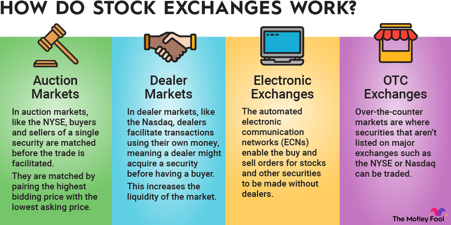

## Table of Contents

## What is a stock exchange?

A stock exchange is a place where people buy and sell shares of companies. It's like a big market, but instead of buying fruits or vegetables, you buy pieces of a company. When you buy a share, you own a small part of that company. People trade shares to make money, either by selling them for more than they paid or by getting dividends, which are like small payments from the company.

Stock exchanges help companies raise money too. When a company wants to grow, it can sell shares to the public. The money from selling these shares can be used to build new factories, hire more workers, or create new products. This way, the company gets the money it needs, and people who buy the shares can make money if the company does well. Some famous stock exchanges are the New York Stock Exchange and the NASDAQ.

## What are the main types of stock exchanges?

There are two main types of stock exchanges: physical and electronic. A physical stock exchange is a place where people meet in person to trade stocks. It's like a big room where traders shout and use hand signals to buy and sell shares. The New York Stock Exchange is a famous example of a physical stock exchange. 

An electronic stock exchange, on the other hand, is a computer system where people trade stocks online. Traders use computers and the internet to buy and sell shares without meeting in person. The NASDAQ is a well-known electronic stock exchange. Both types of exchanges help people trade stocks, but they do it in different ways.

## How does a physical stock exchange operate?

A physical stock exchange is like a big, busy room where people come to trade stocks. Traders, who are people that buy and sell shares, stand in this room and use loud voices and hand signals to communicate their trades. They might shout out the names of stocks and the prices they want to buy or sell them at. There are also special people called brokers who help other people trade their stocks. The brokers take orders from people who can't be in the room and help them buy or sell shares.

The trading happens all day, but there are specific times when the exchange is open for trading. During these times, the room is full of energy and noise as everyone tries to make their trades. When a buyer and a seller agree on a price, the trade is recorded and sent to a central system. This system keeps track of all the trades and makes sure everything is fair. At the end of the day, all the trades are settled, meaning the money and shares are moved to the right people. This way, a physical stock exchange helps people trade stocks face-to-face.

## What is an electronic stock exchange and how does it work?

An electronic stock exchange is a place where people buy and sell stocks using computers and the internet. Instead of meeting in a big room, traders use special computer programs to make their trades. They can do this from anywhere, as long as they have a computer and internet connection. This makes it easier and faster to trade stocks because you don't have to be in a specific place to do it.

When someone wants to buy or sell a stock, they use the computer program to place an order. The program shows them the current prices of stocks and lets them decide what they want to do. Once the order is placed, the computer system matches it with someone else who wants to make the opposite trade. For example, if you want to sell a stock, the system will find someone who wants to buy it at the price you're asking. The trade happens quickly, and the computer keeps track of everything to make sure it's fair and correct.

## What are the differences between a stock exchange and an over-the-counter (OTC) market?

A stock exchange is like a big, organized market where people buy and sell shares of companies. It can be a physical place where traders meet, like the New York Stock Exchange, or it can be electronic, like the NASDAQ. Stock exchanges have rules and regulations that everyone must follow, and they list companies that meet certain standards. When you trade on a stock exchange, you can see the prices and the number of shares being traded, which helps you make decisions.

An over-the-counter (OTC) market is different. It's like a less organized market where people trade stocks directly with each other, often without a central place or strict rules. OTC markets are used for stocks that might not meet the standards of big stock exchanges, like smaller companies or companies from other countries. Trading in an OTC market can be riskier because there's less information available and less oversight. But it can also be a way to find opportunities that aren't available on the big stock exchanges.

In summary, stock exchanges are more structured and regulated, while OTC markets are more flexible but can be riskier. Both serve important roles in the financial world, helping people trade stocks in different ways.

## How do regional stock exchanges differ from national stock exchanges?

A regional stock exchange is a place where people in a certain area buy and sell stocks. It focuses on companies from that area or nearby places. For example, a regional stock exchange in the Midwest might have more stocks from companies in that part of the country. These exchanges are smaller and might not have as many rules as bigger national exchanges. They help smaller companies get money to grow and let people in the area invest in local businesses.

A national stock exchange, on the other hand, is much bigger and covers the whole country. It lists stocks from big companies all over the nation. The New York Stock Exchange and the NASDAQ are examples of national stock exchanges. They have strict rules and a lot of oversight to make sure trading is fair. National exchanges are more well-known and usually have more trading activity because they attract investors from all over the country and even the world.

Both types of exchanges help companies raise money and let people invest, but they serve different needs. Regional exchanges are good for smaller, local companies and investors, while national exchanges are better for bigger companies and investors looking for a wider range of options.

## What role do stock exchanges play in the economy?

Stock exchanges are important for the economy because they help companies grow and create jobs. When a company wants to build new factories or start new projects, it can sell shares on a stock exchange to raise money. This money helps the company expand, which can lead to more jobs and more products or services for people to buy. When companies do well, the whole economy can benefit because more people have jobs and more money to spend.

Stock exchanges also help people save and invest their money. When people buy stocks, they are investing in companies they believe will do well. If the companies do well, the value of the stocks can go up, and people can make money. This encourages people to save and invest, which is good for the economy. Plus, when people feel confident about the stock market, they might spend more money, which can help the economy grow even more.

## How do listing requirements vary between different types of stock exchanges?

Listing requirements are the rules that a company must follow to have its stocks traded on a stock exchange. These rules can be different depending on the type of stock exchange. For big national stock exchanges like the New York Stock Exchange or the NASDAQ, the requirements are very strict. Companies need to have a certain amount of money, a minimum number of shares available to the public, and they must follow lots of rules about how they run their business and report their finances. These strict rules help make sure that the companies listed are strong and trustworthy.

Regional stock exchanges often have less strict listing requirements. They might allow smaller companies to list their stocks, which can help these companies grow and attract investors from their area. The rules might not be as detailed about how much money a company needs or how many shares it must have available. This makes it easier for smaller, local companies to get listed, but it can also mean that these stocks might be riskier for investors. Both types of exchanges have rules to protect investors, but the balance between helping companies grow and keeping investors safe can be different.

## What are dark pools and how do they function as a type of stock exchange?

Dark pools are a special type of stock exchange where people can buy and sell stocks without other people seeing what they are doing. They are called "dark" because the trades happen in secret, away from the public eyes. Big investors, like banks or big companies, use dark pools to trade large amounts of stocks without affecting the prices on the regular stock exchanges. If they traded on a regular exchange, everyone would see their big orders and the price of the stock might go up or down before they finish trading.

In a dark pool, the trades are matched up in a private computer system. When someone wants to buy or sell a stock, they put in their order, but no one else can see it. The system then looks for another order that matches it. If it finds a match, the trade happens right away, and no one outside the dark pool knows about it until after it's done. Dark pools can be helpful for big investors who want to keep their trades secret, but they can also make it harder for regular people to know what's happening in the stock market.

## How do stock exchanges regulate trading and ensure market integrity?

Stock exchanges have rules to make sure trading is fair and honest. They watch over all the trades to stop people from doing things like cheating or lying about stock prices. They use computers and special programs to check for anything that looks strange or wrong. If they find something, they can stop it and even punish the people who did it. This helps keep the market safe for everyone who wants to buy and sell stocks.

Stock exchanges also make companies follow rules about how they tell people about their business. Companies have to share important information, like how much money they are making or losing, so that people can make smart choices about buying or selling their stocks. If a company doesn't follow these rules, the stock exchange can stop them from trading or even kick them off the exchange. This way, the stock exchange helps make sure that the market is fair and that people can trust the information they get.

## What are the advantages and disadvantages of trading on a major stock exchange versus a smaller, niche exchange?

Trading on a major stock exchange has many benefits. These exchanges, like the New York Stock Exchange or the NASDAQ, are well-known and trusted by people all over the world. They have lots of different stocks to choose from, which means you can find big companies from many industries. Because they are so big, it's easy to buy and sell stocks quickly, and the prices are usually fair because so many people are trading. Major exchanges also have strict rules to make sure everything is fair and safe, which can give you more confidence when you're trading.

On the other hand, trading on a smaller, niche exchange can have its own advantages and disadvantages. These exchanges might focus on smaller companies or special kinds of stocks that you can't find on bigger exchanges. This can be a good way to find new opportunities that other people might not know about. But smaller exchanges might not have as many traders, which can make it harder to buy and sell stocks quickly. They also might not have as many rules, which can make trading riskier because there's less protection for investors. So, while you might find unique investment chances, you need to be careful and do your homework before trading on a smaller exchange.

## How do global stock exchanges interact and what are the implications for international investing?

Global stock exchanges are connected in many ways. When someone in one country wants to buy or sell stocks from another country, they can often do it through their local stock exchange. This is because big stock exchanges have agreements with each other to let people trade stocks from around the world. For example, if you live in the United States, you can buy stocks from a company in Japan through the New York Stock Exchange. This connection makes it easier for people to invest in companies from different countries without having to go to a foreign exchange.

The way global stock exchanges interact has big effects on international investing. It lets people spread their money across different countries, which can help them make more money and take less risk. If one country's economy is doing badly, the stocks in another country might still be doing well. But it also means that what happens in one part of the world can affect stock prices everywhere. For example, if there's a big problem in Europe, it might make stock prices go down in the United States too. So, while global stock exchanges open up many opportunities for investors, they also need to be careful and pay attention to what's happening around the world.

## What are the risks and benefits of algo trading?

Algorithmic trading represents a significant advancement in trading technology by facilitating unparalleled efficiency, execution speed, and objectivity in trading decisions. Its transformative potential stems from the integration of computer algorithms to execute trades based on pre-defined criteria such as timing, price, and volume, thereby minimizing human intervention.

One of the most notable benefits of algorithmic trading is the ability to backtest strategies. This process involves applying trading algorithms to historical market data to evaluate their effectiveness and optimize performance before actual deployment. Backtesting affords traders the opportunity to refine their algorithms under various market conditions, ultimately leading to strategies that are better aligned with historical patterns and less prone to discretionary errors. This can be represented mathematically as follows: 

$$
\text{PnL} = \sum_{i=1}^{n} (p_i \cdot q_i - c_i)
$$

Where:
- $p_i$ is the price of the trade
- $q_i$ is the quantity of the asset
- $c_i$ represents transaction costs.

Despite these advantages, algorithmic trading is not devoid of risks. A primary concern is the over-reliance on technology, which may lead to systemic issues if unforeseen circumstances disrupt technological infrastructure. Potential system malfunctions or algorithmic errors can cause significant financial impacts, necessitating diligent system monitoring and fault-tolerant designs.

Additionally, algorithmic trading can exacerbate market [volatility](/wiki/volatility-trading-strategies). High-frequency trading algorithms, designed to trade large volumes rapidly, may amplify price movements, particularly in periods of low liquidity. This volatility can be both a risk and an opportunity, depending on how it is managed.

To mitigate these risks and maximize the benefits, traders should assess their risk tolerance and continuously monitor algorithmic systems. This involves setting up comprehensive risk management frameworks with parameters such as stop-loss limits and diversification across different trading strategies and asset classes.

Furthermore, traders are advised to remain flexible, making algorithm adjustments based on evolving market conditions. Such adaptability enhances the resilience of trading strategies, allowing them to capitalize on market opportunities effectively while managing associated risks.

By understanding and managing these dynamics, traders can harness algorithmic trading's full potential, achieving a balance between automated efficiency and proactive risk management for sustained success in financial markets.

## References & Further Reading

[1]: Domowitz, I. (2006). ["The Mechanics of Trading Markets."](https://faculty.haas.berkeley.edu/hender/ATMonitor.pdf) Journal of Financial Markets, 9(3), 197-298.

[2]: Hasbrouck, J., & Saar, G. (2013). ["Low-Latency Trading."](https://www.sciencedirect.com/science/article/abs/pii/S1386418113000165) The Review of Financial Studies, 26(9), 2092-2136.

[3]: "Algorithmic Trading and DMA: An Introduction to Direct Access Trading Strategies" by Barry Johnson

[4]: "Electronic and Algorithmic Trading Technology: The Complete Guide" by Kendall Kim

[5]: "The Intelligent Investor: The Definitive Book on Value Investing" by Benjamin Graham

[6]: Menkveld, A. J. (2013). ["High frequency trading and the new market makers."](https://www.sciencedirect.com/science/article/pii/S1386418113000281) Journal of Financial Markets, 16(4), 712-740.

[7]: "The Microstructure of Financial Markets" by Frank de Jong and Barbara Rindi