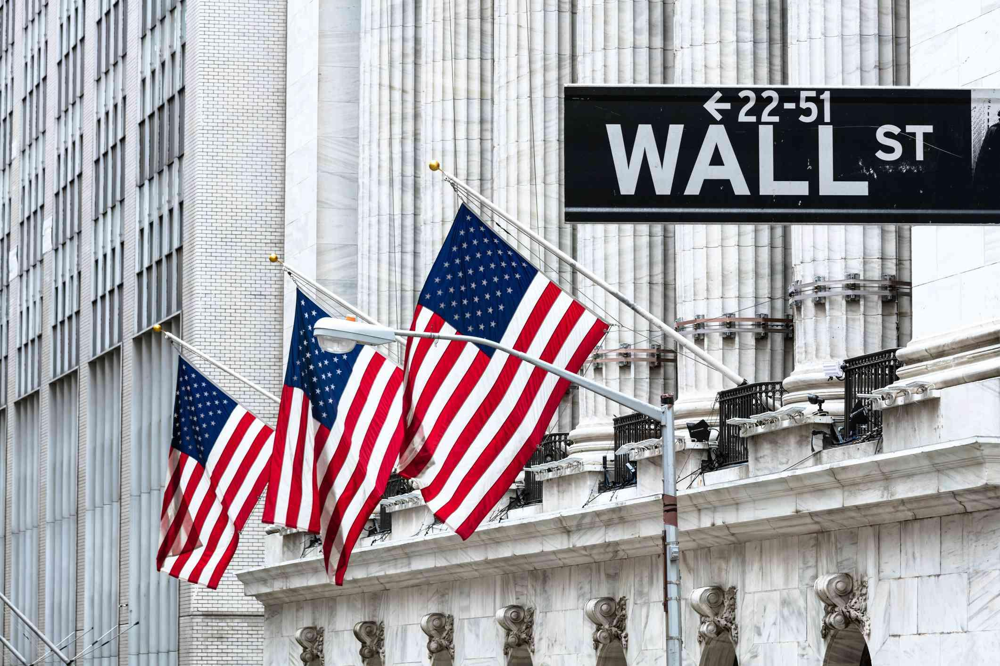

## Table of Contents

## What is a stock exchange?

A stock exchange is a place where people buy and sell shares of companies. It's like a big marketplace, but instead of buying fruits or clothes, people trade pieces of ownership in businesses. These shares are called stocks, and they represent a small part of a company. When you buy a stock, you become a part-owner of that company.

Stock exchanges help companies raise money by selling their stocks to the public. This money can be used to grow the business, create new products, or pay off debts. For people who buy the stocks, it's a way to invest their money and hopefully make more money if the company does well. The price of stocks can go up or down based on how well the company is doing and what's happening in the economy.

## How does a stock exchange work?

A stock exchange works like a big market where people can buy and sell pieces of companies called stocks. When a company wants to raise money, it can sell its stocks on the stock exchange. People who want to invest their money can buy these stocks. The price of a stock goes up if more people want to buy it than sell it, and it goes down if more people want to sell it than buy it. This buying and selling happens all the time during the trading hours of the stock exchange.

To buy or sell stocks, people usually use a broker, which is like a helper who knows how to make trades on the stock exchange. The broker uses a computer system to match buyers and sellers. When someone wants to buy a stock, the broker finds someone who wants to sell that stock at the same price, and they make the trade. All these trades are recorded, and the prices are shown on a big board so everyone can see them. This way, everyone knows how much stocks are worth at any time.

## What are the main functions of a stock exchange?

A stock exchange has a few main jobs. One big job is to help companies get money. When a company wants to grow or start new projects, it can sell pieces of itself, called stocks, on the stock exchange. People buy these stocks, and the money goes to the company. This is a good way for companies to get the money they need without borrowing from a bank.

Another important job of a stock exchange is to help people invest their money. When people buy stocks, they hope the company will do well and the price of the stock will go up. If it does, they can sell the stock for more money than they paid for it. The stock exchange makes it easy for people to buy and sell stocks whenever they want, as long as the exchange is open. This helps people make money and plan for the future.

## What are the differences between a stock exchange and an over-the-counter market?

A stock exchange is like a big, organized marketplace where people buy and sell stocks of companies. It has strict rules and is run by a group that makes sure everything is fair. When you want to buy or sell a stock, you go through a broker who uses the stock exchange's system to find someone to trade with. The prices of stocks are shown on a big board, so everyone can see them. Some famous stock exchanges are the New York Stock Exchange and the NASDAQ.

An over-the-counter (OTC) market is different because it's not as organized. It's more like a bunch of small shops where people can trade stocks that are not listed on a big stock exchange. These stocks might be from smaller companies or companies that don't meet the rules to be on a stock exchange. In an OTC market, people can still buy and sell stocks, but it's not as easy to find someone to trade with, and the prices might not be as clear. The OTC market is good for companies that want to sell their stocks but can't be on a big stock exchange.

The main differences between a stock exchange and an OTC market are how organized they are and the kinds of stocks they trade. A stock exchange is very organized with clear rules and prices, while an OTC market is less organized and can be harder to use. Also, stock exchanges usually have bigger, more well-known companies, while OTC markets have smaller or less-known companies.

## How can someone start trading on a stock exchange?

To start trading on a stock exchange, the first thing you need to do is open a brokerage account. A brokerage account is like a special bank account that lets you buy and sell stocks. You can choose a broker, which is a company that helps people trade on the stock exchange. Some popular brokers have websites and apps that make it easy to start an account. Once you have your account set up, you'll need to put some money into it. This money is what you'll use to buy stocks.

After you have your brokerage account and some money in it, you can start trading. To buy a stock, you need to find the company you want to invest in and decide how many shares you want to buy. Your broker will show you the current price of the stock, and you can place an order to buy it. Once your order is filled, you own a piece of that company. You can keep the stock and hope its price goes up, or you can sell it later if you think it's a good time. Trading on a stock exchange can be exciting, but it's important to learn about the companies you're investing in and understand the risks involved.

## What are the major stock exchanges in the world?

The world has many big stock exchanges where people buy and sell stocks. One of the most famous is the New York Stock Exchange (NYSE) in the United States. It's the biggest stock exchange in the world and has been around for over 200 years. Another important one in the U.S. is the NASDAQ, which is known for having a lot of technology companies. In Asia, the Tokyo Stock Exchange in Japan and the Shanghai Stock Exchange in China are very important. They help many companies in those countries get money to grow.

In Europe, the London Stock Exchange in the United Kingdom and the Euronext, which includes exchanges in France, Belgium, Portugal, and the Netherlands, are major players. The Frankfurt Stock Exchange in Germany is also big and important. These exchanges help companies from all over Europe raise money and let people invest in them. Each of these stock exchanges has its own rules and ways of doing things, but they all help people trade stocks and help companies grow.

## What is the role of stock exchange indices?

Stock exchange indices are like scoreboards for the stock market. They show how a group of stocks is doing overall. For example, the Dow Jones Industrial Average in the U.S. tracks 30 big companies to give an idea of how the whole market is doing. When the index goes up, it means the prices of those stocks are going up, and when it goes down, the prices are going down. This helps people see if the market is doing well or not without having to look at every single stock.

Indices are also used by investors to compare their own investments. If someone's stocks are doing better than the index, they might feel good about their choices. Also, some people use indices to decide what to invest in. They might buy a fund that tries to match the performance of an index, like the S&P 500, which tracks 500 big U.S. companies. This way, they can invest in a lot of different companies at once and spread out their risk.

## How do stock exchanges regulate trading and ensure fairness?

Stock exchanges have strict rules to make sure trading is fair and everyone follows the same guidelines. They have special groups that watch the market all the time to catch any bad behavior, like people trying to cheat or trick others. If someone breaks the rules, they can get in big trouble, like being fined or not allowed to trade anymore. This helps keep the market honest and safe for everyone.

Another way stock exchanges ensure fairness is by setting clear rules for how stocks are bought and sold. They use computer systems to match buyers and sellers at the best possible price, so everyone gets a fair chance. They also make sure that all the information about stocks, like their prices and how much they are traded, is shown clearly for everyone to see. This helps people make smart choices and keeps the market open and fair.

## What impact do stock exchanges have on the economy?

Stock exchanges help the economy grow by letting companies raise money. When a company wants to get bigger or start new projects, it can sell pieces of itself, called stocks, on the stock exchange. People buy these stocks, and the money goes to the company. This helps the company grow without having to borrow money from a bank. When companies grow, they can hire more people and make more products, which is good for the whole economy.

Stock exchanges also help people save and invest their money. When people buy stocks, they hope the company will do well and the price of the stock will go up. If it does, they can sell the stock for more money than they paid for it. This way, people can save for the future and have more money to spend. When people feel good about the stock market, they spend more money, which helps the economy grow even more.

## How have technological advancements affected stock exchanges?

Technological advancements have made big changes to how stock exchanges work. Before, people had to call their brokers on the phone or even go to the stock exchange to buy and sell stocks. Now, with computers and the internet, you can trade stocks from your own home using a website or an app on your phone. This makes it a lot easier and faster for people to trade. Computers also help make trading fairer by matching buyers and sellers quickly and showing the prices of stocks clearly for everyone to see.

Another way technology has changed stock exchanges is by making them more secure and reliable. Computers can watch the market all the time to catch any cheating or mistakes. They can also keep a lot of information and do complicated math to help people make smart choices about what stocks to buy or sell. With technology, stock exchanges can handle a lot more trades every day, which helps the economy grow.

## What are the risks associated with trading on stock exchanges?

Trading on stock exchanges can be risky because the prices of stocks can go up and down a lot. If you buy a stock and its price goes down, you could lose money. Sometimes, the whole market can go down, which means many stocks lose value at the same time. This can happen because of big events like a recession or a crisis. It's hard to predict what will happen, so there's always a chance you might lose some or all of the money you invest.

Another risk is that you might not know enough about the companies you're investing in. If you don't do your homework and understand what the company does and how it's doing, you might make bad choices. Some people also get tricked by false information or scams. It's important to be careful and learn as much as you can before you start trading. Even then, there's no guarantee that you'll make money, so it's wise to only invest money you can afford to lose.

## What advanced trading strategies can be used on stock exchanges?

One advanced trading strategy is called "[day trading](/wiki/day-trading-spy)." Day traders buy and sell stocks within the same day, trying to make money from small changes in stock prices. They use a lot of computer tools and charts to help them decide when to buy and sell. Day trading can be risky because it's hard to predict what will happen in just one day, but it can also be exciting and rewarding if you're good at it.

Another strategy is "swing trading," where you hold onto stocks for a few days or weeks. Swing traders look for patterns in stock prices that suggest the price will go up or down soon. They buy stocks when they think the price is about to go up and sell them when they think it's about to go down. This strategy needs a lot of patience and good timing, but it can be less stressful than day trading because you don't have to watch the market all the time.

A third strategy is "[algorithmic trading](/wiki/algorithmic-trading)," where you use computer programs to make trades for you. These programs follow rules that you set up based on math and data. For example, the program might buy a stock when its price reaches a certain level and sell it when it goes up by a certain amount. Algorithmic trading can be very fast and can handle a lot of trades, but it needs a good understanding of how to program and analyze data.

## References & Further Reading

[1]: Bergstra, J., Bardenet, R., Bengio, Y., & Kégl, B. (2011). ["Algorithms for Hyper-Parameter Optimization."](https://dl.acm.org/doi/10.5555/2986459.2986743) Advances in Neural Information Processing Systems 24.

[2]: ["Advances in Financial Machine Learning"](https://www.amazon.com/Advances-Financial-Machine-Learning-Marcos/dp/1119482089) by Marcos Lopez de Prado

[3]: ["Evidence-Based Technical Analysis: Applying the Scientific Method and Statistical Inference to Trading Signals"](https://www.amazon.com/Evidence-Based-Technical-Analysis-Scientific-Statistical/dp/0470008741) by David Aronson

[4]: ["Machine Learning for Algorithmic Trading"](https://github.com/stefan-jansen/machine-learning-for-trading) by Stefan Jansen

[5]: ["Quantitative Trading: How to Build Your Own Algorithmic Trading Business"](https://www.amazon.com/Quantitative-Trading-Build-Algorithmic-Business/dp/1119800064) by Ernest P. Chan