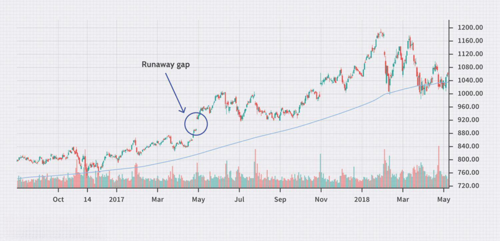

## Table of Contents

## What is a stock gap?

A stock gap happens when a stock's price jumps from one price to another without any trading in between. This usually happens when the market closes and then opens the next day at a different price. For example, if a stock closes at $50 on one day and opens at $55 the next day, there is a $5 gap.

Gaps can happen for many reasons. Sometimes, big news about a company comes out after the market closes, like a good earnings report or a new product announcement. This news can make investors want to buy or sell the stock as soon as the market opens, causing the price to jump. Other times, gaps can happen because of overall market trends or economic news that affects many stocks at once.

## What are the different types of stock gaps?

There are a few different types of stock gaps. One type is called a breakaway gap. This happens when a stock's price suddenly moves out of a trading range it has been stuck in for a while. It usually means the stock is starting a new trend, either up or down. Another type is an exhaustion gap. This happens at the end of a big price move. It shows that the stock has been going up or down a lot, and now it might be ready to change direction.

Another type of gap is a runaway gap, also called a continuation gap. This happens in the middle of a strong trend. It shows that the stock is still moving in the same direction and the trend is likely to keep going. Lastly, there's a common gap, which is also called an area gap. These gaps are usually small and don't mean much. They often happen because of normal day-to-day changes in the market and don't start new trends or end old ones.

Understanding these different types of gaps can help investors make better decisions. For example, seeing a breakaway gap might make an investor want to buy a stock if they think the new trend will continue. On the other hand, seeing an exhaustion gap might make them want to sell if they think the stock's price is about to drop.

## Can you explain a 'breakaway gap' with an example?

A breakaway gap happens when a stock's price suddenly jumps out of a range it has been stuck in for a while. Imagine a stock that has been trading between $30 and $35 for a few months. If something big happens, like the company announces a new product that everyone wants, the stock might open at $40 the next day. That jump from $35 to $40 is a breakaway gap. It shows that the stock is starting a new trend and might keep going up.

For example, let's say a company called TechCo has been trading between $50 and $55 for a long time. Then, TechCo announces a breakthrough in their technology that could change the industry. The next day, the stock opens at $60. This $5 jump from $55 to $60 is a breakaway gap. Investors might see this gap and think the stock will keep going up, so they buy more shares. This can push the price even higher as the new trend continues.

## How does a 'runaway gap' differ from other gaps?

A runaway gap, sometimes called a continuation gap, happens in the middle of a strong trend. It's different from other gaps because it shows that the stock is still moving in the same direction and the trend is likely to keep going. For example, if a stock has been going up for a while and then suddenly jumps higher, that's a runaway gap. It means the stock is still popular and people want to keep buying it.

Unlike a breakaway gap, which starts a new trend, or an exhaustion gap, which ends a trend, a runaway gap is all about continuing what's already happening. It's like the stock is running away from its old price and keeping up the [momentum](/wiki/momentum). If you see a runaway gap, it might be a good sign to keep holding onto the stock if you already own it, because the trend is likely to continue for a bit longer.

## What is an 'exhaustion gap' and how can it be identified?

An exhaustion gap happens at the end of a big price move. It's like the stock is tired and can't keep going in the same direction anymore. Imagine a stock that has been going up for a long time. Suddenly, it jumps even higher, but this jump is different. It's an exhaustion gap, which means the stock might be ready to stop going up and start going down instead.

You can spot an exhaustion gap by looking at how the stock acts after the gap. If the stock jumps up a lot but then starts to drop right away, that's a sign of an exhaustion gap. Also, if a lot of people are selling the stock after the gap, it's another clue. It's like the stock used up all its energy and now it's time for a change in direction.

## What are 'common gaps' and why are they significant?

Common gaps, also known as area gaps, are small price jumps that happen in the stock market. They usually don't mean much and happen because of normal day-to-day changes. For example, a stock might close at $10 one day and open at $10.10 the next day. This small jump is a common gap. These gaps are different from other types of gaps because they don't start new trends or end old ones.

Even though common gaps are not very important, they can still be useful for traders. If a trader sees a common gap, they might not worry about it too much. But, if they see a lot of common gaps happening one after the other, it could be a sign that the stock is getting ready for a bigger move. So, while common gaps are usually not a big deal, keeping an eye on them can help traders understand what might happen next with the stock.

## How do stock gaps affect trading strategies?

Stock gaps can really change how traders make their plans. When a stock has a gap, it means the price jumped from one level to another without any trading in between. This can make traders think differently about buying or selling. For example, if there's a breakaway gap where the price suddenly jumps out of its normal range, traders might see it as a good time to buy because they think the price will keep going up. On the other hand, if there's an exhaustion gap at the end of a big price move, traders might want to sell because they think the price is about to drop.

Understanding the different types of gaps can help traders make better choices. A runaway gap in the middle of a strong trend might make traders want to keep holding onto their stocks because the trend could keep going. But if traders see a lot of common gaps happening one after the other, they might start to think the stock is getting ready for a bigger move. So, by paying attention to gaps, traders can decide when to buy, sell, or hold their stocks based on what the gaps are telling them about the stock's future.

## What technical indicators should be used to analyze stock gaps?

To analyze stock gaps, traders often use a few key technical indicators. One important indicator is [volume](/wiki/volume-trading-strategy). When a gap happens, traders look at the trading volume to see if it's higher than usual. If the volume is high, it means more people are trading the stock, which can make the gap more important. Another useful indicator is the moving average. Traders compare the stock's price to its moving average to see if the gap is part of a bigger trend. If the price is above the moving average after a gap, it might mean the stock will keep going up.

Another indicator that can help is the Relative Strength Index (RSI). The RSI shows if a stock is overbought or oversold. If a stock has a gap and the RSI is very high, it might mean the stock is overbought and could go down soon. On the other hand, if the RSI is low after a gap, the stock might be oversold and could go up. Lastly, traders sometimes use support and resistance levels. These are price levels where the stock tends to stop going up or down. If a gap takes the stock past a support or resistance level, it can be a sign that the stock's price will keep moving in that direction.

## How can historical gap data be used to predict future stock movements?

Historical gap data can help traders guess what might happen to a stock's price in the future. By looking at past gaps, traders can see patterns. For example, if a stock often has breakaway gaps that lead to big price moves, traders might think a new breakaway gap will do the same thing. They can also look at how long it takes for a stock to fill a gap, which means the price goes back to where it was before the gap. If a stock usually fills its gaps quickly, traders might expect the same thing to happen again.

Another way to use historical gap data is to look at how gaps affect the stock's overall trend. If a stock has a lot of runaway gaps during a trend, it might mean the trend is strong and will keep going. On the other hand, if a stock often has exhaustion gaps, it might mean the trend is about to end. By studying these patterns, traders can make better guesses about what the stock will do next and plan their trades accordingly.

## What are the risks associated with trading stock gaps?

Trading stock gaps can be risky because gaps can be unpredictable. When a stock gaps up or down, it might be hard to know if the price will keep moving in that direction or if it will go back to where it was before the gap. If a trader buys a stock after a gap up, thinking the price will keep going up, they might lose money if the price drops instead. This is called a false [breakout](/wiki/breakout-trading), where the price looks like it's starting a new trend but then goes back to its old range.

Another risk is that gaps can happen because of news or events that traders might not know about right away. For example, if a company announces bad news after the market closes, the stock might gap down the next day. Traders who didn't see the news might be surprised and lose money if they bought the stock before the gap. Also, gaps can lead to big price swings, which can make trading more stressful and lead to bigger losses if the market moves against the trader's expectations.

## Can you provide a case study of a successful trade based on a stock gap?

In early 2021, a company called XYZ Corp announced a big new deal with a major client after the market closed. The next day, XYZ Corp's stock opened at $75, up from its closing price of $65 the day before. This was a breakaway gap because the stock had been stuck between $60 and $65 for a while. A trader named Sarah saw this gap and thought it was a good sign. She believed the stock would keep going up because of the new deal, so she bought 100 shares at the opening price of $75.

Over the next few weeks, the stock did keep going up, reaching $90. Sarah decided to sell her shares at $85, making a nice profit. She had used the breakaway gap as a signal that the stock was starting a new trend. By paying attention to the gap and the news that caused it, Sarah was able to make a successful trade. This case shows how understanding stock gaps and the reasons behind them can help traders make smart decisions and earn money.

## How do market conditions influence the formation and behavior of stock gaps?

Market conditions play a big role in how and why stock gaps happen. When the overall market is doing well, like when the economy is growing and people feel good about investing, stocks are more likely to have gaps that go up. This is because good news about a company can make investors excited and want to buy the stock as soon as the market opens. On the other hand, if the market is not doing well, like during a recession, stocks might have more gaps that go down. Bad news can make investors worried and want to sell the stock right away.

The behavior of stock gaps can also change depending on what's happening in the market. For example, if there's a lot of uncertainty, like during big world events or economic changes, gaps might happen more often and be bigger. This is because investors might react strongly to news, causing big jumps in stock prices. Also, if the market is very busy with a lot of trading, gaps might be filled quickly as more people buy and sell the stock. But if the market is quiet, gaps might stay open longer because there's less trading happening.

## References & Further Reading

[1]: ["Technical Analysis of the Financial Markets: A Comprehensive Guide to Trading Methods and Applications"](https://www.amazon.com/Technical-Analysis-Financial-Markets-Comprehensive/dp/0735200661) by John J. Murphy

[2]: Kirkpatrick, C.D., & Dahlquist, J.R. (2010). ["Technical Analysis: The Complete Resource for Financial Market Technicians".](https://books.google.com/books/about/Technical_Analysis.html?id=62-9CgAAQBAJ) FT Press.

[3]: Bulkowski, T. (2002). ["Encyclopedia of Chart Patterns"](https://www.amazon.com/Encyclopedia-Chart-Patterns-Wiley-Trading/dp/1119739683) (Wiley Trading).

[4]: Chan, E. (2009). ["Quantitative Trading: How to Build Your Own Algorithmic Trading Business"](https://github.com/ftvision/quant_trading_echan_book) Wiley.

[5]: ["Market Models for Financial Analysis"](https://www.semanticscholar.org/paper/Market-Models%3A-A-Guide-to-Financial-Data-Analysis-Giot/61fe5385d79f02148fe69cf52e25677755f32df2) by Carol Alexander

[6]: Jansen, S. (2018). ["Machine Learning for Algorithmic Trading: Predictive models to extract signals from market and alternative data for systematic trading strategies with Python"](https://github.com/stefan-jansen/machine-learning-for-trading) Packt Publishing.