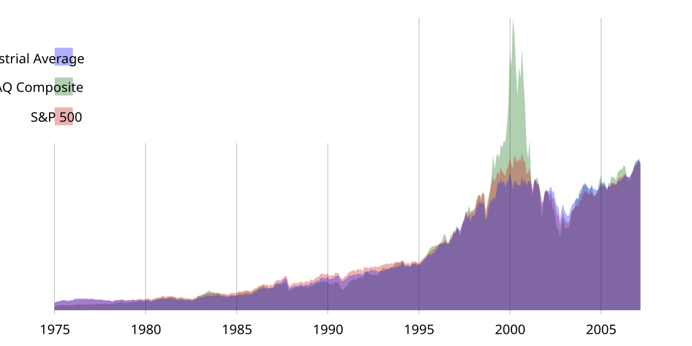

The financial market is a complex and dynamic environment where investments vary from stocks to indices and beyond. Recognizing the intricate nature of these markets is crucial for investors aiming to navigate them successfully. As markets evolve, so do the tools and strategies employed within them, including the increasing reliance on advanced technological solutions to facilitate trading. Understanding various investment tools can empower investors to make informed decisions, optimizing their strategies to align with market dynamics and improve potential returns.

Algorithmic trading, often referred to as algo trading, is emerging as a pivotal component of modern financial markets. It promises significant advantages, such as swift trade executions that surpass human capabilities and a reduction in the errors associated with manual trading. By leveraging sophisticated algorithms, investors and institutions can execute trades at scales and speeds that were previously unattainable. This not only enhances efficiency but also provides opportunities to capitalize on market inefficiencies, often in fractions of a second.



This article will explore the roles of investment tools, stock indices, and algorithmic trading in the financial markets. The discussion will cover how these elements interplay within the market architecture, influence trading strategies, and provide investors with frameworks for making more calculated investment choices. By comprehending the functionalities and applications of these elements, investors can better navigate the ever-evolving landscape of contemporary financial markets. Such knowledge is indispensable for those aiming to maximize returns while effectively managing risks in today's fast-paced trading environment.

## Table of Contents

## Understanding Financial Markets

Financial markets are essential structures within capitalist economies that facilitate the exchange of various financial assets. These markets provide a platform for the buying and selling of stocks, bonds, currencies, and derivatives, among other asset types. By enabling these transactions, financial markets play a critical role in risk transfer and liquidity formation.

Risk transfer in financial markets refers to the ability of participants to shift the potential for losses (or gains) from one party to another. For example, investors can hedge their portfolios against adverse price movements by purchasing derivatives such as options or futures contracts. This capability allows businesses and individuals to manage their exposure to risk more effectively, contributing to financial stability and economic growth.

Liquidity formation is another fundamental function of financial markets. Liquidity refers to the ease with which an asset can be converted into cash without significantly affecting its price. Well-functioning financial markets ensure that buyers and sellers can readily transact with each other, thus maintaining liquidity for various asset classes. This liquidity is vital for investors who need to buy or sell assets quickly to respond to changing market conditions or reallocate their portfolios.

Several factors influence the dynamics of financial markets, making them complex and ever-changing systems. Economic indicators, such as interest rates, inflation, and employment figures, can significantly impact market behavior. For example, rising interest rates may lead to a decrease in bond prices, while high inflation can erode the purchasing power of fixed-income investments.

Geopolitical events, such as elections, trade negotiations, or geopolitical conflicts, can also create [volatility](/wiki/volatility-trading-strategies) in financial markets. Uncertainty surrounding these events often leads to fluctuations in asset prices, as investors attempt to assess potential impacts on economic conditions and corporate earnings.

Investor sentiment is another critical influence on financial markets. This refers to the overall attitude of investors toward the market or a particular asset, which can be driven by news events, market trends, or psychological factors. Positive investor sentiment can lead to rising asset prices, while negative sentiment may result in market downturns.

In conclusion, the intricate and dynamic nature of financial markets makes them indispensable for the efficient functioning of capitalist economies. By enabling risk transfer and [liquidity](/wiki/liquidity-risk-premium) formation, financial markets provide the foundation for economic growth and stability. Understanding the factors that influence these markets is crucial for investors seeking to navigate the financial landscape effectively.

## Investment Tools in Financial Markets

Investment tools serve as resources for investors to assist in decision-making, enhancing their ability to analyze markets and execute informed trades. Among these tools, financial calculators are widely used for computing essential metrics such as compound interest, return on investment (ROI), and net present value (NPV). These calculators simplify complex mathematical equations, providing investors with quick insights into the potential outcomes of their investments.

Market analysis software is another critical resource, furnishing investors with technical analysis indicators, charting capabilities, and financial news updates. Such software often includes features like moving averages, Bollinger Bands, and relative strength index (RSI), enabling investors to discern trends and potential reversals in stock prices. For instance, technical analysis might involve calculating the moving average (MA), which can be expressed as:

$$
MA = \frac{P_1 + P_2 + \ldots + P_n}{n}
$$

where $P$ represents the price over a given period, and $n$ is the number of time periods considered.

Platforms providing real-time data are indispensable, granting access to up-to-the-minute market information. They ensure that investors make decisions based on the latest trading conditions, offering features like live stock quotes, currency exchange rates, and breaking economic news. 

Algorithmic trading platforms are revolutionizing traditional investment strategies by incorporating automation and data analytics. These platforms utilize pre-set algorithms to execute trades based on predefined criteria, such as timing, price, or [volume](/wiki/volume-trading-strategy), minimizing human intervention and the potential for emotional biases. For example, a simple Python script to execute a trade might look like this:

```python
def place_trade(signal, data):
    if signal == 'buy' and available_cash >= data['price']:
        execute_buy_order(data['stock'], data['price'])
    elif signal == 'sell' and stock_owned(data['stock']):
        execute_sell_order(data['stock'], data['price'])

# Example of calling the function
place_trade('buy', {'stock': 'AAPL', 'price': 150})
```

These platforms harness large datasets and sophisticated modeling techniques to predict market movements, offering investors improved accuracy and speed in executing trades. As these tools continue to evolve, they promise to enhance the efficiency and competitiveness of market participants.

## The Significance of Stock Indices

A stock index aggregates the stocks of selected companies to provide a single value representing the overall market or a specific sector's performance. These indices serve as benchmarks for evaluating the performance of investment portfolios. For instance, the Dow Jones Industrial Average (DJIA) comprises 30 major U.S. companies and is often used as an indicator of the health of the U.S. economy. Similarly, the S&P 500 Index includes 500 leading U.S. companies across various sectors, offering a broader market snapshot than the DJIA. The FTSE 100, on the other hand, represents the 100 largest companies listed on the London Stock Exchange, providing insight into the UK's economic condition.

The construction of indices typically involves weighting methods, such as price-weighted, market-capitalization-weighted, or equal-weighted approaches. For example, the DJIA is a price-weighted index, meaning it considers the price of each stock, regardless of the company’s size, affecting the index equally. Conversely, the S&P 500 is a market-cap-weighted index, where each company's influence on the index is proportionate to its market capitalization. 

Investors can engage with stock indices not by owning the underlying stocks but through derivatives like futures, contracts for difference (CFDs), and exchange-traded funds (ETFs). Index futures contracts allow investors to speculate on the future values of indices, facilitating hedging against potential market downturns or betting on market upswings. CFDs offer another speculative opportunity, whereby investors trade on margin to potentially benefit from index price movements without actual ownership. ETFs provide an accessible means to invest in indices, as these funds replicate the performance of specific indices and are traded on stock exchanges like individual stocks.

Index trading appeals to investors seeking exposure to broader market movements while curtailing individual stock risks. However, it also necessitates an understanding of the associated market dynamics, contract specifications, and potential financial commitments, as leverage in derivatives can amplify both gains and losses. Recognizing the importance and utility of stock indices can enhance investment strategies and enable more informed decision-making in the financial markets.

## Algorithmic Trading in Today's Market

Algorithmic trading, often referred to as algo trading, employs computer algorithms to execute trading strategies automatically based on predefined criteria. This technological approach is reshaping modern financial markets, offering traders the ability to react swiftly to market conditions, thereby enhancing both speed and accuracy. The capability to execute trades in milliseconds can significantly reduce transaction costs, allow traders to capitalize on fleeting market inefficiencies, and mitigate errors typically associated with manual trading.

Algorithmic trading strategies often include elements such as [arbitrage](/wiki/arbitrage), [market making](/wiki/market-making), and [trend following](/wiki/trend-following). Arbitrage strategies, for instance, aim to profit from price discrepancies between different markets or securities by executing simultaneous trades. Such strategies can be expressed mathematically, where an algorithm identifies opportunities based on price inequalities: 

$$
Profit = Price_{Market1} - Price_{Market2}
$$

Market making strategies involve providing liquidity to the market by placing both buy and sell orders for a security, while trend following strategies analyze historical price data to predict future movements, allowing traders to make informed decisions based on observed patterns.

Several platforms offer advanced [algorithmic trading](/wiki/algorithmic-trading) solutions, catering to diverse financial instruments such as stocks, options, and cryptocurrencies. For instance, platforms like TradeStation facilitate the creation of customized trading strategies with its EasyLanguage programming language. [Interactive Brokers](/wiki/interactive-brokers-api) provides an integrated environment for algorithmic trading with support for Java, C++, and Python, enabling sophisticated traders to implement proprietary strategies. Coinrule offers a user-friendly interface for [cryptocurrency](/wiki/cryptocurrency) trading, allowing even novice users to automate their trades using predefined templates or custom rules.

Python, in particular, has become a preferred language for designing trading algorithms due to its simplicity and the availability of numerous libraries, such as NumPy, pandas, and TA-Lib, that aid in data analysis and strategy development. A simple example of a moving average crossover strategy implemented in Python can look like this:

```python
import pandas as pd

# Load historical data
data = pd.read_csv('historical_data.csv')

# Calculate moving averages
data['SMA_50'] = data['Close'].rolling(window=50).mean()
data['SMA_200'] = data['Close'].rolling(window=200).mean()

# Generate trading signals
data['Signal'] = 0
data['Signal'][data['SMA_50'] > data['SMA_200']] = 1
data['Signal'][data['SMA_50'] < data['SMA_200']] = -1

# Here, Signal '1' indicates a buy, '-1' indicates a sell, and '0' signals no action
```

In today's market, algorithmic trading is not only a tool for large institutional players but is increasingly accessible to individual traders, offering robust solutions to navigate the complexities and rapid-paced nature of financial markets efficiently. However, the sophistication of algorithmic strategies necessitates a sound understanding of both market dynamics and technological proficiency to successfully harness the potential of algo trading.

## Choosing the Right Trading Platform

Selecting an appropriate trading platform plays a pivotal role in maximizing returns and minimizing risks for investors and traders. The choice of platform can significantly impact one’s trading experience and potential profitability. Key factors to consider when choosing a trading platform include user-friendliness, cost-effectiveness, available resources, and customer support.

User-friendliness is crucial for both novice and experienced traders. A platform that is intuitive and easy to navigate allows users to focus on analyzing market data and executing trades efficiently. The user interface should be clear and straightforward, reducing the learning curve and potential for errors during high-pressure trading situations.

Cost-effectiveness is another vital consideration. Trading platforms may charge various fees, including commissions, spreads, and account maintenance charges. It is essential for traders to weigh these costs against the benefits provided by the platform. Some platforms offer tiered pricing models, allowing users to select the level of service that suits their trading volume and strategy best.

Available resources such as educational materials, analytical tools, and market data are fundamental to informed trading. A platform that provides comprehensive charting capabilities, technical indicators, and real-time market data enables traders to conduct thorough analyses and develop effective strategies. Platforms like TradingView and TrendSpider are popular for their robust analytical tools, offering various features like customizable charts, technical analysis, and integration with trading scripts and bots.

Community support and customer service are also critical factors. Platforms that offer strong community engagement, such as forums or social features, can provide additional insights and support from fellow traders. Efficient customer service ensures that any technical issues or questions are promptly addressed, reducing downtime and potential losses.

In conclusion, the selection of a trading platform should align with the trader's goals, preferences, and trading strategies. By evaluating factors such as user-friendliness, cost-effectiveness, available resources, and support, investors can choose a platform that enhances their trading capabilities and contributes to their overall success in the financial markets.

## Risks and Rewards of Algo Trading

Algorithmic trading, while robust and efficient, entails a mix of potential benefits and inherent risks. One of the primary advantages is the removal of human emotion from trading processes, which often leads to more rational and strategically consistent decisions. Automated systems can execute trades at speeds that far surpass human capabilities, allowing traders to capitalize on fleeting market opportunities.

However, algorithmic trading is not without its pitfalls. Technical failures are a significant risk. These can range from software bugs and data feed disruptions to hardware malfunctions, any of which can lead to costly errors if not promptly addressed. Moreover, these errors can sometimes cascade, creating large-scale impacts on the markets and resulting in substantial financial losses.

Market volatility poses another challenge. While algorithms can be designed to exploit volatility, sudden and extreme market movements can surpass the predefined criteria embedded in these algorithms, leading to unexpected results. This unpredictability necessitates constant monitoring and real-time adjustments to the algorithms to ensure they remain effective under varying market conditions.

Over-reliance on historical data represents another notable risk. Algorithms are typically developed and refined using [backtesting](/wiki/backtesting) on historical market data. Although past performance can offer insights, it is not always indicative of future results. Market conditions can shift due to new economic policies, technological advancements, or geopolitical events, rendering previously successful algorithms ineffective.

Risk management is essential for mitigating these challenges. Traders should employ robust risk management strategies to protect their investments. This may include setting stop-loss orders to limit potential losses, diversifying investment portfolios to spread risk, and continuously updating and auditing trading algorithms to address any anomalies promptly.

Overall, while algorithmic trading offers significant rewards, understanding and preparing for its risks is paramount. By implementing comprehensive risk management practices, traders can harness the potential of algo trading more effectively, aligning technological prowess with prudent financial strategy.

## Conclusion

As financial markets continue to evolve, technology plays a pivotal role in reshaping how investments are made and managed. Algorithmic trading has emerged as a crucial component in this transformation, offering enhanced speed and efficiency in executing trades. By automating complex trading strategies, it minimizes human intervention, reducing the potential for errors and emotional biases. This capability allows traders and investors to capitalize on market opportunities swiftly.

The array of investment tools and platforms available today means that investors are better equipped than ever to make informed and strategic decisions. With platforms providing real-time data, advanced analytics, and algorithmic execution capabilities, users can access a wealth of information and technical resources to guide their investment strategies. However, the effectiveness of these tools relies heavily on the user's understanding of their functions and inherent limitations. For instance, while algorithmic trading can execute trades based on historical data and predefined criteria, it may not always adapt quickly to sudden market changes or unforeseen economic events, underscoring the need for robust risk management practices.

Investors must recognize the balance between leveraging advanced tools and maintaining a critical perspective on the data and strategies employed. The financial landscape’s complexity necessitates a thorough understanding of both the potential and the constraints of technological solutions. As algorithmic trading continues to be at the forefront of financial innovation, it is imperative for investors to stay informed about technological advancements while remaining vigilant about the risks involved. This balanced approach is essential for achieving success and sustainability in today's fast-paced financial markets.

## References & Further Reading

[1]: Bergstra, J., Bardenet, R., Bengio, Y., & Kégl, B. (2011). ["Algorithms for Hyper-Parameter Optimization."](https://dl.acm.org/doi/10.5555/2986459.2986743) Advances in Neural Information Processing Systems 24.

[2]: ["Advances in Financial Machine Learning"](https://www.amazon.com/Advances-Financial-Machine-Learning-Marcos/dp/1119482089) by Marcos Lopez de Prado

[3]: ["Evidence-Based Technical Analysis: Applying the Scientific Method and Statistical Inference to Trading Signals"](https://www.wiley.com/en-us/Evidence+Based+Technical+Analysis%3A+Applying+the+Scientific+Method+and+Statistical+Inference+to+Trading+Signals-p-9780470008744) by David Aronson

[4]: ["Machine Learning for Algorithmic Trading"](https://github.com/stefan-jansen/machine-learning-for-trading) by Stefan Jansen

[5]: ["Quantitative Trading: How to Build Your Own Algorithmic Trading Business"](https://www.amazon.com/Quantitative-Trading-Build-Algorithmic-Business/dp/1119800064) by Ernest P. Chan