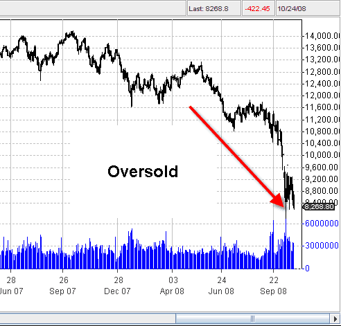
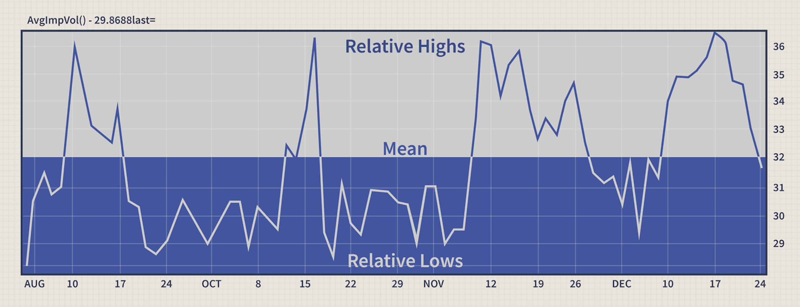

When we talk about a stock being oversold, we refer to a situation where its price has declined to a level that suggests it is undervalued. This typically occurs after a significant and rapid decrease in price over a short period. The concept of a stock being oversold is rooted in technical analysis, where various indicators are used to evaluate whether a stock’s current price is lower than its intrinsic or perceived value.

The identification of oversold stocks is crucial for traders and investors alike. For traders, it represents a potential buying opportunity, under the belief that the stock’s price is likely to rebound. For long-term investors, oversold stocks can be an opportunity to acquire shares in a company at a price lower than its fundamental value. In both scenarios, the core idea is that the stock’s price is set to correct itself, presenting an opportunity for profit.

Understanding what makes a stock oversold is not just about recognizing a dip in price. It involves a comprehensive analysis of market trends, trading volumes, historical performance, and broader economic indicators. It's a key component of a balanced trading strategy, helping investors mitigate risks and capitalize on market inefficiencies. Recognizing and acting upon oversold conditions can be a game-changer in the dynamic environment of stock trading and investing. 

## Table of Contents

## Understanding Oversold Stocks

### Fundamentally Oversold

Fundamental analysis is a key tool in identifying whether a stock is fundamentally oversold. This method involves assessing a company's underlying financial health and its potential for future growth, typically by examining key financial metrics and broader economic indicators. When a stock is fundamentally oversold, it means that its current market price is lower than what the company's fundamental data would suggest as fair value.

Key aspects of [fundamental analysis](/wiki/fundamental-analysis) include evaluating the company's [earning](/wiki/earning-announcement)s, revenue, future growth potential, profit margins, and debt levels. Analysts also consider the company's competitive position within its industry, management quality, and overall economic conditions. One common metric used is the Price-to-Earnings (P/E) ratio, comparing the company's current share price to its earnings per share. A significantly lower P/E ratio compared to industry averages or the company's historical averages can indicate an oversold condition.

Another vital aspect is the company's earnings reports and forecasts. If a company continues to report strong earnings and has positive growth projections, but its stock price is declining, it may be an indication that the stock is oversold. This discrepancy can arise from market overreactions, misinformation, or temporary setbacks that the market misinterprets as long-term issues.

Dividend yields can also serve as an indicator. A higher-than-average dividend yield, assuming dividends are stable, may suggest that the stock price has fallen disproportionately, signaling an oversold condition.

Fundamental analysis is about looking beyond the noise and temporary market sentiment to understand a company's true value. When a stock's price is significantly below this value without a reasonable explanation based on its fundamentals, it is likely oversold. This approach requires thorough research and a deep understanding of both the company in question and the broader market dynamics.

### Technically Oversold

Technical analysis plays a pivotal role in identifying technically oversold stocks. This approach relies on analyzing statistical trends gathered from trading activity, such as price movement and [volume](/wiki/volume-trading-strategy), to evaluate stocks' strength or weakness. An oversold condition in technical terms suggests that a stock's price has fallen to levels where it is undervalued, often due to investor overreaction or market panic.

One primary tool in technical analysis for spotting oversold stocks is the **Relative Strength Index (RSI)**. RSI is a [momentum](/wiki/momentum) oscillator that measures the speed and change of price movements. It operates on a scale from 0 to 100. Generally, a stock is considered oversold when its RSI falls below 30, suggesting that its price might have fallen too far and could be due for a reversal.

Another popular indicator is the **Stochastic Oscillator**, which compares a stock's closing price to its price range over a specific period. When the stochastic reads below 20, it indicates that the stock might be oversold. This tool helps traders identify potential reversal points by showing the momentum of price changes.

**Moving averages** are also used to determine oversold conditions. For instance, if a stock's price falls significantly below its moving average, this can signal that the stock is oversold. The moving average smooths out price data to create a single flowing line, making it easier to identify trends and patterns.

**Bollinger Bands**, another technical tool, consist of a set of trend lines plotted two standard deviations (positively and negatively) away from a simple moving average (SMA) of a stock's price. When a stock's price touches or dips below the lower band, it is considered oversold.

**Volume indicators** like the On-Balance Volume (OBV) also assist in identifying oversold stocks. They provide insights into the intensity of buying or selling pressure, helping to confirm whether a price drop is significant or merely a temporary fluctuation.

Technical analysis is not about absolute predictions but about probabilities and patterns. It requires traders to look for patterns in price history to forecast future movements. As such, an oversold stock as per technical indicators does not guarantee a price rebound. Instead, it indicates that the stock may be undervalued, presenting a potential buying opportunity. However, traders must combine technical analysis with other [factor](/wiki/factor-investing)s such as market sentiment, fundamental analysis, and broader economic indicators for a more comprehensive trading strategy.

### Mean-Reversion Concept

The concept of mean-reversion is critical in understanding oversold stocks. Mean-reversion is a financial theory suggesting that asset prices and historical returns eventually will return to the long-term mean or average level of the entire dataset. In the context of oversold stocks, this implies that a stock's price will tend to normalize following an extreme move.

When applied to oversold stocks, mean-reversion operates under the assumption that if a stock's price has significantly deviated below its historical average, it is likely to revert back to that average over time. This theory is rooted in the belief that market psychology and external factors influencing a stock's price are temporary and that intrinsic value will eventually prevail.

In practical terms, traders who subscribe to mean-reversion theory would view an oversold stock - typically indicated by technical analysis tools like the Relative Strength Index (RSI) falling below certain thresholds - as an opportunity. They anticipate that the stock will bounce back to a more 'normal' price level.

However, relying solely on mean-reversion can be risky. It assumes that the underlying fundamentals of the stock and the broader market remain constant, which is not always the case. Economic changes, shifts in industry dynamics, or company-specific issues can lead to a reevaluation of what constitutes a 'normal' price level for a stock.

Furthermore, while mean-reversion can be a helpful concept in identifying potential buying opportunities in oversold conditions, it should be used in conjunction with other analysis methods. This includes fundamental analysis to ensure that the stock is sound from a business perspective and other technical indicators to confirm buying signals.

Also, mean-reversion strategies require patience and a long-term view, as it may take considerable time for a stock to revert to its mean. The timing of when this reversion will occur is unpredictable, making it essential for traders to employ sound risk management strategies to mitigate potential losses if the stock continues to decline.

## Indicators of Oversold Stocks

### Relative Strength Index (RSI)

The Relative Strength Index (RSI) is a momentum oscillator that plays a pivotal role in identifying oversold conditions in the stock market. Developed by J. Welles Wilder Jr., RSI measures the speed and change of price movements, oscillating between zero and 100. Generally, an RSI reading below 30 is considered to indicate that a stock is oversold.

RSI is calculated based on the average gains and losses of a stock over a specified period, typically 14 days. The formula involves dividing the average gain of the up periods by the average loss of the down periods during the window. This calculation is then converted into an index for easier interpretation.

The key to using RSI in identifying oversold stocks lies in its ability to gauge the intensity of a stock's recent price changes. When a stock's RSI falls below 30, it suggests that its price has been falling aggressively, leading to a potentially undervalued or oversold condition. This is often interpreted by traders as a buying signal, under the assumption that the stock's price is likely to bounce back as the selling momentum exhausts itself.

However, it is crucial to use RSI judiciously. A stock can remain in an oversold condition longer than anticipated, especially in a bearish market. Therefore, traders often look for additional signals, such as a reversal pattern on the price chart or a confluence with other technical indicators, before making a buying decision. This approach helps in confirming that the oversold condition is more likely to lead to a meaningful price reversal.

Moreover, RSI can also be used to spot divergences, which occur when the stock price is making new lows while the RSI fails to make new lows. This divergence can be a strong indicator that the downward momentum is waning, and a price reversal may be imminent.

In conclusion, RSI is a valuable tool in the arsenal of traders looking to identify oversold stocks. Its effectiveness is enhanced when combined with other indicators and analysis techniques, allowing traders to make more informed decisions in volatile markets. However, it's important to remember that no single indicator should be used in isolation, and RSI is no exception. Proper risk management and a balanced trading strategy are essential when trading based on oversold conditions indicated by RSI.

### Stochastics

Stochastics, a powerful technical analysis tool, plays a significant role in signaling oversold stocks. Developed by George C. Lane in the late 1950s, stochastics is a momentum oscillator that measures the closing price of a stock relative to its price range over a specific period. This indicator is particularly useful for traders looking to capture turning points in the market by identifying oversold conditions.

The stochastic oscillator is composed of two lines: the %K line, which represents the current value of the stochastic, and the %D line, a moving average of %K. These lines oscillate between 0 and 100. Traditionally, readings below 20 indicate that a stock might be oversold, suggesting that it is trading at the lower end of its recent price range. This is seen as a potential buying opportunity by traders, as it often precedes a price rebound.

To calculate the stochastic oscillator, the most recent closing price is compared to the highest and lowest prices over a set period, typically 14 days. The %K line is then plotted, with the %D line following as its simple moving average. When the %K line crosses above the %D line in the oversold area (below 20), it generates a buy signal, indicating that the stock might be reversing its downtrend.

However, like all indicators, stochastics should not be used in isolation. False signals can occur, particularly in trending markets where a stock may remain in oversold or overbought territory for an extended period. Therefore, it is often combined with other indicators and analysis techniques, such as RSI or moving averages, to confirm trading signals.

In addition to identifying oversold conditions, stochastics can also be used to spot divergences. A bullish divergence occurs when the price of a stock makes a new low, but the stochastic indicator does not. This divergence can be an early warning sign of a potential upward price reversal, making it a valuable tool for traders.

In conclusion, stochastics is a versatile and widely used indicator in the analysis of oversold stocks. It offers traders an objective view of market momentum and potential reversal points. However, prudent traders combine it with other forms of analysis and adhere to strict risk management protocols to enhance the reliability of their trading strategies and safeguard against false or misleading signals.

### Other Indicators

In addition to the Relative Strength Index (RSI) and Stochastics, several other indicators are commonly used by traders and investors to identify oversold stocks. These indicators enhance the decision-making process by providing diverse perspectives on market conditions. Here are a few notable ones:

1. **Moving Average Convergence Divergence (MACD)**: MACD is a trend-following momentum indicator that shows the relationship between two moving averages of a stock's price. It consists of the MACD line (difference between the 12-day and 26-day exponential moving averages) and a signal line (9-day EMA of the MACD). An oversold condition is often indicated when the MACD line crosses above the signal line, especially after a significant downward move.
2. **Bollinger Bands**: This indicator involves plotting two standard deviations away from a simple moving average (SMA). When the price of a stock drops below the lower Bollinger Band, it is often considered oversold. This is based on the assumption that prices tend to stay within the upper and lower bounds of the bands.
3. **Williams %R**: Developed by Larry Williams, this indicator is similar to the Stochastic Oscillator but with a different scaling. Williams %R oscillates between 0 and -100 and measures overbought and oversold levels. Readings below -80 usually indicate an oversold condition.
4. **On-Balance Volume (OBV)**: OBV uses volume flow to predict changes in stock price. An increasing OBV suggests that the volume is confirming the upward movement of the price, indicating buying opportunities. Conversely, a decreasing OBV can signal that the stock is becoming oversold as selling volume increases.
5. **Fibonacci Retracements**: These are used to identify potential support and resistance levels based on the Fibonacci sequence. In an oversold scenario, traders look for the stock to rebound from key Fibonacci levels, which might indicate a potential entry point.
6. **Money Flow Index (MFI)**: This indicator combines price and volume to identify overbought or oversold conditions in a stock. An MFI reading below 20 typically indicates that a stock is oversold.

It's important to note that while these indicators can be helpful in identifying oversold stocks, they are most effective when used in conjunction with other forms of analysis, such as fundamental analysis or overall market trends. Moreover, reliance on just one indicator can lead to false signals; thus, a combination of indicators is often recommended for a more robust trading strategy. Additionally, investors should always consider external factors such as industry trends, economic indicators, and market sentiment, as these can significantly influence stock prices regardless of technical indicators.

## Oversold vs. Overbought Stocks

Understanding the difference between oversold and overbought stocks is crucial for any trader or investor aiming for a balanced approach in the market. Here's a comparison of the two:

**Oversold Stocks**

Oversold stocks are those that have fallen significantly in price and are perceived to be valued lower than their true worth. This condition often occurs after a prolonged period of selling, driven by investor pessimism or market reactions to news events. In technical terms, an oversold stock typically has a low Relative Strength Index (RSI), often below 30, indicating that it may be undervalued and poised for a rebound. The oversold status doesn't always guarantee an immediate turnaround; stocks can remain oversold for an extended period, especially in bear markets.

**Overbought Stocks**

Overbought stocks, in contrast, are those that have risen in price rapidly and are considered to be trading above their intrinsic value. These stocks often experience a surge due to excessive buying, usually driven by overly optimistic market sentiment or speculative trading. On technical charts, an overbought stock is often indicated by a high RSI, typically above 70, suggesting it might be overvalued and could face a pullback or correction. Like oversold stocks, overbought stocks can also stay in their state longer than anticipated, especially during bull market conditions.

## Identifying Buying Opportunities

Identifying buying opportunities in oversold stocks requires a nuanced approach that goes beyond just recognizing their oversold status. Here's a guide on how to evaluate whether an oversold stock represents a real buying opportunity and the factors you should consider:

### Evaluating Oversold Stocks

While tools like the Relative Strength Index (RSI) and stochastics are essential in identifying oversold stocks, they should not be the sole criteria for making a buying decision. It's vital to deep dive deeper into why the stock is oversold. Is it due to market-wide sell-offs, sector-specific downturns, or company-specific issues?

Assess the company's fundamentals, including its earnings, revenue growth, debt levels, management quality, and competitive position in the industry. A fundamentally strong company that is oversold due to temporary market conditions might represent a good buying opportunity.

Consider the broader market trends and sentiment. Even fundamentally strong stocks can struggle in a bear market. Conversely, a recovering or bullish market can provide the necessary momentum for an oversold stock to bounce back.

Be aware of recent news and events affecting the stock or its industry. Earnings reports, regulatory changes, and significant corporate announcements can all impact whether an oversold stock is likely to recover.

### Factors to Consider

**Time Horizon and Risk Tolerance**: Your investment time horizon and risk tolerance are critical. Oversold stocks can remain depressed for a long time, so short-term traders might face different risks compared to long-term investors.

**Industry Analysis**: Sector-specific factors can significantly influence stock prices. For instance, technological changes, regulatory shifts, or commodity price fluctuations can impact entire industries, affecting even the fundamentally strong companies within.

**Historical Performance**: Look at the stock’s historical performance during similar market conditions. This can provide insights into how the stock might behave in the current scenario.

**Volume and Liquidity**: Pay attention to trading volume. An increase in volume on the days when the stock gains can be a positive sign, indicating growing investor interest.

**Technical Patterns**: Use other technical analysis tools to look for patterns that might indicate a potential reversal, such as double bottoms, bullish divergences, or trend line breaks.

**Economic Indicators**: Macro-economic indicators and industry-specific trends can also provide clues about the potential for recovery in an oversold stock.

While identifying oversold stocks can lead to significant buying opportunities, it requires a comprehensive analysis that combines technical indicators with fundamental analysis, market trends, and a solid understanding of the economic environment. Thorough research and due diligence are key to distinguishing between a true buying opportunity and a value trap in the world of oversold stocks.

## Trading Strategies for Oversold Stocks

### Practical Strategies

When trading oversold stocks, employing practical and effective strategies is crucial to capitalize on potential opportunities while minimizing risks. Here are some strategies that can be adopted:

- **Confirm with Multiple Indicators**: Relying solely on one indicator like the RSI or stochastics can be misleading. Confirm the oversold condition with multiple indicators and tools. For instance, use moving averages, Bollinger Bands, or volume analysis in conjunction with RSI to get a comprehensive view.
- **Look for Bullish Divergence**: In technical analysis, a bullish divergence occurs when the price of a stock is making new lows while the indicator starts to climb. This can often signal a potential turnaround in the stock's price, making it a favorable point for entry.
- **Use Dollar-Cost Averaging**: If you are confident about the stock's long-term value but uncertain about timing, consider dollar-cost averaging. This involves buying a fixed dollar amount of a particular investment on a regular schedule, regardless of the share price, reducing the impact of volatility.
- **Set Clear Entry and Exit Points**: Define your entry and exit strategy before you start trading. Set a clear price point or indicator level for entering the trade and establish a stop-loss level to cut losses if the stock doesn’t rebound as expected.
- **Incorporate News and Fundamentals**: Stay informed about any recent news or events that might impact the stock. Also, analyze the company's fundamentals to ensure it has a strong financial standing and growth prospects.
- **Wait for Confirmation of Trend Reversal**: Instead of trying to catch the falling knife, wait for confirmation of a trend reversal. This could be in the form of a bullish candlestick pattern or the stock closing above a certain resistance level.
- **Scale into Positions**: Rather than taking a full position at once, consider scaling in. This involves entering a trade in small increments, which allows for adjusting the average price of your position and reduces the risk of entering at an inopportune time.
- **Be Patient and Disciplined**: Oversold stocks can remain oversold longer than anticipated. Patience and discipline in sticking to your trading plan are essential.
- **Monitor Market Sentiment**: Keep an eye on the overall market sentiment. If the broader market is bearish, even the most oversold stocks may not rebound quickly.
- **Use Paper Trading for Practice**: If you are new to this strategy, consider starting with paper trading. It allows you to practice trading oversold stocks without risking real money.

By following these practical strategies, traders can effectively navigate the challenges posed by oversold stocks and potentially turn these situations into profitable opportunities. However, it’s important to remember that no strategy guarantees success, and risk management should always be a priority.

### Risk Management

Effective risk management is paramount when trading oversold stocks, as these situations often involve heightened [volatility](/wiki/volatility-trading-strategies) and uncertainty. Here are key risk management strategies to consider:

- **Set Stop-Loss Orders**: Always set a stop-loss order to limit potential losses. Determine a reasonable price level at which the trade will be automatically closed if the market moves against your position. This helps prevent emotional decision-making in volatile market conditions.
- **Position Sizing**: Allocate only a portion of your portfolio to any single oversold stock. Diversifying your investments can reduce the impact of a potential loss from one oversold stock on your overall portfolio.
- **Understand the Reasons for Overselling**: Before trading an oversold stock, understand why it is oversold. Is it due to company-specific issues, sectoral downturns, or broader market sentiments? This understanding can help assess the risk and potential for rebound.
- **Use Technical Analysis for Entry and Exit Points**: Utilize technical analysis tools to identify strategic entry and exit points. This includes understanding support and resistance levels, trend lines, and candlestick patterns.
- **Beware of False Signals**: Sometimes, what appears to be an oversold condition may not lead to a price reversal. Be cautious of false buy signals and confirm with multiple indicators or news events.
- **Monitor Market Sentiment and Conditions**: Keep an eye on broader market sentiment and conditions, as these can greatly influence the movement of oversold stocks. Be prepared to adjust your strategy in response to changing market dynamics.
- **Avoid Chasing Losses**: If a trade doesn’t go as planned, avoid the temptation to chase losses by investing more in the hope of a turnaround. Accept losses as part of trading and focus on future opportunities.
- **Regularly Review and Adjust Your Strategy**: Continuously review your trading strategy and make adjustments as necessary based on market conditions and your trading performance.
- **Educate Yourself Continuously**: Stay informed about the latest trading techniques, market trends, and economic factors that can impact stock prices.
- **Paper Trade First**: If new to trading oversold stocks, consider paper trading first. This allows you to practice without risking real money and helps in understanding the market dynamics associated with oversold stocks.

By implementing these risk management strategies, traders can navigate the challenges of trading oversold stocks more effectively, potentially turning risky situations into profitable opportunities while keeping potential losses under control.

## Quantitative Analysis

Quantitative analysis serves as an essential tool in the evaluation of oversold stock conditions, providing an objective approach to interpreting market data. This technique utilizes statistical and mathematical models to dissect financial markets and securities, offering insights into patterns and trends. It involves the analysis of historical data, including price movements, volume, and market trends, to identify signs of oversold conditions. By applying statistical methods to this data, analysts can accurately discern if a stock is truly oversold.

In today's trading world, many traders deploy algorithms designed to execute trades automatically based on certain oversold indicators. These sophisticated algorithms are capable of analyzing extensive market data in real-time, swiftly pinpointing potential buying opportunities in oversold stocks, far outpacing traditional manual analysis.

A significant advantage of quantitative analysis is its ability to backtest trading strategies using historical market data. This feature is incredibly beneficial in situations involving oversold stocks, as it allows traders to examine how similar stocks have historically performed under oversold conditions, aiding in forecasting future trends.

Quantitative models also play a crucial role in evaluating the risks associated with oversold stocks. They are adept at calculating a stock's volatility, gauging the likelihood of a rebound, and estimating the potential for further decline, which supports more informed investment decisions.

While heavily reliant on data, quantitative analysis is frequently paired with fundamental analysis. This dual approach enables traders to validate statistical results with the core financial health of a company, leading to a more comprehensive method of assessing oversold stocks.

The practice incorporates various technical indicators and oscillators, such as the Moving Average Convergence Divergence (MACD) or Bollinger Bands, to pinpoint oversold conditions. These tools are instrumental in indicating when a stock might have hit a price floor, suggesting a possible rebound.

Advanced quantitative methods include sentiment analysis, which gauges the market's mood through news articles, social media, and financial reports. This approach aids in grasping the wider market perception of a stock, a factor that can significantly influence its perceived oversold status.

With the evolution of technology, quantitative analysis has integrated [machine learning](/wiki/machine-learning) and [artificial intelligence](/wiki/ai-artificial-intelligence) to enhance stock movement predictions. These cutting-edge models are adept at processing and learning from large datasets, continually refining their ability to predict oversold conditions more accurately over time.

## Conclusion

Understanding and identifying oversold stocks is an essential skill in the trading and investing realm. The various facets of oversold stocks, encompassing fundamental and technical analysis as well as the mean-reversion principle, have been thoroughly examined to provide a detailed guide on navigating these market conditions. Discussions around key indicators such as the Relative Strength Index (RSI), stochastics, and other analytical tools are pivotal in aiding traders to recognize when stocks are oversold.

The distinctions between oversold and overbought stocks are crucial for developing effective trading strategies. It's important to discern these differences to identify buying opportunities while considering market trends, company fundamentals, and economic indicators, reflecting the multifaceted approach required in stock market analysis.

Strategies for practical trading and risk management are also essential for traders dealing with the compl[exit](/wiki/exit-strategy)ies of oversold stocks. Real-life examples and case studies are useful in demonstrating how these strategies can be applied and what potential outcomes they might yield. A discussion on the limitations and risks involved serves as a crucial reminder of the potential pitfalls and the importance of caution in trading.

## Frequently Asked Questions

**What does it mean for a stock to be oversold?**

A stock is considered oversold when it is believed to be trading below its intrinsic or fair value. This typically happens after a significant and rapid decline in its price, often due to investor overreaction or market panic.

**How can I identify an oversold stock using technical analysis?**

Technical analysis uses various indicators to identify oversold stocks. The Relative Strength Index (RSI) and Stochastics are two popular tools. An RSI value below 30 or a Stochastic indicator below 20 often signals that a stock might be oversold.

**Can fundamental analysis also indicate a stock is oversold?**

Yes, fundamental analysis, which examines financial data, market conditions, and economic factors, can indicate a stock is oversold. If a company's fundamentals remain strong despite a declining stock price, it may be undervalued or oversold.

**What is the mean-reversion concept in relation to oversold stocks?**

The mean-reversion concept suggests that the price of an oversold stock will eventually revert back to its average or mean price over time. This concept is based on the belief that extreme movements in stock prices are temporary.

**Are there risks involved in trading oversold stocks?**

Yes, trading oversold stocks can be risky. Stocks can remain oversold for extended periods, and prices can continue to decline. It’s important to combine technical signals with sound fundamental analysis and proper risk management strategies.

**How does market sentiment affect the analysis of oversold stocks?**

Market sentiment plays a significant role in the analysis of oversold stocks. Pessimistic market sentiment can lead to stocks becoming oversold as investors may overreact to negative news, driving prices down further than warranted by fundamentals.

**What should I consider before buying an oversold stock?**

Before buying an oversold stock, consider the company's overall financial health, market trends, and economic indicators. Also, assess whether the stock's price drop is due to systemic issues or temporary market reactions.

**Can oversold stocks become overbought?**

Yes, oversold stocks can become overbought if there is a strong market reversal or positive news about the company. This can lead to rapid price increases, pushing the stock into overbought territory.

**What additional indicators can be used to identify oversold stocks?**

Additional indicators include the Moving Average Convergence Divergence (MACD), Bollinger Bands, and Williams %R. Each of these tools provides different insights into market trends and potential reversals.

## References & Further Reading

- ["Technical Analysis of the Financial Markets"](https://www.amazon.com/Technical-Analysis-Financial-Markets-Comprehensive/dp/0735200661) by John J. Murphy - A comprehensive guide to trading methodologies and applications, ideal for understanding technical indicators like RSI and Stochastics.
- ["A Random Walk Down Wall Street"](https://en.wikipedia.org/wiki/A_Random_Walk_Down_Wall_Street) by Burton G. Malkiel - This book offers insights into various investment strategies, including a discussion on stock market trends and behaviors.
- ["Market Wizards"](https://www.amazon.com/Market-Wizards-Updated-Interviews-Traders/dp/1118273052/ref=sr_1_1?keywords=Market+Wizards&qid=1705336773&sr=8-1) by Jack D. Schwager - Interviews with some of the most successful traders in the 1970s and 1980s, providing real-world insights into trading strategies, including dealing with oversold stocks.