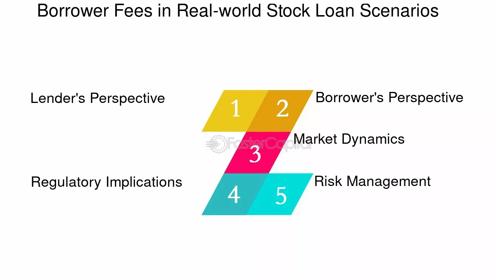

## Table of Contents

## What is a stock loan fee (borrow fee)?

A stock loan fee, also known as a borrow fee, is a cost that investors pay when they borrow stocks to sell them short. Short selling is when you sell a stock you don't own, hoping to buy it back later at a lower price. The fee is charged by the brokerage firm or the institution that lends the stock. The fee is usually a small percentage of the value of the borrowed stock, and it can vary depending on how hard it is to find the stock to borrow.

The amount of the stock loan fee can change based on how many people want to borrow the stock and how many shares are available to borrow. If a lot of people want to short a stock, and there aren't many shares available, the fee can go up. This fee is important for short sellers to think about because it can affect how much money they make or lose on their short sale. It's like a rental cost for using someone else's stock for a while.

## Why do investors pay a stock loan fee?

Investors pay a stock loan fee when they want to short sell a stock. Short selling means selling a stock you don't own, with the hope of buying it back later at a lower price. To do this, you need to borrow the stock from someone else, usually a brokerage firm or another investor. The stock loan fee is the cost of borrowing that stock. It's like renting the stock for a period of time, and the fee is what you pay for that rental.

The fee is important because it affects how much money an investor can make or lose from short selling. If the fee is high, it can eat into the profits if the stock price does go down as expected. On the other hand, if the fee is low, it can make short selling more attractive. The amount of the fee can change based on how many people want to borrow the stock and how many shares are available to borrow. If a lot of people want to short a stock and there aren't many shares to borrow, the fee can go up.

## How is the stock loan fee calculated?

The stock loan fee is calculated as a percentage of the value of the stock that is borrowed. This percentage is called the borrow rate, and it can change every day. To find out the fee, you take the value of the stock you want to borrow, and then you multiply it by the borrow rate. For example, if you want to borrow $10,000 worth of stock and the borrow rate is 3%, you would pay a fee of $300 for that day.

The borrow rate depends on how many people want to borrow the stock and how many shares are available to borrow. If a lot of people want to short sell a stock, and there aren't many shares available, the borrow rate can go up because it's harder to find the stock to borrow. On the other hand, if not many people want to borrow the stock, and there are plenty of shares available, the borrow rate can be lower. So, the stock loan fee can change every day based on what's happening in the market.

## What factors influence the stock loan fee?

The stock loan fee is influenced by how much people want to borrow a stock and how many shares are available to lend. When a lot of investors want to short sell a particular stock, the demand for borrowing that stock goes up. If there aren't many shares available to borrow, the stock loan fee can increase because it becomes harder to find the stock to borrow. This situation often happens with stocks that are hard to borrow, like those that are less common or have a lot of short interest.

On the other hand, if not many people want to borrow a stock, and there are plenty of shares available, the stock loan fee can be lower. This is because it's easier to find the stock to borrow, so lenders don't need to charge as much. The stock loan fee can change every day based on what's happening in the market. Things like news about the company, changes in the stock's price, and overall market conditions can all affect how much people want to borrow a stock and how much it costs to borrow it.

## Can the stock loan fee change over time?

Yes, the stock loan fee can change over time. It depends on how many people want to borrow the stock and how many shares are available to lend. If a lot of investors want to short sell a stock and there aren't many shares to borrow, the fee can go up. This is because it's harder to find the stock to borrow, so lenders can charge more.

The fee can also go down if not many people want to borrow the stock and there are plenty of shares available. This makes it easier to find the stock to borrow, so lenders don't need to charge as much. The stock loan fee can change every day based on what's happening in the market, like news about the company or changes in the stock's price.

## How does the stock loan fee affect short selling?

The stock loan fee is a big deal when it comes to short selling. It's the money you have to pay to borrow the stock you want to sell short. If the fee is high, it can make short selling less profitable. Imagine you sell a stock short hoping it will go down, but you have to pay a lot just to borrow it. If the stock doesn't go down enough, the fee can eat into your profits or even make you lose money.

The fee changes based on how many people want to borrow the stock and how many shares are available. If lots of people want to short sell a stock and there aren't many shares to borrow, the fee can go up. This makes short selling riskier because you're paying more just to borrow the stock. On the other hand, if not many people want to borrow the stock and there are plenty of shares, the fee can be lower, making short selling more attractive. So, the stock loan fee can really affect how much money you might make or lose when you short sell.

## What is the difference between a stock loan fee and a margin interest rate?

A stock loan fee is what you pay when you borrow a stock to sell it short. Short selling means you sell a stock you don't own, hoping to buy it back later at a lower price. The fee is a percentage of the stock's value and can change every day based on how many people want to borrow the stock and how many shares are available. If a lot of people want to borrow the stock and there aren't many shares, the fee can go up.

A margin interest rate is different. It's what you pay when you borrow money from your broker to buy stocks or other investments. This is called buying on margin. The interest rate is a percentage of the money you borrow and can be fixed or change over time. Unlike the stock loan fee, which is about borrowing stocks, the margin interest rate is about borrowing cash to invest. Both fees can affect how much money you make or lose, but they apply to different kinds of borrowing in the stock market.

## How can investors minimize the stock loan fee they pay?

Investors can minimize the stock loan fee they pay by choosing stocks that are easier to borrow. Some stocks are harder to borrow than others, and they can have higher fees. If a stock is popular for short selling and there aren't many shares available, the fee can be high. So, investors can look for stocks that aren't as popular for short selling or have more shares available to borrow. This can help keep the fee lower.

Another way to minimize the stock loan fee is to keep an eye on the fee and be ready to change your short position if the fee goes up too much. The fee can change every day, so it's a good idea to check it often. If the fee starts to get too high, you might want to close your short position and look for another stock to short sell. This way, you can avoid paying a lot in fees and still try to make money from short selling.

## What are the typical ranges for stock loan fees?

Stock loan fees can vary a lot. They usually range from about 0.3% to 3% of the value of the stock you borrow each year. But sometimes, if a stock is really hard to borrow, the fee can go even higher, like 10% or more. It all depends on how many people want to borrow the stock and how many shares are available to lend.

The fee can change every day, so it's a good idea to keep an eye on it. If you're thinking about short selling, it's important to know what the fee is and how it might affect how much money you can make or lose. A high fee can eat into your profits, so it's something to think about before you decide to short sell a stock.

## How do stock loan fees impact the overall profitability of a short position?

Stock loan fees can really affect how much money you make or lose when you short sell a stock. When you short sell, you borrow a stock and sell it, hoping to buy it back later at a lower price. The stock loan fee is what you pay to borrow that stock. If the fee is high, it can eat into your profits. For example, if you make money because the stock price goes down, but you have to pay a big fee to borrow the stock, you might end up with less money than you expected.

The fee changes based on how many people want to borrow the stock and how many shares are available. If a lot of people want to short sell a stock and there aren't many shares to borrow, the fee can go up. This makes short selling riskier because you're paying more just to borrow the stock. So, when you're thinking about short selling, it's important to look at the stock loan fee and think about how it might affect your overall profit or loss.

## What are the tax implications of stock loan fees?

When you pay a stock loan fee for short selling, it can affect your taxes. The fee you pay to borrow the stock is usually seen as an expense related to your investment. This means you can often deduct it from your taxable income. If you make money from short selling, the fee can help lower the amount of taxes you have to pay on your profits.

But, tax rules can be different depending on where you live and your situation. It's a good idea to talk to a tax professional to make sure you're doing everything right. They can help you understand how the stock loan fee fits into your overall tax situation and make sure you're taking advantage of any deductions you can.

## How do regulatory changes affect stock loan fees?

Regulatory changes can have a big impact on stock loan fees. When rules about borrowing and lending stocks change, it can make it harder or easier to borrow stocks. For example, if new rules make it harder to lend stocks, there might be fewer shares available to borrow. This can make the stock loan fee go up because more people are trying to borrow the same number of shares. On the other hand, if new rules make it easier to lend stocks, there might be more shares available, which can make the fee go down.

These changes can also affect how much people want to short sell. If new rules make short selling riskier or more expensive, fewer people might want to do it. This can lower the demand for borrowing stocks and might make the stock loan fee go down. But if rules make short selling easier or cheaper, more people might want to do it, which can increase the demand for borrowing stocks and push the fee up. So, keeping an eye on regulatory changes is important for investors who are thinking about short selling.

## What are Borrow Fees in Securities Lending and How Can They Be Understood?

Borrow fees, commonly referred to as stock loan fees, represent the financial charges incurred by borrowers in securities lending transactions. These fees are a critical component of securities lending, acting as a cost borne by those who borrow stocks to facilitate various trading activities, including short selling. 

The calculation of borrow fees typically relies on a percentage of the stock's value, implying that the fee incurred by the borrower correlates with the price of the underlying security. The fees can be expressed through the formula:

$$
\text{Borrow Fee} = \left( \frac{\text{Annual Fee Rate}}{360} \right) \times \text{Stock Value}
$$

Here, the annual fee rate is agreed upon during the transaction and depends on several factors, translating into daily fees as the standard convention is to employ a 360-day count.

A crucial determinant of borrow fees is the security's [liquidity](/wiki/liquidity-risk-premium). Liquid stocks, which are readily available and traded frequently, generally have lower borrow fees due to their ease of access. Conversely, illiquid securities, with fewer shares available in the market, often attract higher fees because obtaining them poses more difficulty.

Short interest levels also play a pivotal role in shaping borrow fees. A higher short interest indicates a greater number of shares sold short relative to the available float, heightening demand for borrowing and thus increasing fees. This relationship underscores the risk and supply constraint associated with borrowing heavily shorted stocks.

Furthermore, the broader demand for borrowing a particular security influences the fees. Stocks experiencing increased borrowing demand, particularly those targeted for significant short selling, are categorized as 'hard-to-borrow.' Hard-to-borrow stocks are associated with elevated borrow fees, reflecting their scarcity. A combination of high liquidity risk, intense borrowing demand, and robust short interest levels would result in a substantial borrowing cost, reflecting the complexities involved in securities lending.

## What is the impact of borrow fees on trading strategies?

Borrow fees play an integral role in shaping trading strategies for both short sellers and algorithmic traders. As part of the cost structure, these fees directly impact the potential profitability and risk assessments necessary for effective trading.

### Profit Margin Erosion

One of the primary challenges associated with high borrow fees is their potential to significantly erode profit margins. Short selling involves borrowing securities to sell them with the intention of repurchasing them at a lower price. However, if the borrow fees are substantial, they can consume a large portion of the anticipated returns, thereby rendering some short-selling ventures less viable. In situations where fees are excessively high, the cost of borrowing might outweigh potential gains, prompting traders to reconsider such positions.

### Balancing Costs and Returns

Traders must conduct a thorough analysis to balance potential returns against intrinsic costs. Beyond borrow fees, this analysis should account for interest on margin and potential dividends lost when securities are loaned out. The effective annual cost of borrowing can be represented as:

$$
\text{Total Borrow Cost} = \text{Borrow Fee Rate} \times \text{Stock Value} + \text{Margin Interest} + \text{Dividends Lost}
$$

This formula underscores the necessity of comprehensive cost consideration. Each component must be weighed to determine the true cost of maintaining a short position and its impact on net profitability.

### Dynamic Strategy Design

To navigate varying borrow fee structures and changing borrowing conditions, strategies must be adaptable. The financial markets are dynamic, and the costs associated with borrowing a particular stock can fluctuate significantly. For instance, an increase in market demand might push a security into the "hard-to-borrow" category, thereby raising fees steeply. Traders should develop strategies that dynamically adjust to these changes.

Algorithm development can incorporate real-time data analysis to modulate exposure based on cost conditions. For example, Python code to adjust positions based on borrow fees might look like this:

```python
def adjust_position(current_position, borrow_fee, target_return):
    """Adjust position size based on borrow fee dynamics."""
    if borrow_fee > target_return:
        return max(0, current_position - (borrow_fee - target_return) * adjustment_factor)
    else:
        return current_position

# Example Usage
current_position = 1000 # shares
borrow_fee = 0.05 # 5% fee
target_return = 0.08 # 8% desired return

new_position = adjust_position(current_position, borrow_fee, target_return)
print(f"New Position Size: {new_position} shares")
```

This example highlights how real-time data can guide decision-making, ensuring that positions remain aligned with profitability objectives.

In conclusion, borrow fees are a critical [factor](/wiki/factor-investing) in the risk/reward equation for short sellers and algo-traders. High fees demand strategic adjustments and a comprehensive understanding of all related costs. By designing strategies that can dynamically respond to cost fluctuations, traders can optimize their approach, safeguarding against unanticipated erosions in profit margins.

## References & Further Reading

[1]: Fabozzi, F. J., Davis, H. A., & Choudhry, M. (2006). ["Securities Finance: Securities Lending and Repo"](https://onlinelibrary.wiley.com/doi/book/10.1002/9781119197249). John Wiley & Sons.

[2]: D'Agostino, V. C., & Beyer, S. (2020). ["Securities Lending and Repo Reform in the EU"](https://www.sciencedirect.com/science/article/pii/S1383586624050408). Oxford University Press.

[3]: ["Advances in Financial Machine Learning"](https://www.amazon.com/Advances-Financial-Machine-Learning-Marcos/dp/1119482089) by Marcos Lopez de Prado.

[4]: Ekins, P. (2006). ["Short Selling: Strategies, Risks, and Rewards"](https://www.wiley.com/en-us/Short+Selling%3A+Strategies%2C+Risks%2C+and+Rewards-p-9780471704331). Wiley Finance.

[5]: ["Machine Learning for Algorithmic Trading"](https://github.com/stefan-jansen/machine-learning-for-trading) by Stefan Jansen.