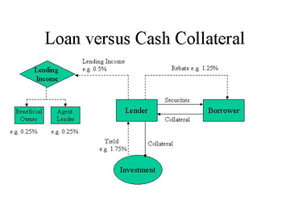

## Table of Contents

## What is a stock loan rebate mechanism?

A stock loan rebate mechanism is a way that people who lend out their stocks can earn some money. When someone wants to borrow stocks, usually to sell them and buy them back later at a lower price, they need to pay the owner of the stocks. The owner, instead of just getting their stocks back, can also get a little extra money as a kind of thank you or reward. This extra money is called a rebate.

The rebate works like this: the borrower pays a fee to borrow the stocks, and part of that fee goes back to the lender as the rebate. The size of the rebate can change based on how much people want to borrow that stock and how much is available to borrow. It's a bit like lending money to a friend and getting a bit of interest back when they return it. This system helps make stock lending more attractive for people who own stocks and don't mind lending them out for a while.

## How does the stock loan rebate mechanism work?

When someone wants to borrow stocks, they have to find someone who owns those stocks and is willing to lend them out. The borrower usually wants to sell the stocks right away and buy them back later at a lower price, hoping to make a profit. To get the stocks, the borrower pays a fee to the owner. Part of this fee comes back to the owner as a rebate, which is like a small reward for lending out their stocks.

The size of the rebate can change depending on how many people want to borrow the stock and how many stocks are available to lend. If lots of people want to borrow a certain stock, the rebate might be bigger because the demand is high. The owner gets their stocks back at the end of the loan period, plus they get to keep the rebate. This makes it more appealing for stock owners to lend out their stocks, knowing they can earn a little extra money in the process.

## Who are the typical participants in a stock loan rebate transaction?

The typical participants in a stock loan rebate transaction are the stock lender and the stock borrower. The stock lender is usually someone who owns stocks and is willing to lend them out for a period of time. This could be an individual investor, a mutual fund, or a pension fund. They agree to lend their stocks to someone else, hoping to earn a little extra money through the rebate.

The stock borrower is usually someone who wants to use the stocks for a strategy called short selling. They borrow the stocks, sell them right away, and plan to buy them back later at a lower price to return to the lender. The borrower pays a fee for borrowing the stocks, and part of this fee is given back to the lender as the rebate. This makes the transaction beneficial for both parties: the borrower gets to carry out their investment strategy, and the lender earns some extra money.

## What are the benefits of using a stock loan rebate mechanism for borrowers?

Using a stock loan rebate mechanism helps borrowers because it can make borrowing stocks cheaper. When someone wants to borrow stocks to sell them and buy them back later, they have to pay a fee to the person who owns the stocks. But with a rebate, part of that fee comes back to the borrower, which means they don't have to pay as much overall. This can make it easier for borrowers to carry out their investment plans, especially if they are trying to save money.

Another benefit is that the rebate can help borrowers manage their costs better. If the demand for borrowing a certain stock is high, the rebate might be bigger, which means the borrower gets more money back. This can be really helpful if the borrower is trying to make a profit from short selling. By getting some money back through the rebate, they can lower their expenses and potentially increase their overall returns.

## What are the risks associated with stock loan rebates for lenders?

Lenders who use stock loan rebates face some risks. One big risk is that the borrower might not be able to return the stocks. If the stock price goes up a lot, the borrower might lose money when they try to buy the stocks back. If they can't pay, the lender might not get their stocks back right away, or they might get them back late. This can be a problem if the lender needs their stocks for something else.

Another risk is that the rebate might not be as big as the lender hopes. The size of the rebate can change based on how many people want to borrow the stock. If not many people want to borrow it, the rebate might be small, and the lender might not earn much extra money. This can make the whole process less worthwhile for the lender. They need to think about whether the potential reward from the rebate is worth the risk of not getting their stocks back on time.

## How is the rebate rate determined in a stock loan transaction?

The rebate rate in a stock loan transaction is determined by how much people want to borrow the stock and how many stocks are available to lend. If a lot of people want to borrow a certain stock, the demand is high, and the rebate rate might go up. This is because lenders can get more money back when there's a lot of competition for their stocks. On the other hand, if not many people want to borrow the stock, the demand is low, and the rebate rate might be smaller because there's less competition.

The availability of stocks also plays a big role in setting the rebate rate. If there are lots of stocks available to lend, the rebate rate might be lower because lenders have to compete to attract borrowers. But if there are only a few stocks available, the rebate rate could be higher because borrowers are willing to pay more to get the stocks they need. So, the rebate rate is really a balance between how much people want the stock and how easy it is to find it to lend.

## Can you explain the difference between a stock loan rebate and a stock loan fee?

A stock loan fee is what someone pays to borrow stocks from someone else. Imagine you want to use someone's bike for a day, you might have to pay them a fee for borrowing it. In the same way, when someone wants to borrow stocks, they pay a fee to the owner of the stocks. This fee is like a rental cost for using the stocks for a while.

A stock loan rebate is different. It's a part of the fee that the borrower pays, but it gets given back to the person who owns the stocks. Think of it like getting a little bit of your money back after you've paid to rent something. The rebate makes it more attractive for people to lend out their stocks because they get to keep some extra money at the end. So, the fee is what the borrower pays to use the stocks, and the rebate is what the lender gets back as a reward for lending them out.

## What role do brokers play in the stock loan rebate process?

Brokers are really important in the stock loan rebate process. They act like middlemen who help connect people who want to borrow stocks with people who own stocks and are willing to lend them out. When someone wants to borrow stocks, they go to a broker, who then finds someone with the right stocks to lend. The broker also helps set up the deal, figuring out how much the borrower has to pay and how much of that money the lender will get back as a rebate.

Brokers also make sure everything goes smoothly. They keep track of when the stocks need to be returned and make sure the lender gets their stocks back on time. Plus, they handle all the money stuff, making sure the borrower pays the fee and the lender gets their rebate. This makes the whole process easier for both the borrower and the lender, who can just focus on their own investment plans without worrying about the details of the loan.

## How do regulatory requirements impact stock loan rebate mechanisms?

Regulatory requirements can affect how stock loan rebate mechanisms work. Governments and financial watchdogs set rules to make sure that stock lending is done fairly and safely. These rules might say things like how much money a borrower has to put up as a promise to return the stocks, or how lenders need to report what they're doing. If the rules are strict, it might make it harder for people to lend out their stocks or for borrowers to get the rebates they want. This can change how much people are willing to lend and borrow, and it can also affect the size of the rebates.

Sometimes, regulations can also make the whole process more complicated. For example, there might be rules about how quickly stocks need to be returned or how much information needs to be shared between lenders and borrowers. This can mean more work for everyone involved, and it might make some people decide not to lend their stocks at all. But, these rules are there to protect everyone and make sure that the stock loan rebate system works well and fairly for both lenders and borrowers.

## What are some common strategies used by investors to maximize returns through stock loan rebates?

Investors often try to maximize their returns through stock loan rebates by choosing to lend out stocks that are in high demand. When a lot of people want to borrow a certain stock, the rebate rate goes up. This means the lender can get more money back as a reward for lending out their stocks. To find these high-demand stocks, investors might look at market trends and see which stocks are being short sold a lot. By lending out these popular stocks, they can earn bigger rebates and boost their overall returns.

Another strategy is to work closely with brokers who can help find the best deals. Brokers have a good sense of which stocks are in demand and can connect investors with borrowers who are willing to pay higher fees, leading to larger rebates. Investors might also negotiate directly with borrowers to get the best possible terms. By being smart about which stocks they lend and working with the right people, investors can make the most out of the stock loan rebate system and increase their earnings.

## Can you provide an example of a stock loan rebate transaction involving a hedge fund?

Imagine a hedge fund wants to bet that the price of a certain company's stock, let's call it XYZ Corp, will go down. The hedge fund decides to borrow 10,000 shares of XYZ Corp from an investor who owns them. The investor agrees to lend the shares, hoping to earn some extra money through a stock loan rebate. The hedge fund pays a fee to borrow the shares, and part of this fee will come back to the investor as a rebate.

The hedge fund then sells the 10,000 shares of XYZ Corp right away at the current market price of $50 per share, making $500,000. They plan to buy the shares back later at a lower price, say $40 per share, to return them to the investor. If the price does drop to $40, the hedge fund can buy back the shares for $400,000, making a profit of $100,000. Meanwhile, the investor gets their 10,000 shares back and also receives a rebate from the fee the hedge fund paid, making the lending worthwhile.

## How have recent market conditions affected the use and effectiveness of stock loan rebate mechanisms?

Recent market conditions have made stock loan rebate mechanisms more important and useful. When the stock market goes up and down a lot, more people want to borrow stocks to try and make money from these changes. This means there's a bigger demand for stock loans, and the rebates that lenders get can be bigger too. If a lot of people want to borrow a certain stock, the lender can get a bigger reward for lending it out. This makes it more attractive for people to lend their stocks, especially when the market is moving a lot.

But, these market conditions can also make things riskier. If the stock market drops a lot, people who borrowed stocks might have a hard time buying them back at a lower price. This can make it harder for them to return the stocks to the lender on time. Lenders need to be careful and think about whether the extra money they can get from the rebate is worth the risk of not getting their stocks back when they need them. So, while stock loan rebates can be more rewarding in a busy market, they also come with more risks that everyone needs to watch out for.

## What are the benefits and intricacies of exploring stock loan rebates?

Stock loan rebates are an integral aspect of the securities lending market. These rebates refer to the fees or interest rates paid by lenders to borrowers of securities, which can offset the borrowing costs. In essence, when an institution or individual borrows a security, they not only pay a lending fee but may also receive a rebate that reduces the net cost of borrowing.

Stock loan rebates are significant because they directly affect the profitability of securities lending transactions. For borrowers, rebates can reduce the cost of borrowing, making it more financially viable to engage in short selling or to meet regulatory or transactional requirements. For lenders, offering rebates can enhance the attractiveness of their securities, increasing the likelihood of their securities being borrowed.

The influence of rebates on the overall cost of borrowing securities is substantial. The net cost of borrowing is calculated by subtracting the rebate received from the borrowing fee paid. Therefore, a higher rebate results in a lower net borrowing cost, and vice versa. This relationship can be represented mathematically as:

$$
\text{Net Cost of Borrowing} = \text{Borrowing Fee} - \text{Rebate}
$$

Several factors influence rebate rates, including the supply and demand dynamics of specific securities, the creditworthiness of the borrower, market conditions, and the duration of the loan. Securities that are in high demand for short selling, often referred to as "hard-to-borrow", may offer lower rebates or even negative rebates, where the borrower effectively pays a premium to borrow. Conversely, "easy-to-borrow" securities typically come with more favorable rebate terms.

For both lenders and borrowers, stock loan rebates offer distinct benefits. Lenders can optimize their returns by adjusting rebate rates based on market conditions, maximizing the utilization of their securities. Borrowers benefit from potentially lower borrowing costs, making strategies like short selling more economically feasible.

Recent trends in rebate practices have shown increased transparency and competitiveness in determining rebate rates. With advancements in technology and data analytics, market participants can assess real-time market conditions more accurately, leading to more dynamic and fair rebate pricing. For investors, these trends imply a more efficient market where borrowing costs can be better predicted and managed, reducing the uncertainty and risks associated with securities lending. 

Overall, the evolution and strategic application of stock loan rebates continue to enhance the efficiency and attractiveness of the securities lending market, offering economic advantages to both lenders and borrowers while impacting broader market dynamics.

## References & Further Reading

[1]: Mishkin, F. S. (2015). *The Economics of Money, Banking, and Financial Markets*. Pearson Education.

[2]: Mehrling, P. (2011). *The New Lombard Street: How the Fed became the dealer of last resort*. Princeton University Press.

[3]: Fabozzi, F. J., Modigliani, F., & Jones, F. J. (2014). *Foundations of Financial Markets and Institutions*. Pearson.

[4]: *Securities Lending and Repurchase Agreements* by Frank Fabozzi (editorial), 2016, Springer Financial Studies.

[5]: Aldridge, I. (2013). *High-Frequency Trading: A Practical Guide to Algorithmic Strategies and Trading Systems*. Wiley Finance.

[6]: Bluhm, C. & Krahnen, J. P. (2004). *Risk and Return of Equity Lending*. Available at SSRN: https://ssrn.com/abstract=604881.

[7]: Ammann, M., & Weigel, F. (2010). *Stock Borrowing, Short Sale Constraints, and Market Efficiency: Evidence from the Swiss Market*. European Financial Management.