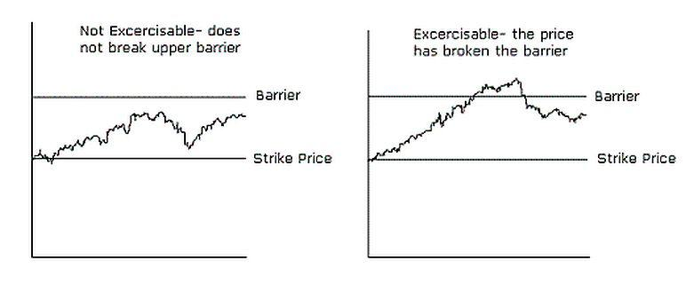

Financial markets are structured systems that facilitate the exchange of financial instruments, including stocks, bonds, currencies, and derivatives. They are pivotal to the global economy as they provide platforms for raising capital, enabling investment, and allowing risk management through various financial products. Financial markets play a crucial role in resource allocation, price discovery, and maintaining liquidity, influencing economic growth and stability across the world [1].

Securities lending is a significant component of financial markets. It involves the temporary transfer of securities from a lender to a borrower, typically facilitated through intermediaries like banks or brokerage firms. This practice is essential for ensuring liquidity and facilitating other market activities such as short selling. In securities lending, stock loan rebates are incentives provided by the lender to the borrower for using their securities. These rebates impact the cost of borrowing and can influence trading strategies and market dynamics.

Algorithmic trading, or algo trading, refers to the use of computer algorithms to execute trades based on pre-set conditions and criteria. This form of trading has transformed financial markets by increasing trade efficiency, reducing human error, and allowing for the rapid processing of vast data sets. Algorithms can execute trades in fractions of a second, greatly enhancing market liquidity and efficiency.

The interrelation between securities lending, stock loan rebates, and algo trading is significant for investors. Algo trading can optimize securities lending by automating processes and adjusting strategies based on market conditions, while stock loan rebates affect the profitability of these strategies. Together, they contribute to more efficient markets, enhance price discovery, and provide opportunities for arbitrage.

This article will explore these interconnected components and their implications for investors. It will delve into the mechanics of securities lending, analyze the impact of stock loan rebates, examine the transformative power of algo trading, and consider how these practices collectively influence market dynamics and investor strategy.

---

Reference:

1. Mishkin, F. S. (2015). The Economics of Money, Banking, and Financial Markets. Pearson Education.

## Table of Contents

## Understanding Securities Lending

Securities lending is a vital component of financial markets that facilitates the borrowing and lending of securities for various purposes, such as short selling, hedging, and improving market [liquidity](/wiki/liquidity-risk-premium). It involves a temporary transfer of securities from a lender to a borrower, who is typically required to provide collateral to secure the transaction. The primary aim of securities lending is to enable market participants to execute trading strategies, manage risks, and fulfill trading obligations effectively.

The mechanics of securities lending involve several key parties: the lender, the borrower, and often an intermediary, such as a custodian or lending agent. The lender, often an institutional investor like a mutual fund or pension fund, owns the securities and seeks to earn additional revenue by lending them. The borrower, usually a [hedge fund](/wiki/hedge-fund-trading-strategies) or broker-dealer, seeks to acquire the securities temporarily for purposes like short selling or [arbitrage](/wiki/arbitrage). The intermediary plays a crucial role in facilitating the transaction, handling administrative tasks, and ensuring compliance with regulatory requirements.

Various types of securities are commonly involved in lending, including equities (stocks), fixed-income securities (bonds), and derivatives. Equity securities are frequently lent for short-selling purposes, allowing borrowers to sell borrowed shares in anticipation of repurchasing them at a lower price. Bonds are often lent to facilitate collateral management and enhance liquidity in fixed-income markets. Derivatives, on the other hand, are typically involved in more complex lending arrangements that support hedging and arbitrage strategies.

The benefits of securities lending are numerous. For lenders, it offers an opportunity to generate additional income from their portfolios without selling their holdings. This added income is derived from the fees or interest charged to borrowers. For borrowers, securities lending provides access to securities they do not currently own, enabling them to execute various trading strategies. Additionally, the lending of securities helps enhance market liquidity and price discovery by increasing the availability of securities for trading.

However, securities lending also carries certain risks. Lenders are exposed to counterparty risk, where the borrower may default on the transaction. Market risk is another concern, as changes in the value of the lent securities or collateral can affect the profitability of the lending arrangement. Operational risk, arising from issues like settlement failures or administrative errors, is also present.

In today's markets, securities lending is extensively utilized in various ways. For example, hedge funds frequently engage in securities lending to implement short-selling strategies, betting against the price decline of specific stocks. Moreover, securities lending supports exchange-traded funds (ETFs) in creating and redeeming shares through "in-kind" transactions, which involve the transfer of actual securities rather than cash.

In summary, securities lending is a fundamental practice that enhances the efficiency and fluidity of financial markets. By understanding the mechanics, parties involved, types of securities, benefits, and risks, investors can leverage securities lending to optimize their trading and investment strategies.

## Exploring Stock Loan Rebates

Stock loan rebates are an integral aspect of the securities lending market. These rebates refer to the fees or interest rates paid by lenders to borrowers of securities, which can offset the borrowing costs. In essence, when an institution or individual borrows a security, they not only pay a lending fee but may also receive a rebate that reduces the net cost of borrowing.

Stock loan rebates are significant because they directly affect the profitability of securities lending transactions. For borrowers, rebates can reduce the cost of borrowing, making it more financially viable to engage in short selling or to meet regulatory or transactional requirements. For lenders, offering rebates can enhance the attractiveness of their securities, increasing the likelihood of their securities being borrowed.

The influence of rebates on the overall cost of borrowing securities is substantial. The net cost of borrowing is calculated by subtracting the rebate received from the borrowing fee paid. Therefore, a higher rebate results in a lower net borrowing cost, and vice versa. This relationship can be represented mathematically as:

$$
\text{Net Cost of Borrowing} = \text{Borrowing Fee} - \text{Rebate}
$$

Several factors influence rebate rates, including the supply and demand dynamics of specific securities, the creditworthiness of the borrower, market conditions, and the duration of the loan. Securities that are in high demand for short selling, often referred to as "hard-to-borrow", may offer lower rebates or even negative rebates, where the borrower effectively pays a premium to borrow. Conversely, "easy-to-borrow" securities typically come with more favorable rebate terms.

For both lenders and borrowers, stock loan rebates offer distinct benefits. Lenders can optimize their returns by adjusting rebate rates based on market conditions, maximizing the utilization of their securities. Borrowers benefit from potentially lower borrowing costs, making strategies like short selling more economically feasible.

Recent trends in rebate practices have shown increased transparency and competitiveness in determining rebate rates. With advancements in technology and data analytics, market participants can assess real-time market conditions more accurately, leading to more dynamic and fair rebate pricing. For investors, these trends imply a more efficient market where borrowing costs can be better predicted and managed, reducing the uncertainty and risks associated with securities lending. 

Overall, the evolution and strategic application of stock loan rebates continue to enhance the efficiency and attractiveness of the securities lending market, offering economic advantages to both lenders and borrowers while impacting broader market dynamics.

## The Role of Algo Trading in Financial Markets

Algorithmic trading, commonly known as algo trading, involves using computer algorithms to execute trading orders with minimal human intervention. These algorithms leverage complex mathematical models and statistical analysis to make trading decisions at speeds and frequencies that a human trader cannot achieve. The primary objective of algo trading is to optimize trade execution by taking advantage of market inefficiencies, enhancing speed, and reducing costs associated with trading.

### Evolution of Algo Trading

The roots of [algorithmic trading](/wiki/algorithmic-trading) can be traced back to the 1970s with the introduction of electronic trading systems. However, it gained significant [momentum](/wiki/momentum) in the 1980s and 1990s with the development of advanced computational technologies and increased electronic communications networks (ECNs), which facilitated faster and more efficient trading. Over the past decades, the adoption of algo trading has surged, with its application expanding across various types of financial instruments, including equities, commodities, and foreign exchange. Today, it is estimated that a significant portion of trades executed on major stock exchanges is driven by algorithms, reflecting its critical role in modern financial markets.

### Advantages of Using Algorithms in Trading

1. **Speed and Efficiency**: One of the most significant advantages of algo trading is the ability to execute trades at speeds much faster than any human trader. Algorithms can process a vast amount of market data in real-time, allowing for quick decision-making and precise order execution.

2. **Reduced Costs**: Algo trading reduces transaction costs by minimizing the impact of market movements, thereby optimizing the timing of trades to obtain the best prices. 

3. **Elimination of Human Emotion**: Automating trades through algorithms removes human emotion from the decision-making process, reducing errors that might occur due to psychological factors, such as fear or greed.

4. **Continual Monitoring**: Algorithms can operate continuously without fatigue, monitoring multiple markets simultaneously and executing trades based on predefined criteria.

### Risks and Challenges

Despite the advantages, algo trading also poses several risks and challenges:

- **Market Volatility**: The speed and volume of trades executed by algorithms can exacerbate market volatility, as seen during the 2010 Flash Crash when the U.S. stock market experienced a massive and rapid sell-off.

- **System Failures**: Technical glitches or errors in the coding of algorithms can lead to significant financial losses. Ensuring robust system architecture and regular maintenance is crucial.

- **Regulatory Concerns**: The complexity and opacity of algorithmic strategies can pose challenges for regulators aiming to ensure fair and transparent markets.

- **Security Threats**: The reliance on technology makes algo trading susceptible to cybersecurity threats, necessitating stringent security measures.

### Common Algorithms Used in Securities Trading

Several types of algorithms are prevalent in securities trading, each designed to achieve specific objectives:

1. **Market-Making Algorithms**: These algorithms provide liquidity to markets by continuously quoting both buy and sell prices. They profit from the bid-ask spread while mitigating inventory risks.

2. **Statistical Arbitrage**: This approach involves using quantitative models to identify price discrepancies between correlated or mean-reverting securities, executing trades to exploit these inefficiencies. 

3. **Trend Following**: These algorithms analyze historical price data to identify patterns or trends, executing trades in the direction of established trends.

4. **Machine Learning and AI Strategies**: Advanced machine learning models are increasingly being integrated into algo trading to enhance predictive capabilities and adapt to new market conditions.

5. **Optimal Execution**: Techniques such as Implementation Shortfall and VWAP (Volume Weighted Average Price) are used to minimize market impact and achieve favorable execution prices.

### Conclusion

Algorithmic trading has revolutionized the financial markets by enhancing efficiency, speed, and precision in trade execution. However, it also requires careful management of associated risks and considerations for regulatory compliance. As technology continues to advance, the integration and sophistication of algo trading strategies are likely to grow, further shaping the landscape of global financial markets.

## Interrelationship Between Securities Lending and Algo Trading

Securities lending and algorithmic trading (algo trading) are crucial mechanisms that, when integrated, enhance the efficiency of financial markets. Securities lending involves the temporary transfer of securities from a lender to a borrower, with the agreement that they will be returned either on demand or at a future date. This process facilitates various trading strategies, notably short selling, which relies on borrowing securities to sell them and later repurchase at hopefully lower prices. Algorithmic trading, on the other hand, employs automated and pre-programmed transactions, designed to perform at speeds and frequencies beyond human capacity.

The interplay between securities lending and algo trading significantly enhances the efficiency and liquidity of financial markets by optimizing asset utilization and reducing market frictions. Algorithmic trading can leverage the availability of a borrowed asset to execute complex strategies such as [statistical arbitrage](/wiki/statistical-arbitrage), [market making](/wiki/market-making), and pairs trading more effectively. For instance, the continuous, automated, high-speed nature of algo trading allows for rapid adaptation to market conditions, enabling traders to capitalize on short-term price inefficiencies.

Integrating algorithmic trading into the stock loan process further optimizes the matching of lenders and borrowers, thus facilitating more seamless securities lending operations. Algorithms can analyze real-time data to ascertain the optimal lending rates, respond to fluctuating supply and demand for securities, and adjust positions instantaneously. This capability helps in minimizing the cost of borrowing and maximizes the revenue from lending, thus benefiting both lenders and borrowers.

This synergy also exerts a remarkable influence on market liquidity and price discovery. Enhanced liquidity arises from the increased availability of securities through lending, which can then be traded by algo traders to create a more active market environment. The rapid execution and settlement of trades inherent in algo trading improve market depth and resilience, reinforcing the efficiency of price discovery mechanisms. Consequently, markets become more competitive and less susceptible to manipulation.

An illustrative example can be seen in high-frequency trading ([HFT](/wiki/high-frequency-trading-strategies)) firms that rely significantly on access to borrowed securities to execute their strategies. For example, during periods of high [volatility](/wiki/volatility-trading-strategies), these firms can borrow undervalued stocks, sell them short, and quickly adjust their positions as market conditions change, often completing large volumes of trades with minimal market impact. As a result, they provide liquidity and contribute to narrowing bid-ask spreads, ultimately benefiting the broader market.

Looking to the future, the integration of securities lending and algo trading is expected to intensify as technology continues to evolve. Advancements in [artificial intelligence](/wiki/ai-artificial-intelligence) (AI) and [machine learning](/wiki/machine-learning) will likely lead to more sophisticated algorithms that can process diverse datasets and adapt to unpredictable market conditions with greater precision. This progression will further bolster market efficiency and liquidity, offering considerable advantages for investors pursuing both lending and trading opportunities.

In summary, the symbiotic relationship between securities lending and algorithmic trading fosters a more dynamic and efficient financial market environment. By leveraging technological advancements, these combined practices enhance liquidity, support price discovery, and optimize trading strategies, presenting promising opportunities for further development and integration in global financial systems.

## Conclusion

This article has explored the intricacies and essential aspects of financial markets, focusing on securities lending, stock loan rebates, and algorithmic trading (algo trading). Understanding securities lending is vital, as it plays a crucial role in financial markets by providing liquidity. Stock loan rebates are significant as they influence the cost of borrowing securities, affecting both lenders and borrowers. Algo trading enhances trading efficiency, offering speed and precision, which are invaluable in today's fast-paced markets.

Investors should be aware of these interconnected concepts when making market decisions. Securities lending can enable more effective algo trading strategies by ensuring the availability of stocks for borrowing. This synergy, in turn, improves market liquidity and facilitates accurate price discovery. As financial markets continue to evolve, these practices are poised to grow and intertwine, leading to innovative investment strategies and potentially new regulatory landscapes.

Investors are encouraged to stay informed about developments in these areas. Continuous learning and adaptation are critical to harnessing the benefits and mitigating the risks associated with these financial practices. Keeping abreast of market innovations ensures that investors can equip themselves with the knowledge to navigate the complexities of modern financial markets effectively.

## References & Further Reading

[1]: Mishkin, F. S. (2015). *The Economics of Money, Banking, and Financial Markets*. Pearson Education.

[2]: Mehrling, P. (2011). *The New Lombard Street: How the Fed became the dealer of last resort*. Princeton University Press.

[3]: Fabozzi, F. J., Modigliani, F., & Jones, F. J. (2014). *Foundations of Financial Markets and Institutions*. Pearson.

[4]: *Securities Lending and Repurchase Agreements* by Frank Fabozzi (editorial), 2016, Springer Financial Studies.

[5]: Aldridge, I. (2013). *High-Frequency Trading: A Practical Guide to Algorithmic Strategies and Trading Systems*. Wiley Finance.

[6]: Bluhm, C. & Krahnen, J. P. (2004). *Risk and Return of Equity Lending*. Available at SSRN: https://ssrn.com/abstract=604881.

[7]: Ammann, M., & Weigel, F. (2010). *Stock Borrowing, Short Sale Constraints, and Market Efficiency: Evidence from the Swiss Market*. European Financial Management.