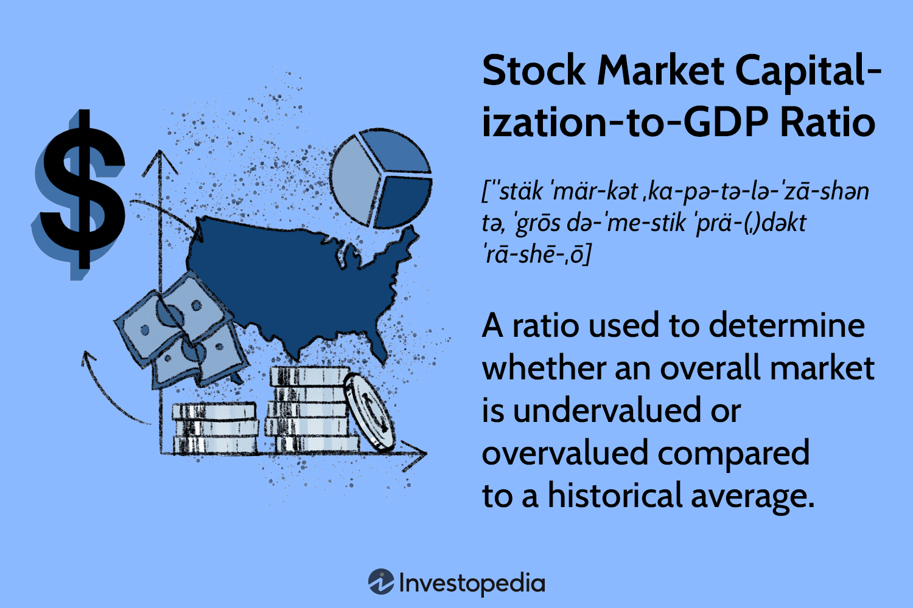

In the complex world of economics and finance, the GDP ratio to stock market capitalization provides a comprehensive overview of the economic landscape. This ratio emerges as a pivotal metric, guiding investors and policymakers in understanding the extent of market valuation relative to the economic output. Essentially, it acts as a barometer to assess whether a market is undervalued or overvalued in comparison to the size of the economy.

Algorithmic trading, contrasting traditional trading methods, signifies a substantial advancement in trading technology. It utilizes algorithms and quantitative methods to execute trades with precision and speed, optimizing market transactions on a large scale. This technological evolution allows for the processing of vast amounts of data swiftly, offering a level of efficiency unattainable through manual trading.



In this article, we focus on the intricate relationships between GDP ratios, stock market capitalization, and algorithmic trading. These components, although distinct, interact in various ways to impact the workings of financial markets. By analyzing these relationships, our goal is to provide valuable insights into how these elements collectively influence market dynamics.

Understanding these interactions is crucial, especially in a time when financial markets are intricately tied to global economic conditions and technological advancements. Through exploring these themes, we aim to offer a deeper comprehension of how such metrics and technologies affect investment decisions and policy formulations.

## Table of Contents

## Understanding the GDP Ratio to Stock Market Capitalization

The stock market capitalization-to-GDP ratio, often referred to as the Buffett Indicator, is a significant metric used to assess the relative valuation of a market. It is calculated by taking the total market capitalization of all publicly traded companies within a country and dividing it by the country's Gross Domestic Product (GDP). Mathematically, the formula is expressed as:

$$
\text{Buffett Indicator} = \frac{\text{Total Market Capitalization}}{\text{GDP}}
$$

This ratio provides insight into whether the stock market is overvalued or undervalued relative to the economic output. Historically, a high ratio might indicate that the market is overvalued relative to its GDP, suggesting potential overheating and increased risk of a market correction. Conversely, a low ratio might imply that the market is undervalued, potentially signaling a good entry point for investment.

The significance of the Buffett Indicator lies in its ability to offer a macroeconomic perspective on market valuation. By comparing two macroeconomic elements—the stock market and GDP—it helps investors and policymakers to gauge if the market reflects true economic conditions or if it is being influenced by speculative factors.

Analysts often assess this ratio against historical averages to contextualize current market conditions. For instance, if the current ratio is significantly higher than historical norms, it might suggest caution in investment decisions, as this could be indicative of a bubble. On the other hand, if the ratio is lower than historical averages, it may present growth opportunities.

It's important to note that while the Buffett Indicator is a useful tool, it should not be used in isolation. Other factors, such as interest rates, monetary policy, and international economic conditions, also play crucial roles in influencing market behavior and should be considered alongside this ratio for a comprehensive analysis of market conditions. Additionally, the ratio can fluctuate based on cyclical economic trends and structural changes in the economy, underscoring the need for a nuanced approach when interpreting its implications.

## Global Trends and Historical Context

Historically, the stock market capitalization-to-GDP ratio has been a valuable indicator for assessing the valuation of markets relative to the economic output of a nation. This ratio, known for its simplicity and effectiveness, provides a macroeconomic perspective on whether a market is overvalued, undervalued, or fairly valued based on historical averages.

Throughout economic history, the stock market capitalization-to-GDP ratio has demonstrated a pattern of fluctuation in response to various economic events and trends. For instance, during the late 1990s, the dot-com bubble significantly influenced this ratio in the United States. As technology stocks soared, the total market capitalization exceeded the GDP by unprecedented margins. At the peak of the dot-com bubble in 2000, the ratio reached roughly 140%, a clear indication of market overvaluation. When the bubble burst, resulting in a significant market correction, the ratio realigned closer to historical norms, demonstrating its utility in identifying periods of speculative excess.

Similarly, the global financial crisis of 2008-2009 led to another pronounced fluctuation in the ratio. Prior to the crisis, the stock market experienced a bullish trend, pushing the ratio above typical levels. However, the ensuing market crash and economic downturn resulted in a sharp decline, as market capitalization fell more steeply than GDP, highlighting the ratio's sensitivity to both market and economic dynamics.

In more recent years, the stock market capitalization-to-GDP ratio has adapted to the evolving economic landscape, shaped by factors such as globalization, the rise of technology companies, and unprecedented monetary policies. For instance, amid the COVID-19 pandemic, fiscal and monetary interventions, alongside shifts towards digital economies, have propelled stock valuations, affecting the ratio once again. By 2021, the ratio in the United States soared past 200%, sparking debates over potential overvaluation and mirroring some characteristics from the dot-com era.

Current market assessments rely heavily on this historical context, utilizing the stock market capitalization-to-GDP ratio not only as a measure of valuation but also as an indicator of broader economic trends. Analysts and policymakers often juxtapose current ratios against historical benchmarks to gauge market stability and forecast potential corrections. By interpreting historical trends within this framework, stakeholders can develop more nuanced insights into the complex interplay between stock markets and economic growth, facilitating informed decision-making in financial markets.

## Algorithmic Trading: Driving Market Efficiency

Algorithmic trading represents a transformative development in financial markets, harnessing technology and quantitative methods to enable trades at unprecedented speeds and volumes. This approach leverages computer algorithms to process market data, execute orders, and manage portfolio risks, thereby contributing significantly to market efficiency.

The rise of [algorithmic trading](/wiki/algorithmic-trading) is attributed to advancements in computing power, data availability, and communication networks. These technological improvements have reduced the time it takes to execute trades from minutes to milliseconds. Consequently, algorithmic trading now constitutes a significant portion of trading [volume](/wiki/volume-trading-strategy) in global markets, particularly in equities, futures, and currencies.

One of the primary benefits of algorithmic trading is its ability to enhance market efficiency. By executing large volumes of trades almost instantaneously, it helps reduce the lag between buy and sell orders and contributes to market [liquidity](/wiki/liquidity-risk-premium). This increased liquidity generally results in tighter bid-ask spreads, making trading less expensive for all market participants.

Algorithmic trading also allows for sophisticated trading strategies that can exploit small price discrepancies across different markets or securities. Strategies such as statistical [arbitrage](/wiki/arbitrage), [trend following](/wiki/trend-following), and mean reversion are commonly implemented using algorithms. These strategies rely on the capability to process vast amounts of data swiftly and precisely, enabling traders to capitalize on fleeting opportunities that might not be visible or executable manually.

Despite its benefits, algorithmic trading is not without pitfalls. One major concern is the potential for market [volatility](/wiki/volatility-trading-strategies). High-frequency trading systems, which constitute a subset of algorithmic trading, can exacerbate market moves through rapid and large sale or purchase orders, leading to phenomena such as "flash crashes." Additionally, algorithmic systems are susceptible to technical failures and require robust monitoring to prevent erroneous trades.

The integration of algorithmic trading with metrics like the GDP ratio to stock market capitalization offers opportunities for refined trading strategies. For instance, algorithms can be programmed to adjust trading activity based on assessments of market valuation relative to economic output, as indicated by the Buffett Indicator. By factoring in macroeconomic indicators, algorithmic traders can align their strategies with broader economic trends and conditions.

Consider a Python example of a simple trading algorithm that uses GDP data:

```python
import pandas as pd

# Example GDP and market cap data
data = pd.DataFrame({
    'GDP': [21.43, 21.73, 22.00, 22.32],  # Trillions of USD
    'MarketCap': [30.73, 31.93, 35.00, 28.30]  # Trillions of USD
})

# Calculate the Buffett Indicator
data['BuffettIndicator'] = data['MarketCap'] / data['GDP']

# Define simple buy/sell strategy based on the Buffett Indicator
def trading_strategy(row):
    if row['BuffettIndicator'] < 1.0:
        return 'buy'
    elif row['BuffettIndicator'] > 1.5:
        return 'sell'
    else:
        return 'hold'

data['Signal'] = data.apply(trading_strategy, axis=1)

print(data)
```

In this example, the algorithm assesses the Buffett Indicator and generates a trading signal: 'buy' if the market is considered undervalued, 'sell' if overvalued, and 'hold' otherwise. Such algorithmic integration underscores the potential for blending macroeconomic data with trading strategies to enhance decision-making processes in financial markets. However, continual risk assessment and adjustment are imperative to navigate the complexities inherent in automated trading systems.

## Interplay Between GDP Ratio, Market Valuation, and Algorithmic Trading

Understanding the dynamics between GDP ratios, market valuation, and algorithmic trading is essential for comprehending the complexities of modern financial markets. Algorithmic traders use quantitative models and sophisticated technologies to make trading decisions, and incorporating economic indicators, such as the GDP ratio, into these strategies can significantly enhance their effectiveness.

The GDP ratio, specifically the stock market capitalization-to-GDP ratio, provides a macroeconomic perspective on market valuation. When algorithmic traders incorporate this ratio into their trading strategies, they gain insights into whether a market may be undervalued or overvalued. For instance, a high GDP ratio might suggest that the market is overvalued, prompting traders to adopt more conservative or short-selling strategies. Conversely, a low GDP ratio could indicate undervaluation, encouraging a bullish trading stance.

Algorithmic trading systems can automatically adjust their strategies based on real-time economic data transformations. By programming algorithms to react to changes in the GDP ratio, traders can efficiently manage risks associated with abrupt market shifts. Here's an example of how one might program a basic strategy in Python:

```python
def trading_strategy(gdp_ratio, threshold_upper=1.5, threshold_lower=0.8):
    if gdp_ratio > threshold_upper:
        return "Sell"
    elif gdp_ratio < threshold_lower:
        return "Buy"
    else:
        return "Hold"

current_gdp_ratio = 1.2  # Example value
decision = trading_strategy(current_gdp_ratio)
print(f"Trading decision based on GDP ratio: {decision}")
```

This simple strategy illustrates a decision framework where the algorithm takes a "Sell" action if the GDP ratio exceeds 1.5, a "Buy" action if it falls below 0.8, and holds otherwise. This approach allows for automated responses to market conditions reflected by GDP metrics.

Economic indicators, including GDP growth rates, inflation data, and employment figures, also play a crucial role in shaping algorithmic trading decisions. Advanced algorithms continuously analyze these indicators to forecast market trends and inform trading strategies. By leveraging [machine learning](/wiki/machine-learning) techniques, traders can improve the accuracy of predictions. For instance, a machine learning model might be trained to predict future stock price movements based on historical GDP data and other relevant economic variables.

The integration of GDP ratios and economic indicators into algorithmic trading not only influences trade execution but also enhances risk management practices. By recognizing patterns and potential economic downturns ahead of time, algorithms can mitigate risks more effectively. This integration fosters a proactive trading environment, responsive to both macro and microeconomic signals.

While the use of GDP ratios in algorithmic trading offers significant advantages, it is important to recognize the complexities and limitations inherent in economic forecasting. The quality of input data, changes in market sentiment, and unforeseen economic events can all impact the reliability of algorithms relying on economic indicators. Thus, continuous refinement of algorithms and strategies is crucial for staying ahead in the rapidly evolving financial landscape.

## Limitations and Critiques

The stock market capitalization-to-GDP ratio, while a useful metric, is not without its limitations and critiques. One of the primary criticisms is related to data accuracy. The figures for market capitalization can vary significantly based on the data sources and the timing of data collection. Market capitalization can be affected by factors such as time lags in stock price measurements, differences in reporting practices across countries, and inclusion criteria of stocks that differ from one index to another.

Moreover, GDP figures themselves are subject to revision and can sometimes lack real-time accuracy, which complicates the benchmarking process. A lag between GDP reporting and stock market activities can lead to mismatched comparisons, diluting the effectiveness of using this ratio as a solitary indicator of market valuation.

Market anomalies present another challenge to the reliability of this ratio. Economic bubbles, recessions, and extraordinary events like financial crises can disrupt typical market patterns, causing the ratio to deviate significantly from normative values. For instance, during speculative bubbles, stock valuations may soar far beyond what GDP figures would suggest, rendering the ratio ineffective for signaling overvaluation or undervaluation.

Algorithmic trading, while enhancing market efficiency, introduces its own set of limitations. These algorithms rely heavily on historical data and predefined parameters, making them vulnerable to unexpected market events or shifts in economic policy that the data does not account for. Furthermore, the sophistication of algorithmic strategies can sometimes lead to market instability, as seen in flash crashes where high-frequency trades trigger rapid stock price declines.

For investors using these tools, there are several considerations. It is crucial to recognize the inherent limitations of the stock market capitalization-to-GDP ratio and to avoid relying solely on this metric for investment decisions. Diversifying the range of indicators used in market analysis can provide a more balanced view. Similarly, while employing algorithmic trading strategies, continuous monitoring and updating of algorithms are vital to adapt to changing market conditions and to mitigate risks associated with unforeseen events. 

Investors should be cautious of overfitting during algorithm development, where too much emphasis on historical data patterns may lead to strategies that do not perform well in different market conditions. A balanced approach, employing both traditional analysis and algorithmic insights, often proves most effective in navigating the complexities of modern financial markets.

## Conclusion

The GDP ratio to stock market capitalization, along with the advent of algorithmic trading, offers insightful perspectives on financial markets. By evaluating the GDP ratio against stock market capitalization, investors can gauge whether markets are valued fairly and align it with economic output. This enhances strategic investment decisions by identifying potential overvaluation or undervaluation.

Algorithmic trading, with its capacity to process large datasets and execute trades efficiently, integrates robustly with GDP metrics to refine trading strategies. It allows for the rapid adjustment of investment plans based on real-time economic indicators, which is paramount in maintaining a competitive edge in fast-moving markets. Investors and policymakers can harness algorithmic trading to exploit unique opportunities presented by shifts in GDP ratios, crafting more responsive and resilient economic policies.

However, the financial landscape is constantly evolving, necessitating continuous analysis and adaptation of these complex interactions. As such, an active engagement with both tools' limitations and potential improvements is essential. This proactive exploration facilitates the navigation of upcoming challenges in financial markets, ensuring that strategies remain relevant and effective over time.

## References & Further Reading

[1]: Buffa, A., & Hearn, A. (2003). ["The Predictive Power of the Buffet Ratio for Stock Market Returns."](https://www.sciencedirect.com/science/article/pii/S1044028321000223) SSRN.

[2]: Chincarini, L. B., & Kim, D. (2006). ["Quantitative Equity Portfolio Management: An Active Approach to Portfolio Construction and Management."](https://archive.org/details/quantitativeequi0000chin_c9d6) McGraw-Hill Education.

[3]: Aldridge, I. (2013). ["High-Frequency Trading: A Practical Guide to Algorithmic Strategies and Trading Systems."](https://onlinelibrary.wiley.com/doi/pdf/10.1002/9781119203803.fmatter) Wiley Finance.

[4]: Andrews, D. C. (2002). ["Practical Algorithms for Quantitative Financial and Risk Management."](https://onlinelibrary.wiley.com/doi/book/10.1002/9781119080305) 1stBooks Library.

[5]: Shiller, R. J. (2000). ["Irrational Exuberance."](https://press.princeton.edu/books/paperback/9780691173122/irrational-exuberance) Princeton University Press.