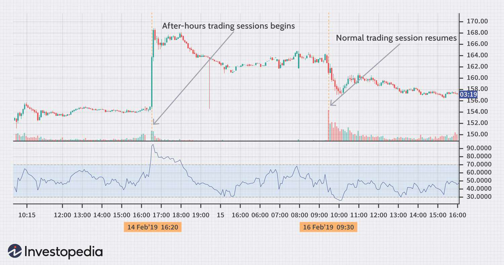

The stock market operates during specific hours, typically from 9:30 a.m. to 4:00 p.m. Eastern Time for major U.S. exchanges. However, trading activities do not necessarily cease when the market closes. After-hours trading, which occurs after the regular market hours, provides investors with the opportunity to continue engaging in buying and selling securities. This extended trading period is crucial for responding to late-breaking news and corporate releases made after traditional market hours. 

Algorithmic trading has become a pivotal component of after-hours trading, significantly influencing how trades are managed during this period. Algorithms, driven by complex mathematical models and advanced computational techniques, facilitate efficient trade execution, especially in a market environment characterized by lower liquidity and higher volatility than during regular sessions. These algorithms are designed to quickly process vast amounts of data and execute trades based on pre-set criteria, thereby optimizing trading performance when human intervention is limited.



This article aims to explore the dynamics of after-hours trading, highlighting its benefits, the strategies employed by traders, and the associated risks. A particular focus will be given to how algorithmic trading has transformed the landscape of after-hours trading, enabling traders to harness opportunities and mitigate potential pitfalls effectively. As we navigate through the intricacies of post-market trading, we will uncover the evolving role of technology in shaping the future of financial markets beyond the closing bell.

## Table of Contents

## Understanding After-Hours Trading

After-hours trading commences shortly after the official closure of major stock exchanges at 4:00 p.m. Eastern Time and typically continues until 8:00 p.m. This extended trading period allows transactions beyond the conventional trading hours, largely facilitated by Electronic Communication Networks (ECNs). These networks play a critical role by matching buy and sell orders electronically without the need for a centralized exchange, thereby providing a platform for continued trade activity in the absence of open markets.

During this period, the trading volume is generally lower, leading to potential increases in market volatility. The reduced number of participants tends to result in wider bid-ask spreads. For instance, while a stock might have a stable spread during regular hours due to high trading volume, after-hours trading might see this spread widen as fewer orders are available for matching on the ECNs. This can create both risk and opportunity, as the volatility may lead to significant price swings that traders can capitalize on if they anticipate movements correctly.

The after-hours trading session is particularly appealing for investors looking to react swiftly to news releases that occur after standard market hours. Companies frequently release earnings reports and other material information after markets close, aiming to avoid immediate market volatility or to provide investors with time to digest the information. Traders operating in the after-hours session can make timely decisions based on these releases, allowing them to position themselves advantageously ahead of the next trading day.

To illustrate the use of ECNs, consider a simplified Python script that simulates the matching of buy and sell orders, which is essentially what an ECN does:

```python
class Order:
    def __init__(self, order_type, price, quantity):
        self.order_type = order_type  # 'buy' or 'sell'
        self.price = price
        self.quantity = quantity

class ECN:
    def __init__(self):
        self.orders = []

    def place_order(self, order):
        self.orders.append(order)
        self.orders.sort(key=lambda x: x.price, reverse=(order.order_type == 'buy'))

    def match_orders(self):
        matches = []
        buy_orders = [o for o in self.orders if o.order_type == 'buy']
        sell_orders = [o for o in self.orders if o.order_type == 'sell']
        i, j = 0, 0
        while i < len(buy_orders) and j < len(sell_orders):
            buy_order = buy_orders[i]
            sell_order = sell_orders[j]
            if buy_order.price >= sell_order.price:
                trade_quantity = min(buy_order.quantity, sell_order.quantity)
                matches.append((buy_order.price, trade_quantity))
                buy_order.quantity -= trade_quantity
                sell_order.quantity -= trade_quantity
                if buy_order.quantity == 0:
                    i += 1
                if sell_order.quantity == 0:
                    j += 1
            else:
                break
        self.orders = [o for o in self.orders if o.quantity > 0]
        return matches
```

This script models a basic version of an ECN where buy and sell orders are placed and matched if the conditions of price thresholds are met, reflecting real ECN functionalities like those used in after-hours markets.

## Benefits of After-Hours Algorithmic Trading

Algorithmic trading has transformed after-hours trading by facilitating efficient trade execution in a market characterized by lower activity. Algorithms can swiftly and efficiently manage trades during the extended hours, thereby offering a number of benefits.

One primary advantage is the speed and efficiency with which algorithms operate, significantly reducing transaction costs and minimizing user errors. Algorithms are programmed to execute trades based on predefined criteria, which eliminates the delay associated with human intervention. For example, an algorithm can be designed to buy or sell a stock if it reaches a certain price, ensuring rapid execution without manual oversight.

Another benefit is the ability of algorithms to respond quickly to late-breaking news, optimizing trading opportunities. News released after the standard market close can have significant implications on stock prices. Algorithms can be tailored to analyze news sentiment and make trades accordingly, thus allowing traders to capitalize on potential stock movements that occur outside regular trading hours. 

Moreover, the continuous placement of orders by algorithms enhances [liquidity](/wiki/liquidity-risk-premium), thereby smoothing trading activity in the after-hours market. In a typically less liquid environment, this constant order flow provided by algorithms helps in maintaining a reasonable level of liquidity. This not only alleviates some of the [volatility](/wiki/volatility-trading-strategies) associated with after-hours trading but also ensures that prices remain more stable and reflective of true market sentiment.

Algorithmic trading in the after-hours market combines precision, speed, and adaptability. By automating trade decisions and executions, algorithms ensure that traders can effectively manage investments even when the market is closed to the general public. Consequently, well-designed algorithms can leverage the unique characteristics of after-hours trading to generate substantial benefits.

## Strategies for Algorithmic Trading Post-Market Close

Algorithmic trading strategies for post-market hours involve sophisticated techniques that analyze market dynamics to optimize trading decisions. Key strategies include employing predictive models and advanced analytics, leveraging [machine learning](/wiki/machine-learning) algorithms, developing customized algorithms, and conducting news and event analysis.

Predictive models and advanced analytics play a crucial role in gauging after-hours market sentiment and trends. Traders utilize quantitative models that incorporate historical data and statistical methods to forecast price movements. Techniques such as time series analysis, regression models, and ARIMA (AutoRegressive Integrated Moving Average) are common in predicting short-term trends. These models can identify potential price reversals or continuations, allowing traders to position their trades accordingly. 

Leveraging machine learning algorithms offers a dynamic approach to adapting to the volatile conditions characteristic of after-hours trading. Algorithms can be trained on vast datasets to recognize patterns and anomalies that might indicate profitable trading opportunities. Machine learning models, such as neural networks and support vector machines, can update in real-time to incorporate new information, enhancing decision-making accuracy. Reinforcement learning, a subset of machine learning, allows algorithms to learn optimal trading strategies through trial and error, ultimately maximizing returns in unpredictable environments.

Developing customized algorithms tailored to specific securities known for after-hours activity enhances trading efficiency. Traders can design these algorithms using languages like Python, which offers libraries such as NumPy, pandas, and scikit-learn, to handle data processing and machine learning model implementation. The customization involves setting parameters that focus the algorithm on securities with a historical tendency for significant after-hours price movements, optimizing trade execution for these securities while mitigating risk.

```python
import pandas as pd
from sklearn.ensemble import RandomForestClassifier

# Example of a simple algorithmic strategy development using Python
def train_model(data):
    # Assuming 'data' is a DataFrame with features and target variable for trading decisions
    features = data[['volume', 'moving_avg', 'rsi']]
    target = data['price_movement']

    model = RandomForestClassifier()
    model.fit(features, target)
    return model

def predict_trade_opportunity(trained_model, market_data):
    # Predict trading opportunities based on the model and incoming market data
    prediction = trained_model.predict(market_data)
    return prediction
```

Utilizing news and event analysis as part of the trading strategy enables traders to anticipate market reactions and make strategic trade placements. Natural language processing (NLP) algorithms analyze vast amounts of unstructured text data from news articles, press releases, and social media to extract sentiment and relevant information. Techniques such as sentiment analysis and keyword extraction help in identifying positive or negative news that could impact after-hours trading. By aligning trading strategies with these analyses, traders can better position themselves to capitalize on post-market news-driven volatility.

In summary, by integrating advanced predictive models, machine learning, custom algorithm development, and comprehensive news analysis, traders can effectively harness the possibilities offered by after-hours trading. These strategies allow for proactivity in decision-making and the ability to swiftly respond to market dynamics, optimizing profitability outside standard trading hours.

## Risks of Algorithmic Trading After-Hours

Algorithmic trading in after-hours markets presents a set of unique risks primarily due to the combination of lower liquidity and heightened volatility. The reduced trading [volume](/wiki/volume-trading-strategy) during these hours can significantly impact the ability to execute trades at desired prices, leading to wider bid-ask spreads and more pronounced price fluctuations. This environment can amplify the risks inherent in [algorithmic trading](/wiki/algorithmic-trading).

Technical glitches, such as errors within trading algorithms, pose a substantial risk, especially in after-hours trading when rapid responses to market conditions are crucial. These glitches might stem from coding errors, incorrect data inputs, or inadequate algorithmic design. For instance, an improperly calibrated algorithm could misinterpret market signals and execute trades that result in large, unintended financial losses. To mitigate such risks, thorough [backtesting](/wiki/backtesting) and simulation are essential before deploying algorithms in a live trading environment.

Cybersecurity threats represent another substantial risk [factor](/wiki/factor-investing). After-hours trading systems often operate with less stringent network protections compared to those in place during regular trading hours. This makes them vulnerable to cyber attacks, including hacking and unauthorized access. Such threats can lead to data breaches, system compromises, and unauthorized trading activities. Implementing robust cybersecurity protocols and ensuring continual monitoring can help protect trading systems from these threats.

The absence of human oversight during after-hours trading can exacerbate the risks associated with algorithmic errors. With fewer traders and analysts available to monitor trades, errors can go unchecked, potentially escalating into significant losses. To address this, incorporating automated monitoring systems that can alert responsible parties in real-time when anomalies are detected is crucial. Furthermore, setting strict risk management parameters and stop-loss orders can help manage potential negative impacts of algorithmic trading during these volatile periods.

In summary, while algorithmic trading offers efficiency and speed, particularly in the dynamic after-hours market, it also requires careful management of specific risks. Financial practitioners must ensure they have robust frameworks and contingency plans in place to safeguard against the potential pitfalls of trading in these extended sessions.

## Key Technical Indicators for After-Hours Trading

After-hours trading operates in a unique environment where technical indicators play a crucial role in guiding trading decisions. Key among these indicators is trading volume. Volume is essential for assessing the level of activity and potential volatility during after-hours sessions. Lower volumes generally indicate less liquidity, which can result in significant price swings and wider bid-ask spreads. Therefore, monitoring volume helps traders gauge the reliability of price movements during these periods.

Moving averages are another important technical indicator employed in after-hours trading. A moving average, typically calculated over a specified time frame, provides insights into price trends by smoothing the data to highlight the underlying direction of the market. Traders commonly use the simple moving average (SMA) or the exponential moving average (EMA) to identify potential support and resistance levels. These levels help traders determine entry and [exit](/wiki/exit-strategy) points when trading during less active hours.

The Relative Strength Index (RSI) is widely used to identify oversold or overbought conditions in after-hours trading. The RSI is a [momentum](/wiki/momentum) oscillator that measures the speed and change of price movements and is expressed on a scale of zero to 100. Values above 70 typically indicate overbought conditions, while values below 30 suggest oversold conditions. In after-hours sessions, where liquidity is lower, the RSI can be particularly helpful in assessing potential reversal points due to exaggerated price movements.

Lastly, monitoring the bid-ask spread is crucial for ensuring fair pricing and gauging market sentiment during extended hours. The bid-ask spread, the difference between the highest price a buyer is willing to pay and the lowest price a seller is willing to accept, tends to widen when trading volume is low. This can be a sign of increased risk, as wider spreads often indicate less confidence in pricing and potentially higher price volatility.

Overall, by attentively utilizing these technical indicators—volume, moving averages, RSI, and bid-ask spread—traders can make more informed decisions when engaging in after-hours trading. Recognizing the limitations and opportunities inherent in these indicators enables market participants to better navigate the intricacies of extended trading sessions.

## Conclusion

Algorithmic trading in the after-hours market presents both opportunities and challenges to modern investors. These opportunities arise from the ability to respond rapidly to news events, deploy advanced computational strategies, and take advantage of potential price inefficiencies in a less crowded marketplace. With the right tools and understanding, traders can effectively capitalize on these post-market movements. Utilizing algorithms can ensure that trades are executed precisely, with speed, and often at reduced costs compared to manual trading.

However, such opportunities come with inherent risks that necessitate robust strategies and vigilant management. The reduced liquidity during after-hours trading can lead to increased volatility and wider bid-ask spreads, posing challenges even for sophisticated algorithms. Technical glitches can result in significant financial losses, and cybersecurity threats may jeopardize the security of these trades. Additionally, a lack of human oversight can lead to unforeseen consequences if algorithms operate unchecked.

To navigate the complexities of after-hours trading, an effective balance between informed strategies and algorithmic precision is essential. Traders must employ comprehensive risk management techniques, continuously monitor algorithmic performance, and update trading models in response to evolving market conditions. By doing so, they can leverage the advantages of algorithmic trading while mitigating potential pitfalls, thus navigating the after-hours landscape with greater efficacy.

## References & Further Reading

[1]: Bergstra, J., Bardenet, R., Bengio, Y., & Kégl, B. (2011). ["Algorithms for Hyper-Parameter Optimization."](https://dl.acm.org/doi/10.5555/2986459.2986743) Advances in Neural Information Processing Systems 24.

[2]: ["Advances in Financial Machine Learning"](https://www.amazon.com/Advances-Financial-Machine-Learning-Marcos/dp/1119482089) by Marcos Lopez de Prado

[3]: ["Evidence-Based Technical Analysis: Applying the Scientific Method and Statistical Inference to Trading Signals"](https://www.amazon.com/Evidence-Based-Technical-Analysis-Scientific-Statistical/dp/0470008741) by David Aronson

[4]: ["Machine Learning for Algorithmic Trading"](https://github.com/stefan-jansen/machine-learning-for-trading) by Stefan Jansen

[5]: ["Quantitative Trading: How to Build Your Own Algorithmic Trading Business"](https://www.amazon.com/Quantitative-Trading-Build-Algorithmic-Business/dp/1119800064) by Ernest P. Chan