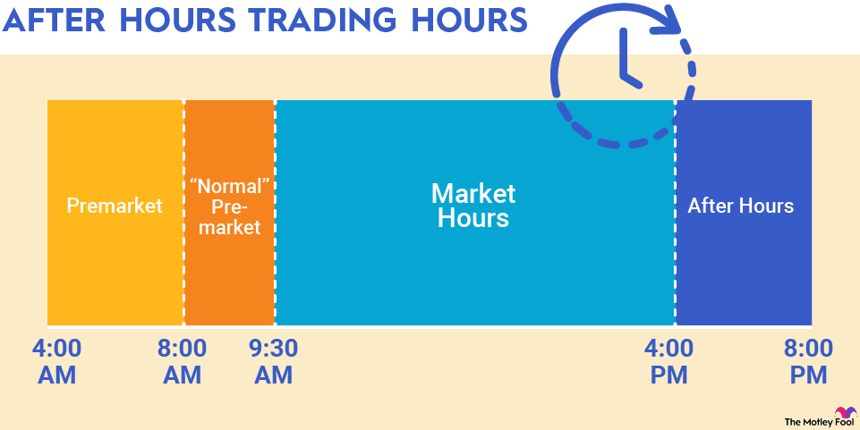

## Table of Contents

## What is the stock market close time?

The stock market in the United States usually closes at 4:00 PM Eastern Time. This is when the regular trading session ends for the day. The two main stock exchanges, the New York Stock Exchange (NYSE) and the Nasdaq, both follow this schedule.

After the regular trading session ends, there is also an after-hours trading session. This session starts right after the close and can go until 8:00 PM Eastern Time. Not all stocks are available for trading during this time, and the volume of trades is usually lower than during regular hours.

## What is after-hours trading?

After-hours trading is when people can buy and sell stocks after the regular stock market closes at 4:00 PM Eastern Time. It starts right after the close and can go until 8:00 PM Eastern Time. This time is good for people who can't trade during the day because they are at work or busy.

Not all stocks can be traded after hours, and fewer people trade during this time. This means the prices can change a lot more than during the regular trading day. It's important to be careful because the market can be more unpredictable.

## Why do stock prices change after the market closes?

Stock prices can change after the market closes because of news or events that happen after the regular trading day ends. For example, a company might announce good or bad news after the market closes, like a new product or a problem with their business. This news can make people want to buy or sell the stock when the market reopens, so the price changes to match what people think the stock is worth now.

Also, during after-hours trading, fewer people are trading compared to the regular day. This means that even small trades can move the price a lot more than during the day. If someone wants to buy or sell a lot of stock after hours, it can push the price up or down quickly because there aren't as many other trades happening at the same time.

## Who can participate in after-hours trading?

Anyone with a brokerage account that offers after-hours trading can participate. Not all brokerages allow this, so you need to check with your broker to see if they offer it. If they do, you can trade stocks after the regular market closes at 4:00 PM Eastern Time.

During after-hours trading, you can buy and sell stocks just like during the regular day. But, there are usually fewer people trading, so the prices can change a lot more. It's important to be careful because the market can be more unpredictable after hours.

## What are the risks associated with after-hours trading?

After-hours trading can be riskier than trading during the regular day. One big reason is that there are fewer people trading after hours. This means that even small trades can move the price a lot more than during the day. If someone wants to buy or sell a lot of stock, it can push the price up or down quickly because there aren't as many other trades happening at the same time.

Another risk is that not all stocks can be traded after hours. This can make it hard to buy or sell the stock you want. Also, the prices can be different from what they were at the end of the regular trading day. This is because news or events that happen after the market closes can change what people think the stock is worth. So, the price you see after hours might not be the same when the market opens again the next day.

## How does after-hours trading affect the next day's opening price?

After-hours trading can change the price of a stock before the regular market opens the next day. If a lot of people buy or sell a stock after hours, it can make the price go up or down. This new price can affect what the stock's opening price will be the next day. For example, if good news comes out after the market closes and a lot of people buy the stock after hours, the price might be higher when the market opens again.

The opening price is important because it sets the starting point for the day's trading. If the after-hours price is a lot different from the closing price of the previous day, it can cause a big jump or drop when the market opens. This can make the stock more exciting to trade but also riskier. People need to watch what happens after hours to guess what might happen when the market opens again.

## What are the differences between pre-market and after-hours trading?

Pre-market trading happens before the regular market opens, usually from around 4:00 AM to 9:30 AM Eastern Time. After-hours trading happens after the regular market closes, from 4:00 PM to 8:00 PM Eastern Time. Both let people trade stocks when the main market is not open, but they happen at different times of the day. 

In both pre-market and after-hours trading, there are fewer people trading than during the regular day. This means that prices can change a lot more and it can be riskier. But pre-market trading might be affected by news that came out overnight, while after-hours trading can be affected by news that comes out after the market closes. Both can influence what the opening price will be when the regular market starts again, but they happen at different times and might be influenced by different news.

## How can investors access after-hours trading platforms?

Investors can access after-hours trading platforms through their brokerage accounts. Not all brokerages offer this service, so it's important to check with your broker to see if they allow after-hours trading. If they do, you can usually find an option to trade after hours in the trading section of their platform. You might need to enable this feature in your account settings first.

Once you have access, you can trade stocks just like you would during the regular market hours. You can place orders to buy or sell stocks, but remember that the prices can change a lot more because fewer people are trading. It's a good idea to keep an eye on any news or events that happen after the market closes, as they can affect the stock prices during after-hours trading.

## What types of orders can be placed during after-hours trading?

During after-hours trading, you can place different types of orders to buy or sell stocks. The most common type is a market order, which means you want to buy or sell the stock at the best price available right now. Another type is a limit order, where you set a specific price you're willing to buy or sell at. If the stock reaches that price during after-hours trading, the order will go through.

You can also use stop orders during after-hours trading. A stop order becomes a market order once the stock reaches a certain price, called the stop price. This can help you limit losses or protect gains. However, because fewer people are trading after hours, the prices can change a lot more, so it's important to be careful with these orders.

## How do liquidity and volatility impact after-hours trading?

Liquidity and [volatility](/wiki/volatility-trading-strategies) can make after-hours trading different from regular trading. Liquidity means how easy it is to buy or sell a stock. During after-hours trading, there are fewer people trading, so there's less [liquidity](/wiki/liquidity-risk-premium). This means it can be harder to buy or sell the stock you want because there aren't as many people to trade with. If you want to buy or sell a lot of stock, it might be harder to find someone to trade with, and the price might change a lot because of your trade.

Volatility means how much the price of a stock can change. After-hours trading can be more volatile because there are fewer trades happening. This means that even small trades can move the price a lot more than during the day. If there's news or an event after the market closes, it can make people want to buy or sell the stock, which can make the price go up or down quickly. So, after-hours trading can be riskier because the prices can change a lot more.

## What are the regulatory considerations for after-hours trading?

There are some rules that investors need to know about when they trade stocks after the regular market closes. The main stock exchanges, like the New York Stock Exchange and Nasdaq, have their own rules for after-hours trading. These rules are there to make sure that trading is fair and safe. For example, they might set limits on how much the price can change during after-hours trading to stop it from moving too much too fast.

Also, the rules can be different depending on which brokerage you use. Some brokerages might let you trade after hours, but others might not. They might also have their own rules about what types of orders you can place and when you can trade. It's important to check with your brokerage to know what you can and can't do during after-hours trading. This helps you stay within the rules and trade safely.

## How do institutional investors use after-hours trading to their advantage?

Institutional investors, like big investment firms, can use after-hours trading to get a head start on the market. If they hear important news after the market closes, they can start buying or selling stocks right away. This can help them act on the news before most other people, which might give them a better chance to make money or avoid losing money. Because there are fewer people trading after hours, their big trades can move the price a lot, but they can use this to their advantage if they know what they're doing.

Also, institutional investors can use after-hours trading to make big trades without causing too much attention during the regular day. If they try to buy or sell a lot of stock during the day, it can make the price go up or down a lot and everyone will notice. But after hours, with fewer people watching, they can make their moves more quietly. This can help them get a better price for their trades and keep their strategies secret from other investors.

## References & Further Reading

[1]: Bergstra, J., Bardenet, R., Bengio, Y., & Kégl, B. (2011). ["Algorithms for Hyper-Parameter Optimization."](https://dl.acm.org/doi/10.5555/2986459.2986743) Advances in Neural Information Processing Systems 24.

[2]: ["Advances in Financial Machine Learning"](https://www.amazon.com/Advances-Financial-Machine-Learning-Marcos/dp/1119482089) by Marcos Lopez de Prado

[3]: ["Evidence-Based Technical Analysis: Applying the Scientific Method and Statistical Inference to Trading Signals"](https://www.amazon.com/Evidence-Based-Technical-Analysis-Scientific-Statistical/dp/0470008741) by David Aronson

[4]: ["Machine Learning for Algorithmic Trading"](https://github.com/stefan-jansen/machine-learning-for-trading) by Stefan Jansen

[5]: ["Quantitative Trading: How to Build Your Own Algorithmic Trading Business"](https://www.amazon.com/Quantitative-Trading-Build-Algorithmic-Business/dp/1119800064) by Ernest P. Chan