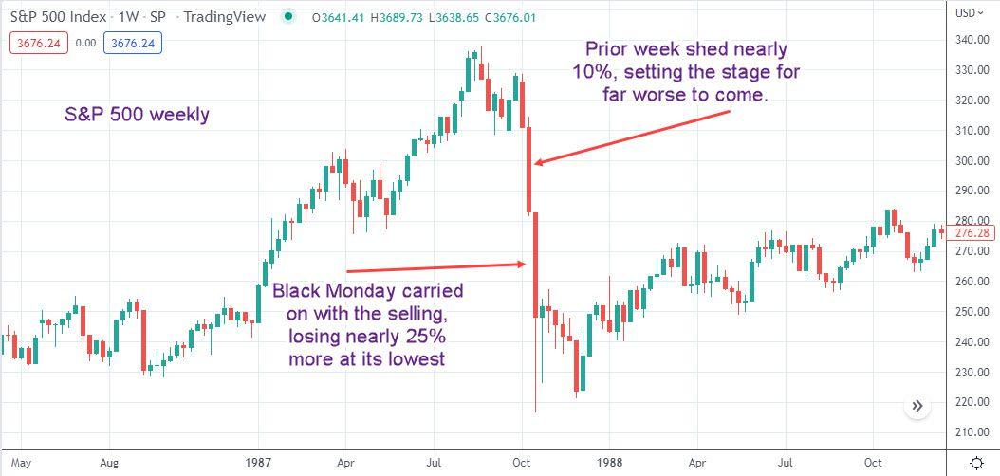

## Table of Contents

## What was the Stock Market Crash of 1987?

The Stock Market Crash of 1987, also known as Black Monday, happened on October 19, 1987. It was a big drop in stock prices around the world. In the United States, the stock market lost about 22.6% of its value in one day. This was the biggest one-day drop in the history of the stock market.

Many things caused the crash. One reason was that people were using computers to trade stocks quickly. These computers could sell stocks very fast if prices started to drop. Also, some investors were worried about the economy and started selling their stocks. When many people started selling at the same time, it made the prices drop even more. This led to panic and more selling.

After the crash, governments and stock markets made new rules to try to prevent such big drops in the future. They created things like "circuit breakers" that stop trading for a short time if prices fall too fast. The crash taught people a lot about how stock markets work and how quickly things can change.

## When did the Stock Market Crash of 1987 occur?

The Stock Market Crash of 1987 happened on October 19, 1987. This day is also called Black Monday. It was a very big drop in stock prices all over the world. In the United States, the stock market lost about 22.6% of its value in just one day. This was the biggest one-day drop ever in the stock market.

Many things caused the crash. One reason was that computers were being used to trade stocks very quickly. These computers could sell stocks fast if prices started to drop. Also, some investors were worried about the economy and started selling their stocks. When many people started selling at the same time, it made the prices drop even more. This led to panic and more selling.

After the crash, governments and stock markets made new rules to try to stop such big drops from happening again. They created things like "circuit breakers" that stop trading for a short time if prices fall too fast. The crash taught people a lot about how stock markets work and how quickly things can change.

## What were the immediate effects of the 1987 crash on the stock market?

The immediate effect of the 1987 crash on the stock market was a huge drop in stock prices. On October 19, 1987, the stock market in the United States lost about 22.6% of its value in just one day. This was the biggest one-day drop in history. The crash caused a lot of panic among investors. Many people saw their investments lose a lot of value very quickly, which made them worried and scared.

After the crash, trading volumes went up a lot because people were trying to sell their stocks to avoid losing more money. This made the prices drop even more. It took a while for the stock market to recover from the crash. In the days and weeks that followed, the market was very unstable, with prices going up and down a lot. It took some time for things to calm down and for investors to feel more confident again.

## What were some of the key events leading up to the 1987 crash?

In the months before the 1987 crash, the stock market was doing very well. Stock prices were going up a lot, and many people were buying stocks because they thought the prices would keep going up. This made the market very high, which some people thought was too high. They worried that the prices were not based on how well companies were doing, but just on people's hopes that prices would keep going up.

There were also some big changes happening in the world that made people nervous. For example, the U.S. dollar was getting weaker compared to other countries' money. This made some investors worried about the economy. Also, new technology was being used to trade stocks. Computers could buy and sell stocks very quickly, and if prices started to drop, these computers would sell a lot of stocks very fast. This made the market more likely to have big drops.

In the days just before the crash, there were some signs that things might go wrong. On October 14, 1987, the Dow Jones Industrial Average dropped a lot, which made people worried. Then, over the weekend, a big trade group said they were going to stop buying U.S. dollars, which made the dollar drop even more. When the market opened on Monday, October 19, all these worries and the fast computer trading led to a huge drop in stock prices, which became known as Black Monday.

## How did the use of program trading contribute to the 1987 crash?

Program trading played a big role in the 1987 crash. This is when computers are used to buy and sell stocks quickly based on certain rules. Before the crash, many investors were using these programs to trade stocks. If stock prices started to drop, the computers would automatically sell a lot of stocks very fast. This made the prices drop even more because there were so many stocks being sold at the same time.

When the market started to go down on Black Monday, these computer programs kicked in and started selling stocks in huge amounts. This made the prices fall even faster and caused a lot of panic among other investors. People saw the prices dropping quickly and got scared, so they started selling their stocks too. This made the crash even worse. Program trading made the stock market very unstable and was a big reason why the crash happened so suddenly and was so bad.

## What role did margin debt play in the 1987 crash?

Margin debt played a big part in the 1987 crash. Margin debt is when people borrow money from their brokers to buy stocks. They use the stocks they already own as a kind of promise to pay back the loan. If stock prices go up, this can be good because people can make more money. But if prices go down, it can be bad. In 1987, a lot of people had borrowed money to buy stocks. When the market started to drop, these people had to sell their stocks quickly to pay back their loans. This made the prices drop even more.

When the crash happened, many people got margin calls. A margin call is when a broker tells someone they need to put more money into their account or sell some stocks because the value of their stocks has gone down. This made more people sell their stocks, which made the prices drop even faster. So, the high amount of margin debt made the crash worse because it forced people to sell their stocks at the worst possible time.

## How did international markets react to the 1987 crash?

The 1987 crash affected stock markets all over the world. When the U.S. market crashed on Black Monday, other countries' markets also dropped a lot. In places like Australia, Hong Kong, and the United Kingdom, stock prices went down by big amounts in the days after the U.S. crash. This showed how connected the world's markets are. If something big happens in one country, it can affect markets everywhere.

After the crash, governments and stock markets in different countries worked together to try to calm things down. They made new rules to help stop such big drops from happening again. For example, they set up "circuit breakers" that would stop trading for a short time if prices fell too fast. This helped to give people time to think and not panic. The crash taught everyone that what happens in one part of the world can quickly affect other parts too.

## What were the findings of the Brady Report regarding the 1987 crash?

The Brady Report was made after the 1987 crash to find out why it happened. The report said that program trading was a big reason for the crash. Program trading is when computers buy and sell stocks very quickly. When the market started to drop, these computers sold a lot of stocks all at once, which made the prices drop even more. The report also said that people were using too much margin debt, which means they borrowed money to buy stocks. When the market went down, they had to sell their stocks to pay back their loans, which made the crash worse.

The report also talked about other things that made the crash happen. It said that some investors were worried about the economy and started selling their stocks. When many people started selling at the same time, it made the prices drop even more. The report suggested that the stock market needed new rules to stop such big drops from happening again. One idea was to use "circuit breakers" that would stop trading for a short time if prices fell too fast. This would give people time to think and not panic. The Brady Report helped people understand what went wrong and how to make the stock market safer.

## How did regulatory changes post-1987 aim to prevent future crashes?

After the 1987 crash, the government and stock markets made new rules to try to stop big drops from happening again. One big change was the use of "circuit breakers." These are rules that stop trading for a short time if stock prices fall too fast. This gives people time to think and not panic. Another change was better rules for program trading. This is when computers buy and sell stocks very quickly. The new rules made sure that this kind of trading did not make the market go down too fast.

The government also made changes to how margin debt worked. Margin debt is when people borrow money to buy stocks. After the crash, they made it harder for people to borrow too much money. This was to stop people from having to sell their stocks quickly if the market went down. All these changes were made to make the stock market safer and to help stop big crashes like the one in 1987 from happening again.

## What were the long-term economic impacts of the 1987 crash?

The 1987 crash had some big effects on the economy in the long run. Even though the stock market lost a lot of value in one day, the economy did not go into a big recession right away. Instead, the U.S. economy kept growing. But the crash made people more careful about investing. They started to think more about the risks of the stock market. This led to changes in how people and companies managed their money. They used less borrowed money to buy stocks and were more careful with their investments.

Over time, the crash also led to new rules and ways of doing things in the stock market. Governments and stock markets made rules like "circuit breakers" to stop big drops from happening again. These changes made the market safer and more stable. The crash also showed how connected the world's markets are. If something big happens in one country, it can affect markets everywhere. This made countries work together more to keep the global economy stable.

## How did the 1987 crash influence future market strategies and investor behavior?

The 1987 crash changed how people thought about the stock market. Before the crash, many people were buying stocks because they thought the prices would keep going up. But after the crash, people became more careful. They started to think more about the risks of investing in the stock market. Investors began to use less borrowed money to buy stocks. They also started to look at the economy more closely before making big investments. This made them more careful and less likely to take big risks.

The crash also led to new ways of managing the stock market. Governments and stock markets made new rules to stop big drops from happening again. One big change was the use of "circuit breakers." These rules stop trading for a short time if stock prices fall too fast. This gives people time to think and not panic. The crash also showed how connected the world's markets are. If something big happens in one country, it can affect markets everywhere. This made countries work together more to keep the global economy stable.

## What lessons can be learned from the Stock Market Crash of 1987 for modern investors?

The Stock Market Crash of 1987 teaches modern investors to be careful and not to take too many risks. Before the crash, many people borrowed a lot of money to buy stocks because they thought the prices would keep going up. But when the market crashed, they had to sell their stocks quickly to pay back their loans, which made the crash worse. Modern investors should learn from this and not borrow too much money to invest. They should also look at the economy closely before making big investments and think about the risks, not just the possible rewards.

Another lesson from the 1987 crash is that new technology can change the stock market quickly. Back then, computers were used to buy and sell stocks very fast. When the market started to drop, these computers sold a lot of stocks at once, which made the prices drop even more. Today, technology is even more advanced, so investors need to understand how it can affect the market. They should also know about the rules that are in place to stop big drops, like "circuit breakers," which stop trading for a short time if prices fall too fast. By learning from the past, investors can be better prepared for the future.

## References & Further Reading

[1]: Roll, R. (1988). ["The International Crash of October 1987."](https://www.jstor.org/stable/4479142) Financial Analysts Journal, 44(5), 19-35.

[2]: Shiller, R. J. (1987). ["Investor Behavior in the October 1987 Stock Market Crash: Survey Evidence."](https://papers.ssrn.com/sol3/papers.cfm?abstract_id=227115) National Bureau of Economic Research.

[3]: MacKenzie, D. (2006). ["An Engine, Not a Camera: How Financial Models Shape Markets."](https://academic.oup.com/mit-press-scholarship-online/book/20588) MIT Press.

[4]: Brady, N. F. (1988). ["Report of the Presidential Task Force on Market Mechanisms."](https://www.sechistorical.org/collection/papers/1980/1988_0101_BradyReport.pdf) U.S. Government Printing Office.

[5]: Carlson, M. (2006). ["A Brief History of the 1987 Stock Market Crash with a Discussion of the Federal Reserve Response."](https://www.federalreserve.gov/pubs/feds/2007/200713/200713pap.pdf) Federal Reserve.

[6]: Haugen, R. A. (1999). ["The New Finance: The Case Against Efficient Markets."](https://archive.org/details/newfinancecas00haug) Prentice Hall.