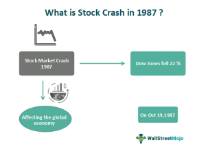

The stock market crash of 1987, commonly known as Black Monday, was a significant financial disaster that impacted markets worldwide. On October 19, 1987, the Dow Jones Industrial Average (DJIA) suffered a historic decline, dropping by 22.6% in a single day. This crash remains the largest single-day percentage decrease in the history of the U.S. stock market. The repercussions of this decline were not confined to the United States; they spread across the globe, sparking a broader financial crisis that affected international markets.

The astonishing speed and size of the crash prompted intense scrutiny and analysis from economists, policymakers, and market participants. Various factors have been identified as contributors to the event, including prevailing economic conditions, financial market structural weaknesses, and the emerging role of technology in trading. In particular, the influence of algorithmic and program trading—automated systems that execute orders based on preset criteria—was a focal point in understanding how trading dynamics contributed to the rapid market decline.

This article explores the complexities underlying this landmark event, examining the economic and technological influences that shaped the 1987 market environment. By analyzing the causes and impacts of Black Monday, we can better understand the evolving landscape of financial markets and the importance of robust mechanisms to manage risk and ensure stability.

## Table of Contents

## Prelude to Black Monday

In the years leading up to the stock market crash of 1987, the financial atmosphere was dominated by an extensive bull market that saw the Dow Jones Industrial Average (DJIA) more than triple its value within a five-year span. This period was marked by what many analysts and investors recognized as excessive valuation levels. Stock prices soared to heights that were not always supported by corresponding growth in earnings or economic fundamentals, a phenomenon that fueled increasingly optimistic expectations among market participants.

A fundamental factor contributing to this environment was the macroeconomic backdrop, characterized by a substantial and persistent trade deficit in the United States. This trade imbalance exerted pressure on the U.S. dollar, influencing both domestic and international investment decisions. The Federal Reserve's monetary policies also played a critical role during this period. Efforts to combat inflation had previously led to high interest rates but began to shift as inflation was perceived to be under control.

As these dynamics unfolded, they interacted with the financial markets in complex ways. The Federal Reserve's decisions around interest rates influenced borrowing costs and, consequently, investment strategies. Market participants were particularly responsive to the Federal Reserve's signals regarding future monetary policy, leading to volatility and shifts in investor sentiment.

Excessive valuations and heightened expectations created an unstable environment, primed for disruption. The disconnect between stock prices and their underlying economic fundamentals became increasingly unsustainable. As such, these conditions set a precarious stage for the market correction that followed, culminating in the dramatic events of Black Monday.

## What Happened on Black Monday?

Black Monday, October 19, 1987, marked a day of unprecedented turmoil in global financial markets. The day began with an atmosphere of uncertainty, rapidly escalating into widespread panic, as traders encountered a torrent of sell orders. This deluge overwhelmed the capabilities of existing computerized trading systems, leading to severe delays and numerous unfilled orders. The chaos was exacerbated by the structural inefficiencies present in the financial exchanges of the era.

At the opening of the markets, there was an immediate inundation of sell orders, primarily driven by a collective fear among investors regarding the ongoing economic conditions. As sell orders vastly outnumbered buy orders, the market was thrown into disorder. The infrastructure at the time was ill-equipped to handle such a [volume](/wiki/volume-trading-strategy), resulting in execution backlogs that further fueled investor anxiety.

One core issue was the reliance on program trading strategies, where computers executed trades based on predefined algorithms. These systems, initially designed to optimize trading efficiency, instead created a feedback loop that accelerated the downward spiral. As the markets plummeted, these programs automatically initiated more sell orders to cut losses, thereby magnifying the market's losses.

The crisis highlighted significant structural weaknesses within the global market framework. Exchanges across different countries lacked coordination, making it difficult to manage and mitigate the effects of the crash globally. While the initial financial tremors began in the United States, the crisis quickly spread across international borders, affecting markets in Europe, Asia, and beyond.

The lack of standardized procedures and communication among global exchanges hindered any potential coordinated response, leaving the markets vulnerable to speculative pressures. As the day progressed, most financial systems were incapable of processing the surge in activity, which prolonged the crisis and deepened its impact. 

Overall, the events of Black Monday served as a stark reminder of the fragility of financial systems under extreme stress and underscored the need for robust mechanisms to manage and respond to market disruptions effectively.

## Causes of the 1987 Market Crash

The stock market crash of 1987, often referred to as Black Monday, was precipitated by a combination of economic, geopolitical, and technological factors. A primary catalyst was the fear of higher interest rates, which loomed large in the minds of investors. This anxiety was driven by monetary policy changes and an expectation that central banks, aiming to combat potential inflation, would raise interest rates. As interest rates rise, the cost of borrowing increases, potentially leading to reduced corporate profits and lower stock valuations.

Geopolitical tensions also contributed to market instability. During this period, various international events heightened uncertainty and influenced investor behavior. The interplay between domestic and global economic policies, exemplified by agreements such as the Plaza Accord and the Louvre Accord, played a significant role in shaping market perceptions. These accords were international frameworks designed to address issues related to the U.S. dollar's valuation. While intended to foster stability, the implementation of such agreements had the unintended effect of influencing stock prices, as they modified currency values and, consequently, international trade balances.

A significant [factor](/wiki/factor-investing) exacerbating the impact of these economic and geopolitical pressures was the rise of program trading and algorithm-driven trading models. Program trading refers to the use of computer algorithms to automate trading decisions, based on pre-determined criteria or market conditions. These systems, while efficient under normal circumstances, contributed to the crash by accelerating sell-offs in a highly volatile environment. When markets began to decline, program traders automatically executed large volumes of sell orders, intensifying the downward spiral and overwhelming traditional trading mechanisms.

This phenomenon highlighted the interconnectedness of modern financial markets and underscored the systemic risks associated with [algorithmic trading](/wiki/algorithmic-trading). The algorithms designed to manage and hedge investments inadvertently exacerbated market [volatility](/wiki/volatility-trading-strategies) by triggering massive sell-offs, illustrating the need for more robust regulatory oversight and trading safeguards.

In summary, the 1987 crash was caused by a convergence of high-[interest rate](/wiki/interest-rate-trading-strategies) fears, geopolitical tensions, and algorithmic trading strategies. The interplay of these elements created a perfect storm that emphasized the vulnerabilities in the financial systems of the time.

## The Role of Algorithmic Trading

Algorithmic trading, commonly known as program trading, became a pivotal element in the landscape of financial markets during the late 20th century. This approach involves executing pre-defined buy or sell orders that are triggered automatically based on specific market conditions. The sophistication of these systems allows them to process large volumes of trades at speeds unattainable by human traders, contributing to increased market [liquidity](/wiki/liquidity-risk-premium) and efficiency.

However, the very characteristics that made algorithmic trading advantageous also rendered it potentially hazardous during periods of market stress. During the 1987 stock market crash, algorithmic trading systems significantly influenced the severity of the market downturn. These systems were primarily designed to minimize losses by selling off assets rapidly during declining markets, a strategy known as portfolio insurance. While this approach proves beneficial under controlled scenarios, it can lead to disastrous outcomes during volatile periods.

On October 19, 1987, as stock prices began to drop, program traders triggered a wave of automated sell orders, exacerbating the market plunge. The volume of trades overwhelmed trading systems and order [books](/wiki/algo-trading-books), thereby amplifying the decline and creating a cascading effect throughout global markets. This phenomenon underscored a vulnerability inherent in automated trading strategies: the inability to adapt to extreme and unforeseen market conditions.

The consequences of the crash prompted a re-evaluation of algorithmic trading practices and highlighted the need for regulatory changes. One of the most notable regulatory responses was the introduction of mechanisms like circuit breakers, designed to temporarily halt trading in the event of severe market declines. These measures aim to prevent panic-induced sell-offs and provide a cooldown period for markets to balance.

In summary, while algorithmic trading brought numerous efficiencies to financial markets, the events of Black Monday in 1987 demonstrated its potential risks. The incident not only acted as a catalyst for regulatory scrutiny but also pushed for improvements in trading systems to better handle periods of extreme volatility.

## Global Impact and Aftermath

The stock market crash of October 1987, commonly known as Black Monday, had a profound global impact, triggering significant declines across financial markets in Asia, Europe, and the Americas. The interconnected nature of global economies meant that the ripple effects were felt far beyond the United States. In Hong Kong, the market fell by 45.8% over four days, while in the United Kingdom, the FTSE 100 Index dropped by more than 10% on October 19 alone. Other indices, such as Australia's ASX 200, Germany's DAX, and Canada's S&P/TSX Composite, experienced similarly severe downturns as panic spread among investors worldwide.

In response to the unprecedented turmoil, central banks across major economies took decisive actions to stabilize their financial systems and restore investor confidence. Interventions were necessary to prevent a complete breakdown of market functioning and to ensure liquidity. The Federal Reserve in the United States led these efforts by providing additional liquidity to support banking systems and financial institutions. Alan Greenspan, the newly appointed Chair of the Federal Reserve at the time, stated that the central bank stood ready to serve as a source of liquidity to counteract both domestic and international pressures in the market.

To mitigate future risks and prevent a recurrence of such catastrophic market events, the U.S. Federal Reserve and other financial regulators implemented several regulatory changes. One of the key measures was the introduction of circuit breakers—mechanisms to temporarily halt trading on stock exchanges in the event of significant price declines. These circuit breakers were designed to give investors time to assimilate information and regain composure during periods of heightened volatility, reducing the likelihood of panic-driven sell-offs.

Furthermore, trading curbs were also established to limit the extent of daily price movements and provide a cooling-off period during which market participants could make more informed and rational decisions. These measures aimed to curb excessive volatility and enhance market resilience.

The market adjustments and regulatory frameworks introduced in the aftermath of the 1987 crash underscored the necessity of robust oversight and international cooperation. They also highlighted the critical importance of maintaining sufficient liquidity and having appropriate mechanisms in place to manage market stress effectively. These developments have continued to inform regulatory approaches and market safeguards in subsequent decades, underscoring the enduring lessons learned from the Black Monday crash.

## Lessons Learned and Regulatory Changes

The stock market crash of 1987 highlighted notable vulnerabilities in the financial system, particularly concerning algorithmic trading. In response to this, regulatory bodies made significant changes to bolster market stability and prevent future crises of similar magnitude.

One of the primary lessons from the crash was the realization of the dangers inherent in unregulated algorithmic trading. The trading models employed during this period were designed to execute transactions rapidly, sometimes exacerbating market movements during periods of stress. Post-crash analyses indicated that these algorithms, during volatile moments, could lead to feedback loops that amplify price declines. As a result, there was a comprehensive reevaluation of regulatory frameworks governing stock markets.

A key regulatory innovation introduced after the crash was the implementation of circuit breakers. These mechanisms are designed to temporarily halt trading on an exchange, providing a cooling-off period during extreme market movements. Circuit breakers are triggered based on preset percentage declines in major indices. For instance, in the United States, if the S&P 500 index falls by a certain percentage, trading can be paused to allow information to disseminate and for participants to reassess their positions. This helps curb panic-selling and reduces the chance of a freefall scenario similar to that of Black Monday.

Moreover, the 1987 crash underscored the necessity for international cooperation and coordination. Financial markets are interconnected, and a disruption in one market can have cascading effects globally. In light of this, financial regulators and central banks around the world have increasingly collaborated to ensure greater cohesion in policy responses and regulatory standards. This cooperation aims to create a more seamless and resilient global financial system.

These regulatory changes and the emphasized need for international synergy have become fundamental in shaping modern approaches to market oversight. They underscore the importance of mitigating systemic risks while harnessing the benefits of technological advancements in trading practices.

## Conclusion

The Black Monday crash of 1987 illuminates the profound influence of technological advancements and policy changes on financial markets. This historic event underscores the necessity for continuous vigilance as markets evolve, highlighting that the conditions leading to such a crisis can manifest rapidly and unpredictably. The integration of algorithmic trading and technology-driven market strategies has exponentially increased market complexities, necessitating robust regulatory oversight to mitigate systemic risks.

As financial markets continue to advance, the 1987 crash serves as a crucial case study in understanding the potential impacts of technology on market stability. The lessons learned remain pertinent, emphasizing the importance of adaptive strategies to prevent future crises. Implementing robust frameworks that account for the potential systemic influences of algorithmic trading and other automated systems is critical.

Continuous vigilance, characterized by monitoring market behaviors and technological advancements, is essential to anticipate and counteract potential market instabilities. Regulatory bodies must ensure these initiatives are comprehensive, adaptable, and international in scope, recognizing that financial markets are increasingly interconnected.

Effective strategies include the employment of circuit breakers and trading curbs and fostering global cooperation among market regulators. This approach is vital for maintaining market integrity and confidence. As trading practices and technologies evolve, adaptive strategies in regulatory oversight will help navigate the complexities inherent in modern-[day trading](/wiki/day-trading-spy) environments, safeguarding against potential disruptions.

## References & Further Reading

[1]: Roll, R. (1988). ["The International Crash of October 1987."](https://www.jstor.org/stable/4479142) Financial Analysts Journal, 44(5), 19-35.

[2]: Shiller, R. J. (1987). ["Investor Behavior in the October 1987 Stock Market Crash: Survey Evidence."](https://papers.ssrn.com/sol3/papers.cfm?abstract_id=227115) National Bureau of Economic Research.

[3]: MacKenzie, D. (2006). ["An Engine, Not a Camera: How Financial Models Shape Markets."](https://academic.oup.com/mit-press-scholarship-online/book/20588) MIT Press.

[4]: Brady, N. F. (1988). ["Report of the Presidential Task Force on Market Mechanisms."](https://www.sechistorical.org/collection/papers/1980/1988_0101_BradyReport.pdf) U.S. Government Printing Office.

[5]: Carlson, M. (2006). ["A Brief History of the 1987 Stock Market Crash with a Discussion of the Federal Reserve Response."](https://www.federalreserve.gov/pubs/feds/2007/200713/200713pap.pdf) Federal Reserve.

[6]: Haugen, R. A. (1999). ["The New Finance: The Case Against Efficient Markets."](https://archive.org/details/newfinancecas00haug) Prentice Hall.