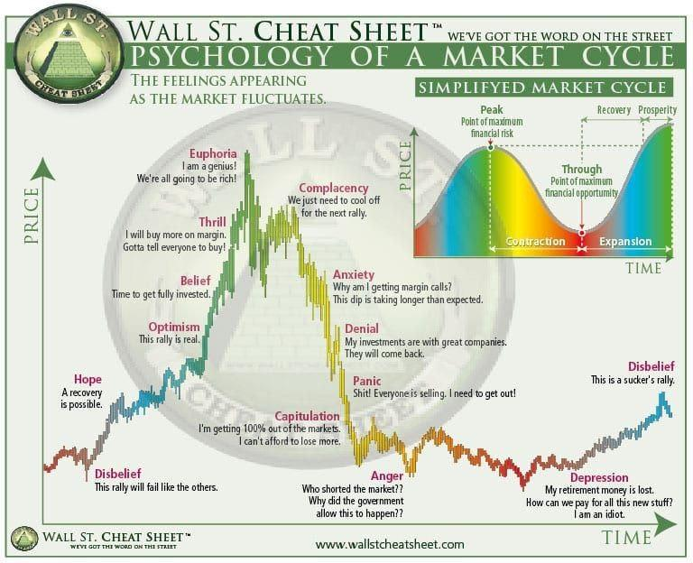

## Table of Contents

## What is a stock market cycle?

A stock market cycle is like a repeating pattern that the stock market goes through over time. It has different phases where the market goes up and down. These cycles can last for a few years or even longer. The cycle starts with a period of growth, where stock prices rise and people feel good about investing. This is called a bull market. During this time, more people want to buy stocks, which pushes the prices even higher.

After the bull market, there comes a time when the market starts to slow down. This is called a bear market, where stock prices start to fall. People might start to feel worried and sell their stocks, which makes the prices drop even more. Eventually, the market hits a low point and then starts to recover. This recovery leads back to another bull market, and the cycle begins all over again. Understanding these cycles can help investors make better choices about when to buy and sell stocks.

## What are the main phases of a stock market cycle?

The stock market cycle has four main phases: expansion, peak, contraction, and trough. The expansion phase is when the market starts to grow. Stock prices go up, and people feel good about investing. This is also called a bull market. During this time, more and more people want to buy stocks, which makes the prices rise even higher.

After the expansion comes the peak phase. This is when the market reaches its highest point. But then, things start to change. The market enters the contraction phase, also known as a bear market. Stock prices start to fall, and people might start to feel worried. They might sell their stocks, which makes the prices drop even more. Finally, the market hits its lowest point in the trough phase. After the trough, the market starts to recover, and the cycle begins again with another expansion phase.

## How long does a typical stock market cycle last?

A typical stock market cycle can last anywhere from a few years to over a decade. It's hard to say exactly how long because each cycle is different. Things like the economy, world events, and what people think about the market can change how long a cycle lasts.

For example, some cycles in the past have lasted around 5 to 7 years. But there have been longer cycles, like the one from 1987 to 2000, which lasted about 13 years. So, while we can talk about an average length, it's important to remember that stock market cycles can be quite unpredictable.

## What causes stock market cycles?

Stock market cycles are caused by a mix of things like the economy, what people think about the market, and big events around the world. When the economy is doing well, businesses make more money, and people feel good about investing. This makes stock prices go up and starts the expansion phase of the cycle. But if the economy starts to slow down, businesses might not do as well, and people might start to worry. This can make stock prices fall and start the contraction phase.

Another big thing that causes stock market cycles is what people think and feel about the market. If a lot of people think the market will keep going up, they'll buy more stocks, which pushes prices higher. But if people start to think the market will go down, they might sell their stocks, which can make prices drop. Big world events, like wars or pandemics, can also shake up the market and cause cycles to start or change. These events can make people feel unsure and change how they invest, which affects stock prices and the cycle.

## How can an investor identify the current phase of a stock market cycle?

To figure out where the stock market is in its cycle, an investor needs to look at a few things. One big thing to watch is how stock prices are moving. If prices are going up a lot and more people are buying stocks, it's probably the expansion phase, or a bull market. But if prices are going down and people are selling, it might be the contraction phase, or a bear market. Another thing to check is what's happening in the economy. If businesses are doing well and people are spending money, that can mean the market is in the expansion phase. But if businesses are struggling and people are saving more, it might be the contraction phase.

Also, it's helpful to listen to what experts and news are saying about the market. If a lot of people are feeling good and think the market will keep going up, it's likely still in the expansion phase. But if people are worried and think the market will go down, it might be moving into the contraction phase. Looking at economic reports and market trends can also give clues. For example, if unemployment is low and companies are making more money, it's a good sign of an expansion. But if unemployment is going up and profits are down, it might be a sign of a coming contraction. By keeping an eye on these things, an investor can get a better idea of where the stock market cycle is at.

## What are the common indicators used to predict stock market cycles?

Common indicators used to predict stock market cycles include economic data, market sentiment, and technical analysis. Economic data like GDP growth, unemployment rates, and corporate earnings can show if the economy is doing well or not. If the economy is growing and businesses are making more money, it's a sign that the market might be in an expansion phase. On the other hand, if the economy is slowing down and businesses are struggling, it could mean the market is moving into a contraction phase.

Market sentiment is another big indicator. It's all about what people think and feel about the market. If a lot of people are feeling good and think the market will keep going up, it's likely still in the expansion phase. But if people are worried and think the market will go down, it might be moving into the contraction phase. You can get a sense of market sentiment by reading news, listening to experts, and looking at surveys that ask people how they feel about the market.

Technical analysis is a third way to predict stock market cycles. It involves looking at charts and patterns of stock prices to see where the market might be headed. For example, if stock prices are making higher highs and higher lows, it's a sign of an expansion phase. But if prices are making lower highs and lower lows, it might be a sign of a contraction phase. By using these indicators together, investors can get a better idea of where the stock market cycle is at and where it might be going next.

## How do stock market cycles affect investment strategies?

Stock market cycles can really change how people invest. When the market is in an expansion phase, or a bull market, people might feel more confident and want to buy more stocks. They might choose to invest in riskier stocks that could grow a lot because they think the market will keep going up. But when the market is in a contraction phase, or a bear market, people might get worried and want to sell their stocks. They might move their money into safer investments like bonds or cash to protect it from losing value. Knowing where the market is in its cycle can help investors decide when to buy or sell and what kinds of investments to choose.

Also, understanding stock market cycles can help investors plan for the long term. If they know that the market goes through ups and downs, they might decide to keep their money in the market even when it's going down, because they know it will likely go back up. This is called staying invested for the long haul. Some investors might also use a strategy called dollar-cost averaging, where they invest a little bit of money regularly, no matter what the market is doing. This can help them buy more stocks when prices are low and fewer when prices are high, which can be a good way to handle the ups and downs of stock market cycles.

## What are the risks associated with investing during different phases of a stock market cycle?

Investing during the expansion phase of a stock market cycle can be exciting because stock prices are going up and it feels like a good time to buy. But there are risks too. If you buy stocks when prices are already high, you might end up paying more than the stocks are really worth. This means if the market turns around and starts to go down, you could lose a lot of money. Also, if everyone is feeling too good about the market, it might be a sign that a peak is coming soon, and then prices could start to fall.

On the other hand, investing during the contraction phase can be scary because stock prices are going down and it might feel like a bad time to buy. But there are risks here too. If you sell your stocks when prices are low, you might miss out on the chance to buy them back cheaper. And if you try to wait for the market to hit the bottom before buying, you might wait too long and miss the start of the next expansion phase. It's hard to know exactly when the market will turn around, so you could end up buying stocks that keep going down in value.

Understanding the risks in each phase can help you make better choices. In the expansion phase, it's important to not get too excited and buy stocks just because everyone else is. In the contraction phase, it's important to not get too scared and sell everything. By keeping a cool head and thinking about the long term, you can handle the ups and downs of the stock market cycle better.

## Can stock market cycles be accurately predicted? Why or why not?

It's really hard to predict stock market cycles accurately. The stock market is affected by so many things, like the economy, what people think about the market, and big events around the world. These things can change quickly and in ways that are hard to guess. For example, a new law or a surprise event like a war or a health crisis can shake up the market and change the cycle in ways no one saw coming. Even experts who study the market all the time can't always predict what will happen next.

That said, people do try to predict stock market cycles using different tools and indicators. They look at things like how the economy is doing, what people are saying about the market, and patterns in stock prices. While these tools can give some clues about where the market might be headed, they're not perfect. Sometimes the market does what no one expects. So, while it's possible to make educated guesses about stock market cycles, it's important to remember that no one can predict the future with 100% accuracy.

## How have historical stock market cycles influenced current market analysis techniques?

Historical stock market cycles have taught people a lot about how the market works. By looking at past cycles, experts have learned that the market goes through ups and downs in a kind of pattern. This has helped them come up with ways to study the market better. For example, they use charts and graphs to find patterns in stock prices, which is called technical analysis. They also look at things like how the economy is doing and what people think about the market, which is called [fundamental analysis](/wiki/fundamental-analysis). These ways of studying the market help experts make better guesses about where the market might be headed next.

Also, historical cycles have shown that the market can be unpredictable because of big events like wars or health crises. This has made people more careful about trying to predict the future. Instead of trying to guess exactly when the market will go up or down, many investors now focus on long-term investing. They use strategies like dollar-cost averaging, where they invest a little bit of money regularly, no matter what the market is doing. This helps them smooth out the ups and downs of the market over time. So, while historical cycles can't tell us exactly what will happen next, they have helped shape the tools and strategies people use to understand and invest in the market today.

## What role do global economic factors play in influencing stock market cycles?

Global economic factors have a big impact on stock market cycles. Things like what's happening in other countries' economies, trade between countries, and big events like wars or health crises can shake up the market. If a big economy like the U.S. or China is doing well, it can make people feel good about investing, which can push the market into an expansion phase. But if those big economies start to slow down, it can make people worried and push the market into a contraction phase.

Also, changes in global interest rates and money exchange rates can affect stock market cycles. If interest rates go up in one country, it might make investors move their money there to get better returns, which can affect stock prices in other countries. And if the value of one country's money goes up or down compared to another, it can change how much companies make from selling things in different countries. This can make their stock prices go up or down, which can influence the whole market cycle.

## How can advanced statistical models enhance the understanding of stock market cycles?

Advanced statistical models can help people understand stock market cycles better by looking at lots of data and finding patterns that might be hard to see otherwise. These models can use things like [machine learning](/wiki/machine-learning) to look at past stock prices, how the economy is doing, and what people are thinking about the market. By doing this, they can find out what things are most likely to make the market go up or down. This can help investors make better guesses about where the market might be headed next.

Even though these models are really helpful, they're not perfect. The stock market can be affected by surprise events like wars or health crises that no one can predict. So, while advanced statistical models can give us a lot of good information about stock market cycles, they can't tell us exactly what will happen in the future. But they can still help investors make smarter choices by giving them a better understanding of how the market works.

## References & Further Reading

[1]: Bergstra, J., Bardenet, R., Bengio, Y., & Kégl, B. (2011). ["Algorithms for Hyper-Parameter Optimization."](https://dl.acm.org/doi/10.5555/2986459.2986743) Advances in Neural Information Processing Systems 24.

[2]: ["Advances in Financial Machine Learning"](https://www.amazon.com/Advances-Financial-Machine-Learning-Marcos/dp/1119482089) by Marcos Lopez de Prado

[3]: ["Evidence-Based Technical Analysis: Applying the Scientific Method and Statistical Inference to Trading Signals"](https://www.amazon.com/Evidence-Based-Technical-Analysis-Scientific-Statistical/dp/0470008741) by David Aronson

[4]: ["Machine Learning for Algorithmic Trading"](https://github.com/stefan-jansen/machine-learning-for-trading) by Stefan Jansen

[5]: ["Quantitative Trading: How to Build Your Own Algorithmic Trading Business"](https://github.com/LucindaYa/quant-resources/blob/master/Quantitative%20Trading%20How%20to%20Build%20Your%20Own%20Algorithmic%20Trading%20Business.pdf) by Ernest P. Chan