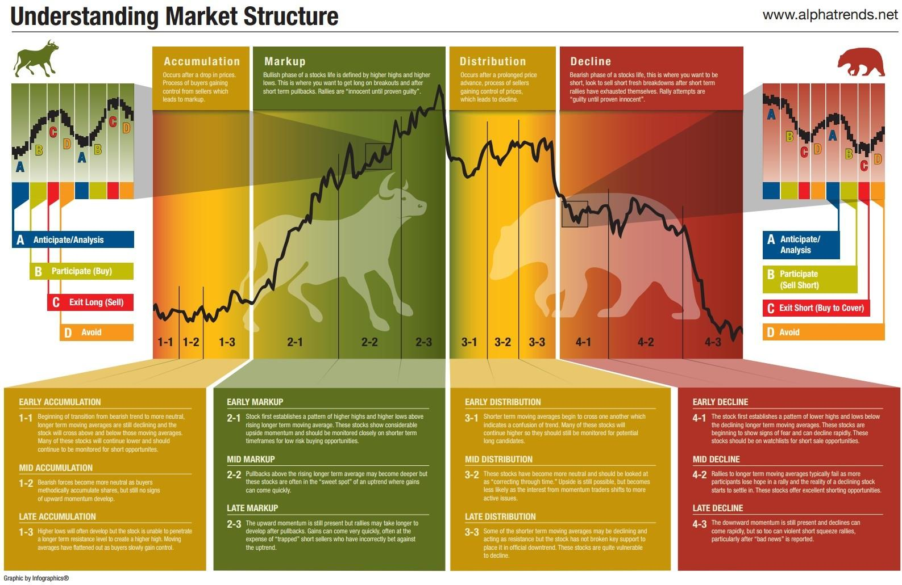

## Table of Contents

## What is a stock market cycle?

A stock market cycle is a pattern that the stock market goes through over time. It's like a roller coaster with ups and downs. The cycle has four main parts: expansion, peak, contraction, and trough. During the expansion, the economy grows, and stock prices go up. When it reaches the peak, the market is at its highest point. After that, it starts to go down during the contraction phase, and stock prices fall. Finally, it hits the trough, which is the lowest point before the cycle starts over again.

These cycles can last for different amounts of time. Some might take a few years, while others could take much longer. It's important for investors to understand these cycles because they can help predict when to buy or sell stocks. If you can spot when the market is at the peak or trough, you might make better decisions. But remember, predicting the market is very hard, and no one can do it perfectly. So, it's always a good idea to be careful and do a lot of research before making any investment choices.

## What are the main phases of a stock market cycle?

A stock market cycle has four main phases: expansion, peak, contraction, and trough. During the expansion phase, the economy is growing, and stock prices are going up. This is a good time for businesses because they are making more money, and people feel confident about spending and investing. As the expansion continues, the market eventually reaches its peak. At the peak, stock prices are at their highest, and the market can't grow anymore.

After the peak comes the contraction phase. During contraction, the economy starts to slow down, and stock prices begin to fall. Businesses might not be doing as well, and people might start to worry about their investments. This phase can be tough for investors because they might see the value of their stocks go down. Eventually, the market hits the trough, which is the lowest point in the cycle. At the trough, stock prices are at their lowest, and the economy is at its weakest. But after the trough, the cycle starts over again with a new expansion phase.

## How long do stock market cycles typically last?

Stock market cycles can last for different amounts of time. Some cycles might be short, lasting just a few months, while others can go on for several years. On average, a full cycle from expansion to trough might take about 3 to 5 years. But this can change a lot depending on what's happening in the world and the economy.

It's hard to predict exactly how long a cycle will last because so many things can affect it. Things like government policies, big world events, and changes in technology can make cycles shorter or longer. For example, a big economic crisis might make a cycle last longer because it takes more time for the economy to recover. So, while we can talk about average times, each cycle is different and can surprise us.

## What causes stock market cycles?

Stock market cycles are caused by many things that happen in the economy and the world. One big reason is how people feel about the future. When people think things will get better, they spend more money and buy more stocks. This makes the economy grow and pushes stock prices up. But if people start to worry that things might get worse, they might stop spending and sell their stocks. This can slow down the economy and make stock prices fall.

Another reason for stock market cycles is what the government does. If the government spends a lot of money on things like roads and schools, it can help the economy grow. They can also change taxes and interest rates to make people spend more or less. These actions can make the stock market go up or down. Big events around the world, like wars or new technology, can also shake up the economy and cause stock market cycles.

So, stock market cycles are caused by a mix of how people feel, what the government does, and big events that happen. All these things together make the stock market go through its ups and downs.

## What are the indicators of the beginning of a bull market?

A bull market starts when the economy begins to grow again after being down. One big sign is when stock prices start going up and keep going up for a while. This often happens after the market hits its lowest point, or the trough. People start feeling more hopeful about the future, so they buy more stocks. When lots of people are buying, it pushes stock prices higher. Another sign is when companies start making more money and growing. This makes investors feel good about putting their money into the market.

Another thing to look for is when the government does things to help the economy. They might lower taxes or interest rates to make it easier for people to spend and invest. When the government does this, it can help kickstart a bull market. Also, if there's good news about the economy, like more people getting jobs or businesses doing better, it can make people feel more confident. All these signs together can show that a bull market is starting.

## How can investors identify the peak of a market cycle?

Identifying the peak of a market cycle can be tricky, but there are some signs to watch for. One big sign is when stock prices are really high and they keep going up, but not as fast as before. It's like the market is getting tired. People might start to feel worried that the prices can't keep going up forever. Another sign is when lots of people are talking about how great the market is and everyone is buying stocks. When everyone is doing the same thing, it might mean the market is at its peak.

Another way to spot the peak is by looking at what companies are doing. If companies are not growing as much as they used to, it could be a sign that the market is at its top. Also, if the government starts to raise interest rates to slow down the economy, it might mean the peak is near. The government does this to stop the economy from growing too fast. So, by watching stock prices, how people feel, what companies are doing, and what the government is doing, investors can get a good idea if the market is at its peak.

## What are the signs that a bear market is approaching?

A bear market is when stock prices start going down and keep going down for a while. One big sign that a bear market might be coming is when the economy starts to slow down. You might see companies making less money and not growing as fast as before. Another sign is when people start to feel worried about the future. When people are scared, they might sell their stocks, which makes prices go down even more. If you see a lot of bad news about the economy, like more people losing their jobs, it could mean a bear market is on its way.

Another thing to watch for is what the government is doing. If they start raising interest rates to slow down the economy even more, it could be a sign that a bear market is coming. High interest rates make it harder for people to borrow money and spend, which can hurt the economy. Also, if stock prices have been going up a lot and suddenly start to go down, it might mean the market is getting ready for a bear market. So, by looking at the economy, how people feel, and what the government is doing, you can get a good idea if a bear market is coming.

## How do economic indicators influence stock market cycles?

Economic indicators are like clues that tell us how the economy is doing. They can help us understand if the stock market is going to go up or down. Things like the unemployment rate, how much money people are spending, and how fast the economy is growing are all important. When the unemployment rate goes down, it usually means more people have jobs and are earning money. This can make the stock market go up because people feel good about spending and investing. On the other hand, if people are spending less money, it might mean the economy is slowing down, which can make stock prices fall.

Government actions also play a big role in how economic indicators affect the stock market. For example, if the government lowers interest rates, it can make borrowing money easier. This can help the economy grow and push stock prices up. But if the government raises interest rates to slow down the economy, it might make people spend less and cause stock prices to go down. So, by watching these economic indicators and understanding what the government is doing, investors can get a better idea of where the stock market might be headed.

## What strategies can investors use during different phases of a stock market cycle?

During the expansion phase of a stock market cycle, investors should focus on buying stocks. This is a good time because the economy is growing, and stock prices are going up. Investors can look for companies that are doing well and have a good chance to keep growing. It's also a good idea to spread out your money among different kinds of stocks to lower the risk. If you see a company that is making more money and growing fast, it might be a good time to buy its stock.

When the market reaches its peak, investors need to be careful. This is when stock prices are at their highest, and it might be a good time to sell some stocks to make a profit. It's hard to know exactly when the peak is happening, but if you see stock prices going up slower than before and lots of people talking about how great the market is, it might be time to sell. You don't have to sell everything, but taking some profits can help you have money to buy stocks again when prices go down.

During the contraction and trough phases, the economy is slowing down, and stock prices are falling. This can be a scary time, but it's also a good time to buy stocks at lower prices. Look for strong companies that might do well when the economy starts to grow again. It's important to be patient and not sell your stocks just because prices are going down. If you can wait until the market starts to go up again, you might make a lot of money. Remember, stock market cycles always come back around, so staying calm and having a plan can help you do well no matter what phase the market is in.

## How do global events impact stock market cycles?

Global events can shake up stock market cycles a lot. When something big happens around the world, like a war or a natural disaster, it can make people worried. When people are scared, they might sell their stocks, which makes prices go down. For example, if there's a war in a big country, it can hurt the economy there and make people all over the world feel less safe about investing. This can push the stock market into a contraction phase, where prices keep falling.

But global events can also help the stock market. If there's good news, like a new technology that makes life better or a big trade deal between countries, it can make people feel hopeful. When people are hopeful, they might buy more stocks, which can push the market into an expansion phase. For example, if a new medicine is found that can cure a big disease, it can make people feel good about the future and want to invest more. So, global events can make the stock market go up or down, depending on if they make people feel scared or hopeful.

## What historical examples illustrate typical stock market cycles?

One good example of a stock market cycle is the dot-com bubble from the late 1990s to early 2000s. During the expansion phase, lots of new internet companies were starting up, and people were excited about them. Stock prices for these companies went up and up. This was the peak of the market. But then, people started to realize that many of these companies were not making money and might never make money. So, they started selling their stocks, and prices began to fall. This was the contraction phase. By 2002, the market hit its trough, and many internet companies went out of business. It took a while for the market to start growing again.

Another example is the 2008 financial crisis. Before the crisis, during the expansion phase, people were buying lots of houses, and banks were giving out loans easily. Stock prices were going up because everyone thought the housing market would keep growing. But then, in 2007, the housing bubble burst, and people couldn't pay back their loans. This was the peak turning into a contraction. Banks started to fail, and stock prices crashed. By 2009, the market hit its trough, and it was a very scary time. But slowly, with help from the government, the economy started to recover, and the stock market began a new expansion phase.

## How can advanced technical analysis tools predict shifts in stock market cycles?

Advanced technical analysis tools can help investors see patterns and trends in stock prices that might show when the market is going to change. These tools use math and charts to look at past stock prices and try to guess what might happen next. For example, moving averages can show if a stock is going up or down over time. If a short-term moving average goes above a long-term one, it might mean the market is starting to grow, which could be the beginning of an expansion phase. On the other hand, if the short-term average goes below the long-term one, it might mean the market is going to start falling, which could be the start of a contraction phase.

Another tool that can help predict shifts in stock market cycles is the Relative Strength Index (RSI). The RSI measures how fast stock prices are going up or down and tells if a stock is overbought or oversold. If the RSI is very high, it might mean the market is at its peak and could start to go down soon. If the RSI is very low, it might mean the market is at its trough and could start to go up again. By using these tools and looking at other signs, investors can get a better idea of when the market might change and make smarter choices about when to buy or sell stocks.

## What is the key to understanding market fluctuations?

Market fluctuations describe the variations in financial markets over time, significantly impacting investment strategies and economic stability. These fluctuations are primarily driven by economic data, market sentiment, geopolitical events, and changes in monetary policy.

### Key Drivers of Market Fluctuations

1. **Economic Data**: Information such as GDP growth rates, employment figures, and manufacturing output can influence investor expectations and market performance. Positive economic data typically leads to market optimism, while negative data can cause declines.

2. **Market Sentiment**: The collective attitude of investors towards the market plays a significant role in fluctuations. Sentiment is often influenced by news, investor psychology, and broader market trends. Bullish sentiment might drive prices up, while bearish sentiment can cause declines.

3. **Geopolitical Events**: Situations such as political instability, conflicts, or trade disputes can lead to market volatility. For instance, tensions in major oil-producing regions can affect global oil prices and, consequently, stock markets worldwide.

4. **Monetary Policy**: Central banks, through policies such as interest rate adjustments and quantitative easing, have a substantial impact on market behavior. Lower interest rates usually lead to higher asset prices as borrowing becomes cheaper, stimulating investment and spending.

### Interpreting Market Fluctuations

Interpreting these fluctuations is essential for investors aiming to make informed decisions. This process involves analyzing patterns and predicting future price movements. Two primary tools used by investors for this purpose are historical data analysis and trend analysis.

- **Historical Data**: Examining past market data helps identify recurring patterns and baselines for future predictions. Patterns such as historical highs and lows, and previous market responses to similar economic indicators, guide investors' expectations.

- **Trend Analysis**: By identifying trends, investors can recognize potential future market directions. Techniques such as moving averages and momentum analysis are commonly used for this purpose. For instance, a simple moving average (SMA) may smooth out price data to identify the direction of the trend:
$$
  \text{SMA} = \frac{\sum_{\text{i}=\text{n-k+1}}^{\text{n}} \text{Price}_i}{k}

$$

  where $k$ is the number of periods chosen for the moving average.

In conclusion, understanding market fluctuations requires a comprehensive analysis of economic indicators, sentiment shifts, geopolitical developments, and policy changes. By leveraging historical and trend data, investors can enhance their ability to navigate volatile markets and make evidence-based decisions.

## References & Further Reading

[1]: Bergstra, J., Bardenet, R., Bengio, Y., & Kégl, B. (2011). ["Algorithms for Hyper-Parameter Optimization."](https://papers.nips.cc/paper/4443-algorithms-for-hyper-parameter-optimization) Advances in Neural Information Processing Systems 24.

[2]: ["Advances in Financial Machine Learning"](https://www.amazon.com/Advances-Financial-Machine-Learning-Marcos/dp/1119482089) by Marcos Lopez de Prado

[3]: ["Evidence-Based Technical Analysis: Applying the Scientific Method and Statistical Inference to Trading Signals"](https://www.amazon.com/Evidence-Based-Technical-Analysis-Scientific-Statistical/dp/0470008741) by David Aronson

[4]: ["Machine Learning for Algorithmic Trading"](https://github.com/stefan-jansen/machine-learning-for-trading) by Stefan Jansen

[5]: ["Quantitative Trading: How to Build Your Own Algorithmic Trading Business"](https://www.amazon.com/Quantitative-Trading-Build-Algorithmic-Business/dp/1119800064) by Ernest P. Chan

[6]: MSCI. (n.d.). ["What Is ESG Investing?"](https://www.msci.com/our-solutions/sustainable-investing)

[7]: Investopedia. (n.d.). ["Emerging Markets: What You Should Know."](https://www.investopedia.com/articles/basics/11/should-you-invest-emerging-markets.asp)

[8]: Forbes. (n.d.). ["Breaking Down the 5 Biggest Tech Investment Trends."](https://www.forbes.com/sites/bernardmarr/2023/09/11/the-top-5-tech-trends-in-2024-everyone-must-be-ready-for/)