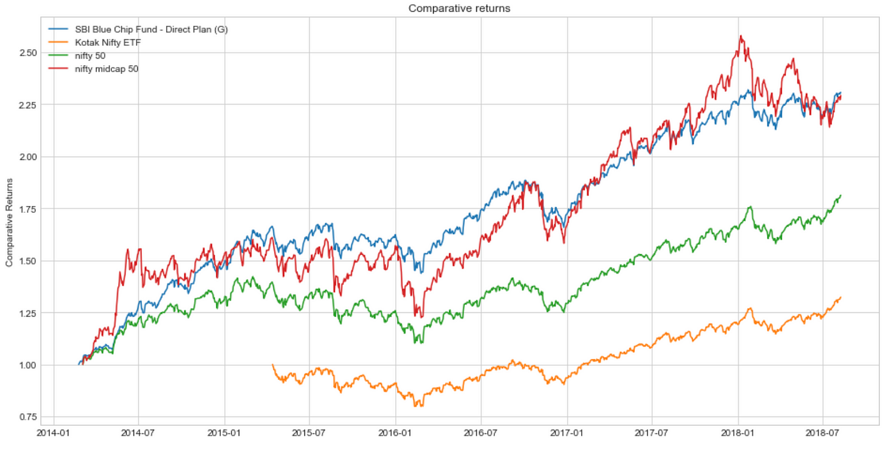

## Table of Contents

## What is stock market data analysis and why is it important?

Stock market data analysis is the process of looking at information about stocks to make smart choices about buying or selling them. This information can include things like the price of a stock, how many people are buying or selling it, and news about the company. By studying this data, people can try to predict what might happen to the stock's price in the future. This helps them decide if it's a good time to buy, sell, or hold onto a stock.

Understanding stock market data analysis is important because it helps people make better decisions with their money. If someone can predict that a stock's price will go up, they might buy it and make a profit later. On the other hand, if they think the price will go down, they might sell it to avoid losing money. This kind of analysis is used by everyone from individual investors to big companies and financial experts. It's a key part of managing investments and trying to grow wealth over time.

## How can Python be used for stock market data analysis?

Python is a popular tool for stock market data analysis because it's easy to use and has many libraries that help with data work. One of the most used libraries is Pandas, which lets you organize and study data in tables. With Pandas, you can get stock data from different places, clean it up, and look at it in many ways. For example, you can see how a stock's price has changed over time or compare it with other stocks. Another useful library is Matplotlib, which helps you make charts and graphs to see patterns in the data more easily. By using these tools, you can make sense of a lot of numbers and find important trends.

Another important part of stock market data analysis with Python is using libraries like NumPy for math work and SciPy for more advanced calculations. These libraries can help you do things like figuring out how risky a stock is or predicting future prices with math models. For getting real-time stock data, you can use libraries like yfinance or Alpha Vantage, which connect to the internet and pull in the latest information. This way, you can keep your analysis up to date and make decisions based on the newest data. Overall, Python makes it easier to handle and understand stock market data, helping people make smarter investment choices.

## What are the essential Python libraries for stock market data analysis?

Pandas is a key library for stock market data analysis. It helps you organize stock data into tables called DataFrames. With Pandas, you can easily get data from different sources, clean it up, and do calculations. You can look at how a stock's price changes over time or compare it with other stocks. This makes it easier to spot patterns and trends in the data.

Matplotlib is another important library that helps you make charts and graphs. Seeing data in pictures can help you understand it better. For example, you can make a line chart to see how a stock's price has moved over time or a scatter plot to see if there's a relationship between two stocks. Matplotlib works well with Pandas, so you can quickly turn your data into useful pictures.

NumPy and SciPy are also useful for stock market analysis. NumPy helps with basic math operations on large sets of data, which is important for things like calculating averages or finding how risky a stock is. SciPy goes further and helps with more complex math models, like predicting future stock prices. Together, these libraries make it easier to do the math needed for smart investment decisions.

## How do you import and clean stock market data using Python?

To import stock market data using Python, you can use libraries like `yfinance` or `pandas-datareader`. For example, if you want to get data for a specific stock like Apple, you can use `yfinance` to download the data directly from Yahoo Finance. You just need to tell the library which stock you want and the time period you're interested in. Once you run the code, you'll get a DataFrame with columns like the stock's opening price, highest price, lowest price, closing price, and how many shares were traded. This DataFrame is easy to work with because it's organized like a spreadsheet.

After you import the data, you might need to clean it up. Cleaning means making sure the data is correct and ready to use. Sometimes, there might be missing values or strange numbers that don't make sense. You can use Pandas to find and fix these problems. For example, you can fill in missing values with the average of the other values or remove rows that have too many missing pieces. You can also change the data types if needed, like making sure dates are in the right format. Once your data is clean, you can start analyzing it to find patterns and make decisions about buying or selling stocks.

## What are some basic statistical measures used in stock market analysis?

In stock market analysis, one of the most common statistical measures is the average, or mean, of a stock's price over a certain time. This helps investors see the typical price of the stock. Another important measure is the standard deviation, which shows how much the stock's price moves up and down. A high standard deviation means the stock's price is very changeable, which can be riskier. On the other hand, a low standard deviation means the stock's price is more stable.

Another useful measure is the correlation between different stocks or between a stock and the overall market. Correlation tells you how closely two things move together. If two stocks have a high positive correlation, they tend to go up and down together. If they have a high negative correlation, one goes up when the other goes down. This can help investors spread out their risk by choosing stocks that don't all move in the same way. Also, the beta of a stock is a measure of its risk compared to the market. A stock with a beta higher than 1 is more volatile than the market, while a beta less than 1 is less volatile.

## How can you visualize stock market data effectively with Python?

To visualize stock market data effectively with Python, you can use the Matplotlib library to create different types of charts and graphs. One common way is to use a line chart to show how a stock's price changes over time. You can plot the closing price of a stock each day and see the ups and downs clearly. This helps you spot trends, like if the stock is going up, down, or staying the same. You can also add other lines to the chart, like moving averages, which smooth out the price changes and make it easier to see the overall direction of the stock.

Another useful way to visualize stock market data is by using a candlestick chart. This type of chart shows more details about the stock's price in a single day, including the opening price, the highest price, the lowest price, and the closing price. Each "candle" on the chart represents one day, and the color of the candle can show whether the stock's price went up or down that day. Candlestick charts are great for seeing short-term patterns and can help you understand the stock's daily movements better. By using these visualization tools, you can make sense of the data and make smarter decisions about buying or selling stocks.

## What are moving averages and how are they calculated in Python?

Moving averages are a way to smooth out the ups and downs of a stock's price over time. They help you see the overall trend of the stock instead of focusing on small daily changes. There are two main types of moving averages: the simple moving average (SMA) and the exponential moving average (EMA). The SMA is just the average price of a stock over a certain number of days. For example, a 10-day SMA is the average of the last 10 days' prices. The EMA is similar, but it gives more weight to recent prices, making it more responsive to new information.

To calculate a simple moving average in Python, you can use the Pandas library. If you have a DataFrame with the stock's daily closing prices, you can use the `rolling` function to get the average over a certain number of days. For example, if your DataFrame is called `df` and the column with the closing prices is called `Close`, you can calculate a 10-day SMA with `df['Close'].rolling(window=10).mean()`. This will give you a new column with the SMA values. For an exponential moving average, you can use the `ewm` function in Pandas. You would write `df['Close'].ewm(span=10, adjust=False).mean()` to get a 10-day EMA. Both of these methods help you see the bigger picture of a stock's price movement.

## How do you implement technical analysis indicators using Python?

To implement technical analysis indicators using Python, you can use libraries like Pandas and TA-Lib. For example, if you want to use the Relative Strength Index (RSI), which helps you see if a stock is overbought or oversold, you can use Pandas to calculate it. First, you get the stock's price data into a DataFrame. Then, you can use a formula to calculate the RSI. The RSI looks at how much the stock's price has gone up or down over a certain number of days, usually 14 days. You can write a function in Python to do this calculation and add the RSI values to your DataFrame. This way, you can see if the RSI is above 70, which might mean the stock is overbought, or below 30, which might mean it's oversold.

Another common indicator is the Moving Average Convergence Divergence (MACD), which helps you see the stock's momentum. To calculate the MACD, you need to find the difference between two exponential moving averages (EMAs) of the stock's price. One EMA is usually for 12 days, and the other is for 26 days. You then calculate a signal line, which is a 9-day EMA of the MACD line. In Python, you can use Pandas to calculate these EMAs and then find the MACD and signal line. By plotting these lines, you can see when they cross each other, which can signal good times to buy or sell the stock. Using these indicators in Python helps you make better decisions about when to trade.

## What is backtesting and how can it be performed using Python?

Backtesting is a way to check if a trading plan would have worked well in the past. It's like pretending to buy and sell stocks using old data to see how much money you would have made or lost. This helps people see if their ideas about when to buy or sell stocks are good ones. By looking at past data, they can make their trading plan better before they use it with real money.

To do backtesting with Python, you can use a library called Backtrader. First, you get the old stock data into a DataFrame using a library like Pandas. Then, you set up your trading rules in Backtrader, like when to buy or sell based on certain signals. After that, you run the backtest, and Backtrader will show you how your trading plan would have done in the past. This way, you can see if your plan needs changes before you start trading for real.

## How can machine learning be applied to predict stock prices in Python?

Machine learning can help predict stock prices by looking at a lot of past data and finding patterns. In Python, you can use libraries like scikit-learn to make models that learn from this data. For example, you can use a model called a "decision tree" to see how different things, like the stock's past prices or news about the company, might affect its future price. Once the model is trained on old data, you can use it to make guesses about what the stock price might do next. This can help you decide if it's a good time to buy or sell the stock.

To start, you gather a lot of data about the stock, like its past prices, trading volume, and maybe even news articles. You clean up this data and turn it into numbers that the machine learning model can understand. Then, you split the data into two parts: one part to train the model and another part to test it. After training the model, you use the test data to see how well it predicts stock prices. If the model does well, you can use it to make predictions on new data. This way, machine learning helps you make smarter choices about trading stocks.

## What are some advanced techniques for risk management in stock market analysis?

One advanced technique for risk management in stock market analysis is using something called "Value at Risk" (VaR). VaR helps you figure out the most money you could lose in a certain time, like a day or a week, with a certain chance. For example, if your VaR is $10,000 at a 95% confidence level, there's a 5% chance you could lose more than $10,000 in that time. To calculate VaR, you can use past data and special math models. This helps you understand how risky your investments are and make better choices about how much risk to take.

Another technique is using "Monte Carlo simulations." This method uses a computer to run many different scenarios of what might happen to stock prices. By looking at all these different possibilities, you can see how likely it is that you'll lose money and how much you might lose. This helps you plan for different situations and make your investment strategy safer. For example, if the simulations show a high chance of big losses, you might decide to spread your money across more stocks or invest in less risky options.

## How can you integrate real-time data feeds into your Python stock market analysis system?

To integrate real-time data feeds into your Python stock market analysis system, you can use libraries like `yfinance` or `Alpha Vantage`. These libraries let you connect to the internet and pull in the latest stock prices and other important information. For example, with `yfinance`, you can write a few lines of code to get the current price of a stock like Apple. This real-time data can be added to your existing data in a DataFrame, so you always have the newest information to work with. This way, you can make decisions based on what's happening right now in the market.

Once you have the real-time data, you can use it to update your charts and graphs in real-time too. Libraries like Matplotlib can help you show the latest stock prices on a chart that keeps updating. This means you can watch the stock's price move up and down as it happens. By keeping your analysis up to date with real-time data, you can spot new trends or changes in the market quickly. This can help you make better choices about buying or selling stocks, because you're always working with the most current information.

## What is Risk Management?

Using historical data in risk assessment is another significant advantage. Historical performance analysis helps measure potential losses and the probability of unfavorable outcomes. Stress testing strategies using historical market shocks such as the 2008 financial crisis can provide a quantitative basis for risk limits and ensure strategies remain viable under stress.

For instance, traders can deploy value-at-risk (VaR) models based on historical data to estimate potential losses in future scenarios:

$$
\text{VaR} = (Z \times \sigma \times \sqrt{t})
$$

where $Z$ is the z-score corresponding to the confidence level, $\sigma$ is the historical volatility, and $t$ is the holding period.

## References & Further Reading

[1]: Bergstra, J., Bardenet, R., Bengio, Y., & Kégl, B. (2011). ["Algorithms for Hyper-Parameter Optimization."](https://papers.nips.cc/paper/4443-algorithms-for-hyper-parameter-optimization) Advances in Neural Information Processing Systems 24.

[2]: ["Advances in Financial Machine Learning"](https://www.amazon.com/Advances-Financial-Machine-Learning-Marcos/dp/1119482089) by Marcos Lopez de Prado

[3]: ["Evidence-Based Technical Analysis: Applying the Scientific Method and Statistical Inference to Trading Signals"](https://www.amazon.com/Evidence-Based-Technical-Analysis-Scientific-Statistical/dp/0470008741) by David Aronson

[4]: ["Machine Learning for Algorithmic Trading"](https://github.com/stefan-jansen/machine-learning-for-trading) by Stefan Jansen

[5]: ["Quantitative Trading: How to Build Your Own Algorithmic Trading Business"](https://books.google.com/books/about/Quantitative_Trading.html?id=j70yEAAAQBAJ) by Ernest P. Chan