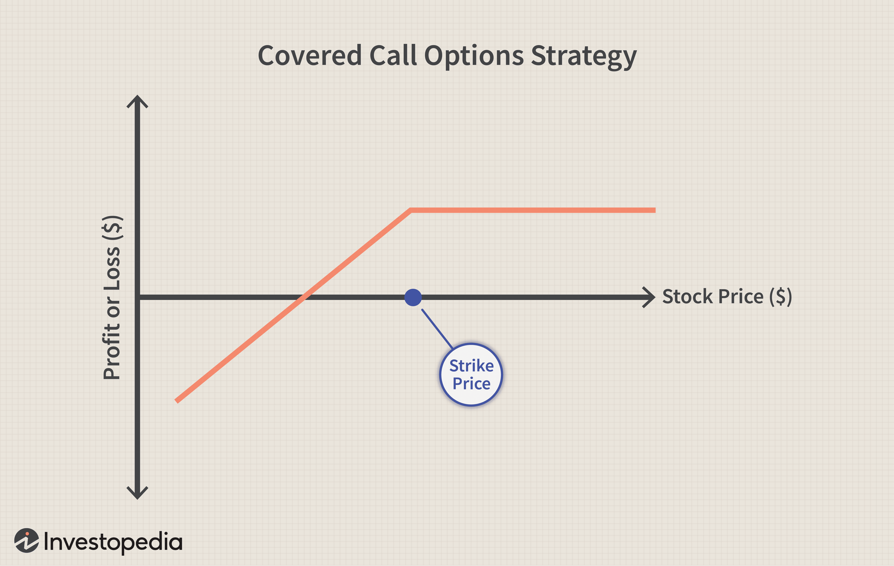

Stock market investing is the process of buying and selling shares of publicly traded companies with the aim of generating returns, either through capital appreciation or dividends. As a vital component of the global financial system, it allows individuals and institutions to allocate capital to businesses in need of funding while offering opportunities for wealth accumulation. Historically, investing in stocks has been synonymous with long-term wealth building, owing to its ability to outperform other asset classes like bonds and real estate over extended periods. This potential for significant returns, however, comes with inherent risks, necessitating informed decision-making by investors.

Earnings in the stock market refer to a company's profits over a specific period, typically expressed in reports released quarterly or annually. These earnings reports are critical because they provide investors with insights into a company’s financial health, operational performance, and future prospects. Key metrics such as Earnings Per Share (EPS) and revenue growth are often derived from these reports, helping investors evaluate the profitability and growth trajectory of a business. Earnings announcements can dramatically influence stock prices and investor sentiment, as better-than-expected results can lead to surging stock prices, whereas disappointing figures may cause declines.



Algorithmic trading, distinct from traditional trading methods, involves using automated systems to execute trades based on pre-defined algorithms. This form of trading leverages technological advancements in data processing and computing power to enhance trade execution speed and precision, minimizing human errors. Algorithms in trading are designed to analyze vast sets of data, including market conditions and financial reports, to identify optimal entry and exit points for trades. Common strategies employed in algorithmic trading include arbitrage, market making, and trend following. Its growing influence in modern investing is attributed to its ability to process information more quickly and efficiently than human traders.

The integration of stock market earnings analysis with algorithmic trading represents a sophisticated approach to trading that combines fundamental analysis with advanced computational techniques. By incorporating earnings data into algorithms, traders aim to enhance decision-making and optimize returns. This article seeks to shed light on how investors can leverage these concepts—stock market earnings and algorithmic trading—to engage in more effective investment strategies, potentially balancing the precision and speed of algorithmic systems with the insights gleaned from earnings reports. As technology continues to evolve, so too do the methods by which investors can harness these tools for more robust portfolio management.

## Table of Contents

## Understanding Stock Market Earnings

Stock market earnings refer to the profits made by publicly traded companies over a specific period, and they hold significant importance for investors seeking to evaluate a company’s financial health and growth prospects. Analyzing earnings provides insights into a company's profitability, efficiency, and performance, which in turn influence investment decisions and portfolio strategies.

Investors primarily focus on two types of earnings reports: quarterly and annual. Quarterly earnings reports, mandated by regulatory authorities like the U.S. Securities and Exchange Commission (SEC), provide interim financial updates four times a year. These frequent reports allow investors to track a company's performance regularly and adjust investment decisions accordingly. Annual earnings reports offer a comprehensive view of a company's financial standing over a fiscal year, often accompanied by broader strategic insights from company management.

Key metrics derived from earnings reports include Earnings Per Share (EPS) and revenue growth. EPS, calculated as:

$$
EPS = \frac{{\text{Net Income} - \text{Dividends on Preferred Stock}}}{\text{Average Outstanding Shares}}
$$

serves as a critical indicator of a company's profitability on a per-share basis. Revenue growth indicates the percentage increase in a company’s sales over a given period, providing insight into the company’s expansion and market share acquisition.

Earnings significantly impact stock prices and investor sentiment. When a company announces earnings that exceed analysts’ expectations, it often leads to a surge in the stock's price as investors adjust their valuations positively. Conversely, earnings that fall short of expectations typically lead to stock price declines as market confidence wanes. For example, when Apple Inc. reported higher-than-expected earnings in the fourth quarter of 2020, its stock price saw immediate gains. Conversely, Facebook (Meta Platforms) experienced a substantial stock price drop in early 2022 following an earnings report that fell short of market expectations.

Major earnings announcements have historically affected markets by setting precedents for the industry, influencing trading volumes, and shifting investor sentiment broadly. For instance, during the dot-com bubble in the late 1990s, earnings announcements from technology companies had large ripple effects on stock market indices due to heightened investor interest in the sector.

Understanding and interpreting these earnings reports allow investors to discern a company’s operational effectiveness, inform investment strategies, and predict market movements, making them a cornerstone of comprehensive financial analysis.

 to Algorithmic Trading

Algorithmic trading, often abbreviated as algo trading, refers to the use of computer programs and algorithms to execute stock market trades. Unlike traditional trading, which is typically manual and relies on human intuition and decision-making, [algorithmic trading](/wiki/algorithmic-trading) automates the trading process using pre-defined rules and complex mathematical models. This automation allows for executing orders at speeds and frequencies that would be impossible for a human trader.

The surge in the popularity of algorithmic trading has been largely driven by technological advancements. The evolution of computer processing power, high-speed internet connectivity, and the availability of large datasets are key enablers. These technologies have enhanced the ability to analyze market conditions in real-time and execute orders with precision.

The basic structure of a trading algorithm includes components such as speed, precision, and data analysis. Speed is crucial in executing trades within milliseconds to capitalize on the smallest price differences. Precision involves ensuring that the trades executed align perfectly with the parameters set by the strategy. Data analysis is integral; algorithms harness large volumes of historical and real-time data to identify trading opportunities based on patterns and statistical relationships.

Several strategies are commonly utilized in algorithmic trading:

1. **Arbitrage**: This strategy exploits price differences of identical or similar financial instruments across different markets or forms. By simultaneously buying and selling these assets, traders can profit from the divergence before prices converge.

2. **Market Making**: This involves placing buy and sell orders to capture the spread between the bid and ask price. Algorithms work to maintain a balance of buying and selling orders, profiting from the spread on each trade.

3. **Trend Following**: This approach is based on the analysis of market data to capture trends. Algorithms are designed to identify and follow upward or downward trends in asset prices, entering trades in the direction of the prevailing market trend.

While algorithmic trading offers significant advantages such as increased efficiency, the ability to process vast amounts of data, and the reduction of human error, it also presents challenges. One major advantage is the elimination of emotional biases, which can influence decision-making adversely in traditional trading. However, challenges include the risk of overfitting algorithms to past data, which can lead to poor performance in changing market conditions, and the complexity involved in developing and maintaining effective trading models. Moreover, reliance on algorithms can lead to vulnerabilities during unforeseen technological failures or market disruptions.

Algorithmic trading has transformed the landscape of financial markets, encouraging continuous innovation and the development of more sophisticated trading strategies. However, it remains crucial for both traders and developers to be aware of its intricacies and limitations.

## Integrating Earnings Analysis into Algo Trading

Earnings data can serve as a critical enhancer of algorithmic trading strategies by providing insights into a company's financial health and potential market movements. The integration of earnings analysis into algorithmic trading involves leveraging earnings reports to refine model parameters, conduct predictive analytics, and optimize trading decisions through real-time data processing.

Machine learning plays a pivotal role in analyzing large datasets of earnings reports. By employing algorithms capable of natural language processing (NLP), traders can evaluate qualitative data from earnings calls and financial statements. Machine learning models such as Random Forests, Support Vector Machines (SVM), and Neural Networks can be trained to identify patterns and correlations in earnings data, thereby facilitating more informed trading decisions. For instance, an SVM can be used to classify market sentiment based on the tone of earnings call transcripts, while a [neural network](/wiki/neural-network) might predict stock price movement based on historical earnings trends.

Algo traders often set parameters based on earnings forecasts and surprise factors—the difference between expected and actual earnings figures. Predictive models can quantify the expected impact of earnings surprises on stock prices, adjusting algorithmic parameters accordingly. This parameter setting can involve defining thresholds for automated buy or sell orders, which activate only when earnings data crosses predetermined surprise levels.

Backtesting is essential for optimizing the use of earnings data within trading algorithms. By simulating trades using historical earnings data, traders can assess the viability and performance of their strategies before live deployment. Strategies like the following can be explored:

```python
import pandas as pd
import numpy as np
from sklearn.model_selection import train_test_split
from sklearn.ensemble import RandomForestClassifier
from sklearn.metrics import accuracy_score

# Example: Backtesting an earnings-based strategy
def backtest_strategy(data):
    # Assuming 'data' has columns ['Earnings_Surprise', 'Price_Move', 'Buy_Signal']

    # Simple feature engineering
    data['Lagged_Surprise'] = data['Earnings_Surprise'].shift(1)

    # Train-test split
    X = data.drop(['Price_Move', 'Buy_Signal'], axis=1().fillna(0)
    y = data['Buy_Signal']
    X_train, X_test, y_train, y_test = train_test_split(X, y, test_size=0.3, random_state=42)

    # Model training
    model = RandomForestClassifier()
    model.fit(X_train, y_train)

    # Validation
    predictions = model.predict(X_test)
    return accuracy_score(y_test, predictions)

# Example usage
# accuracy = backtest_strategy(earnings_data)
# print(f"Backtesting Accuracy: {accuracy*100:.2f}%")
```

Real-time data processing capabilities are crucial for the efficient execution of trades after earnings releases. This requires infrastructures capable of high-frequency data acquisition and processing to react swiftly to market changes. Technologies like Apache Kafka and Redis can be employed to achieve low-latency data streaming, enabling traders to capitalize on post-earnings price movements instantly.

The integration of earnings analysis into algorithmic trading thus merges quantitative and qualitative data analysis with technical efficiency, empowering traders to make data-driven decisions that align with evolving market dynamics.

## Benefits and Risks of Earnings-Incorporated Algo Trading

Combining earnings insights with algorithmic trading can significantly enhance the potential for higher returns. Earnings data provide critical information about a company's financial health and future prospects. By integrating this data into algorithmic models, investors can capitalize on earnings surprises and trends that may signal investment opportunities. Historically, markets exhibit significant [volatility](/wiki/volatility-trading-strategies) around earnings announcements, reflecting revised investor expectations. Algorithms tailored to exploit these periods can yield substantial gains by swiftly adjusting positions based on new information.

Automation in algorithmic trading plays a crucial role in minimizing emotional biases commonly associated with earnings reactions. Human investors might overreact to earnings news, driven by fear or greed, potentially leading to suboptimal investment decisions. Algorithms, on the other hand, operate based on predefined criteria, executing trades objectively. This emotion-free execution ensures that decisions align with strategic goals rather than impulsive reactions, resulting in more consistent outcomes over time.

However, reliance on algorithms comes with risks, such as unforeseen market events that could disrupt model assumptions. Unpredictable occurrences like geopolitical incidents or sudden regulatory changes can render algorithmic predictions inaccurate. This unpredictability highlights the need for robust risk management strategies. Over-reliance on algorithms without human oversight might also result in missed qualitative factors essential for insightful analysis. Therefore, maintaining a balance between algorithmic precision and human intuition is crucial.

Algorithmic trading based on earnings data also presents regulatory and ethical considerations. Regulations around market manipulation and fairness require that trading algorithms adhere to guidelines that ensure transparency and fairness. Ethical concerns include the misuse of non-public earnings information, which could lead to unfair market advantages. Moreover, algorithm designers must be vigilant in preventing their systems from exacerbating market volatility or engaging in manipulative trading practices.

To manage risks in algorithms incorporating earnings analysis effectively, best practices should be followed. First, [backtesting](/wiki/backtesting) algorithms against historical data is vital to validate their robustness and performance in various market conditions. Monitoring algorithms in real-time helps to identify and rectify unexpected behaviors promptly. Diversifying algorithm strategies across different market segments and conditions can also mitigate risks associated with specific events affecting earnings. Lastly, continuous algorithmic refinement to account for regulatory changes, technological advancements, and updated market data ensures sustained performance.

In conclusion, while earnings-incorporated algorithmic trading offers substantial opportunities for higher returns by leveraging timely financial data, it demands careful consideration of accompanying risks. Balancing automation benefits with human oversight and adhering to regulatory frameworks are pivotal in navigating this sophisticated investment landscape successfully.

## Case Studies and Real-World Examples

Case studies illustrating the application of earnings analysis in algorithmic trading provide valuable insights into the potential of such strategies. These examples demonstrate how integrating earnings data can influence trading performance, sometimes offering advantages over traditional methods.

One notable case is the use of earnings-based algorithms in the technology sector, where rapid information dissemination plays a critical role. A [hedge fund](/wiki/hedge-fund-trading-strategies) deployed an algorithm that analyzed earnings reports, particularly surprise earnings, to predict stock price movements shortly after announcements. The algorithm used historical earnings data to fine-tune parameters, focusing on the Earnings Surprise Metric (ESM), calculated as:

$$
\text{ESM} = \frac{\text{Actual Earnings} - \text{Expected Earnings}}{\text{Price of Stock}}
$$

The strategy consistently outperformed traditional buy-and-hold approaches, particularly during periods of high earnings volatility, showcasing the effectiveness of quick data processing and decision-making inherent in algorithmic trading.

However, not all attempts have been successful. A financial firm experienced significant losses when their earnings-based algorithm failed to account for broader market conditions. Their algorithm relied heavily on earnings growth projections but struggled during market downturns when external economic factors outweighed earnings impacts. This highlights the critical lesson that while algorithms can process earnings data swiftly, they must also incorporate macroeconomic variables to avoid over-reliance on a single data source.

Comparisons across industries reveal varying outcomes. For instance, in stable industries like utilities, earnings announcements have less immediate impact on stock volatility compared to sectors such as biotechnology, where unexpected earnings can lead to drastic price changes. This disparity underscores the necessity for industry-specific adjustments in algorithm parameters to optimize performance.

Real-world applications demonstrate significant insights: incorporating diverse data streams, such as sentiment analysis and macroeconomic indicators, can mitigate risks associated with earnings-based algorithmic trading. Moreover, continuous backtesting and parameter adjustments based on historical and real-time data are crucial for maintaining algorithmic effectiveness.

In summary, while earnings analysis can significantly enhance algorithmic trading strategies, it requires a robust framework that adapts to various market conditions and integrates multiple data sources to manage associated risks effectively. These case studies serve as a blueprint for future algorithmic trading endeavors, emphasizing the need for diligent strategy development and risk management.

## Future Trends in Earnings-Based Algo Trading

Future advancements in algorithmic trading, particularly those related to earnings data, are poised to revolutionize investment strategies through the integration of emerging technologies, regulatory changes, and enhanced data processing capabilities.

AI and [machine learning](/wiki/machine-learning) are playing pivotal roles in transforming algorithmic trading. These technologies enable more sophisticated analysis of earnings data, allowing algorithms to recognize patterns and predict market movements with greater accuracy. Machine learning models can be trained on vast historical earnings data to improve predictions about future company performance. For instance, natural language processing (NLP) algorithms can analyze textual data from earnings calls transcripts, identifying sentiment or key trends that may affect investor behavior.

Quantum computing represents another frontier for algorithmic trading. Though still in its nascent stages, quantum computers' ability to process complex calculations at unprecedented speeds could significantly enhance the efficiency of algorithms analyzing earnings data. Quantum algorithms could potentially solve optimization problems much faster than classical computers, leading to more refined trading strategies.

The regulatory landscape surrounding algorithmic trading is increasingly dynamic. As the use of algorithms in trading grows, regulatory bodies are developing frameworks to ensure market stability and fairness. New regulations may focus on transparency, requiring firms to disclose the nature and risks of their trading algorithms. Additionally, there could be stricter compliance requirements regarding data privacy and the ethical use of AI, which would impact how earnings data is utilized.

As data accessibility and processing technologies continue to evolve, investment strategies are likely to become more data-driven. The availability of [alternative data](/wiki/best-alternative-data) sources, such as satellite imagery or social media analytics, will complement traditional earnings reports, providing a more holistic view of market conditions. This abundance of data, combined with faster processing capabilities, will enable more granular and timely trading decisions. Investors will need to adapt to these changes by continually updating their knowledge and skillsets.

For investors looking to leverage these trends, staying informed about both technological advancements and regulatory changes is crucial. Participating in industry conferences, subscribing to financial tech newsletters, and engaging with online investment communities can aid in maintaining an up-to-date understanding of the field. By remaining adaptable and open to new methodologies, investors can capitalize on the potential of earnings-based algorithmic trading to enhance their portfolios.

## Conclusion

In summarizing the integration of stock market earnings and algorithmic trading, this approach offers a nuanced technique for leveraging technology in investment. The melding of earnings analysis with algorithmic processes capitalizes on data-driven insights and enhances the speed and precision of trade executions. Among the key benefits are the potential for higher returns and the reduction of human emotional bias, which can often cloud judgment during volatile earnings periods.

However, this sophisticated strategy is not without its risks. An over-reliance on algorithms may lead to significant challenges, particularly when unanticipated market events occur. Furthermore, the regulatory and ethical landscapes require careful navigation to ensure compliance and fairness.

Investors are encouraged to engage in continuous learning and thoughtful consideration when adopting algorithmic trading strategies. While technologies such as AI and quantum computing present promising advancements, maintaining a balance between automated tools and human intuition remains crucial. The human element in interpreting complex market signals and making informed decisions should not be underestimated.

As a call to action, readers are advised to continuously seek further knowledge and resources. Consulting with financial advisors can provide personalized insights and strategic guidance, helping investors harness the full potential of earnings-based algorithmic trading while effectively managing associated risks.

## References & Further Reading

[1]: Bergstra, J., Bardenet, R., Bengio, Y., & Kégl, B. (2011). ["Algorithms for Hyper-Parameter Optimization."](https://dl.acm.org/doi/10.5555/2986459.2986743) Advances in Neural Information Processing Systems 24.

[2]: ["Advances in Financial Machine Learning"](https://www.amazon.com/Advances-Financial-Machine-Learning-Marcos/dp/1119482089) by Marcos Lopez de Prado

[3]: ["Evidence-Based Technical Analysis: Applying the Scientific Method and Statistical Inference to Trading Signals"](https://www.amazon.com/Evidence-Based-Technical-Analysis-Scientific-Statistical/dp/0470008741) by David Aronson

[4]: ["Machine Learning for Algorithmic Trading"](https://github.com/stefan-jansen/machine-learning-for-trading) by Stefan Jansen

[5]: ["Quantitative Trading: How to Build Your Own Algorithmic Trading Business"](https://www.amazon.com/Quantitative-Trading-Build-Algorithmic-Business/dp/1119800064) by Ernest P. Chan