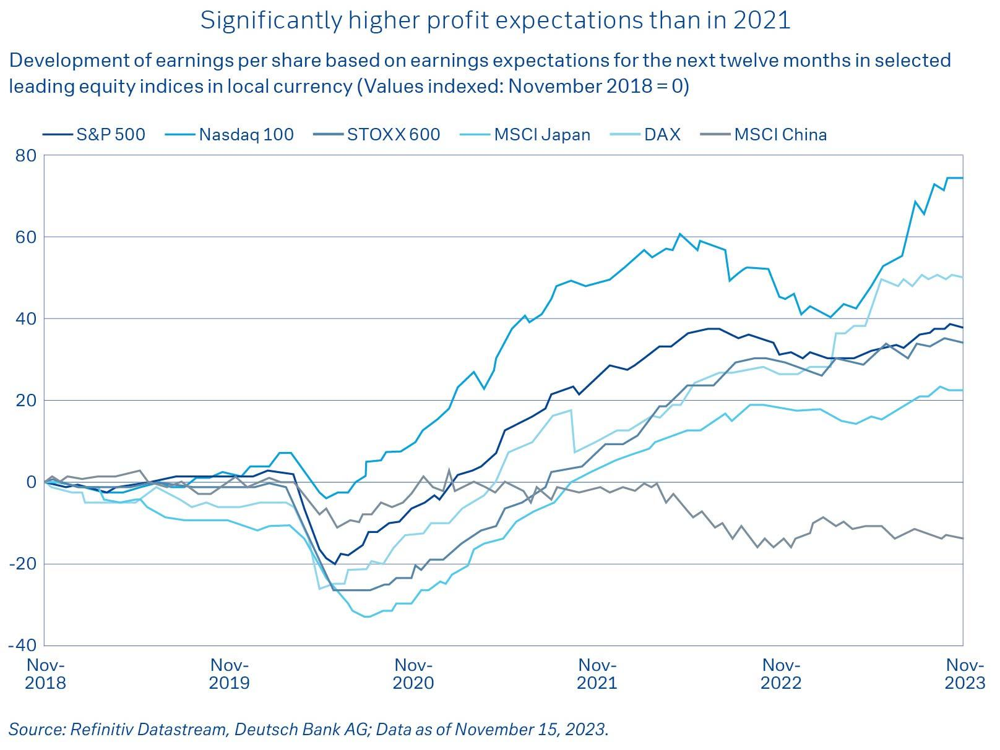

## Table of Contents

## What is the stock market and how does it work?

The stock market is a place where people buy and sell pieces of companies, called stocks or shares. When you buy a stock, you own a small part of that company. The stock market is like a big store where these pieces are traded every day. The price of a stock goes up and down based on how much people want to buy or sell it. If more people want to buy a stock, its price goes up. If more people want to sell, the price goes down.

Companies sell stocks to get money to grow their business. When a company does well, its stock price usually goes up, and people who own the stock can make money. But if the company does poorly, the stock price can go down, and people might lose money. The stock market can be risky, but it can also be a way to make money over time. People often work with a broker, who helps them buy and sell stocks, or they might use an app or website to do it themselves.

## How can beginners start investing in the stock market?

Beginners can start investing in the stock market by first learning about it. They can read books, watch videos, or take online courses to understand how stocks work. It's important to know the basics, like what stocks are, how they are bought and sold, and what makes their prices go up or down. Once they feel ready, they should open a brokerage account. A brokerage account is like a bank account but for buying and selling stocks. Many brokers have apps or websites that make it easy to start investing.

After setting up a brokerage account, beginners should start with a small amount of money they can afford to lose. It's smart to begin with a small investment to learn how the market works without risking too much. They can choose to buy stocks of companies they know and like, or they can invest in funds that hold many different stocks. Funds can be a good way to spread out the risk because they include a variety of companies. As they gain more experience, they can slowly invest more money and try different strategies.

## What are the different types of stocks and their potential earnings?

There are two main types of stocks: common stocks and preferred stocks. Common stocks are what most people think of when they hear the word "stock." When you buy common stocks, you own a piece of the company and can vote on company decisions. The price of common stocks can go up and down a lot, which means they can be riskier but also have the potential to earn more money. If the company does well, the value of your stocks can go up, and you might get dividends, which are like a share of the company's profits. But if the company does poorly, you could lose money.

Preferred stocks are different. They usually don't let you vote on company decisions, but they often give you a fixed dividend. This means you get a regular payment, which can make preferred stocks less risky than common stocks. However, the price of preferred stocks doesn't usually go up as much as common stocks, so they might not have as much potential to earn a lot of money. Preferred stocks are more like a steady income, while common stocks can be more like a roller coaster with bigger ups and downs.

Both types of stocks have their own risks and rewards. Common stocks can offer higher potential earnings but come with more risk, while preferred stocks offer more stability but less chance for big gains. It's important for investors to understand these differences and choose the type of stock that fits their goals and how much risk they are willing to take.

## How do dividends contribute to stock market earnings?

Dividends are payments that companies give to their shareholders, usually from their profits. When you own stocks that pay dividends, you get a little bit of money regularly, kind of like getting a small paycheck. This can add up over time and help you earn money from the stock market, even if the price of the stock doesn't go up. Dividends can be especially good for people who want a steady income from their investments, like retirees.

Not all stocks pay dividends, though. Some companies, especially new or fast-growing ones, might use their profits to grow the business instead of paying dividends. But for companies that do pay dividends, they can make your investment more valuable. If you keep the dividends and reinvest them by buying more stocks, your earnings can grow even more over time. This is called compounding, and it's a powerful way to increase your wealth in the stock market.

## What role do stock market indices play in understanding earnings potential?

Stock market indices, like the S&P 500 or the Dow Jones, are like big lists of stocks that show how the market is doing overall. They help investors see if the market is going up or down. If an index goes up, it means that the stocks in that index are generally doing well, which can make people feel good about investing. If an index goes down, it might mean that the market is having a tough time, and people might be more careful about buying stocks.

These indices can also give investors an idea about the earnings potential of the market. For example, if the S&P 500 is going up a lot, it might mean that many companies are making more money and could be good investments. But if an index is going down, it might mean that companies are not doing as well, and the potential to earn money from stocks could be lower. By watching these indices, investors can get a sense of when might be a good time to buy or sell stocks and understand the overall health of the market.

## How can one analyze a company's financial health to predict stock earnings?

To analyze a company's financial health and predict its stock earnings, you can start by looking at its financial statements. These are reports that show how much money the company is making and spending. One important report is the income statement, which tells you if the company is making a profit or a loss. Another key report is the balance sheet, which shows what the company owns and owes. If a company has more money coming in than going out and has a strong balance sheet, it's usually a good sign that the stock could do well in the future.

Another way to predict stock earnings is by looking at financial ratios. These are numbers that help you understand how well a company is doing compared to others. For example, the price-to-earnings (P/E) ratio tells you how much you're paying for the company's earnings. A lower P/E ratio might mean the stock is a good deal, while a higher one might mean it's expensive. The debt-to-equity ratio shows how much the company relies on borrowed money. A lower ratio usually means the company is financially healthy and might be a safer bet for [earning](/wiki/earning-announcement) money from its stock.

It's also helpful to keep an eye on the company's growth and future plans. If a company is growing its sales and profits, and has good plans for the future, its stock might go up. You can find this information in the company's annual reports or in news articles. By putting all this information together, you can get a better idea of whether a company's stock might earn you money in the future.

## What are the risks associated with stock market investments and how can they impact earnings?

Investing in the stock market can be risky because the value of stocks can go up and down a lot. If the price of a stock goes down after you buy it, you could lose money. This can happen for many reasons, like if the company isn't doing well, or if something big happens in the world that makes people worried about the economy. Another risk is that the stock market can be unpredictable. Even if you do a lot of research, it's hard to know for sure what will happen next. This means you could make less money than you hoped, or even lose some of your investment.

These risks can impact your earnings in different ways. If the stock market goes down a lot, like during a big crash, you might see the value of your investments drop quickly. This could mean you earn less money or even lose money if you need to sell your stocks at a low price. On the other hand, if you keep your stocks and wait for the market to recover, you might be able to earn money again. But it's important to remember that the stock market can be a roller coaster, and it takes patience and a willingness to take risks to earn money over time.

## How do economic indicators affect stock market performance and earnings potential?

Economic indicators are like signs that tell us how the economy is doing. Things like unemployment rates, inflation, and how much people are spending can all affect the stock market. When these indicators show that the economy is doing well, people feel more confident and might buy more stocks. This can make stock prices go up and increase the potential for earnings. For example, if unemployment is low, it means more people have jobs and money to spend, which can help companies make more profits and make their stocks more valuable.

On the other hand, if economic indicators show that the economy is struggling, it can make people worried about the future. When people are worried, they might sell their stocks, which can make stock prices go down. This can lower the potential for earnings because the value of your investments goes down. For instance, if inflation is high, it means things cost more, and people might not spend as much money. This can hurt company profits and make their stocks less valuable. So, keeping an eye on these economic indicators can help you understand what might happen to the stock market and your potential earnings.

## What advanced strategies can be used to maximize stock market earnings?

One advanced strategy to maximize stock market earnings is called diversification. This means spreading your money across different types of investments, like stocks from different industries, bonds, and even other things like real estate. By doing this, you can lower your risk because if one investment does poorly, others might do well and balance it out. Another part of diversification is investing in different countries. This way, if the economy in one country is struggling, your investments in other countries might still do well. Diversification can help you earn more money over time because it protects you from big losses.

Another strategy is to use dollar-cost averaging. This means you invest a fixed amount of money at regular times, like every month, no matter what the market is doing. By doing this, you buy more stocks when prices are low and fewer when prices are high, which can help you get a better average price over time. This can lead to higher earnings because you're not trying to guess when the market will go up or down. You're just steadily putting money in and letting it grow. Together, diversification and dollar-cost averaging can help you maximize your earnings in the stock market by managing risk and taking advantage of long-term growth.

## How does global market interaction influence stock earnings?

Global market interaction means that what happens in one part of the world can affect stock earnings in another part. For example, if a big company in the United States does a lot of business in China, and something happens in China that makes it hard for the company to sell its products, the stock price of that company might go down. This is because investors might worry that the company will make less money. Also, when countries trade a lot with each other, problems like trade wars or tariffs can make stocks go up and down. If countries start putting taxes on goods from other countries, it can hurt companies that rely on those goods, which can lower their stock prices.

Another way global markets influence stock earnings is through currency changes. If the money in one country gets stronger compared to another country's money, it can affect how much money companies make when they sell things in different countries. For example, if the U.S. dollar gets stronger, it might be harder for U.S. companies to sell their products in Europe because their products become more expensive for Europeans. This can hurt the company's profits and make its stock price go down. So, keeping an eye on what's happening in other parts of the world can help investors understand how their stocks might do and plan their investments better.

## What are the tax implications of stock market earnings?

When you earn money from the stock market, you have to pay taxes on it. There are two main types of taxes you might have to pay: capital gains tax and dividend tax. Capital gains tax is what you pay when you sell a stock for more money than you bought it for. If you hold the stock for less than a year before selling it, you pay a short-term capital gains tax, which is usually the same as your regular income tax rate. But if you hold it for more than a year, you pay a long-term capital gains tax, which is often lower. This means it can be a good idea to hold onto your stocks for at least a year if you want to pay less in taxes.

Dividend tax is what you pay on the money you get from dividends, which are payments some companies give to their shareholders. The tax rate on dividends can also depend on how long you've held the stock. If you've held the stock for more than 60 days during the 121-day period that begins 60 days before the ex-dividend date, you might pay a lower tax rate on the dividends. It's important to keep track of your dividends and how long you've held your stocks because it can affect how much tax you owe. Talking to a tax advisor can help you understand all the rules and make sure you're paying the right amount of taxes on your stock market earnings.

## How can one use algorithmic trading to enhance stock market earnings potential?

Algorithmic trading uses computer programs to buy and sell stocks based on certain rules. These rules can be things like buying a stock when its price goes up by a certain amount, or selling it when it goes down. By using these programs, you can make trades faster and more accurately than if you were doing it by hand. This can help you make more money because you can take advantage of small changes in the market that happen quickly. Also, algorithmic trading can help you follow a plan without letting your feelings get in the way, which can lead to better decisions and more earnings.

Another way algorithmic trading can help is by letting you trade in many different stocks at the same time. Instead of watching and trading just a few stocks, the computer can keep an eye on lots of stocks and make trades based on the rules you set. This can help you spread out your investments and lower your risk. By using algorithmic trading, you can also test different strategies to see which ones work best for making money. This can help you find the best ways to invest and increase your chances of earning more from the stock market.

## What is the understanding of stock market earnings?

Stock market earnings refer to the profits made by publicly traded companies over a specific period, and they hold significant importance for investors seeking to evaluate a company’s financial health and growth prospects. Analyzing earnings provides insights into a company's profitability, efficiency, and performance, which in turn influence investment decisions and portfolio strategies.

Investors primarily focus on two types of earnings reports: quarterly and annual. Quarterly earnings reports, mandated by regulatory authorities like the U.S. Securities and Exchange Commission (SEC), provide interim financial updates four times a year. These frequent reports allow investors to track a company's performance regularly and adjust investment decisions accordingly. Annual earnings reports offer a comprehensive view of a company's financial standing over a fiscal year, often accompanied by broader strategic insights from company management.

Key metrics derived from earnings reports include Earnings Per Share (EPS) and revenue growth. EPS, calculated as:

$$
EPS = \frac{{\text{Net Income} - \text{Dividends on Preferred Stock}}}{\text{Average Outstanding Shares}}
$$

serves as a critical indicator of a company's profitability on a per-share basis. Revenue growth indicates the percentage increase in a company’s sales over a given period, providing insight into the company’s expansion and market share acquisition.

Earnings significantly impact stock prices and investor sentiment. When a company announces earnings that exceed analysts’ expectations, it often leads to a surge in the stock's price as investors adjust their valuations positively. Conversely, earnings that fall short of expectations typically lead to stock price declines as market confidence wanes. For example, when Apple Inc. reported higher-than-expected earnings in the fourth quarter of 2020, its stock price saw immediate gains. Conversely, Facebook (Meta Platforms) experienced a substantial stock price drop in early 2022 following an earnings report that fell short of market expectations.

Major earnings announcements have historically affected markets by setting precedents for the industry, influencing trading volumes, and shifting investor sentiment broadly. For instance, during the dot-com bubble in the late 1990s, earnings announcements from technology companies had large ripple effects on stock market indices due to heightened investor interest in the sector.

Understanding and interpreting these earnings reports allow investors to discern a company’s operational effectiveness, inform investment strategies, and predict market movements, making them a cornerstone of comprehensive financial analysis.

 to Algorithmic Trading

Algorithmic trading, often abbreviated as algo trading, refers to the use of computer programs and algorithms to execute stock market trades. Unlike traditional trading, which is typically manual and relies on human intuition and decision-making, [algorithmic trading](/wiki/algorithmic-trading) automates the trading process using pre-defined rules and complex mathematical models. This automation allows for executing orders at speeds and frequencies that would be impossible for a human trader.

The surge in the popularity of algorithmic trading has been largely driven by technological advancements. The evolution of computer processing power, high-speed internet connectivity, and the availability of large datasets are key enablers. These technologies have enhanced the ability to analyze market conditions in real-time and execute orders with precision.

The basic structure of a trading algorithm includes components such as speed, precision, and data analysis. Speed is crucial in executing trades within milliseconds to capitalize on the smallest price differences. Precision involves ensuring that the trades executed align perfectly with the parameters set by the strategy. Data analysis is integral; algorithms harness large volumes of historical and real-time data to identify trading opportunities based on patterns and statistical relationships.

Several strategies are commonly utilized in algorithmic trading:

1. **Arbitrage**: This strategy exploits price differences of identical or similar financial instruments across different markets or forms. By simultaneously buying and selling these assets, traders can profit from the divergence before prices converge.

2. **Market Making**: This involves placing buy and sell orders to capture the spread between the bid and ask price. Algorithms work to maintain a balance of buying and selling orders, profiting from the spread on each trade.

3. **Trend Following**: This approach is based on the analysis of market data to capture trends. Algorithms are designed to identify and follow upward or downward trends in asset prices, entering trades in the direction of the prevailing market trend.

While algorithmic trading offers significant advantages such as increased efficiency, the ability to process vast amounts of data, and the reduction of human error, it also presents challenges. One major advantage is the elimination of emotional biases, which can influence decision-making adversely in traditional trading. However, challenges include the risk of overfitting algorithms to past data, which can lead to poor performance in changing market conditions, and the complexity involved in developing and maintaining effective trading models. Moreover, reliance on algorithms can lead to vulnerabilities during unforeseen technological failures or market disruptions.

Algorithmic trading has transformed the landscape of financial markets, encouraging continuous innovation and the development of more sophisticated trading strategies. However, it remains crucial for both traders and developers to be aware of its intricacies and limitations.

## What are some case studies and real-world examples?

Case studies illustrating the application of earnings analysis in algorithmic trading provide valuable insights into the potential of such strategies. These examples demonstrate how integrating earnings data can influence trading performance, sometimes offering advantages over traditional methods.

One notable case is the use of earnings-based algorithms in the technology sector, where rapid information dissemination plays a critical role. A [hedge fund](/wiki/hedge-fund-trading-strategies) deployed an algorithm that analyzed earnings reports, particularly surprise earnings, to predict stock price movements shortly after announcements. The algorithm used historical earnings data to fine-tune parameters, focusing on the Earnings Surprise Metric (ESM), calculated as:

$$
\text{ESM} = \frac{\text{Actual Earnings} - \text{Expected Earnings}}{\text{Price of Stock}}
$$

The strategy consistently outperformed traditional buy-and-hold approaches, particularly during periods of high earnings [volatility](/wiki/volatility-trading-strategies), showcasing the effectiveness of quick data processing and decision-making inherent in algorithmic trading.

However, not all attempts have been successful. A financial firm experienced significant losses when their earnings-based algorithm failed to account for broader market conditions. Their algorithm relied heavily on earnings growth projections but struggled during market downturns when external economic factors outweighed earnings impacts. This highlights the critical lesson that while algorithms can process earnings data swiftly, they must also incorporate macroeconomic variables to avoid over-reliance on a single data source.

Comparisons across industries reveal varying outcomes. For instance, in stable industries like utilities, earnings announcements have less immediate impact on stock volatility compared to sectors such as biotechnology, where unexpected earnings can lead to drastic price changes. This disparity underscores the necessity for industry-specific adjustments in algorithm parameters to optimize performance.

Real-world applications demonstrate significant insights: incorporating diverse data streams, such as sentiment analysis and macroeconomic indicators, can mitigate risks associated with earnings-based algorithmic trading. Moreover, continuous [backtesting](/wiki/backtesting) and parameter adjustments based on historical and real-time data are crucial for maintaining algorithmic effectiveness.

In summary, while earnings analysis can significantly enhance algorithmic trading strategies, it requires a robust framework that adapts to various market conditions and integrates multiple data sources to manage associated risks effectively. These case studies serve as a blueprint for future algorithmic trading endeavors, emphasizing the need for diligent strategy development and risk management.

## References & Further Reading

[1]: Bergstra, J., Bardenet, R., Bengio, Y., & Kégl, B. (2011). ["Algorithms for Hyper-Parameter Optimization."](https://dl.acm.org/doi/10.5555/2986459.2986743) Advances in Neural Information Processing Systems 24.

[2]: ["Advances in Financial Machine Learning"](https://www.amazon.com/Advances-Financial-Machine-Learning-Marcos/dp/1119482089) by Marcos Lopez de Prado

[3]: ["Evidence-Based Technical Analysis: Applying the Scientific Method and Statistical Inference to Trading Signals"](https://www.amazon.com/Evidence-Based-Technical-Analysis-Scientific-Statistical/dp/0470008741) by David Aronson

[4]: ["Machine Learning for Algorithmic Trading"](https://github.com/stefan-jansen/machine-learning-for-trading) by Stefan Jansen

[5]: ["Quantitative Trading: How to Build Your Own Algorithmic Trading Business"](https://www.amazon.com/Quantitative-Trading-Build-Algorithmic-Business/dp/1119800064) by Ernest P. Chan