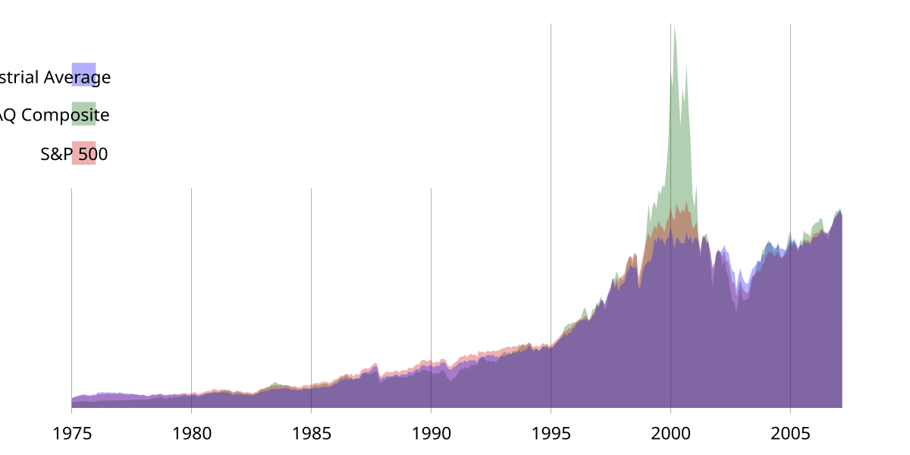

As financial markets evolve, the fusion of stock indices, financial indicators, and algorithmic trading is fundamentally transforming global investment strategies. Stock indices serve as essential financial indicators, representing the collective performance of selected stocks within a market or sector. These indices provide snapshots of market trends and the economic environment, allowing investors to make informed decisions swiftly and efficiently.

Stock indices are invaluable for understanding the broader financial landscape. They range from broad market indices, which capture overall market performance, to sector-specific indices, which focus on particular industries or economic sectors. For instance, indices like the S&P 500, Dow Jones Industrial Average, and Nasdaq Composite in the United States, and international indices such as the FTSE 100 and Nikkei 225, offer insights into economic health and investor sentiment across different regions and sectors.



The expanding role of algorithmic trading underscores the importance of stock indices. Algorithmic trading systems use automated processes to execute trades based on predefined criteria, such as price movements, timing, and volume, often using stock indices as primary data sources. This approach allows for a systematic execution that enhances trading efficiency, reduces human error, and increases the potential to capitalize on market opportunities.

Incorporating technical indicators within these algorithms can further enhance decision-making processes. By integrating data-driven insights such as moving averages or volatility measures, traders and investors can develop strategies tailored to prevailing market dynamics. This synergy of technology and market data is becoming crucial for optimizing investment portfolios and adapting to the ever-changing financial environment.

In summary, the synthesis of stock indices and algorithmic trading, aided by sophisticated financial indicators, empowers traders and investors to navigate markets with greater precision and agility. Embracing this integrated approach provides a robust framework for optimizing investment strategies, offering significant competitive advantages in the global financial markets.

## Table of Contents

## Understanding Stock Indices

Stock indices serve an instrumental role in financial markets by representing a group of stocks intended to reflect the performance of a specific sector or the market as a whole. These financial tools provide an aggregate measure of the market's movement, thus simplifying the task of tracking overall market performance for investors. By analyzing stock indices, investors can bypass the complexity of monitoring individual stocks, thereby gaining a cohesive view of the market's health.

Prominent stock indices serve as benchmarks for investors globally. In the United States, the S&P 500, Dow Jones Industrial Average, and Nasdaq Composite are widely tracked indices. The S&P 500 comprises 500 of the largest U.S. companies and is weighted by market capitalization, offering insight into the performance of major U.S. industries. The Dow Jones Industrial Average includes 30 significant publicly traded companies and uses price-weighting, making it one of the oldest and most recognized indices. Meanwhile, the Nasdaq Composite includes over 3,000 stocks, heavily skewed towards technology companies, thus providing a detailed view of this sector.

Internationally, indices such as the FTSE 100 and Nikkei 225 also provide valuable benchmarks. The FTSE 100 represents the top 100 companies on the London Stock Exchange, while the Nikkei 225 indices rank Japan's top companies by market capitalization. These indices illustrate market conditions and economic strength in their respective regions.

Stock indices are categorized based on market capitalization, region, or sector. They offer a benchmark for evaluating the performance of investment portfolios. For instance, market capitalization-based indices segment stocks into large-cap, mid-cap, or small-cap indices, offering insights into different segments of the market.

Investors often track stock indices via financial products such as Exchange-Traded Funds (ETFs) and futures. ETFs, which are marketable securities, replicate the performance of a specific index and are available for trading on stock exchanges. They offer flexible and cost-effective ways to invest in broad market segments. Additionally, futures contracts allow investors to speculate on or hedge against index movements, thereby playing a central role in financial risk management.

In summary, stock indices provide a streamlined approach to understanding market movements and optimizing portfolio strategies. They encapsulate the performance of large swathes of the market, offering vital insights for both individual and institutional investors.

## Financial Indicators in Market Indices

Indices notably rely on financial indicators to provide a comprehensive reflection of market dynamics. Key indicators include price, [volume](/wiki/volume-trading-strategy), and [volatility](/wiki/volatility-trading-strategies), each playing a crucial role in interpreting market behavior and trends. Price serves as a fundamental indicator, offering insights into the directional movement of an index by reflecting the weighted average price of constituent stocks. Volume indicates the quantity of shares traded, serving as a metric for market activity and [liquidity](/wiki/liquidity-risk-premium). Volatility measures the frequency and intensity of price movements, providing an understanding of risk associated with consensus trends in an index.

Technical indicators are instrumental in analyzing index movements. Moving averages, for instance, are utilized to smooth price data over a specific period, filtering out short-term fluctuations and highlighting the underlying trend. A Simple Moving Average (SMA) can be defined mathematically as:

$$
\text{SMA}_n = \frac{\sum_{i=1}^{n} P_i}{n}
$$

where $P_i$ is the price of the stock at period $i$, and $n$ is the number of periods.

Other measures, such as the Exponential Moving Average (EMA), assign more weight to recent prices, providing a more responsive indicator to changing trends. Volatility measures such as the standard deviation of returns over a specific period further aid in defining market stability or instability, allowing traders to assess potential risk verses reward scenarios.

Trend indicators are equally vital, offering signals regarding the [momentum](/wiki/momentum) of an index, which can be strategically harnessed to formulate investment strategies. For instance, the Moving Average Convergence Divergence (MACD) indicator, which measures the difference between two EMAs, aids in identifying potential buy or sell signals based on momentum changes.

Indices also employ various weighting techniques, such as price-weighted or market capitalization-weighted methods, to represent sector performance. A price-weighted index, such as the Dow Jones Industrial Average (DJIA), calculates the index level based on the price of constituent stocks. In contrast, a market-cap-weighted index, like the S&P 500, uses each stock's market capitalization to determine its impact on the index level. The formula for a market-cap-weighted index is:

$$
\text{Index Level} = \frac{\sum(MC_i)}{D}
$$

where $MC_i$ is the market capitalization of stock $i$, and $D$ is the index divisor.

Understanding and analyzing these indicators is crucial for interpretation and accurate investment forecasting. Investors and traders rely on these parameters to make informed decisions, predict market outcomes, and devise strategies to optimize their portfolios. These calculated approaches build a foundation for navigating complex market environments, ensuring investors possess a dynamic and responsive understanding of market indices.

## Algorithmic Trading: Leveraging Indices

Algorithmic trading employs predefined rules and models to execute trades under optimized conditions. This approach leverages the systematic analysis of stock index movements, facilitating efficient trade execution. By incorporating index fluctuations into trading algorithms, traders can systematically capitalize on market trends, enhancing their operational strategy.

Algo-traders utilize technical indicators such as moving averages, exponential averages, and relative strength indexes to refine the precision of their algorithms. This allows for the timing of trades to align closely with index trends, maximizing profit potential. For instance, a simple moving average (SMA) or an exponential moving average (EMA) can be used to determine entry or [exit](/wiki/exit-strategy) points by smoothing out short-term fluctuations in stock prices, thereby highlighting primary trends.

The implementation of [algorithmic trading](/wiki/algorithmic-trading) strategies significantly boosts trading efficiency by minimizing human error and optimizing decision-making processes. Algorithms can process vast amounts of data rapidly, offering traders the potential to seize market opportunities that may not be perceptible through manual analysis. This can be further enhanced by employing [machine learning](/wiki/machine-learning) models that adjust trading strategies based on real-time data analytics.

Moreover, algorithmic trading systems are designed to adapt strategies in real time, responding to index movements and broader market conditions. This real-time capability ensures that trading models can be recalibrated quickly to accommodate sudden market changes, thus preserving or even improving the performance of the trading strategy. This adaptability is critical in a volatile market environment, where conditions can shift rapidly and unpredictably.

For instance, consider a Python implementation using the `pandas` library to calculate a moving average crossover strategy:

```python
import pandas as pd

# Sample data: 'data' is a DataFrame with 'Date' and 'Close' columns
data['SMA_10'] = data['Close'].rolling(window=10).mean()
data['SMA_50'] = data['Close'].rolling(window=50).mean()

# Trading signals
data['Signal'] = 0
data['Signal'][10:] = np.where(data['SMA_10'][10:] > data['SMA_50'][10:], 1, 0)
data['Position'] = data['Signal'].diff()

# Positions: 1 for buy and -1 for sell
buy_signals = data[data['Position'] == 1]
sell_signals = data[data['Position'] == -1]
```

This script creates a simple moving average crossover strategy, generating buy and sell signals when the short-term moving average crosses above or below the long-term moving average. This is a straightforward demonstration of how algorithmic trading can automate complex decision rules to enhance trading precision and responsiveness to market dynamics.

## Popular Technical Indicators for Algo Trading

Technical indicators play a pivotal role in algorithmic trading by providing tools to analyze market trends and execute trades with precision. Among these, moving averages, the Relative Strength Index (RSI), and Bollinger Bands are particularly notable due to their effectiveness and widespread use. 

### Moving Averages

Moving Averages (MAs) are employed to smooth out price data and highlight the direction of a trend over a specified period. The two most common types are the Simple Moving Average (SMA) and the Exponential Moving Average (EMA). The SMA is calculated by taking the arithmetic mean of prices over a predetermined number of periods. Conversely, the EMA gives more weight to recent prices, making it more responsive to new information.

**Formula for Simple Moving Average (SMA):**  
$$
\text{SMA}_n = \frac{P_1 + P_2 + \cdots + P_n}{n} \]  
where $P_1, P_2, \ldots, P_n$ are the stock prices over $n$ periods.

**Python Example for Calculating SMA:**

```python
import pandas as pd

def calculate_sma(prices, window):
    return prices.rolling(window=window).mean()

# Example usage:
prices = pd.Series([1, 2, 3, 4, 5, 6, 7, 8, 9, 10])
sma = calculate_sma(prices, 3)
```

### Relative Strength Index (RSI)

The RSI is a momentum oscillator that measures the speed and change of price movements. It is used to identify overbought or oversold conditions in the trading of assets. RSI values range from 0 to 100, with levels above 70 indicating that the asset may be overbought, and levels below 30 suggesting it might be oversold.

**Formula for RSI:**

$$
\text{RSI} = 100 - \left(\frac{100}{1 + \frac{\text{Average Gain}}{\text{Average Loss}}}\right)
$$

**Python Example for Calculating RSI:**

```python
def calculate_rsi(prices, window=14):
    delta = prices.diff()
    gain = (delta.where(delta > 0, 0)).rolling(window=window).mean()
    loss = (-delta.where(delta < 0, 0)).rolling(window=window).mean()
    rs = gain / loss
    return 100 - (100 / (1 + rs))

# Usage:
prices = pd.Series([1, 2, 3, 3, 2, 1, 1, 2, 3, 4])
rsi = calculate_rsi(prices)
```

### Bollinger Bands

Bollinger Bands consist of a middle band (a simple moving average) and two outer bands (standard deviations away from the middle band). These bands expand and contract based on market volatility, providing visual cues for potential entry and exit points.

**Formula for Bollinger Bands:**

- Middle Band: $\text{SMA}_n$
- Upper Band: $\text{SMA}_n + k \times \sigma$
- Lower Band: $\text{SMA}_n - k \times \sigma$

where $\sigma$ is the standard deviation of the price, and $k$ is a constant, typically set to 2.

**Python Example for Calculating Bollinger Bands:**

```python
def calculate_bollinger_bands(prices, window=20, num_std_dev=2):
    sma = calculate_sma(prices, window)
    rolling_std = prices.rolling(window=window).std()
    upper_band = sma + (rolling_std * num_std_dev)
    lower_band = sma - (rolling_std * num_std_dev)
    return sma, upper_band, lower_band

# Usage:
prices = pd.Series([1, 2, 3, 4, 5, 6, 7, 8, 9, 10])
sma, upper_band, lower_band = calculate_bollinger_bands(prices)
```

### Integration in Algorithmic Trading

Integrating these technical indicators into trading algorithms can substantially enhance decision-making processes. By incorporating MAs, RSI, and Bollinger Bands, traders can automate their strategies, identifying optimal entry and exit points based on statistical analysis rather than emotion. This data-driven approach supports consistent execution aligned with the underlying trends and potential reversals of financial instruments.

## Challenges and Considerations

While technical indicators offer substantial insights, they are not foolproof and must be used with caution. Algorithmic trading relies heavily on such indicators, but their effectiveness can be compromised by several factors. 

Market anomalies and unexpected macroeconomic shifts can significantly impact the reliability of algorithmic predictions. Events such as financial crises, unexpected regulatory changes, or significant geopolitical tensions can lead to abrupt market movements that algorithms, based on historical data, may not anticipate. Such anomalies highlight the inherently unpredictable nature of markets, emphasizing the need for algorithms to be adaptable and flexible.

Continuously updating algorithms to reflect changing market conditions is crucial. Real-time data integration, machine learning algorithms, and adaptive systems are essential tools for ensuring algorithms remain relevant and effective. The iterative nature of machine learning, for example, allows for the adjustment of models as more data becomes available, improving prediction accuracy and trading outcomes over time.

Diversifying strategies to include various indicators can mitigate the risks posed by market volatility. Relying solely on one type of indicator or a single asset class may limit the effectiveness of an algorithm, particularly during periods of volatility. By employing a combination of technical indicators—such as moving averages, Bollinger Bands, and the Relative Strength Index (RSI)—algorithms can make more informed decisions, balancing the strengths and weaknesses of different measures.

An awareness of these challenges will enhance the robustness of algorithmic trading approaches. Traders and developers must ensure algorithms are tested against multiple market scenarios and that there are mechanisms in place to monitor performance and identify potential issues in real-time. This vigilance can prevent significant losses and capitalize on emerging opportunities, safeguarding the integrity and performance of trading strategies in dynamic markets.

## Conclusion

Stock indices, when combined with technical indicators, serve as powerful tools in both manual and algorithmic trading, providing crucial insights and benchmarks for evaluating market performance. As financial technology continues to advance, the role of algorithmic trading has become integral in exploiting stock indices efficiently. This approach allows traders to capitalize on data-driven insights to inform their trading decisions, making algorithmic strategies an indispensable component of modern investment portfolios.

Understanding and implementing a strategic combination of indices and indicators can significantly enhance trading performance. Indices offer a broad overview of market trends, while technical indicators, such as moving averages or Bollinger Bands, provide granular insights into market dynamics. This synthesis of data enables the development of algorithms that can make precise and timely trades, potentially maximizing returns while minimizing risks.

Proper risk management strategies are essential in safeguarding against unforeseen market fluctuations. Effective risk management involves the systematic evaluation of trading strategies, diversification of investment portfolios, and the implementation of safeguards to cushion against market volatility. Strategies that integrate stop-loss orders or diversification can help mitigate potential losses, ensuring that technical analysis is employed prudently.

Continuous learning and adaptation remain vital for success in the rapidly evolving financial markets. The dynamic nature of these markets necessitates a commitment to ongoing education and strategy refinement, ensuring that traders remain responsive to new developments. This adaptability facilitates the effective use of stock indices and technical indicators, fostering resilience and long-term growth in investment strategies.

Overall, the synergistic use of stock indices with technical indicators can optimize trading outcomes, provided these tools are used in tandem with sound risk management and a commitment to continuous improvement.

## References & Further Reading

[1]: ["Advances in Financial Machine Learning"](https://www.amazon.com/Advances-Financial-Machine-Learning-Marcos/dp/1119482089) by Marcos Lopez de Prado

[2]: ["Evidence-Based Technical Analysis: Applying the Scientific Method and Statistical Inference to Trading Signals"](https://www.amazon.com/Evidence-Based-Technical-Analysis-Scientific-Statistical/dp/0470008741) by David Aronson

[3]: ["Machine Learning for Algorithmic Trading"](https://github.com/stefan-jansen/machine-learning-for-trading) by Stefan Jansen

[4]: ["Quantitative Trading: How to Build Your Own Algorithmic Trading Business"](https://www.amazon.com/Quantitative-Trading-Build-Algorithmic-Business/dp/1119800064) by Ernest P. Chan

[5]: Bergstra, J., Bardenet, R., Bengio, Y., & Kégl, B. (2011). ["Algorithms for Hyper-Parameter Optimization."](https://dl.acm.org/doi/10.5555/2986459.2986743) Advances in Neural Information Processing Systems 24.