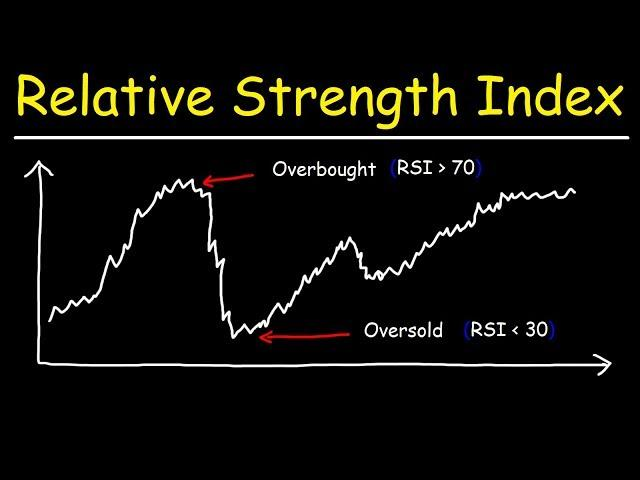

## Table of Contents

## What are stock market indicators?

Stock market indicators are tools that help investors understand how the stock market is doing. They give information about trends, patterns, and the overall health of the market. Some common indicators include stock prices, trading volume, and various indexes like the Dow Jones Industrial Average or the S&P 500. By looking at these indicators, investors can make better decisions about buying or selling stocks.

There are two main types of indicators: leading and lagging. Leading indicators, like the Consumer Confidence Index, try to predict what the market will do in the future. They help investors get ready for what might happen next. Lagging indicators, like the unemployment rate, show what has already happened in the market. They help confirm trends that have already started. Both types are important for understanding the full picture of the stock market.

Using these indicators wisely can help investors manage their money better. It's important to look at many different indicators and not just rely on one. This way, investors can get a more complete view of the market and make smarter choices. By keeping an eye on these indicators, people can feel more confident about their investment decisions.

## What does 'overbought' mean in the context of the stock market?

When a stock is 'overbought,' it means that its price has gone up a lot and very quickly. It's like when too many people want to buy the same thing, so the price gets pushed higher than it should be. This often happens because of excitement or fear that they might miss out on making money. But, when a stock is overbought, it might be a sign that the price could go down soon.

Investors use tools called technical indicators, like the Relative Strength Index (RSI), to figure out if a stock is overbought. If the RSI goes above 70, it's a hint that the stock might be overbought. This doesn't mean the price will definitely drop right away, but it's a warning for investors to be careful. They might decide to sell the stock or wait to see what happens next.

## What does 'oversold' mean in the context of the stock market?

When a stock is 'oversold,' it means that its price has gone down a lot and very quickly. It's like when too many people want to sell the same thing, so the price gets pushed lower than it should be. This often happens because people are worried or scared, and they want to get rid of the stock before it loses even more value. But, when a stock is oversold, it might be a sign that the price could go up soon.

Investors use tools called technical indicators, like the Relative Strength Index (RSI), to figure out if a stock is oversold. If the RSI goes below 30, it's a hint that the stock might be oversold. This doesn't mean the price will definitely go up right away, but it's a warning for investors to be careful. They might decide to buy the stock, thinking it's a good deal, or wait to see what happens next.

## How can beginners identify overbought and oversold conditions?

Beginners can identify overbought and oversold conditions by using a tool called the Relative Strength Index (RSI). The RSI is a number that goes from 0 to 100. If the RSI goes above 70, it means the stock might be overbought. This happens when a lot of people have been buying the stock, and the price has gone up too fast. It's like a warning sign that the price might go down soon. On the other hand, if the RSI goes below 30, it means the stock might be oversold. This happens when a lot of people have been selling the stock, and the price has gone down too fast. It's a sign that the price might go up soon.

To use the RSI, beginners can look at stock charts on websites or apps that show this information. Most of these tools will already have the RSI calculated and displayed on the chart. All you need to do is find the RSI line and see where it is on the scale. If it's above 70, the stock might be overbought, and if it's below 30, the stock might be oversold. Remember, these are just hints and not guarantees. It's always a good idea to look at other information too, like news about the company or what other people are saying about the stock.

## What is the Relative Strength Index (RSI) and how is it used to detect overbought and oversold conditions?

The Relative Strength Index (RSI) is a tool that helps people see if a stock's price has gone up or down too fast. It's like a number that goes from 0 to 100. When the RSI is above 70, it means the stock might be overbought. This happens when a lot of people have been buying the stock, and the price has gone up too quickly. It's a warning sign that the price might go down soon. On the other hand, when the RSI is below 30, it means the stock might be oversold. This happens when a lot of people have been selling the stock, and the price has gone down too quickly. It's a sign that the price might go up soon.

To use the RSI, you can look at stock charts on websites or apps that show this information. Most of these tools will already have the RSI calculated and displayed on the chart. All you need to do is find the RSI line and see where it is on the scale. If it's above 70, the stock might be overbought, and if it's below 30, the stock might be oversold. Remember, these are just hints and not guarantees. It's always a good idea to look at other information too, like news about the company or what other people are saying about the stock.

## What are the common threshold values for RSI to indicate overbought and oversold conditions?

The Relative Strength Index (RSI) is a tool used to see if a stock's price has gone up or down too fast. The common threshold value for RSI to indicate an overbought condition is when it goes above 70. This means a lot of people have been buying the stock, and the price might have gone up too quickly. It's like a warning that the price could go down soon.

On the other hand, the common threshold value for RSI to indicate an oversold condition is when it goes below 30. This means a lot of people have been selling the stock, and the price might have gone down too quickly. It's a sign that the price could go up soon. Remember, these numbers are just hints and not sure things, so it's good to look at other information too.

## How does the Stochastic Oscillator help in identifying overbought and oversold stocks?

The Stochastic Oscillator is another tool that helps people figure out if a stock's price has gone up or down too fast. It's a bit like the RSI, but it looks at the closing prices of a stock over a certain time period. The Stochastic Oscillator gives you a number that goes from 0 to 100. When this number goes above 80, it means the stock might be overbought. This happens when the stock's price has been going up quickly and might be ready to go down soon. On the other hand, when the number goes below 20, it means the stock might be oversold. This happens when the stock's price has been going down quickly and might be ready to go up soon.

To use the Stochastic Oscillator, you can look at stock charts on websites or apps that show this information. The tool will already have the Stochastic Oscillator calculated and shown on the chart. You just need to find the line and see where it is on the scale. If it's above 80, the stock might be overbought, and if it's below 20, the stock might be oversold. Remember, these are just hints and not guarantees. It's always a good idea to look at other information too, like news about the company or what other people are saying about the stock.

## What are the key differences between RSI and Stochastic Oscillator in terms of their application?

The Relative Strength Index (RSI) and the Stochastic Oscillator are both used to figure out if a stock's price has gone up or down too fast, but they look at different things. The RSI looks at how much the price has changed from one day to the next. It compares the size of the price changes, both up and down, over a certain number of days, usually 14. If the RSI goes above 70, it means the stock might be overbought, and if it goes below 30, it might be oversold. This makes the RSI good for seeing if a stock's price has been moving too much in one direction.

The Stochastic Oscillator, on the other hand, looks at where the stock's closing price is compared to its price range over a certain time, usually the last 14 days. It tells you if the closing price is near the top or the bottom of that range. If the Stochastic Oscillator goes above 80, it means the stock might be overbought, and if it goes below 20, it might be oversold. This makes the Stochastic Oscillator good for seeing if the stock's price is getting too high or too low compared to its recent history. Both tools can help you make better decisions about buying or selling stocks, but they give you different kinds of information to think about.

## Can you explain the Bollinger Bands and their role in spotting overbought and oversold conditions?

Bollinger Bands are a tool that helps people see if a stock's price has gone up or down too much. They are made up of three lines on a stock chart. The middle line is the average price of the stock over a certain time, usually 20 days. The other two lines are above and below the middle line, and they show how much the price usually changes. If the price goes above the top line, it might mean the stock is overbought. This happens when the price has gone up a lot and might be ready to go down soon. If the price goes below the bottom line, it might mean the stock is oversold. This happens when the price has gone down a lot and might be ready to go up soon.

Using Bollinger Bands, you can see when a stock's price is moving away from what is normal. When the price touches or goes past the top band, it's a hint that the stock might be overbought, and it could be a good time to think about selling. When the price touches or goes past the bottom band, it's a hint that the stock might be oversold, and it could be a good time to think about buying. But remember, these are just hints, not sure things. It's always smart to look at other information too, like news about the company or what other people are saying about the stock, before making a decision.

## How do advanced traders use the Commodity Channel Index (CCI) to assess market conditions?

Advanced traders use the Commodity Channel Index (CCI) to spot when a market or a stock might be overbought or oversold. The CCI is a number that goes up and down based on the price of the stock over a certain time, usually 20 days. If the CCI goes above +100, it means the stock might be overbought. This happens when the price has gone up a lot and might be ready to go down soon. On the other hand, if the CCI goes below -100, it means the stock might be oversold. This happens when the price has gone down a lot and might be ready to go up soon. Traders watch the CCI to see if it's time to buy or sell a stock.

Traders also use the CCI to find trends in the market. When the CCI stays above +100 for a long time, it can mean that the market is in a strong upward trend. This can be a good time for traders to keep buying or hold onto their stocks. If the CCI stays below -100 for a long time, it can mean that the market is in a strong downward trend. This can be a good time for traders to keep selling or wait for a better time to buy. By watching the CCI, traders can make better decisions about when to get in or out of the market.

## What are the limitations and potential pitfalls of using overbought and oversold indicators?

Using overbought and oversold indicators can be helpful, but they have some limits. These tools give hints about the market, but they don't always get it right. Sometimes, a stock can stay overbought or oversold for a long time, and the price might keep going up or down even when the indicator says it should change. This can trick people into buying or selling too early. Also, these indicators are based on past information, so they can't predict the future perfectly. Things like news or big events can change the market quickly, and the indicators might not see that coming.

Another problem is that people can use these indicators in different ways. What one person thinks is overbought, another might not. This can make it hard to know if you're making the right choice. Also, if a lot of people are using the same indicators, they might all buy or sell at the same time. This can make the market move in ways that the indicators don't expect. So, it's important to use these tools along with other information, like news about the company or what other people are saying about the stock. That way, you can make better decisions and not rely too much on just one thing.

## How can expert traders combine multiple indicators to enhance the accuracy of their market analysis?

Expert traders often use more than one indicator to get a better understanding of the market. They might use the RSI to see if a stock is overbought or oversold, and then check the Stochastic Oscillator to see if the price is at the top or bottom of its recent range. By looking at both, they can feel more sure about their decision. For example, if the RSI says a stock is overbought and the Stochastic Oscillator also shows the price is near the top of its range, it's a stronger sign that the price might go down soon. This helps traders avoid making decisions based on just one piece of information.

Another way experts combine indicators is by looking at different types of data. They might use the CCI to see if the market is in a strong trend and then check the Bollinger Bands to see how much the price is moving away from what's normal. If the CCI shows a strong upward trend and the price is touching the top Bollinger Band, it could mean the stock is overbought and might be a good time to sell. By using these different tools together, traders can get a fuller picture of what's happening in the market and make smarter choices.

## What are Key Stock Indicators: RSI and Stochastics?

Indicators like the Relative Strength Index (RSI) and Stochastics serve as fundamental tools to discern overbought and oversold market conditions, assisting traders in making informed decisions.

The Relative Strength Index (RSI), developed by J. Welles Wilder Jr., is a [momentum](/wiki/momentum) oscillator that measures the speed and change of price movements. It operates on a scale from 0 to 100 and is typically used over a 14-day period. The RSI formula is:

$$
RSI = 100 - \left(\frac{100}{1 + \frac{\text{Average Gain}}{\text{Average Loss}}}\right)
$$

This indicator is considered overbought when above 70, suggesting that the stock may be due for a price correction. Conversely, it is deemed oversold when below 30, indicating potential undervaluation and a possible price increase. These thresholds, however, can be adjusted based on specific market conditions or individual trading strategies.

Stochastic Oscillators, developed by George Lane in the late 1950s, provide another mechanism for determining the market's momentum. Unlike RSI, Stochastics compare a particular closing price of a stock to its price range over a certain period, typically 14 days. The Stochastic Oscillator is represented by two lines: %K and %D. 

The formula for %K is:

$$
\%K = 100 \times \frac{\text{(Current Close - Lowest Low)}}{\text{(Highest High - Lowest Low)}}
$$

where "Lowest Low" and "Highest High" are calculated over the look-back period. %D is a moving average of %K. 

Stochastics indicate overbought conditions when the value is above 80 and oversold conditions when below 20. Similar to RSI, these levels can be adjusted depending on market [volatility](/wiki/volatility-trading-strategies) or the specific trading approach.

Both RSI and Stochastics are integral in identifying potential reversals in stock prices, offering traders valuable insights into probable market turning points. These indicators, when used alongside other analytical tools, can help traders optimize their entry and [exit](/wiki/exit-strategy) strategies in financial markets.

## References & Further Reading

[1]: Wilder, J. W. (1978). ["New Concepts in Technical Trading Systems"](https://archive.org/details/newconceptsintec00wild) by J. Welles Wilder Jr.

[2]: Lane, G. C. (1984). ["Foundations of Stochastics"](https://books.google.com/books/about/Using_Stochastics_Cycles_R_S_I.html?id=Qx7iPwAACAAJ).

[3]: Pring, M. J. (1991). ["Technical Analysis Explained: The Successful Investor's Guide to Spotting Investment Trends and Turning Points"](https://archive.org/details/technicalanalysi00prin) by Martin J. Pring.

[4]: Chan, E. (2009). ["Quantitative Trading: How to Build Your Own Algorithmic Trading Business"](https://github.com/ftvision/quant_trading_echan_book).

[5]: López de Prado, M. (2018). ["Advances in Financial Machine Learning"](https://www.amazon.com/Advances-Financial-Machine-Learning-Marcos/dp/1119482089).

[6]: Aronson, D. R. (2006). ["Evidence-Based Technical Analysis: Applying the Scientific Method and Statistical Inference to Trading Signals"](https://www.amazon.com/Evidence-Based-Technical-Analysis-Scientific-Statistical/dp/0470008741).

[7]: Jansen, S. (2018). ["Machine Learning for Algorithmic Trading: Predictive Models to Extract Signals from Market and Alternative Data for Systematic Trading Strategies with Python"](https://scholar.google.com/citations?user=dRKfiYQAAAAJ&hl=en).